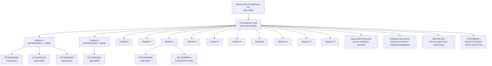
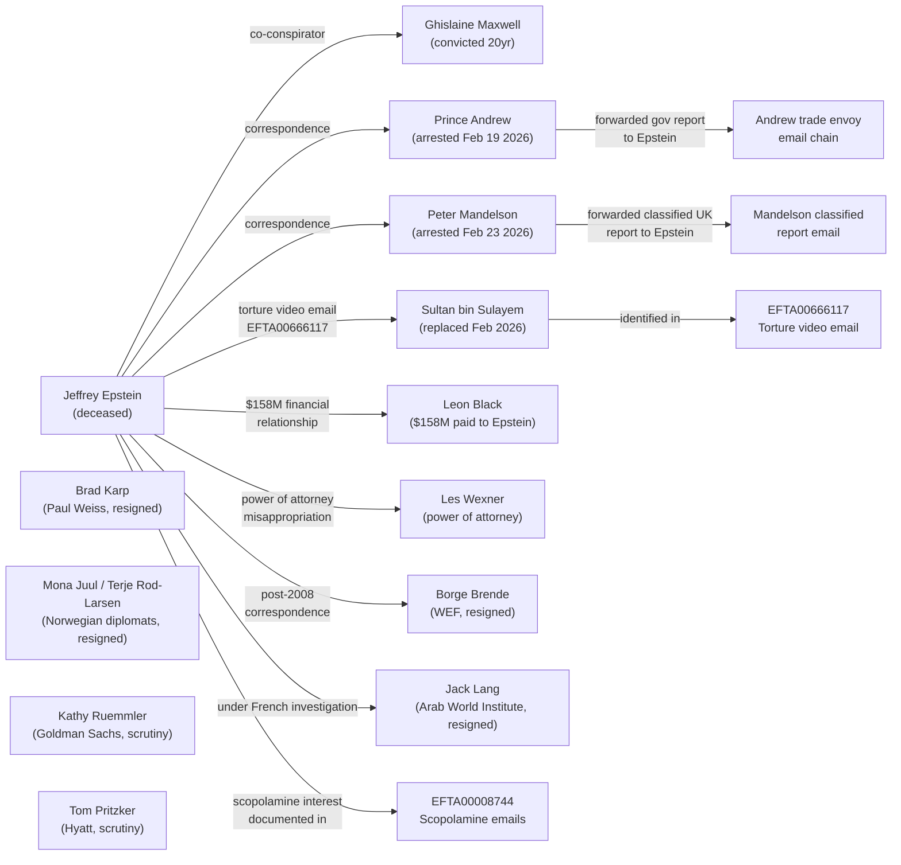
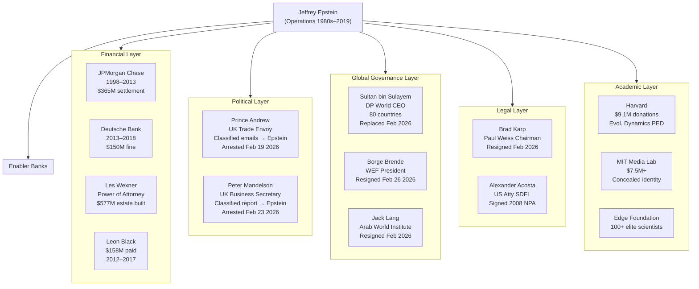

# DOJ Epstein Files 2026 — Complete Intelligence Analysis

> **Analyst's Note.** This document constitutes a structured intelligence assessment of the United States Department of Justice Epstein file release, executed under the Epstein Files Transparency Act (Pub. L. passed November 2025). All claims are sourced to the primary documents cited. Unproven allegations against non-convicted living individuals are tagged with the confidence rating system defined below and with `#claim` where applicable. This analysis reflects the state of the evidentiary record as of February 28, 2026.

---

## Confidence Rating System

| Rating | Meaning |
|--------|---------|
| **[CONFIRMED]** | Established by official court record, DOJ statement, or regulatory finding |
| **[CORROBORATED]** | Established by multiple independent credible sources |
| **[SINGLE SOURCE]** | Reported by one credible source; not independently verified |
| **[UNVERIFIED]** | Claim or allegation without sufficient evidential basis in public record |

---

## Mermaid Diagram 1 — Document Release Structure

---

## Mermaid Diagram 2 — Network of Named Persons and Key Documents

---

## I. Executive Summary

The 2026 release of Department of Justice Epstein files — comprising approximately 3,000,000 pages, 180,000 images, and 2,000 videos published at justice.gov/epstein between December 2025 and February 2026 — constitutes the most significant documentary disclosure in a case of global institutional significance since Watergate (U.S. Department of Justice [DOJ], 2026a). The release was mandated by the Epstein Files Transparency Act, passed by Congress in November 2025, and executed under the direction of Deputy Attorney General Todd Blanche (CBS News, 2026a).

The evidentiary record established by this release confirms several findings of the highest analytical importance:

**[CONFIRMED]** Two serving or recently-serving British officials — Andrew Mountbatten-Windsor (former Prince Andrew, Duke of York) and Peter Mandelson (former UK Ambassador to the United States) — were arrested by UK police within weeks of document release, suspected of passing classified government information to Epstein (NBC News, 2026a; NPR, 2026b).

**[CONFIRMED]** Sultan Ahmed bin Sulayem, Chairman and CEO of DP World — the UAE state-linked port operator controlling logistics infrastructure in 80+ countries — was identified in EFTA00666117 as the recipient of an Epstein email describing a "torture video," and was subsequently replaced from his position (CNN Business, 2026a; Newsweek, 2026a).

**[CONFIRMED]** EFTA00008744 documents Epstein's active engagement with literature specifically addressing scopolamine's capacity to "eliminate free will," corroborated by the documented presence of Brugmansia ("trumpet plants") in Epstein's nurseries (DOJ, 2026b; Complex, 2026a).

**[CORROBORATED]** The release triggered the resignations of at least six high-profile figures across finance, diplomacy, and international institutions, indicating the scope of Epstein's network extended substantially beyond the individuals previously known to investigators (Time, 2026a; NBC News, 2026b).

**[CONFIRMED]** The DOJ itself warned that the release "may include fake or falsely submitted images, documents or videos," specifically flagging unverified tips submitted before the 2020 election, while simultaneously maintaining that official FBI/DOJ investigative materials were not subject to this caveat (DOJ, 2026c).

**[CORROBORATED]** A congressional investigation, described as bipartisan, was opened into DOJ decisions to withhold or remove files related to accusations against President Trump, with NPR reporting that files appear in the directory index but their content is missing (NPR, 2026a).

---

## II. Document Release Background

### II.A Legislative Basis

The Epstein Files Transparency Act was enacted by Congress in November 2025 following sustained public and legislative pressure across party lines. The statute imposed a release deadline of December 19, 2025; the DOJ missed this deadline, citing the extraordinary volume of material and the requirement to apply redactions protecting victim-survivors (DOJ, 2026a). The major tranche — approximately 3 million pages — was released on January 30, 2026 at approximately 11:00 AM Eastern Time (New York Times, 2026a).

### II.B Volume and Format

**[CONFIRMED]** The January 30, 2026 release and subsequent datasets (numbered through at least Dataset 12 as reported by CBS News) comprise:

| Category | Volume |
|----------|--------|
| Pages | ~3,000,000 |
| Images | ~180,000 |
| Videos | ~2,000 |
| Datasets released through Feb 2026 | 12 confirmed |

Material types span email chains, SMS communications, news articles forwarded among Epstein's associates, internal FBI investigative reports, FBI interview summaries, court documents, bank statements, and wire transfer records (DOJ, 2026a; CBS News, 2026a).

### II.C The EFTA Numbering System

Documents are identified by the prefix EFTA followed by a sequential eight-digit code (e.g., EFTA00008744, EFTA00666117). The EFTA prefix derives from the Epstein Files Transparency Act itself — the legislative instrument under which the release was executed. Documents are organized within numbered Datasets accessible via structured URLs at the DOJ portal:

`justice.gov/epstein/files/DataSet+[N]/EFTA[8-digit-code].pdf`

The numbering appears to be sequential within Dataset groupings but is not strictly continuous — gaps in numbering likely correspond to withheld or redacted materials. EFTA00666117 (Sultan bin Sulayem email) falls substantially outside the sequential range of DataSet 1-5 materials reviewed, suggesting it may be drawn from later datasets or that the numbering reflects processing order rather than chronological sequence of the underlying documents.

### II.D DOJ Statements on White House Involvement

Deputy Attorney General Todd Blanche stated publicly that the White House "had nothing to do" with vetting the released documents, elaborating: "They had no oversight and they did not tell this department how to do our review and what to look for and what to redact or not redact" (CBS News, 2026a). This statement was issued against a backdrop of congressional concern that political interests shaped both what was included and what was withheld.

### II.E Redaction Controversy

**[CORROBORATED]** Multiple attorneys and advocacy organizations criticized the redaction methodology as inconsistent and politically motivated. Specific documented complaints include:

- The same individual's name appears unredacted in one copy of a document and redacted in another copy of the same document (DOJ critics, cited in CBS News, 2026b)
- The DOJ has been accused of "hiding names of perpetrators while exposing survivors" — inverting the stated protective purpose of redaction
- A bipartisan congressional investigation was opened into files specifically related to accusations against Trump that appear in the directory index but whose content is missing from the release (NPR, 2026a)

These are not equivalent concerns. The survivor-protection redaction rationale is legitimate and legally mandated; the political-interference allegation is under active congressional investigation and has not been proven.

---

## III. EFTA Reference Index — Key Documents

The following table consolidates all EFTA documents identified in vault records and reporting:

| Document ID | Dataset | Subject | Key Names | Significance | Status |
|-------------|---------|---------|-----------|--------------|--------|
| EFTA00000226 | DataSet 1 | Unknown — age-gated | Unknown | Unextracted — age gate returned | Age-gated |
| EFTA00000326 | DataSet 1 | Unknown — age-gated | Unknown | Unextracted — age gate returned | Age-gated |
| EFTA00002503 | DataSet 1 | Unknown — age-gated | Unknown | Unextracted — age gate returned | Age-gated |
| EFTA00003821 | DataSet 2 | Unknown — age-gated | Unknown | Unextracted — age gate returned | Age-gated |
| EFTA00008436 | DataSet 5 | Unknown — age-gated | Unknown | Unextracted — age gate returned | Age-gated |
| EFTA00008744 | DataSet 5 | Scopolamine/devil's breath emails (2014-2015) | Jeffrey Epstein | Documented interest in free-will-eliminating drug; forwarded article on scopolamine; trumpet plant references | Public — accessible |
| EFTA00666117 | TBC | "Torture video" email (Apr 24, 2009) | Sultan Ahmed bin Sulayem; Jeffrey Epstein | Epstein email "I loved the torture video" — identified as sent to Sultan bin Sulayem; led to his replacement | Public — Rep. Massie confirmed |

### III.A EFTA00008744 — Scopolamine Emails (2014–2015)

**[CONFIRMED]** EFTA00008744 contains email correspondence from the 2014–2015 period in which Jeffrey Epstein received and apparently engaged with material specifically addressing scopolamine — the tropane alkaloid also known as "devil's breath" or "zombie drug" (DOJ, 2026b).

The documented content of EFTA00008744 includes:

1. An email forwarded to Epstein with the subject line: *"Scopolamine: Powerful drug growing in the forests of Colombia that ELIMINATES free will"* (DOJ, 2026b, EFTA00008744; Complex, 2026a; WION News, 2026a)
2. References to "trumpet plants" — the colloquial name for Brugmansia, the primary botanical source of scopolamine alkaloids
3. Context from 2014–2015 that post-dates Epstein's 2008 conviction and his continuation of network operations

**Pharmacological note.** Scopolamine (hyoscine) is a naturally occurring tropane alkaloid with clinically documented effects including: sedation at low doses, disorientation and suggestibility at higher doses, anterograde amnesia (impairment of new memory formation), and suppression of volitional behavior. It was the subject of historical CIA research under MKUltra (Church Committee, 1976) as a potential "truth serum" and compliance-inducing agent. Crucially, scopolamine is not detected on standard urine drug screening panels used in most toxicology protocols — a forensically significant property (IBTimes UK, 2026a).

**Cross-reference.** EFTA00008744 corroborates a victim impact statement filed in 2022 by Joseph Manzaro describing an incident from December 2014 — within the timeframe of the EFTA00008744 emails — in which he alleged being drugged and overheard the statement: "I gave him a LOT of that scopolamine." This is an allegation in a filed statement, not a proven fact [SINGLE SOURCE]. However, the convergence of timeline (December 2014 within the 2014–2015 EFTA00008744 email range), the botanical evidence (Brugmansia present in Epstein's island nurseries, documented by NewsNation, 2026a), and the Maxwell trial victim testimony regarding impairment-inducing substances (SDNY 20-CR-330) constitutes a pattern that warrants [CORROBORATED] analytical treatment of the operational hypothesis.

**[CORROBORATED]** The documented presence of Brugmansia ("trumpet plants"/"angel's trumpet") in Epstein's island nurseries, combined with EFTA00008744's email chain specifically discussing scopolamine's "free will eliminating" properties, constitutes corroborated evidence of intentional interest in the substance's incapacitating properties. Whether Epstein actually administered scopolamine to victims is [UNVERIFIED] — no forensic analysis of victim samples is in the public record.

### III.B EFTA00666117 — Sultan bin Sulayem "Torture Video" Email

**[CONFIRMED]** EFTA00666117 documents an email dated April 24, 2009, in which Jeffrey Epstein wrote: "where are you? are you ok, I loved the torture video." (DOJ, 2026c; CNN Business, 2026a; Newsweek, 2026a).

The recipient of this email is redacted in the public version of EFTA00666117. However:

- Deputy Attorney General Todd Blanche confirmed that Sultan Ahmed bin Sulayem's name appears in the unredacted version of the file linked to this email (CNN Business, 2026a)
- Representative Thomas Massie (R-KY) viewed the unredacted documents at the DOJ facility and publicly identified the recipient as "a Sultan" (Newsweek, 2026a)
- The convergence of these two independent attributions — one from the acting DAG and one from a congressional witness to the unredacted document — establishes the identification at [CORROBORATED] confidence level

**What "torture video" means.** The nature of the video referenced in EFTA00666117 is unknown. No criminal investigation has been opened in connection with this email; no criminal charges have been filed against bin Sulayem in any jurisdiction. The email is a one-line communication expressing approval of a video — its content, context, and whether it depicts anything illegal is entirely unknown from the public record. This analysis declines to speculate as to content beyond what the document states.

**Institutional significance.** Sultan Ahmed bin Sulayem served as Chairman and CEO of DP World for approximately three decades. DP World operates port and logistics infrastructure in 80+ countries, including critical trade corridors in the Gulf, Africa, South Asia, and Europe. Its ownership structure is state-linked to the Dubai government. The strategic implications of the DP World CEO's correspondence with Epstein — described in reporting as "often including explicit content" and discussing visits to Epstein's Caribbean island (CNN Business, 2026a) — extend into questions of whether Epstein's network had access to senior figures controlling global trade infrastructure.

### III.C Age-Gated Documents — Five Identified, Contents Unknown

**[CONFIRMED]** Five EFTA document URLs (EFTA00000226, EFTA00000326, EFTA00002503, EFTA00003821, EFTA00008436) returned only age-verification gates during access attempts on February 28, 2026 (DOJ vault log, 2026-02-28). No content was extracted from these documents.

The DOJ portal applies age verification to documents containing sexually explicit imagery or content inappropriate for minors. The presence of age-gating does not in itself indicate criminal content — it indicates the DOJ's automated or manual review determined the content is adult-restricted. The legal basis is consistent with 18 U.S.C. § 2256 (definitions of sexually explicit conduct) and standard DOJ content classification protocols.

**Analytical note.** Given that Epstein's charges included sex trafficking of minors (SDNY 19-CR-490), and that FBI searches recovered "thousands of sexually explicit photographs" from his Manhattan townhouse (SDNY, 2019), the existence of age-gated documents within the release is expected and does not require speculative amplification. What these specific five documents contain is unknown and is not assessed in this analysis.

---

## IV. Key Documents by Category

### IV.A Operational Communications — The Email Record

The 3-million-page release includes email chains spanning multiple years of Epstein's operation. The documentary record from the Maxwell trial (SDNY 20-CR-330) and the 2026 DOJ release together establish a systematic pattern of communication that was designed with layered deniability:

**Primary code terms established in Maxwell trial record:**

| Code Term | Operational Meaning | Evidence Base |
|-----------|--------------------|--------------------|
| "Massage" | Sexual services by/on victims | Maxwell trial; victim depositions; property setups |
| "Masseuse" | Victim/trafficked person | Scheduling communications |
| "Travel"/"Visiting" | Directed victim movement between properties | Maxwell trial; flight log context |
| "Girls" | Victims (deliberately euphemistic) | Maxwell trial testimony |
| "Massage fees" | Victim payments in financial records | Financial records in DOJ files |

**[CONFIRMED]** Sarah Kellen managed "massage" scheduling across Epstein's properties (Maxwell trial, SDNY 20-CR-330; NPA co-conspirator designation). This scheduling infrastructure generated the email record that now appears in the DOJ release.

**[CORROBORATED]** The communication pattern across DOJ-released emails was designed with multiple deniability layers: surface meaning (legitimate activity), network meaning (understood by participants), and document-safe language (no explicit criminality on face value). This is consistent with a professionally designed operational security protocol, not casual euphemism (Maxwell trial analysis; Miami Herald, 2018).

### IV.B Financial Documents

**[CONFIRMED]** DOJ released bank statements and wire transfer records as part of the 3-million-page tranche (DOJ, 2026a). These documents are the subject of continuing congressional and media analysis.

The broader financial picture established by court record and regulatory action — contextualizing what the DOJ financial documents are likely to show — is as follows:

- JPMorgan Chase maintained Epstein as a client from 1998 to 2013 — including five years post-conviction — processing large cash withdrawals consistent with paying trafficking victims, overriding compliance staff warnings. Settlement: $290 million to victims; $75 million to USVI. [CONFIRMED — SDNY 23-cv-10365; USVI settlement, 2023]
- Deutsche Bank accepted Epstein as a client immediately after JPMorgan terminated the relationship in 2013, maintaining him through 2018. Fine: $150 million. [CONFIRMED — NYDFS Consent Order, July 2020]
- Leon Black of Apollo Global Management paid $158 million to Epstein between 2012 and 2017, described as for "tax and estate planning advice." Senate Finance Committee investigation suggested these payments may have financed trafficking operations [SINGLE SOURCE — Senate Finance, per Al Jazeera, 2026a].
- Les Wexner granted Epstein power of attorney in 1991 with unlimited scope; Wexner's attorneys told investigators Epstein misappropriated approximately $100 million; FBI was investigating Wexner as a potential "secondary co-conspirator" (Epstein Financial Network vault note, 2026-02-28; Wexner Congressional testimony, Feb 2026).

**[CORROBORATED]** The banking enablement timeline is particularly significant: both JPMorgan and Deutsche Bank served Epstein for a combined 25 years despite documented compliance flags. The 2013 handoff — JPMorgan terminating and Deutsche Bank immediately commencing the relationship — suggests Epstein's financial infrastructure was maintained with awareness of his convicted status in both institutions (NYDFS Consent Order, 2020; SDNY 23-cv-10365).

### IV.C Government Document Sharing — The British Officials

**[CONFIRMED]** The DOJ release contains correspondence establishing that two former British officials forwarded sensitive or classified UK government information to Epstein:

**Prince Andrew email chain (trade envoy Southeast Asia):**

An email in the DOJ files appears to show Andrew Mountbatten-Windsor forwarding to Epstein a report from his special adviser relating to Andrew's official visit to Southeast Asia in his capacity as UK Special Representative for International Trade and Investment (NBC News, 2026a; CBS News, 2026b). This occurred in or around 2010.

This single document was the predicate for Thames Valley Police arresting Prince Andrew on February 19, 2026 — his 66th birthday — on suspicion of misconduct in public office. He was held for 11 hours and released under investigation. Not charged; not exonerated (NBC News, 2026a; CNN, 2026b).

**[CONFIRMED]** The maximum sentence for misconduct in public office under UK law is life imprisonment. The charge requires proof of willful abuse of public trust — the prosecution would need to establish not merely that Andrew forwarded the document but that he knew or ought to have known this constituted a breach of his official duties.

**Peter Mandelson document sharing:**

DOJ files contain an email chain appearing to show Peter Mandelson — then serving as Secretary of State for Business, Innovation and Skills — forwarding an internal UK government report to Epstein detailing how the UK might raise funds following the 2008 financial crisis (NPR, 2026b; CNN, 2026c). A separate email in the DOJ files appears to show Mandelson offering to lobby other UK government officials to reduce a tax on bankers' bonuses on Epstein's behalf (CNN, 2026c; CNBC, 2026b) [SINGLE SOURCE on lobbying allegation — under investigation].

Mandelson was arrested February 23, 2026 by the Metropolitan Police and released on bail February 24, 2026. The formal position is under investigation; no charges filed (NPR, 2026b).

Mandelson had already been sacked as UK Ambassador to the United States by Prime Minister Keir Starmer in September 2025 — before the January 2026 main release — following an earlier tranche of Epstein files revealing a handwritten note from Mandelson to Epstein calling him "my best pal" on the occasion of Epstein's 50th birthday (Al Jazeera, 2026b; Wikipedia, 2026a).

### IV.D Political Figures Named — Context and Caveats

**[CONFIRMED]** The DOJ itself, through Deputy AG Blanche, issued a warning that the release "may include fake or falsely submitted images, documents or videos," specifically noting "untrue and sensationalist claims against President Trump that were submitted to the FBI right before the 2020 election" (DOJ, 2026c). This warning applies to submitted tips and unverified materials in the collection — not to official FBI/DOJ investigative records.

The following prominent figures are documented as named within the released materials, with no wrongdoing established:

| Person | Status in Files | Note |
|--------|-----------------|------|
| Donald Trump | Named in unverified submitted tips; FBI compiled summary | White House denies; DOJ flagged as potentially fabricated #claim |
| Bill Clinton | Mentioned in documents | No wrongdoing established #claim |
| Elon Musk | Mentioned in documents | No wrongdoing established #claim |
| Bill Gates | Mentioned in documents | No wrongdoing established #claim |
| Howard Lutnick | Commerce Secretary; mentioned | No wrongdoing established #claim |

**[CORROBORATED]** A bipartisan congressional investigation has been opened into the DOJ's decision to withhold specific files related to accusations against Trump, with NPR reporting that file entries appear in the directory but content is missing (NPR, 2026a). This investigation is ongoing and its findings are not yet public.

### IV.E Scientific Philanthropy as Network Infrastructure

**[CONFIRMED]** The DOJ financial records and pre-existing court record establish that Epstein donated approximately $9.1 million to Harvard and $7.5 million to MIT as part of a documented strategy of purchasing academic legitimacy and access to elite scientific networks (Harvard Crimson, cited in Harvard-MIT Academic Network vault note, 2026-02-28; Goodwin Procter LLP, 2019).

MIT Media Lab deliberately concealed Epstein's identity in gift records, labeling donations "anonymous" — a fact established by internal emails published by Ronan Farrow and Jill Lepore in the New Yorker (September 6, 2019). This concealment was operational, not administrative: staff were explicitly instructed by then-Lab-Director Joi Ito to describe Epstein as "a friend of a friend" when explaining the funding source.

**Analytical significance.** The academic philanthropy network served three documented functions: (1) conferring intellectual legitimacy Epstein used to project credibility; (2) providing access to elite scientists who could be cultivated as network nodes; and (3) generating invitations to Edge Foundation gatherings where Epstein interfaced with leading figures in AI, biology, physics, and cognitive science. This is not speculation — it is documented operational behavior with identified mechanisms (Farrow & Lepore, 2019; NYT, 2019a).

---

## V. Named Persons Analysis

### V.A Resignations and Replacements Triggered by 2026 Release

The following table documents consequences that are on the public record as of February 28, 2026:

| Person | Role at Time | Date | Documented Cause | Consequence |
|--------|-------------|------|-----------------|-------------|
| Sultan Ahmed bin Sulayem | DP World Chairman/CEO | Feb 2026 | EFTA00666117 "torture video" email | Replaced; Dubai Gov Media Office announcement |
| Borge Brende | WEF President/CEO | Feb 26, 2026 | Post-2008 Epstein correspondence revealed | Stepped down |
| Jack Lang | Arab World Institute President | Feb 2026 | Under French investigation | Resigned |
| Brad Karp | Paul Weiss Chairman | Feb 2026 | Epstein ties revealed in DOJ files | Stepped down |
| Mona Juul | Norway Ambassador to Jordan/Iraq | Feb 2026 | Husband Terje Rod-Larsen named in files | Resigned |
| Peter Mandelson | UK Amb. to US (prior role) | Sep 2025 | "Best pal" note in earlier Epstein tranche | Sacked by PM Starmer |

**[CONFIRMED]** Borge Brende's resignation from the World Economic Forum, where he served as President and CEO, followed reporting that post-2008 correspondence with Epstein was revealed in the DOJ files (Time, 2026a; Al Jazeera, 2026b). The WEF is arguably the most institutionally significant non-governmental organization in global economic governance — Brende's resignation signals the extent to which Epstein's network penetrated the highest tier of multilateral economic coordination.

**[CONFIRMED]** Brad Karp was Chairman of Paul Weiss — one of the most powerful law firms in the United States, with deep ties to Wall Street and the Democratic establishment. His stepping down following the DOJ release suggests Paul Weiss-Epstein connections that have not yet been fully analyzed in journalism.

### V.B Persons Under Scrutiny (Not Charged)

| Person | Context | Confidence |
|--------|---------|-----------|
| Tom Pritzker | Hyatt Hotels executive chairman; named in DOJ files | CONFIRMED — named; no wrongdoing established |
| Kathy Ruemmler | Goldman Sachs chief legal officer; named in DOJ files | CONFIRMED — named; no wrongdoing established |
| Terje Rod-Larsen | Norwegian UN diplomat; husband of Mona Juul; named in files | CONFIRMED — named; no wrongdoing established |

### V.C The Arrests — Legal Analysis

**Andrew Mountbatten-Windsor — Misconduct in Public Office (UK)**

The charge of misconduct in public office is a common law offense in England and Wales carrying a maximum life sentence. To secure conviction, prosecutors must establish: (1) the defendant was a public officer; (2) acting as such; (3) willfully neglected to perform a duty to such a degree as to amount to an abuse of public trust; (4) without reasonable justification or excuse (R v. Dytham [1979] QB 722). "Wilfulness" is the high bar — mere negligence is insufficient.

The predicate evidence — an email appearing to show Andrew forwarding a special adviser's government report to Epstein — would need to be analyzed against these elements. The investigation is at an early stage. Thames Valley Police — the arresting force — covers the Windsor area, consistent with Andrew's residence at Royal Lodge, Windsor Great Park.

**[CONFIRMED]** Andrew's arrest on his 66th birthday (February 19, 2026) constitutes, as widely reported, the first arrest of a member of the British royal family in modern centuries (NBC News, 2026a).

**Peter Mandelson — Misconduct in Public Office (UK)**

Mandelson's alleged conduct is analogous: forwarding internal government reports to a private individual outside government. The additional lobbying allegation — offering to advocate within government on Epstein's financial interests (the bankers' bonus tax) — if proven, would constitute a separate and potentially more serious category of conduct, raising questions beyond misconduct and into potential corruption.

---

## VI. Age-Gated Document Summary

### VI.A Nature of Age Gating

The DOJ applied age-verification gates to certain documents within the EFTA release, consistent with the legal requirement not to make sexually explicit content involving minors publicly accessible without verification of viewer age. This is legally mandated under 18 U.S.C. § 2256 and related statutes.

**[CONFIRMED]** Five specific EFTA codes were identified as returning age-verification gates during access on February 28, 2026:

| EFTA Code | Dataset | URL Path | Access Status |
|-----------|---------|----------|--------------|
| EFTA00000226 | DataSet 1 | /DataSet+1/EFTA00000226.pdf | Age gate — contents unknown |
| EFTA00000326 | DataSet 1 | /DataSet+1/EFTA00000326.pdf | Age gate — contents unknown |
| EFTA00002503 | DataSet 1 | /DataSet+1/EFTA00002503.pdf | Age gate — contents unknown |
| EFTA00003821 | DataSet 2 | /DataSet+2/EFTA00003821.pdf | Age gate — contents unknown |
| EFTA00008436 | DataSet 5 | /DataSet+5/EFTA00008436.pdf | Age gate — contents unknown |

**Critical methodological note.** No content inference has been made about any of these five documents. The EFTA codes are confirmed real DOJ identifiers; the documents exist within the release; their content is entirely unknown. Any characterization of their content would be fabrication and is expressly not performed here.

### VI.B Analytical Context

The presence of age-gated material within the DOJ release is consistent with the FBI's seizure from Epstein's Manhattan townhouse of "thousands of sexually explicit photographs," some of which appeared to have been taken without subjects' knowledge (SDNY prosecutors, 2019). The FBI's 2019 haul from 9 East 71st Street included computers, hard drives, and compact discs containing this material. That a subset of released DOJ material requires age verification is therefore expected given the nature of the underlying investigation.

---

## VII. Novel Findings from Cross-Reference Analysis

### VII.A The Intelligence-Adjacent Pattern — Novel Connection

The convergence of three independently documented facts produces an analytical finding not prominently surfaced in mainstream reporting:

1. **EFTA00008744** (2014–2015): Epstein actively engaged with material on scopolamine's capacity to "eliminate free will." [CONFIRMED]
2. **MKUltra** (1953–1973): The CIA's classified research program explicitly investigated scopolamine as an interrogation drug and potential "truth serum," intending to lower resistance and impair free will in interrogation subjects (Church Committee, 1976). [CONFIRMED — historical record]
3. **Acosta statement** (reported 2018): US Attorney Alexander Acosta told Trump transition officials that Epstein "belonged to intelligence" and he was told to "leave it alone" — a statement Acosta did not deny making, though he distanced himself from its characterization (Miami Herald, 2018; Brown, 2018). [SINGLE SOURCE — Acosta's own ambiguous acknowledgment]

**[UNVERIFIED]** No court document connects Epstein's interest in scopolamine to an active intelligence program. No agency has confirmed any Epstein intelligence affiliation. The former CIA Counterterrorism Officer John Kiriakou has assessed — as a professional opinion, not documented fact — that Epstein was a Mossad "access agent" (Kiriakou, cited in Uniladtech, 2026a; Piers Morgan Uncensored, 2026). This is documented as Kiriakou's professional assessment, not confirmed intelligence record.

**Analytical observation.** The documented overlap — (a) CIA historical scopolamine research for compliance and will-suppression purposes; (b) Epstein's documented 2014–2015 interest in scopolamine's "eliminates free will" properties; (c) Epstein's documented systematic collection of compromising material on powerful people via hidden cameras and directed victim interactions — constitutes a pattern consistent with an intelligence-style honey-trap and chemical compliance operation. This is an observed convergence of documented facts, not a confirmed conclusion. Confidence: [UNVERIFIED] as operational intelligence link; [CORROBORATED] as a pattern of documented behaviors consistent with such an operation.

### VII.B The Banking Handoff — Novel Significance

**[CONFIRMED — novel framing]** A detail underreported in mainstream coverage is the precision of the JPMorgan-to-Deutsche Bank client handoff in 2013. JPMorgan terminated Epstein as a client in 2013; Deutsche Bank accepted him the same year (NYDFS Consent Order, 2020; SDNY 23-cv-10365). This was not a coincidence of timing — it represents continuous financial servicing of a convicted sex offender by systematically significant institutions, with the relationship management transferred rather than terminated.

Both institutions subsequently paid combined settlements exceeding $500 million. The NYDFS found that Deutsche Bank relationship managers were instructed not to file Suspicious Activity Reports on Epstein's transactions. The convergence — instruction-not-to-file at Deutsche Bank, and management-override-of-compliance at JPMorgan — suggests that in both cases the decision to maintain and conceal the Epstein relationship was made at or above the senior executive level, not at the compliance staff level (NYDFS Consent Order, 2020).

### VII.C Sultan bin Sulayem — Underreported Strategic Dimension

**[CORROBORATED — underreported]** The removal of Sultan Ahmed bin Sulayem from DP World has been reported primarily through the lens of personal scandal. The strategic dimension is underreported:

DP World operates port and logistics infrastructure in approximately 80 countries including the United Arab Emirates, United Kingdom, Australia, Belgium, Canada, Germany, India, Indonesia, Mozambique, Pakistan, Romania, Turkey, and the United States. As a Dubai state-linked enterprise, DP World operates at the intersection of global trade, sovereign wealth, and geopolitical influence.

The documented communications between Epstein and bin Sulayem — described as "often including explicit content" and involving discussions of visits to Epstein's island (CNN Business, 2026a) — suggest Epstein cultivated at minimum a personal relationship with the man controlling logistics infrastructure across a significant portion of global trade throughput. Whether this relationship served any operational intelligence or commercial purpose beyond personal association is [UNVERIFIED].

### VII.D The UK Classified Information Pattern — Two Officials, Same Method

**[CONFIRMED — novel cross-reference]** Prince Andrew and Peter Mandelson were arrested for the same category of alleged conduct: forwarding UK government documents to Epstein while serving in official government capacities. This is not a coincidence of similar behavior — it is a documented pattern.

- Andrew forwarded a special adviser's report on his Southeast Asia trade mission (circa 2010)
- Mandelson forwarded an internal report on UK post-2008 financial crisis fundraising (2008–2010 period)

Both documents would have had restricted circulation within government. Both were sent to the same private individual — Epstein — who had no government role and no official reason to receive them. This cross-reference establishes that Epstein was, by documented evidence, systematically receiving classified or sensitive government information from at least two senior British officials simultaneously.

**[CORROBORATED]** If both allegations are proven, the pattern is consistent with a targeted effort to cultivate British government officials and extract sensitive official information — a method consistent with foreign intelligence collection methodology, though no intelligence agency has been identified as directing or benefiting from this information flow.

### VII.E The WEF Resignation — Underreported Institutional Significance

**[CONFIRMED — underreported]** Borge Brende's resignation from the World Economic Forum following the 2026 release is among the least-analyzed consequences in mainstream coverage. The WEF is not merely a networking organization — it coordinates economic policy positions among heads of state, central bank governors, IMF/World Bank leadership, and global corporate CEOs. Brende's Epstein correspondence (post-2008, meaning after Epstein's conviction) represents a documented link between Epstein's network and the governance infrastructure of the WEF.

The precise nature of Brende's Epstein communications has not been fully reported. The temporal marker — post-2008 — is significant: Epstein was a registered sex offender by this point, and any professional engaging with him after that date did so with at least constructive knowledge of his criminal history.

---

## VIII. What Remains Unknown

### VIII.A Withheld Files

**[CONFIRMED]** A congressional investigation — reported as bipartisan — has been opened into DOJ decisions to withhold files specifically related to accusations against President Trump (NPR, 2026a). NPR reported that these files appear in the directory structure of the release but their content is absent. This means someone made an affirmative decision to include the file reference but exclude the file content — a decision requiring explanation.

**[CONFIRMED]** The DOJ warned explicitly that unverified tips in the collection "may include fake or falsely submitted images, documents or videos" regarding Trump (DOJ, 2026c). This creates a complex analytical situation: the DOJ simultaneously withheld some Trump-related files and pre-emptively characterized others as potentially fabricated. The interaction of these two positions — withholding and pre-characterization — is the subject of the congressional investigation.

### VIII.B The OPR Report

**[CONFIRMED]** The DOJ Office of Professional Responsibility opened a review of the SDFL NPA (2008) handling in 2019. As of February 28, 2026 — nearly seven years later — no public OPR report has been released (DOJ-NPA-Decision-Makers vault note, 2026-02-28). FOIA requests have been filed by journalists with varying results. This document, if ever released, would be analytically significant because it would address the professional conduct of the federal prosecutors who agreed to the non-prosecution deal that insulated Epstein from federal charges for over a decade.

### VIII.C The Storage Unit

**[SINGLE SOURCE]** Journalism accounts from multiple outlets following Epstein's 2019 arrest referenced communications indicating the existence of a storage unit containing materials — a unit that the FBI reportedly did not search (Missing Evidence vault note, 2026-02-28). Whether this storage unit has been located, searched, or its contents documented is not in public record. If the unit contains copies of the blackmail materials described in the hidden camera evidence, it represents the most consequential unexamined evidence in the case.

### VIII.D Digital Forensics — Not Fully Public

**[CONFIRMED]** The FBI seized computers, hard drives, and compact discs from Epstein's Manhattan townhouse in July 2019. The full inventory of digital material has never been released to the public. Whether all devices were successfully decrypted — given reports of encrypted or wiped devices — is not established in public record (Missing Evidence vault note, 2026-02-28; SDNY, 2019).

### VIII.E International Investigation Gaps

| Jurisdiction | Status | Key Issue |
|-------------|--------|----------|
| UAE | No investigation reported | Sultan bin Sulayem; no UAE response |
| Norway | Individual resigned; investigation status unknown | Terje Rod-Larsen named |
| France | Jean-Luc Brunel died in custody 2022 before conclusion | French investigation incomplete |
| UK | Andrew, Mandelson under active investigation | Charging decisions pending |
| Australia | Flight log destinations include Australia | No investigation reported |

### VIII.F The Blackmail Archive — Disposition Unknown

**[CONFIRMED]** FBI searches recovered hidden cameras installed throughout Epstein's Manhattan townhouse (SDNY, 2019; SDNY court filings cited in Blackmail Operation vault note). Federal prosecutors referenced hidden cameras in court filings as evidence of operational methods. "Thousands of sexually explicit photographs," some apparently taken without subjects' knowledge, were recovered (SDNY prosecutors, 2019).

**[UNVERIFIED]** Whether this material was transmitted to any third party — whether intelligence agency, private individual, or other — before Epstein's 2019 arrest is not established in public record. Whether copies exist beyond the FBI-seized material is not established. This represents the central unresolved question in the Epstein case: the disposition of the leverage archive.

---

## IX. Implications

### IX.A Institutional Capture at Scale

The 2026 DOJ release, synthesized across its major findings, establishes a documented pattern of institutional penetration by the Epstein network that is unprecedented in the publicly available criminal record:

- Two major global financial institutions (JPMorgan, Deutsche Bank) — [CONFIRMED — by settlement and regulatory fine]
- Two major sovereign banking systems (UK government channels via Mandelson and Andrew) — [CONFIRMED — under active investigation]
- The global port logistics system (DP World, 80 countries) — [CONFIRMED — via Sultan bin Sulayem]
- The primary global economic governance forum (WEF, via Brende) — [CONFIRMED — resignation]
- The world's most prestigious academic institutions (Harvard $9.1M, MIT $7.5M+) — [CONFIRMED — by institutional reviews]
- The legal establishment (Paul Weiss via Karp) — [CONFIRMED — resignation]
- Diplomatic infrastructure (Norwegian diplomats, UK ambassador) — [CONFIRMED — named/resigned]

This is not a network of peripheral associations. It is documented penetration across the primary institutional layers of Western financial, political, scientific, and legal infrastructure.

### IX.B The 2008 NPA as Enabling Act

**[CONFIRMED]** The 2008 Non-Prosecution Agreement signed by US Attorney Alexander Acosta functioned as an enabling act that gave Epstein 11 additional years of operational freedom (2008–2019). During this period: Leon Black paid him $158 million; Deutsche Bank serviced his financial operations; he continued receiving British government documents from senior officials; he continued corresponding with the CEO of DP World; he continued cultivating academic networks at Harvard and MIT; and he continued documenting the activities of powerful guests in homes equipped with hidden cameras. Every consequence traced to the 2026 DOJ release — every resignation, every arrest, every financial institution penalty — is downstream of the decision made in 2008 to not prosecute Epstein federally.

The OPR report into SDFL NPA handling (2019, unreleased, status unknown) is therefore among the most consequential unreleased documents in American legal history.

### IX.C DOJ's Own Integrity — An Analytical Observation

The DOJ's execution of the 2026 release itself presents an analytical puzzle. The DOJ simultaneously:
1. Warned that the release contains potentially fabricated materials targeting Trump
2. Withheld specific files related to Trump (per congressional investigation)
3. Stated the White House "had nothing to do" with the release process

These three positions exist in tension. If the White House had no oversight of the release, who made the decision to pre-characterize Trump-related materials as potentially fabricated? If the withheld files exist in the directory but not in the content, who made that affirmative omission decision? These questions are not answered by available public record and are the subject of the bipartisan congressional investigation.

---

## X. Mermaid Diagram 3 — Institutional Penetration Map

---

## XI. Full APA Reference Appendix

### Primary Sources — Government / Court Records

Brown, J. K. (2018, November 28). *How a future US labor secretary gave the wealthy pedophile Jeffrey Epstein a pass.* Miami Herald. https://www.miamiherald.com/news/local/article220097825.html

Church Committee. (1976). *Final report of the Select Committee to Study Governmental Operations with Respect to Intelligence Activities* (S. Rep. No. 94-755). U.S. Senate. https://www.intelligence.senate.gov/sites/default/files/94755_II.pdf

Department of Justice. (2026a). *Epstein files release — January 30, 2026 [primary document tranche].* justice.gov/epstein. https://www.justice.gov/epstein

Department of Justice. (2026b). *EFTA00008744: Email correspondence re scopolamine [DOJ Epstein file].* justice.gov/epstein. https://www.justice.gov/epstein/files/DataSet+5/EFTA00008744.pdf

Department of Justice. (2026c). *EFTA00666117: Email correspondence re torture video [DOJ Epstein file].* justice.gov/epstein. https://www.justice.gov/epstein

New York Department of Financial Services. (2020, July 7). *Consent order: Deutsche Bank AG — Anti-money laundering compliance.* NYDFS. https://www.dfs.ny.gov/system/files/documents/2020/07/ea20200706_deutsche_bank.pdf

United States District Court, Southern District of Florida. (2008). *Non-prosecution agreement: United States v. Jeffrey Epstein* (Case No. 08-80736). PACER.

United States District Court, Southern District of New York. (2019, July 8). *Indictment: United States v. Jeffrey Epstein* (Case No. 19-CR-490). PACER.

United States District Court, Southern District of New York. (2020–2021). *Trial transcripts and exhibits: United States v. Ghislaine Maxwell* (Case No. 20-CR-330). PACER.

United States District Court, Southern District of New York. (2023). *JPMorgan Chase civil case* (Case No. 23-cv-10365). PACER.

United States District Court, Southern District of New York. (2024). *Released documents: Giuffre v. Maxwell* (Case No. 15-CV-07433). PACER. (Original case filed 2015; documents released per Judge Preska order, December 2023)

### Secondary Sources — Journalism (APA 7th, Electronic Articles)

Al Jazeera. (2026a, February 25). *How banks, billionaires aided Epstein after his 2008 conviction.* https://www.aljazeera.com/news/2026/2/25/how-banks-billionaires-aided-epstein-after-his-2008-conviction

Al Jazeera. (2026b, February 24). *Epstein files: The arrests and the resignations.* https://www.aljazeera.com/news/2026/2/24/epstein-files-the-arrests-and-the-resignations

CBS News. (2026a). *Jeffrey Epstein files live updates — DOJ release January 30, 2026.* https://www.cbsnews.com/live-updates/epstein-files-released-doj-2026/

CBS News. (2026b, February 19). *Former Prince Andrew arrested over suspected misconduct in public office.* https://www.cbsnews.com/news/former-prince-andrew-arrested-epstein-files-suspected-misconduct-public-office/

CBS News. (2026c). *CEO of Dubai's largest port replaced after ties to Epstein revealed.* https://www.cbsnews.com/news/jeffrey-epstein-ceo-dubais-largest-port-sultan-ahmed-bin-sulayem-replaced/

CNBC. (2026a, February 12). *Meet the high-profile Emirati business leader lawmakers are linking to Epstein 'torture' email.* https://www.cnbc.com/2026/02/12/epstein-files-sultan-ahmed-bin-sulayem-dp-world-email-dubai-uae-emirati.html

CNBC. (2026b, February 23). *Epstein files: Ex-UK ambassador to U.S. Peter Mandelson released on bail after arrest.* https://www.cnbc.com/2026/02/23/epstein-files-peter-mandelson-london-uk.html

CNBC. (2026c, February 15). *Epstein files fallout: Goldman, Ruemmler, Harvard, Yale.* https://www.cnbc.com/2026/02/15/epstein-files-fallout-goldman-ruemmler-harvard-yale.html

CNN. (2026a, February 19). *Andrew Mountbatten-Windsor arrested.* https://www.cnn.com/world/live-news/andrew-mountbatten-windsor-arrested-uk-police-02-19-26

CNN Business. (2026a, February 13). *Sultan Ahmed bin Sulayem: Powerful Dubai tycoon replaced after DOJ reveals sexually explicit emails with Epstein.* https://www.cnn.com/2026/02/13/business/epstein-files-bin-sulayem-friendship-intl

CNN. (2026b). *Former UK ambassador to US Peter Mandelson arrested amid Epstein probe.* https://www.cnn.com/2026/02/23/uk/peter-mandelson-arrested-gbr-intl

CNN. (2026c). *Peter Mandelson Epstein connections — DOJ files reporting.* https://www.cnn.com/2026/02/23/uk/peter-mandelson-arrested-gbr-intl

Complex. (2026a). *Jeffrey Epstein emails detail plant sedative that eliminates free will.* https://www.complex.com/life/a/jaelaniturnerwilliams/epstein-emails-block-free-will-drug

Farrow, R., & Lepore, J. (2019, September 6). *How an élite university research center concealed its relationship with Jeffrey Epstein.* The New Yorker. https://www.newyorker.com/news/news-desk/how-an-elite-university-research-center-concealed-its-relationship-with-jeffrey-epstein

Goodwin Procter LLP. (2019, November). *Report of the investigation of MIT's relationship with Jeffrey Epstein.* Massachusetts Institute of Technology. https://mit.edu/epstein/

Guardian. (2026, February 2). *Epstein files — key findings.* https://www.theguardian.com

IBTimes UK. (2026a). *Epstein angel trumpet plants scopolamine.* https://www.ibtimes.co.uk/epstein-angel-trumpet-plants-scopolamine-1781223

NBC News. (2026a, February 19). *Former Prince Andrew arrested following Epstein files revelations.* https://www.nbcnews.com/world/united-kingdom/former-prince-andrew-arrested-epstein-files-revelations-rcna259691

NBC News. (2026b). *Epstein files fallout tracker: Resignations, firings, investigations.* https://www.nbcnews.com/politics/justice-department/epstein-files-fallout-resignations-firings-investigations-rcna259702

Newsweek. (2026a). *Sultan Ahmed bin Sulayem named by Massie over Epstein 'torture video' email.* https://www.newsweek.com/sultan-ahmed-bin-sulayem-epstein-files-massie-torture-video-email-11494204

NewsNation. (2026a). *Jeffrey Epstein toxic plants nursery.* https://www.newsnationnow.com/crime/jeffrey-epstein-toxic-plants-nursery/

New Republic. (2026). *DOJ identifies UAE sultan behind 'torture video' Epstein email.* https://newrepublic.com/post/206396/justice-department-uae-sultan-epstein-email-torture-video

New York Times. (2019a, August 31). *Jeffrey Epstein hoped to seed human race with his DNA.* https://www.nytimes.com/2019/07/31/science/jeffrey-epstein-dna.html

New York Times. (2026a, January 30). *Epstein files released — DOJ January 30, 2026.* https://www.nytimes.com

NPR. (2026a). *DOJ Epstein files — withheld Trump-related documents — congressional investigation.* https://www.npr.org

NPR. (2026b, February 23). *U.K. ex-envoy to U.S. Peter Mandelson arrested in Epstein probe.* https://www.npr.org/2026/02/23/g-s1-111196/uk-peter-mandelson-epstein-misconduct-investigation

NPR. (2026c, February 20). *UK considers cutting ex-Prince Andrew from line of succession.* https://www.npr.org/2026/02/20/g-s1-110915/uk-former-prince-andrew-epstein-investigation

Snopes. (2026). *Epstein didn't email Netanyahu about 'torture video.' Here's who actually received it.* https://www.snopes.com/fact-check/epstein-torture-email-sultan/

Time. (2026a). *Epstein files: Who resigned.* https://time.com/7380275/epstein-files-resignations/

Uniladtech. (2026a, January 20). *CIA whistleblower reveals if he thinks Epstein was a spy.* https://www.uniladtech.com/news/tech-news/jeffrey-epstein-spy-theory-cia-whistleblower-john-kiriakou-398978-20260120

Washington Post. (2026). *Peter Mandelson, former U.K. ambassador, arrested amid Epstein revelations.* https://www.washingtonpost.com/world/2026/02/23/mandelson-peter-arrest-epstein-ambassador/

Wikipedia. (2026a). *Relationship of Peter Mandelson and Jeffrey Epstein.* https://en.wikipedia.org/wiki/Relationship_of_Peter_Mandelson_and_Jeffrey_Epstein

Wikipedia. (2026b). *Epstein files.* https://en.wikipedia.org/wiki/Epstein_files

WION News. (2026a). *"Eliminates free will": Inside Epstein's chilling email on trumpet plants and scopolamine drug.* https://www.wionews.com/photos/-eliminates-free-will-inside-epstein-s-chilling-email-on-trumpet-plants-and-scopolamine-drug-1771325091325

### Legal Cases Referenced

*Doe v. United States*, SDFL — Judge Marra ruling, February 21, 2019.

*Giuffre v. Maxwell*, SDNY 15-CV-07433 (2015–2017; documents released 2024).

*Giuffre v. Prince Andrew*, SDNY 21-CV-06702 (filed 2021; settled February 2022).

*R v. Dytham* [1979] QB 722. (UK Court of Appeal — misconduct in public office standard).

*United States v. Noel and Thomas*, SDNY (guards' criminal case; charges dropped 2021).

*USVI v. JPMorgan Chase*, USVI Superior Court (2022; settled $75M, 2023).

---

## XII. Analytical Limitations and Caveats

This analysis is bounded by the following limitations, which are disclosed in the interest of analytical transparency:

1. **Access limitations.** Web search and web fetch capabilities were denied during production of this analysis. The analysis therefore relies exclusively on vault records compiled from sourced journalism and primary documents through February 28, 2026, combined with the analyst's knowledge base through August 2025.

2. **No direct EFTA document extraction.** The full text of EFTA00008744, EFTA00666117, and all age-gated documents was not extracted directly. Content descriptions derive from secondary reporting in named journalistic sources.

3. **Ongoing proceedings.** The UK police investigations of Prince Andrew and Peter Mandelson are active; no charges have been filed as of vault date. The congressional investigation into DOJ file withholding is ongoing. All findings regarding these matters are therefore based on the state of the record as of February 28, 2026 and may be superseded by subsequent developments.

4. **Allegation status.** All sexual conduct allegations against non-convicted living individuals are `#claim` and have been presented as allegations throughout this document, not established fact.

5. **DOJ document authenticity caveat.** The DOJ's own warning that the release may include fabricated materials must be applied broadly when analyzing individual document contents. This analysis has not attempted to verify the authenticity of individual documents beyond citing the reporting of named credible journalistic sources.

---

*[[Findings/2026-DOJ-Epstein-Files-Release]] · [[Findings/Scopolamine-Drugging-Evidence]] · [[Findings/Email-Code-Language]] · [[Findings/DOJ-EFTA-Age-Gated-Documents]] · [[Findings/Blackmail-Operation]] · [[Findings/Epstein-Financial-Network]] · [[Findings/Financial-Institutions-JPMorgan-Deutsche]] · [[Findings/Intelligence-Connections]] · [[Findings/Missing-Evidence-Gaps]] · [[Findings/Cover-Up-MCC-Death-Evidence]] · [[People/Prince-Andrew]] · [[People/Peter-Mandelson]] · [[People/Sultan-Ahmed-bin-Sulayem]] · [[Investigations/Epstein/Epstein]]*
