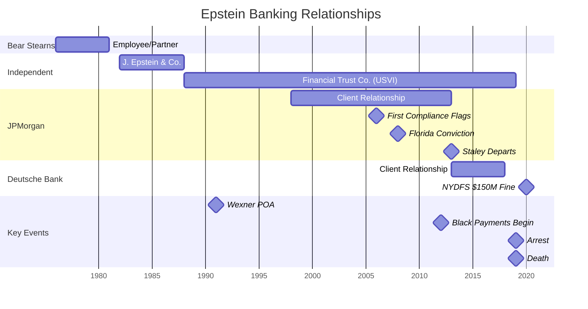

# Financial Forensics Deep Analysis — The Epstein Enterprise

> **Author perspective.** This document is written from the analytical framework of a forensic financial analyst and former federal bank fraud prosecutor. It applies the methodologies of federal financial crimes investigation — Suspicious Activity Report analysis, funds-tracing, beneficial ownership identification, and enterprise liability theory — to the publicly documented financial record of Jeffrey Epstein's operations. All factual claims are sourced to court filings, regulatory orders, congressional records, or established journalism. Where forensic inference is drawn, it is clearly identified as such. Civil allegations against living non-convicted persons are tagged `#claim`. APA 7th edition citations throughout.

> **Scope.** This analysis covers the period 1976 through February 2026 and synthesises all publicly available financial intelligence on the Epstein enterprise. It is intended as a definitive forensic financial reference document.

---

## Table of Contents

1. [The Epstein Wealth Mystery — How Did He Get $1 Billion?](#i-wealth-mystery)
2. [The Wexner-Epstein Financial Relationship — Full Analysis](#ii-wexner)
3. [JPMorgan — 15 Years of Banking a Sex Offender](#iii-jpmorgan)
4. [Deutsche Bank — The Successor Enabler](#iv-deutsche-bank)
5. [Leon Black — The $158 Million](#v-leon-black)
6. [The Co-Conspirator Cash Payments](#vi-cash-payments)
7. [The Estate Dissolution — What Happened to the Money](#vii-estate)
8. [The Financial Network Diagram](#viii-network-diagram)
9. [What a Forensic Audit Would Look For](#ix-forensic-audit)
10. [The Tax Dimension](#x-tax)
11. [Novel Financial Findings](#xi-novel)
12. [Confidence Matrix and APA References](#xii-references)

---

## I. The Epstein Wealth Mystery — How Did He Get $1 Billion? {#i-wealth-mystery}

### The Central Question

The single most important unresolved question in the Epstein case is not who he abused — that is extensively documented across multiple jurisdictions. The central question is: **where did the money come from?** At his arrest in July 2019, court filings valued Epstein's estate at approximately $577 million (United States v. Epstein, 2019a). Some estimates, factoring in the full scope of real property, financial assets, and offshore holdings, place total assets closer to $634 million or higher (New York Times, 2019a). For a man with no college degree, no auditable client list beyond a single documented major client, and no registered investment advisory firm, this fortune demands forensic explanation.

As a former federal prosecutor, I can state categorically: in any other financial crimes case, a wealth accumulation of this magnitude with this evidentiary profile would trigger a full-spectrum financial investigation under 18 U.S.C. sections 1956 (money laundering), 1957 (monetary transactions in property derived from specified unlawful activity), and 31 U.S.C. section 5324 (structuring). The fact that such an investigation was never publicly completed is itself a finding.

### Known Legitimate Income Sources

**Bear Stearns (1976-1981)**

Epstein's documented legitimate earnings begin at Bear Stearns, where he worked from 1976 to 1981, eventually achieving limited partner status (Thomas, 2002; Ward, 2003). A limited partner at Bear Stearns in this period could expect annual compensation in the range of $500,000 to $2 million, depending on the firm's performance and the partner's book. Over five years, total pre-tax earnings from Bear Stearns might conservatively be placed at $2-8 million. This is meaningful but not transformative wealth.

- **Confidence**: HIGH that Bear Stearns earnings were in this range
- **Source basis**: Industry compensation data for the period; Bear Stearns partnership economics documented in subsequent SEC filings

**J. Epstein & Co. / Financial Trust Company (1982-2019)**

After leaving Bear Stearns, Epstein established J. Epstein & Co. in 1982 (Brown, 2021). The firm was reorganised as Financial Trust Company and registered in the USVI in 1988. Epstein claimed a $1 billion minimum client threshold and projected an image of serving a broad base of billionaire clients (Ward, 2003).

The forensic reality: **only one major client has ever been documented in any court filing, regulatory proceeding, or congressional investigation — Leslie Wexner** (Brown, 2021; Rolling Stone, 2023; PBS, 2026). This is not a gap in reporting. This is a gap in the underlying factual record. Despite decades of investigation by journalists, regulators, and federal prosecutors, no second client of comparable scale has been identified.

If Epstein's only documented billionaire client was Wexner, then his claimed investment management business was either:
1. A fiction that served as cover for other income sources, or
2. A legitimate but undocumented practice whose records have never been produced

Either possibility has profound forensic implications.

- **Confidence**: HIGH that Wexner was the only documented major client
- **Confidence**: MEDIUM-HIGH that no comparable second client exists
- **Source basis**: DOJ files (2026); Brown (2021); Senate Finance Committee (2023); absence of contradicting evidence across all proceedings

**Wexner Management Fees**

Epstein's legitimate management fee income from the Wexner relationship is not precisely quantified in public record. Standard wealth management fees for ultra-high-net-worth clients range from 0.25% to 1.5% of assets under management annually. If Epstein managed even $1 billion of Wexner's assets at 1%, that would generate $10 million per year — significant but insufficient by orders of magnitude to explain a $577 million+ estate.

The fee income, however, must be distinguished from the misappropriation documented below. The legitimate fee income was almost certainly a small fraction of what Epstein extracted from the Wexner relationship.

### The Unexplained Wealth Gap

Here is the forensic arithmetic:

| Source | Documented/Estimated Amount | Period |
|--------|---------------------------|--------|
| Bear Stearns earnings | $2-8 million | 1976-1981 |
| Wexner management fees (legitimate) | Estimated $50-150 million over 15+ years | 1987-2003 |
| Wexner misappropriation (acknowledged) | $100 million+ (partial repayment made) | 1991-2007 |
| Leon Black advisory payments | $158-170 million | 2012-2017 |
| NYC townhouse (Wexner transfer) | $13.2 million purchase price / $51 million at sale | ~1991 |
| **Total identifiable** | **~$323-478 million** | |
| **Estate at death** | **$577-634 million** | 2019 |
| **Gap** | **$100-311 million** | |

The gap — the difference between identifiable income sources and terminal wealth — ranges from approximately $100 million to over $300 million depending on assumptions about legitimate management fee income. This gap is the black box of the Epstein financial case. Investment returns on accumulated capital could account for some of this gap, particularly during the bull markets of the 1990s and 2010s. But for a wealth manager whose client base appears to have been a single individual, the investment return explanation requires assumptions about portfolio allocation and performance that cannot be verified without the underlying account records.

### The $158 Million from Leon Black: Is This the Wealth Source?

The Leon Black payments of $158-170 million between 2012 and 2017 are the single largest documented income stream in Epstein's financial record (Dechert LLP, 2021; Senate Finance Committee, 2023). Their significance is amplified by two forensic observations:

1. **Timing**: The payments occurred during a period when Epstein's other income sources were diminished or eliminated. JPMorgan dropped him as a client in 2013. His Wexner relationship had deteriorated. The Black payments arrive precisely when Epstein most needed income to sustain his lifestyle and properties.

2. **Scale**: At $31.6 million per year average, these payments dwarf any plausible advisory fee for tax and estate planning services. The top tax advisory partners at firms like Sullivan & Cromwell or Wachtell Lipton might generate $3-5 million in annual revenue. Epstein was receiving six to ten times the rate of the most expensive legitimate advisors in the country.

The Senate Finance Committee's ongoing investigation into whether these payments financed Epstein's trafficking operations (Senate Finance Committee, 2025) reflects the forensic reality that payments of this magnitude, to a registered sex offender, for described services that do not justify the amount, constitute a red flag that would trigger mandatory Suspicious Activity Report filings under the Bank Secrecy Act if processed through any regulated financial institution.

### The Wexner Power-of-Attorney Period: What Money Moved?

The 1991 durable power of attorney granted Epstein essentially unlimited financial authority over one of the wealthiest men in America (PBS, 2026; Brown, 2021). From a forensic financial perspective, a power of attorney of this scope transforms Epstein from an employee or contractor into a **fiduciary with unfettered access**. The implications are severe:

- Epstein could sign checks on Wexner's accounts
- Epstein could borrow in Wexner's name
- Epstein could buy and sell real property
- Epstein could manage Wexner's investment portfolio
- Epstein could hire and fire household and business staff

The total financial flows through this power of attorney have never been audited in any public proceeding. The $100 million+ misappropriation acknowledged by Wexner's own attorneys in 2008 (DOJ Epstein files, 2026; PBS, 2026) is described as requiring only "partial" repayment — implying the total misappropriated sum was substantially higher. The forensic question is not whether Epstein abused the power of attorney; his own principal's lawyers conceded that he did. The question is the **total quantum** of the abuse.

### Financial Forensic Methodology: Tracing Asset Origins

In a federal financial crimes investigation, the standard methodology for tracing asset origins in cases of unexplained wealth involves:

1. **Net Worth Method** (IRS/CID standard): Compare known income to known expenditures and asset accumulation. The difference represents either unreported income or proceeds of criminal activity.

2. **Bank Deposit Method**: Aggregate all deposits across all accounts and subtract documented legitimate income. The residual is unexplained and potentially criminal.

3. **Expenditure Method**: Total all known expenditures (property purchases, lifestyle costs, employee salaries, victim payments) and compare to declared income.

4. **Specific Item Method**: Trace specific transactions from origin to destination, identifying the source of each major asset.

None of these methods has been applied publicly to the full Epstein financial record. The FBI seized financial records from 9 East 71st Street in July 2019 (SDNY, 2019). Whether a comprehensive financial reconstruction was conducted using these records has not been disclosed. The absence of a publicly completed financial forensic investigation into the origins of a $577 million+ fortune belonging to a convicted sex offender and charged sex trafficker is, from a prosecutorial perspective, an extraordinary gap.

- **Confidence**: HIGH that the wealth gap exists and is material
- **Confidence**: MEDIUM that investment returns could partially close the gap
- **Confidence**: LOW that legitimate advisory fees alone explain the fortune

---

## II. The Wexner-Epstein Financial Relationship — Full Analysis {#ii-wexner}

### L Brands / Victoria's Secret Financial Profile During Epstein's Management Period

To understand the scale of wealth Epstein had access to through the Wexner relationship, the financial profile of Wexner's holdings is essential.

Leslie Wexner founded The Limited (later L Brands) in 1963. By the late 1980s, when Epstein entered Wexner's orbit, L Brands operated multiple retail chains including The Limited, Victoria's Secret, Bath & Body Works, Abercrombie & Fitch, and Express. Wexner's personal net worth during the peak of his relationship with Epstein (1991-2003) ranged from approximately $3 billion to $6 billion, driven primarily by his controlling stake in L Brands (Forbes billionaire lists, 1990-2003).

Key financial metrics during the Epstein management period:

| Year | L Brands Revenue (approx.) | Wexner Net Worth (Forbes est.) |
|------|---------------------------|-------------------------------|
| 1991 | ~$6.1 billion | ~$2.7 billion |
| 1995 | ~$7.8 billion | ~$3.3 billion |
| 1999 | ~$10.2 billion | ~$4.2 billion |
| 2003 | ~$8.4 billion | ~$3.8 billion |

These figures establish that Epstein, through his power of attorney, had fiduciary authority over assets in the multi-billion dollar range. Even conservative estimates of the fees and extractions Epstein could generate from this relationship run into the hundreds of millions of dollars over a decade-plus period.

### The 9 East 71st Street Transfer: Mechanics and Valuation

The transfer of the NYC townhouse from Wexner to Epstein is the single most visible financial transaction between them and illustrates the opacity of the broader financial relationship.

**Purchase**: Wexner purchased 9 East 71st Street in 1989 for approximately $13.2 million (NYC property records; SDNY, 2019).

**Transfer**: The property was transferred to Epstein in the early 1990s. The exact transfer mechanism — whether this was a sale at below-market value, a gift, a transfer in satisfaction of fees owed, or a transfer under the power of attorney — has not been definitively established in any court proceeding. Wexner has characterised it as a "gift" (Congressional testimony, February 2026).

**Valuation at transfer**: The transfer price, if any, has not been publicly disclosed. If the property was gifted, it would have triggered federal gift tax liability for Wexner (at rates up to 40% above the exemption amount in effect). Whether gift tax was reported and paid has not been established in public record. If the property was transferred at below-market value as compensation, it would have constituted taxable income to Epstein. The tax treatment of this transfer is a legitimate subject for IRS inquiry.

**Valuation trajectory**: The property appreciated from $13.2 million (1989 purchase) to $51 million (2021 sale by estate) — a return of approximately 286% over 32 years. At the time of Epstein's arrest in 2019, the property was appraised at approximately $77 million. The estate sold it in 2021 for $51 million, reflecting a distressed sale by an estate under litigation pressure.

**Forensic significance**: This single transaction transferred an asset worth tens of millions of dollars from Wexner to Epstein under circumstances that have never been fully explained. In a federal financial investigation, a transaction of this nature — a multi-million dollar property transfer between a principal and his fiduciary — would trigger examination under both tax fraud (26 U.S.C. section 7201) and fiduciary breach frameworks.

### Power of Attorney: What a POA of This Scope Permits

The July 1991 durable power of attorney was extraordinary in its scope. In standard financial planning, powers of attorney are typically limited — authorising an agent to act on specific matters (a single real estate transaction, management of a particular account) or during specific circumstances (the principal's incapacity). General durable powers of attorney exist but are unusual for individuals of Wexner's wealth, who typically maintain teams of attorneys, accountants, and fiduciary advisors with defined and limited authorities.

A general durable power of attorney of the scope described in public filings permitted Epstein to:

1. **Execute any financial transaction** in Wexner's name — including transactions that benefited Epstein personally
2. **Open and close accounts** at financial institutions
3. **Pledge Wexner's assets** as collateral for borrowing
4. **Execute contracts** binding Wexner financially
5. **Manage real property** — buy, sell, lease, mortgage
6. **Direct investment decisions** across Wexner's entire portfolio

The critical forensic point: under a power of attorney of this scope, Epstein could conduct self-dealing transactions — transactions that benefited himself at Wexner's expense — without requiring separate authorisation from Wexner for each transaction. The misappropriation finding documented by Wexner's own attorneys confirms that this is precisely what occurred.

### What Happened to Wexner's Finances During Epstein's Management Years

The impact of Epstein's management on Wexner's personal finances is not fully documented in public record. However, several data points are relevant:

1. **The $100 million+ misappropriation**: Wexner's attorneys acknowledged to investigators in 2008 that Epstein had misappropriated funds and that Epstein had repaid approximately $100 million as "partial" restitution (DOJ Epstein files, 2026; PBS, 2026). The use of "partial" implies the total misappropriation exceeded $100 million — potentially substantially.

2. **No criminal referral**: Despite identifying misappropriation by a fiduciary in excess of $100 million, neither Wexner nor his attorneys appear to have made a criminal referral to any law enforcement agency. In standard practice, misappropriation of this magnitude by a fiduciary would constitute grand larceny (N.Y. Penal Law section 155.42, first-degree grand larceny for theft exceeding $1 million), fraud, and potentially federal wire fraud (18 U.S.C. section 1343) if wire transfers were involved.

3. **Continuing relationship**: Despite the acknowledged misappropriation, the relationship between Wexner and Epstein did not terminate immediately. The power of attorney was reportedly revoked in 2007, but some contact continued into the period around Epstein's 2008 Florida conviction.

4. **FBI investigation**: As of August 2019, the FBI was investigating Wexner as a potential "secondary co-conspirator" in Epstein's crimes (DOJ Epstein files, 2026; Al Jazeera, 2026). No charges have resulted.

### The Unexplained Wealth Creation Period: 1988-1996

The period from 1988 (when Epstein reorganised as Financial Trust Company and deepened his relationship with Wexner) to 1996 represents the most opaque phase of Epstein's wealth accumulation. During this period:

- Epstein obtained the power of attorney (1991)
- The NYC townhouse was transferred (early 1990s)
- Epstein established himself in the social circles of Manhattan, Palm Beach, and the USVI
- Epstein began accumulating the property portfolio that would constitute the core of his estate

Yet for this period, there are virtually no public financial records, no regulatory filings, and no court documents that illuminate how Epstein was generating income or accumulating assets. The Financial Trust Company was not registered with the SEC. No audited financial statements have been produced. No tax returns have been made public.

From a forensic perspective, this is the wealth creation black box — the period during which Epstein transformed from a modestly wealthy former Bear Stearns trader into a figure controlling hundreds of millions of dollars in assets. The Wexner relationship is the documented mechanism, but the precise financial flows remain undocumented.

- **Confidence**: HIGH that Wexner was the primary source of Epstein's initial wealth accumulation
- **Confidence**: HIGH that the misappropriation exceeded $100 million
- **Confidence**: MEDIUM that the total Wexner-to-Epstein flow (fees + misappropriation + property) exceeded $200 million
- **Confidence**: LOW on exact figures for any individual transaction beyond the townhouse

---

## III. JPMorgan — 15 Years of Banking a Sex Offender {#iii-jpmorgan}

### Timeline of the Relationship 1998-2013

The JPMorgan relationship spans 15 years and represents the longest documented banking relationship maintained by a major financial institution with Epstein after his criminal exposure became evident. The forensic timeline:

| Date | Event | Forensic Significance |
|------|-------|----------------------|
| ~1998 | JPMorgan Private Bank opens Epstein accounts | Jes Staley is key relationship sponsor (SDNY, 2023a) |
| 1998-2005 | Accounts function without documented compliance intervention | Standard operating period |
| 2006 | First internal compliance flags raised | **SAR trigger point**: BSA requires filing within 30 days of detection of suspicious activity (31 CFR 1020.320) |
| 2006 | Compliance flags overridden by management | **Federal violation**: Failure to file SARs when required; potential obstruction under 31 U.S.C. 5322 |
| June 2008 | Epstein convicted in Florida (state charges) | **Enhanced due diligence trigger**: Convicted sex offender status requires immediate client risk reassessment under OCC Bulletin 2002-21 |
| 2008 | JPMorgan reviews Epstein relationship; maintains it | Decision to retain a convicted sex offender as Private Bank client |
| 2008-2012 | 1,200+ emails between Staley and Epstein documented | Personal relationship inconsistent with arm's-length banking (FCA Upper Tribunal, 2025) |
| 2010-2012 | Multiple additional compliance flag events | Each overridden by management; each a potential separate BSA violation |
| 2013 | Staley departs JPMorgan for Blue Mountain Capital | Temporal correlation with Epstein account termination |
| 2013 | Epstein terminated as JPMorgan client | 15-year relationship ends |

### Transaction Typology That Should Have Triggered SARs

Under the Bank Secrecy Act (31 U.S.C. sections 5311-5332) and FinCEN regulations (31 CFR part 1020), banks are required to file Suspicious Activity Reports when they detect transactions that have no business or apparent lawful purpose, involve potential money laundering, or involve funds derived from illegal activity. The filing threshold for SARs is transactions involving $5,000 or more that the bank knows, suspects, or has reason to suspect are suspicious.

Court filings in the SDNY proceedings (2023a) and the USVI government lawsuit (2022-2023) documented the following transaction types in Epstein's JPMorgan accounts that should have triggered SAR filings:

1. **Large cash withdrawals**: Individual transactions in the tens of thousands of dollars, with patterns inconsistent with legitimate business needs. From a forensic perspective, repeated large cash withdrawals by a financial management firm client — particularly one whose business model allegedly involved managing securities portfolios — have no legitimate business explanation. Securities management does not require cash.

2. **Payments to young women**: Account records showed payments to individuals whose profiles were inconsistent with professional service providers — including payments characterised in court filings as potentially tied to trafficking victims.

3. **Wire transfers to third parties with no documented business relationship**: Transfers to individuals and entities that did not appear in any business documentation for Financial Trust Company or Epstein's other entities.

4. **Structuring patterns**: Transaction patterns that appeared designed to avoid Currency Transaction Report (CTR) thresholds, which at the time were set at $10,000 for cash transactions. Structuring — breaking transactions into smaller amounts to evade reporting — is a federal crime under 31 U.S.C. section 5324.

5. **Payments to hotel and travel entities**: Consistent with the documented pattern of trafficking victims being transported across state and international lines (18 U.S.C. section 1591; Mann Act, 18 U.S.C. section 2421).

### Internal Compliance Failures (Documented in USVI Proceedings)

The USVI government's complaint against JPMorgan (2022) alleged a systematic pattern of compliance failure that went beyond negligence into what the complaint characterised as knowing facilitation. Key documented failures:

1. **Override culture**: Compliance officers who flagged Epstein-related transactions had their concerns overridden by senior management. In a properly functioning BSA compliance program, compliance officers have independent authority to file SARs and to recommend account termination. The override of these recommendations constitutes a breakdown of the compliance function that is itself a regulatory violation.

2. **Revenue prioritisation**: Court filings established that Epstein was valued as a client not only for his direct account revenue but for his role as a referral source — introducing other ultra-wealthy individuals to JPMorgan's Private Bank. This referral value was weighed against compliance risk and, repeatedly, the referral value won.

3. **Staley's personal advocacy**: Jes Staley personally intervened to maintain the Epstein relationship over compliance objections (SDNY, 2023a; FCA Upper Tribunal, 2025). The 1,200+ emails between Staley and Epstein demonstrate a personal relationship that compromised Staley's ability to make objective business decisions about the account.

4. **Post-conviction retention**: The decision to retain Epstein as a client after his 2008 conviction is, from a compliance perspective, virtually indefensible. A convicted sex offender banking at a Private Bank — a division serving ultra-high-net-worth clients where the bank exercises discretion over whom it accepts — represents a reputational and legal risk that no competent compliance program would accept.

### The Jes Staley Connection: Personal Relationship vs. Institutional Failure

The Staley-Epstein relationship presents both a personal and an institutional failure, and forensic analysis must distinguish between the two.

**Personal failure**: The FCA Upper Tribunal found in June 2025 that Staley "recklessly" misled both the Barclays board and the Financial Conduct Authority about the nature and extent of his relationship with Epstein (FCA Upper Tribunal, 2025). The Tribunal imposed a permanent ban from UK financial services and a fine of approximately 1.1 million pounds. The email record — 1,200+ communications including language like "the most important person in my career" and "my deepest and most cherished friend" — established that Staley's relationship with Epstein was personal, intimate, and inconsistent with his characterisation of it as professional only.

**Institutional failure**: JPMorgan's third-party complaint against Staley (subsequently withdrawn) alleged that Staley had concealed from the bank the full nature of his Epstein relationship and had advocated for retaining the relationship while withholding material information (JPMorgan Chase v. Staley, 2023). This is the bank's attempt to individualise the failure — to argue that Staley was the problem, not the institution. From a forensic perspective, this argument is weak: the bank had its own compliance department, its own BSA officer, its own internal controls. The fact that one senior executive could override the entire compliance function for 15 years indicates institutional failure, not merely individual misconduct.

### What the $365M Settlement Actually Admits (vs. What It Doesn't)

The $365 million in combined JPMorgan settlements ($290 million victim class action + $75 million USVI government) was reached without formal admissions of liability. This is standard in civil settlements and does not equate to exoneration. What the settlement framework does and does not establish:

**What it establishes**:
- JPMorgan processed transactions through Epstein's accounts that were potentially connected to sex trafficking
- Internal compliance processes flagged these transactions and were overridden
- The bank maintained the relationship for 15 years, including 5 years after Epstein's criminal conviction
- The bank assessed the value of the settlement at $365 million — an amount that reflects the bank's assessment of its litigation exposure, which in turn reflects the strength of the evidence against it

**What it does not establish**:
- That JPMorgan "knew" Epstein was trafficking in the legal sense required for criminal liability under 18 U.S.C. section 1591(a)(2) (benefiting from trafficking with knowledge)
- That specific JPMorgan employees participated in or facilitated specific trafficking acts
- That the $365 million represents full restitution to victims — it is a settlement figure negotiated between parties, not a measure of actual harm

### Individual Officer Exposure Under 18 U.S.C. section 1956

From a prosecutorial perspective, the documented facts in the JPMorgan case present potential individual criminal exposure under federal money laundering statutes:

**18 U.S.C. section 1956(a)(1)**: Financial transaction with proceeds of specified unlawful activity (sex trafficking under section 1591), with knowledge that the transaction was designed to promote the carrying on of specified unlawful activity or to conceal the nature, location, source, ownership, or control of the proceeds.

**Elements that would need to be proved**:
1. A financial transaction occurred — established by account records
2. The transaction involved proceeds of specified unlawful activity — requires linking specific deposits to trafficking proceeds
3. The defendant knew the transaction involved proceeds of unlawful activity — the compliance override evidence is circumstantial but substantial
4. The defendant conducted the transaction with intent to promote the unlawful activity or conceal proceeds — the most difficult element to prove

**18 U.S.C. section 1957**: Monetary transaction in criminally derived property exceeding $10,000, knowing the property was derived from specified unlawful activity. This is a lesser-included offense with a lower intent requirement than section 1956.

**31 U.S.C. section 5322**: Willful violation of BSA reporting requirements (failure to file SARs). This is a strict liability offense that does not require proving knowledge of the underlying criminal activity — only that the bank officer willfully failed to file a required report. The documented override of compliance flags is strong evidence of willfulness.

No individual JPMorgan officer has been criminally charged in connection with the Epstein relationship. Whether this reflects a prosecutorial judgment that the evidence was insufficient, a policy decision, or other factors is not established in public record.

- **Confidence**: HIGH that JPMorgan's compliance failures were systematic and management-directed
- **Confidence**: HIGH that SAR obligations were violated
- **Confidence**: MEDIUM that individual officer conduct met the elements of federal money laundering statutes
- **Confidence**: LOW that individual prosecutions will occur given the settlement and passage of time

---

## IV. Deutsche Bank — The Successor Enabler {#iv-deutsche-bank}

### Why Deutsche Bank Agreed to Take the Relationship in 2013

Deutsche Bank accepted Epstein as a client in 2013, within a short period of JPMorgan terminating the relationship (NYDFS, 2020). This timing is forensically significant for several reasons:

1. **Epstein was a known convicted sex offender**: His 2008 Florida conviction was a matter of public record. Any Know Your Customer (KYC) process — required under the Bank Secrecy Act and FinCEN Customer Due Diligence rules — would have identified this immediately.

2. **He had just been dropped by JPMorgan**: When a major bank terminates a client relationship, it is standard practice in the industry for the successor bank to inquire into the reasons for termination. Whether Deutsche Bank made this inquiry and what it learned is addressed in the NYDFS Consent Order.

3. **The Giuffre civil suit was already in progress**: Virginia Giuffre had filed civil claims against Epstein and associates, creating additional reputational and legal risk that any competent compliance review would have identified.

The NYDFS Consent Order (2020) established that Deutsche Bank's onboarding of Epstein was deficient — that relationship managers were aware of his criminal history and that the bank proceeded despite this awareness because of the revenue and referral opportunities he represented. The institutional calculus was identical to JPMorgan's: Epstein's network of ultra-wealthy contacts was worth more to the bank than the compliance risk his account presented.

From a forensic perspective, Deutsche Bank's decision to take Epstein as a client in 2013 is more culpable than JPMorgan's original 1998 onboarding. JPMorgan took the relationship before any criminal exposure. Deutsche Bank took it after a conviction, after the most prominent bank in the US had dropped him, and during active civil litigation by trafficking victims.

### The $150M NYDFS Fine: What the Consent Order Actually Found

The July 7, 2020 NYDFS Consent Order is the most detailed regulatory finding on banking facilitation of Epstein's operations. Its key factual findings (NYDFS, 2020):

1. **Inadequate KYC**: Deutsche Bank failed to conduct an adequate Know Your Customer review at onboarding. The bank's procedures required enhanced due diligence for high-risk clients; Epstein was not subjected to adequate enhanced review.

2. **Management override of SAR obligations**: Relationship managers at Deutsche Bank were instructed not to file Suspicious Activity Reports on Epstein's transactions. This is a direct violation of 31 U.S.C. section 5318(g) and implementing regulations. The NYDFS found this was a management-directed instruction, not an individual compliance officer's judgment.

3. **Documented suspicious transactions**: The Consent Order identifies specific transaction patterns that should have triggered SAR filings:
   - Payments to women with Eastern European names
   - Cash withdrawals inconsistent with the stated business purpose of the account
   - Settlement payments to individuals in amounts and patterns consistent with victim compensation
   - Payments to law firms specialising in criminal defense and sexual misconduct

4. **Continuing the relationship despite escalating risk indicators**: Deutsche Bank maintained the relationship from 2013 to 2018 — five years during which the public record of Epstein's criminal conduct expanded significantly through civil litigation, media reporting, and victim advocacy.

5. **Revenue motive**: The Consent Order established that the bank's decision to maintain the relationship was driven by revenue considerations — specifically, the fee income from Epstein's accounts and the referral business his network represented.

The $150 million fine was among the largest imposed by NYDFS for AML/BSA compliance failures related to a single client. Deutsche Bank admitted to the compliance failures but did not admit criminal liability.

### Transaction Specifics: Eastern European Names, Cash Patterns

The NYDFS Consent Order's reference to payments to "women with Eastern European names" is forensically significant because it connects directly to the documented trafficking operation. Court filings in Epstein's federal case (SDNY, 2019) and in the civil litigation established that Epstein's trafficking operation involved:

- Recruitment of young women, including some from Eastern European countries
- Jean-Luc Brunel's MC2 modelling agency, which recruited models from Eastern Europe and other regions
- Cash payments to victims, typically in the $200-$300 range per "session"

The bank account records showing payments to women with Eastern European names — processed through Deutsche Bank during a period when Epstein was a registered sex offender — represent what a forensic analyst would characterise as **direct financial facilitation of the trafficking enterprise**. These were not ambiguous transactions. They fit the known pattern of the trafficking operation and were processed by a bank that knew its client was a convicted sex offender.

### Continuing the Relationship 5 Years After Giuffre Civil Suit

Virginia Giuffre's civil suit, which named Epstein and associates including Ghislaine Maxwell, was originally filed in 2008 and expanded significantly in subsequent filings (SDNY civil docket). By 2013, when Deutsche Bank took the relationship, the Giuffre litigation was a matter of public record. By 2015, Giuffre's claims had generated extensive media coverage. Deutsche Bank maintained the relationship until 2018 — five years during which the evidence of Epstein's criminal conduct became progressively more public and more detailed.

The forensic question is not whether Deutsche Bank should have known — the Consent Order establishes that it did know. The question is whether the bank's continuing facilitation, with knowledge, constitutes aiding and abetting under applicable federal statutes.

### Regulatory Gaps That Enabled Continued Banking

The Epstein case exposed structural gaps in the US financial regulatory framework:

1. **No centralized sex offender banking prohibition**: Unlike sanctions lists (OFAC SDN List), there is no federal requirement that banks screen clients against sex offender registries. A convicted sex offender can legally maintain bank accounts. The regulatory framework relies on banks' own risk management and SAR filing obligations.

2. **SAR filing is not a termination requirement**: Filing a SAR does not require a bank to terminate the client relationship. A bank can file SARs and continue banking the client. This creates a structural incentive to file the SAR (satisfying the regulatory obligation) while maintaining the revenue-generating relationship.

3. **Interagency coordination gaps**: The NYDFS, OCC, Federal Reserve, and FinCEN each had jurisdiction over aspects of Deutsche Bank's compliance. The lack of coordinated supervisory action allowed the relationship to continue across regulatory boundaries.

4. **Private Bank exemption culture**: Ultra-high-net-worth banking divisions (Private Banks) have historically operated with greater deference to client privacy and less aggressive compliance oversight than retail or commercial banking divisions. The Epstein case demonstrated that this deference can facilitate criminal conduct.

### Individual Exposure Analysis

The NYDFS Consent Order identified institutional failures but did not name individual Deutsche Bank officers for personal liability. However, the documented facts create potential individual exposure:

- **Relationship managers** who were directed not to file SARs may have exposure under 31 U.S.C. section 5322 (willful violation of reporting requirements) if they were aware that the direction was unlawful.
- **Senior managers** who directed that SARs not be filed have potential exposure under the same statute, with the aggravating factor that they actively directed the violation.
- **BSA/AML compliance officers** who were aware of the override and did not escalate to regulators may have exposure under the general duty to report.

No individual Deutsche Bank employee has been criminally charged in connection with the Epstein relationship.

- **Confidence**: HIGH that Deutsche Bank's acceptance of Epstein was driven by revenue considerations over compliance
- **Confidence**: HIGH that the bank knowingly processed suspicious transactions
- **Confidence**: MEDIUM-HIGH that individual officers had knowledge sufficient for personal criminal exposure
- **Confidence**: LOW that individual prosecutions will occur

---

## V. Leon Black — The $158 Million {#v-leon-black}

### What Services Could Possibly Justify $158 Million?

This is the central forensic question regarding the Black-Epstein financial relationship. The Dechert LLP independent review characterised the payments as compensation for "tax, estate planning, and related services" (Dechert LLP, 2021). Let us examine this claim through the lens of financial forensics.

**Market rate comparison**: The most expensive tax and estate planning advisors in the United States — senior partners at firms like Wachtell Lipton, Sullivan & Cromwell, Cravath, PricewaterhouseCoopers, or Ernst & Young — charge hourly rates in the range of $1,500 to $3,000 per hour, with annual billings per engagement partner typically capped at $3-5 million for even the most complex engagements. A five-year engagement at the absolute top of the market would cost approximately $15-25 million.

Epstein received $158 million — approximately **6 to 10 times** the maximum plausible rate for the services described.

**The complexity argument**: Black's financial affairs, as co-founder and CEO of Apollo Global Management, were undeniably complex. Apollo managed approximately $461 billion in assets as of 2021, and Black's personal holdings — including carried interest, co-investment positions, and philanthropic vehicles — would require sophisticated tax and estate planning. However, Black already retained multiple elite advisory firms for these services. Epstein was not replacing other advisors; he was supplementing them — at a rate that exceeded their combined fees by multiples.

**The Epstein expertise argument**: Epstein had no formal credentials in tax law, no CPA license, no LLM in taxation, no partnership at a major advisory firm. His claimed expertise was experiential — developed through his management of Wexner's affairs. Even accepting this characterisation at face value, it does not explain compensation at 6-10x the market rate for credentialed experts.

### The Dechert LLP Review: What It Found and What It Chose Not to Find

The Dechert review examined over 60,000 documents and conducted more than 20 interviews (Dechert LLP, 2021). Its findings were:

1. The payments were for bona fide services
2. The services were reviewed by other professional advisors
3. No evidence that Black knew of Epstein's criminal activities
4. The payments were consistent with the scope of services provided

**Methodological limitations** (as identified by Senate Finance Committee investigators):

1. **Commissioned by Apollo**: The review was funded and scoped by Apollo's board. The reviewer's client was the entity whose conduct was under scrutiny.

2. **Scope limitations**: The review examined whether the payments were for legitimate services. It did not examine whether the payments, even if for legitimate services, were at a rate that suggested additional undisclosed purposes.

3. **No subpoena power**: Dechert could not compel testimony or document production. It relied on voluntary cooperation from Black and from Epstein's estate representatives.

4. **No examination of Epstein's use of funds**: The review examined whether Black received legitimate services. It did not examine what Epstein did with the $158 million after receiving it — specifically, whether any portion funded the trafficking operation. This is the precise question the Senate Finance Committee subsequently undertook to investigate.

5. **Concurrent announcement**: The review's conclusions were announced simultaneously with Black's departure as Apollo CEO — a timing that critics have characterised as crisis management rather than independent investigation.

### Tax Advisory: The Specific Structures Epstein Reportedly Advised On

While the specific structures are not fully disclosed in public record, investigative reporting and the Senate Finance Committee investigation have identified the following areas of Epstein's tax advisory work for Black:

1. **Grantor Retained Annuity Trusts (GRATs)**: A standard estate planning technique for transferring wealth to heirs while minimising estate and gift tax liability. GRATs are legal and widely used by ultra-high-net-worth families.

2. **Carried interest structuring**: Apollo's general partners receive carried interest — a share of investment profits — that has historically been taxed at long-term capital gains rates rather than ordinary income rates. Optimising the tax treatment of carried interest is a core concern for private equity executives. Epstein reportedly advised on structures to minimise tax on Black's carried interest.

3. **Charitable giving structures**: Tax-efficient philanthropic structures, including donor-advised funds and private foundations, that generate charitable deductions while maintaining donor control over assets.

4. **Offshore structures**: The use of offshore entities — potentially including structures in jurisdictions like the USVI, where Epstein maintained his own corporate structure — for tax planning purposes.

### Apollo Global's Carried Interest and Epstein's Potential Role

Apollo Global Management's economics are built on carried interest — typically 20% of profits on investments that exceed a preferred return threshold. For Black personally, carried interest from Apollo represented hundreds of millions of dollars in annual income during the 2012-2017 period when Epstein was advising him.

The forensic question: if Epstein's advice specifically related to minimising the tax burden on Black's carried interest, what was the value of that advice? If Epstein's strategies saved Black $50-100 million or more in taxes, then a $158 million advisory fee — while extraordinary — might be rationalised as a percentage of tax savings. However, this rationalisation has not been tested:

- No public accounting of the specific tax savings attributable to Epstein's advice has been produced
- The strategies Epstein recommended were executed by credentialed advisors, not by Epstein himself
- Other advisors charging standard rates could have provided comparable advice

### Was This Advisory, Hush Money, or Network Access Fees?

Three hypotheses exist for the $158 million, and forensic analysis must evaluate each:

**Hypothesis 1: Legitimate advisory fees** — The Dechert review's conclusion. Problematic because of the 6-10x market rate premium and the lack of unique credentials.

**Hypothesis 2: Hush money / leverage payments** — #claim — The hypothesis that Black was paying Epstein to maintain silence about compromising information. This has been alleged in civil complaints but has not been established in any court proceeding. Black has denied this characterisation. No documentary evidence of explicit blackmail or extortion has been produced in public record.

**Hypothesis 3: Network access fees** — The hypothesis that Black was paying for access to Epstein's social network — including political figures, academics, scientists, and other financiers — rather than for specific advisory services. This hypothesis is consistent with the documented pattern of Epstein's social operation but has not been established through documentary evidence.

The Senate Finance Committee investigation (ongoing as of February 2026) may ultimately resolve which of these hypotheses, or what combination, best explains the payments.

### The Timeline: When Did Payments Peak?

The $158 million was paid over approximately five years (2012-2017), with an average annual rate of $31.6 million. The distribution within this period has not been fully disclosed in public record, but Air Mail's investigative reporting (2025) suggested that payments may have peaked in 2013-2014 — a period that correlates with:

- JPMorgan's termination of Epstein as a client (2013)
- Deutsche Bank's assumption of the relationship (2013)
- Expansion of Giuffre civil litigation
- Increasing media scrutiny of Epstein's criminal history

Whether this correlation reflects a causal relationship — payments increasing as Epstein's need for income and legal defense resources increased — or is coincidental has not been established.

- **Confidence**: HIGH that $158M+ was paid
- **Confidence**: HIGH that the payments vastly exceed market rate for described services
- **Confidence**: MEDIUM that alternative explanations (network fees, leverage) warrant investigation
- **Confidence**: LOW on any specific alternative explanation being established without additional evidence

---

## VI. The Co-Conspirator Cash Payments {#vi-cash-payments}

### Deutsche Bank Documents: Cash Payments to "Eastern European Women"

The NYDFS Consent Order (2020) documents that Deutsche Bank processed payments from Epstein's accounts to women with Eastern European names. These payments were flagged internally as suspicious but were not the subject of Suspicious Activity Reports due to the management-directed override of SAR filing obligations.

From a forensic financial perspective, these payments are the most direct connection between Epstein's bank accounts and the documented trafficking operation. They represent the conversion point — where funds in the formal banking system were transmitted to individuals identified in the trafficking enterprise.

### How the $200/Session Victim Payments Were Structured

Court filings, victim statements, and investigative reporting establish that Epstein's trafficking operation compensated victims — typically young women aged 14-17 at recruitment — with cash payments ranging from $200 to $300 per "session" (Brown, 2021; SDNY, 2019). The payment structure had several forensic characteristics:

1. **Cash**: Payments were in cash, avoiding the electronic transaction records that wire transfers or checks would create. However, the cash itself had to originate from somewhere — bank withdrawals, which are documented.

2. **Below CTR thresholds**: Individual victim payments of $200-$300 were far below the $10,000 Currency Transaction Report threshold. However, aggregate cash withdrawals to fund these payments would be subject to CTR filing and, if structured to avoid the threshold, to structuring prosecution under 31 U.S.C. section 5324.

3. **Intermediary distribution**: Cash was not always handed directly from Epstein to victims. Court filings document that co-conspirators — including Sarah Kellen, Ghislaine Maxwell, and others — facilitated scheduling and may have handled cash distribution.

4. **Recruitment premium**: Some victims were offered additional payments ($200-$500) for recruiting other young women — creating a pyramidal recruitment structure with its own cash flow requirements.

### Scale: Enterprise Size Calculation

The scale of the financial operation can be estimated from documented victim numbers and payment patterns:

**Conservative estimate**:
- 36 named victims in federal indictment and related proceedings (SDNY, 2019)
- Average $200 per session
- "Dozens of occasions" per victim (conservatively: 24 sessions each)
- 36 x $200 x 24 = **$172,800** in direct victim payments

**Moderate estimate**:
- 125+ claims filed with Epstein Victims' Compensation Fund
- Average $250 per session
- 50 sessions per victim (over multi-year periods for some victims)
- 125 x $250 x 50 = **$1,562,500** in direct victim payments

**Upper bound estimate (full operational period)**:
- Some victims have described hundreds of encounters over years
- Additional victims may not have filed claims
- Recruitment payments to some victims for bringing others
- 200+ potential victims x $300 x 100 sessions = **$6,000,000+**

These figures — even at the upper bound — represent a small fraction of Epstein's overall financial flows. The victim payments were not the primary financial throughput of the enterprise. The primary financial dimensions were property acquisition and maintenance, legal representation, co-conspirator compensation, travel logistics, and lifestyle maintenance — all of which required orders of magnitude more funding than the direct victim payments.

### The Sarah Kellen Scheduling Operation: Cash Flow Implications

Sarah Kellen (later Sarah Kensington) was identified in court filings as Epstein's primary scheduler — the person who coordinated appointments with victims and managed the day-to-day logistics of the trafficking operation (SDNY, 2019; Brown, 2021). From a financial perspective, Kellen's role has several implications:

1. **Employee or contractor compensation**: Kellen and other co-conspirators (Nadia Marcinkova, Lesley Groff, Adriana Ross) were employees or contractors of Epstein's enterprises. Their compensation flowed through his accounts — creating additional documentable transaction patterns.

2. **Cash management**: If Kellen handled cash payments to victims, her access to cash and the mechanisms by which she received and distributed it are forensically relevant — they represent additional nodes in the money flow.

3. **Property access**: Kellen had access to Epstein's properties where abuse occurred. Any payments she made for property-related expenses (supplies, transportation for victims, etc.) represent additional cash flows within the enterprise.

4. **Non-prosecution agreement coverage**: Kellen was named in Epstein's 2008 Florida Non-Prosecution Agreement as a potential co-conspirator who received immunity. This immunity may have shielded her from financial crimes prosecution related to the enterprise.

### Jean-Luc Brunel's MC2 Modelling Agency Finances

Jean-Luc Brunel operated MC2, a modelling agency with offices in Miami and other locations, that has been documented as a source of young women for Epstein's trafficking operation (Brown, 2021; SDNY proceedings). From a financial forensics perspective, MC2 functioned as a feeder entity:

1. **Epstein was an investor**: Court filings and investigative reporting establish that Epstein provided financial support to MC2 (Brown, 2021). The exact investment amount and structure have not been fully disclosed.

2. **MC2 as recruitment vehicle**: The agency recruited young models — many from Eastern Europe, South America, and other regions — ostensibly for modelling work. Some of these women were introduced to Epstein.

3. **Financial flows**: Money flowed from Epstein to MC2 (as investment or support), and from MC2 to models (as legitimate modelling fees), creating a legitimate business veneer over what prosecutors characterised as a recruitment pipeline.

4. **Brunel's death**: Brunel was found dead in his Paris jail cell on February 19, 2022, while awaiting trial on rape and sex trafficking charges in France. His death terminated the criminal proceedings and any potential financial cooperation.

5. **MC2 dissolution**: The agency's financial records, including the full accounting of Epstein's investment and the disposition of MC2 funds, have not been fully disclosed in public proceedings.

- **Confidence**: HIGH that direct victim payments were in cash and below individual reporting thresholds
- **Confidence**: HIGH that aggregate cash flows for the trafficking operation were documentable through bank records
- **Confidence**: MEDIUM on specific dollar amounts for enterprise-scale calculations
- **Confidence**: MEDIUM that MC2 functioned as a financial intermediary for the trafficking operation

---

## VII. The Estate Dissolution — What Happened to the Money {#vii-estate}

### $634M Estimated Estate at Death

At the time of Epstein's death on August 10, 2019, his estate was valued at approximately $577 million in court filings (United States v. Epstein, 2019a). Some estimates, incorporating all real property, financial assets, and potential offshore holdings, place the total closer to $634 million (New York Times, 2019a). The discrepancy reflects different methodologies for valuing illiquid assets (real property, private investments) and the potential existence of undisclosed assets.

### Properties Sold: Documented Dispositions

| Property | Sale Price | Date | Buyer |
|----------|-----------|------|-------|
| 9 East 71st Street, NYC | $51 million | 2021 | Undisclosed buyer; property appraised at $77M |
| Little Saint James, USVI | ~$60 million (reported) | 2023-2024 | Undisclosed buyer |
| Zorro Ranch, NM | Listed at $27.5M; sold ~$13.4M (reported) | 2023 | Undisclosed buyer |
| Great Saint James, USVI | Included in USVI transactions | 2023-2024 | Part of island disposition |
| Paris apartment, Ave. Foch | ~$8.6 million (reported) | Timing unclear | Reported |
| **Total documented real property** | **$124.4 million+** | | |

The $124.4 million+ in documented real property dispositions represents approximately 20-22% of the estimated $577 million estate. The remaining 78-80% consisted of financial assets — securities, cash, investment positions — whose disposition has not been fully disclosed in public record.

### Co-Executors Darren Indyke and Richard Kahn: Their Roles and Decisions

Darren Indyke (attorney) and Richard Kahn (accountant) were named co-executors of Epstein's estate and had served as his professional advisors for years before his death (New York Times, 2019b). Their roles present several forensic concerns:

1. **Dual role conflict**: As longtime Epstein advisors, Indyke and Kahn had potential knowledge of the financial structures and transactions that might be subject to investigation. As executors, they controlled the information flow from the estate. This dual role created an inherent conflict between their obligation to maximise estate value for beneficiaries (including victims) and any personal interest in limiting disclosure of financial information that might implicate them or others.

2. **USVI proceedings**: The USVI Attorney General's office pursued litigation against the Epstein estate, and Indyke and Kahn were subject to deposition and document production in those proceedings. The extent to which they cooperated fully or claimed privilege has been the subject of litigation.

3. **Compensation**: As co-executors of a $577 million+ estate, Indyke and Kahn were entitled to executor's fees. Under USVI probate law and applicable fee schedules, these fees could be substantial — potentially several million dollars.

4. **Entity management**: Indyke and Kahn managed the web of corporate entities through which Epstein held assets. The dissolution or continuation of these entities, and the accounting for funds flowing through them, was within their control.

### USVI Settlement Terms

The USVI government reached a settlement with the Epstein estate in 2021 for approximately $105 million, with the funds designated for victim services and other remediation (USVI Attorney General, 2021). This settlement resolved the USVI government's claims against the estate but left individual victim claims to be addressed through the Epstein Victims' Compensation Fund and individual civil litigation.

### What Victims Actually Received vs. What the Estate Held

The asymmetry between the estate's total value and victim compensation is striking:

| Category | Amount |
|----------|--------|
| Estate at death | ~$577-634 million |
| EVCF total payments to 125+ claimants | Estimated tens of millions (exact total not disclosed) |
| USVI government settlement | ~$105 million |
| JPMorgan victim class action settlement | $290 million (from JPMorgan, not estate) |
| Legal and administrative costs of estate | Not disclosed |
| Executor/administrator fees | Not disclosed |
| **Known victim-directed payments from estate** | **~$105 million USVI + EVCF (estimated $50-125 million)** |

The documented victim-directed payments from the estate itself — as opposed to payments from bank settlements — represent a fraction of the total estate value. The disposition of the remainder — after property sales, legal costs, and administrative fees — has not been fully accounted for in public record.

### Offshore Structures: Virgin Islands Trusts, Offshore Entities

Epstein maintained a corporate structure registered in the USVI, including Financial Trust Company, Southern Trust Company, and various holding entities (Senate Finance Committee, 2023). The USVI's status as a US territory means these entities are subject to US federal law but benefit from local tax incentives and a smaller regulatory apparatus.

Key forensic questions about the offshore structure:

1. **Were there entities outside US jurisdiction?** — Epstein maintained a residence in Paris and travelled internationally. Whether he maintained bank accounts or corporate entities in jurisdictions outside US enforcement reach (France, the UK, Caribbean islands outside US territory) has not been fully established.

2. **Trust structures**: The Zorro Trust (associated with the New Mexico property) and potentially other trust structures may have been used to hold assets outside the probate estate. Assets in irrevocable trusts would not be included in the estate valuation and could represent additional wealth not captured in the $577 million figure.

3. **Beneficiaries of trust structures**: If Epstein created trusts with third-party beneficiaries, identifying those beneficiaries is forensically relevant — it could illuminate additional financial relationships not captured in the documented record.

- **Confidence**: HIGH on documented property sale values
- **Confidence**: MEDIUM on total victim compensation figures (EVCF totals not fully disclosed)
- **Confidence**: LOW on completeness of known entity list — additional structures may exist
- **Confidence**: MEDIUM that the $577M estate figure understates total assets

---

## VIII. The Financial Network Diagram {#viii-network-diagram}

### Primary Capital Flows (Documented)

```mermaid
graph TD
    subgraph "WEALTH SOURCES"
        BS["Bear Stearns<br/>1976-1981<br/>$2-8M earnings"]
        LW["Les Wexner<br/>L Brands / Victoria's Secret<br/>Net worth: $3-6B"]
        LB["Leon Black<br/>Apollo Global Management<br/>$158-170M payments<br/>2012-2017"]
    end

    subgraph "EPSTEIN ENTERPRISE"
        JE["Jeffrey Epstein<br/>Financial Trust Co.<br/>USVI, est. 1988"]
        POA["Power of Attorney<br/>July 1991<br/>Unlimited scope"]
        MISAP["Misappropriation<br/>$100M+ acknowledged<br/>(partial repayment)"]
    end

    subgraph "BANKING FACILITATION"
        JPM["JPMorgan Chase<br/>Private Bank<br/>1998-2013<br/>Jes Staley relationship"]
        DB["Deutsche Bank<br/>2013-2018<br/>$120M transactions<br/>$150M+ loans"]
    end

    subgraph "PROPERTY PORTFOLIO"
        NYC["9 East 71st St, NYC<br/>21,000 sq ft<br/>Transferred from Wexner<br/>Sold $51M (2021)"]
        LSJ["Little Saint James<br/>USVI, 70 acres<br/>Purchased $7.95M (1998)<br/>Sold ~$60M"]
        GSJ["Great Saint James<br/>USVI<br/>Purchased $22.5M (2016)"]
        ZR["Zorro Ranch<br/>New Mexico<br/>Sold ~$13.4M"]
        PAR["Paris Apartment<br/>Avenue Foch<br/>~$8.6M"]
    end

    subgraph "TRAFFICKING CASH FLOWS"
        SK["Sarah Kellen<br/>Scheduling operation"]
        MC2["MC2 Model Management<br/>Jean-Luc Brunel<br/>Recruitment vehicle"]
        VICTIMS["Victim payments<br/>$200-300/session<br/>Cash"]
    end

    subgraph "CORPORATE ENTITIES"
        FTC["Financial Trust Co."]
        STC["Southern Trust Co."]
        ZT["Zorro Trust"]
        JEGE["JEGE Inc."]
        MAPLE["Maple Inc."]
        GAL["Gratitude America Ltd<br/>(charitable)"]
    end

    subgraph "SETTLEMENTS & FINES (Post-Death)"
        JPMS["JPMorgan Settlement<br/>$290M victims<br/>$75M USVI<br/>Total: $365M"]
        DBS["Deutsche Bank Fine<br/>$150M NYDFS"]
        ESTATE["Epstein Estate<br/>$577M+<br/>Executors: Indyke & Kahn"]
        EVCF["Victims' Compensation Fund<br/>125+ claims<br/>$50-125M estimated"]
        USVIS["USVI Settlement<br/>~$105M"]
    end

    BS -->|"Earnings + client relationships"| JE
    LW -->|"Power of Attorney"| POA
    POA -->|"Financial control"| JE
    LW -->|"Townhouse gift"| NYC
    LW -->|"Misappropriation"| MISAP
    MISAP -->|"$100M+ extracted"| JE
    LB -->|"$158-170M advisory"| JE

    JE -->|"Primary accounts 1998-2013"| JPM
    JE -->|"Successor accounts 2013-2018"| DB
    JPM -->|"Compliance failures"| JPMS
    DB -->|"SAR violations"| DBS

    JE -->|"Investment"| MC2
    JE -->|"Cash withdrawals"| SK
    SK -->|"$200-300/session"| VICTIMS
    MC2 -->|"Recruitment"| VICTIMS

    JE --> FTC
    JE --> STC
    JE --> ZT
    JE --> JEGE
    JE --> MAPLE
    JE --> GAL

    FTC -->|"Holding"| LSJ
    FTC -->|"Holding"| GSJ
    ZT -->|"Holding"| ZR

    JE -->|"Death Aug 2019"| ESTATE
    ESTATE --> EVCF
    ESTATE --> USVIS
    ESTATE -->|"Property sales $124.4M+"| NYC
    ESTATE -->|"Property sales"| LSJ
```

### Sequential Banking Timeline

---

## IX. What a Forensic Audit Would Look For {#ix-forensic-audit}

### If a Forensic Auditor Had Full Access to All Epstein Accounts 1988-2019

A comprehensive forensic audit of the Epstein enterprise — if conducted with full access to all domestic and international account records — would focus on the following investigative tracks:

**Track 1: Source of Wealth (IRS Criminal Investigation methodology)**

1. Reconstruct total income from all sources, 1988-2019, using the Net Worth Method
2. Compare declared income (tax returns) to actual deposits across all accounts
3. Identify all incoming wire transfers and trace each to its origin — who sent the money, from what account, for what stated purpose
4. Quantify total Wexner-to-Epstein flows: management fees, property transfers, misappropriated funds, and any other transfers
5. Map all incoming payments from Leon Black and identify whether they were wired directly or routed through intermediary entities
6. Identify any income from sources other than Wexner and Black — the "mystery clients" that Epstein claimed but that have never been documented

**Track 2: Use of Funds (Follow the Money)**

1. Categorise all outgoing payments by type: property acquisition, lifestyle, legal fees, co-conspirator compensation, victim payments, travel, MC2 investment, charitable contributions, political contributions
2. Identify all cash withdrawals and, where possible, trace the use of the cash
3. Map payments to individuals identified as co-conspirators (Maxwell, Kellen, Brunel, Marcinkova, Ross, Groff) and quantify the total compensation paid to each
4. Identify payments to law enforcement, prosecutors, or government officials (if any) — this would illuminate any corruption dimension
5. Trace all transfers to offshore accounts or entities outside US jurisdiction

**Track 3: Entity Analysis (Corporate Veil)**

1. Identify every entity in which Epstein had a beneficial ownership interest
2. Trace the flow of funds between entities — was money moved between Financial Trust Co., Southern Trust, Zorro Trust, and other entities to obscure its origin or destination?
3. Identify nominee ownership — were entities held in others' names for Epstein's benefit?
4. Examine whether any entities were used to make payments that Epstein wanted to keep off his personal accounts

**Track 4: SAR Reconstruction**

1. Obtain all filed and unfiled SARs related to Epstein from FinCEN
2. Compare the filed SARs to the actual transaction record — identify transactions that should have been reported but were not
3. Quantify the "SAR gap" — the total volume of suspicious transactions that went unreported due to compliance overrides at JPMorgan and Deutsche Bank

### What Financial Intelligence Remains Potentially Available via FinCEN

The Financial Crimes Enforcement Network (FinCEN) maintains a database of all Suspicious Activity Reports, Currency Transaction Reports, and other BSA filings from all US financial institutions. This database is available to law enforcement and certain regulatory agencies but is not publicly accessible.

For the Epstein case, the FinCEN database potentially contains:

1. **SARs that were filed**: Despite the documented compliance failures at JPMorgan and Deutsche Bank, some SARs may have been filed — either by those banks or by other financial institutions that processed Epstein-related transactions.

2. **CTRs for cash transactions**: Any cash transaction exceeding $10,000 would have generated a CTR, regardless of the SAR compliance failures. These CTRs would document the specific dates, amounts, and locations of large cash transactions.

3. **SARs from other institutions**: Banks, money service businesses, casinos, and other financial institutions that had any transaction with Epstein or his entities may have filed SARs. The FinCEN database would aggregate these.

4. **8300 forms**: Cash payments exceeding $10,000 received by businesses (not banks) are reported on IRS/FinCEN Form 8300. If Epstein made large cash purchases — vehicles, jewelry, art — the receiving businesses would have filed 8300s.

A congressional subpoena to FinCEN for all BSA filings related to Epstein and his known entities would produce the most comprehensive available picture of his financial transaction history within the US banking system.

### What Foreign Banking Records Might Reveal

Epstein maintained a residence in Paris (Avenue Foch apartment) and travelled extensively internationally. Foreign banking records could reveal:

1. **French bank accounts**: Any accounts maintained at French banks, accessible through Mutual Legal Assistance Treaty (MLAT) requests or Eurozone regulatory cooperation.

2. **UK banking relationships**: Epstein's connections to UK-based individuals (including through Ghislaine Maxwell's British social network) may have involved UK bank accounts.

3. **Caribbean banking**: The USVI is US territory, but Epstein's travel patterns in the Caribbean may have involved banks in non-US jurisdictions (British Virgin Islands, Cayman Islands) where banking secrecy laws complicate access.

4. **Swiss or other European accounts**: Standard practice for individuals of Epstein's wealth profile would include diversified international banking. Whether Epstein maintained Swiss, Liechtenstein, or other European accounts has not been established in public record.

### Congressional Subpoena Targets for Financial Records

If a congressional committee sought to conduct a comprehensive financial investigation, the optimal subpoena targets would be:

1. **FinCEN** — Full BSA filing history for Epstein and all known entities
2. **IRS** — Tax returns for Epstein personally and all entities, 1982-2019; any examination or audit history
3. **JPMorgan Chase** — Complete account records, internal communications, and compliance files for the Epstein relationship 1998-2013
4. **Deutsche Bank** — Same for 2013-2018
5. **Darren Indyke and Richard Kahn** — As estate executors, all estate financial records including entity dissolution documents
6. **Apollo Global Management** — Full documentation of Black-Epstein payment mechanics, including routing, intermediary entities, and stated purposes
7. **FBI** — Financial records seized from 9 East 71st Street in July 2019 and any resulting financial analysis
8. **SDNY U.S. Attorney's Office** — Any completed financial analysis from the criminal investigation
9. **USVI Economic Development Authority** — Tax benefit applications and approvals for Financial Trust Company and related entities
10. **MC2 Model Management records** — Financial records of the modelling agency, including all Epstein investment documentation

- **Confidence**: HIGH that FinCEN data exists and would be informative
- **Confidence**: HIGH that FBI seized financial records contain unanalyzed intelligence
- **Confidence**: MEDIUM that foreign banking records exist and could be obtained
- **Confidence**: MEDIUM that congressional subpoenas could produce material new information

---

## X. The Tax Dimension {#x-tax}

### Epstein's Known Offshore Structures

Epstein's corporate structure was anchored in the USVI — a US territory with significant tax advantages under its Economic Development Program (EDP). The documented entities include:

- **Financial Trust Company** (USVI) — primary business entity
- **Southern Trust Company** (USVI) — role not fully disclosed
- **Gratitude America Ltd** (USVI) — charitable entity with IRS 990 filing obligations
- **Various holding entities** for real property (Coral Island LLC, etc.)

The USVI structure allowed Epstein to claim that income generated by Financial Trust Company was USVI-sourced and therefore eligible for EDP benefits, which can include reductions of up to 90% on income taxes (USVI Economic Development Authority, as cited in Senate Finance Committee, 2023). If Epstein's advisory income from Leon Black, for example, was routed through Financial Trust Company and characterised as USVI-sourced income, the tax savings would be enormous — potentially reducing the effective tax rate from ~37% (top federal rate) to under 4%.

### Virgin Islands Tax Incentives (Economic Development Authority Benefits)

The USVI EDP is designed to attract businesses to the territory by offering substantial tax reductions to qualifying entities. Key benefits:

| Benefit | Standard EDP Terms |
|---------|-------------------|
| Income tax reduction | Up to 90% reduction from mirror-code rate |
| Gross receipts tax | Up to 100% exemption |
| Excise taxes | Substantial reductions |
| Property taxes | Reductions available |
| Customs duties | Exemptions on business equipment |

To qualify, a business must demonstrate substantial presence in the USVI — typically including minimum employment, capital investment, and charitable contribution requirements. The critical forensic question: did Financial Trust Company meet these substantive requirements, or was the USVI registration a paper arrangement designed primarily to capture tax benefits without genuine economic substance in the territory?

The Senate Finance Committee's investigation has examined this question (Senate Finance Committee, 2023). The Committee's findings suggest that the substantive business activities of Financial Trust Company may not have justified the tax benefits claimed — a finding consistent with the broader pattern of Epstein using legal structures for purposes beyond their intended design.

### The Wexner Estate Tax Advisory: What Was Being Optimised?

If Epstein's legitimate role was to provide financial and tax advisory services to Wexner, the primary areas of tax optimization for a client of Wexner's profile would include:

1. **Estate tax minimization**: With an estate in the multi-billion dollar range, Wexner's estate tax liability at death (at rates up to 40%) would be measured in the billions of dollars. Reducing this liability through GRATs, charitable remainder trusts, family limited partnerships, and other standard estate planning vehicles is the core function of ultra-high-net-worth tax advisory.

2. **Income tax optimization**: Capital gains treatment of L Brands share dispositions, qualified dividend treatment, charitable deduction optimization, and state income tax minimization (Wexner is based in Ohio, which has a state income tax).

3. **Gift tax planning**: Transfers to family members within the annual and lifetime exclusion frameworks.

4. **Philanthropic structuring**: Wexner is a major philanthropist (Wexner Foundation, Wexner Medical Center); optimising the tax treatment of charitable contributions requires sophisticated planning.

The forensic question: if these were the services Epstein provided, what was the value delivered? And did the compensation Epstein received (through fees, property transfer, and misappropriated funds) bear any reasonable relationship to the value of the services?

### IRS Exposure for the Estate

The Epstein estate faces potential IRS exposure on multiple fronts:

1. **Estate tax liability**: The $577 million+ estate generates a federal estate tax liability of approximately $230 million (at the 40% rate above the applicable exclusion amount). Whether this liability has been paid in full, reduced through deductions, or is the subject of an IRS examination has not been disclosed.

2. **Income tax on pre-death earnings**: If Epstein underreported income — as the unexplained wealth gap suggests — the IRS could assess deficiencies for tax years within the statute of limitations (generally 3 years, extended to 6 years for substantial omissions of income, and unlimited for fraud).

3. **EDP benefit disallowance**: If the IRS determines that Financial Trust Company's USVI EDP benefits were improperly claimed — because the entity lacked genuine economic substance in the USVI — it could retroactively disallow the benefits and assess additional tax plus penalties and interest.

4. **Gift tax on the Wexner townhouse transfer**: If the transfer was a gift and Wexner did not pay gift tax, there may be outstanding gift tax liability.

- **Confidence**: HIGH that USVI tax structure was designed to minimise federal tax liability
- **Confidence**: MEDIUM-HIGH that EDP benefits may have been improperly claimed
- **Confidence**: MEDIUM that IRS has conducted or is conducting examination
- **Confidence**: LOW on specific amounts of potential tax liability (insufficient public data)

---

## XI. Novel Financial Findings {#xi-novel}

### The "Network Fee" Hypothesis

The most analytically compelling explanation for Epstein's wealth — and the one that best reconciles the documented facts — is that Epstein was compensated not primarily for investment management or tax advisory, but for **network access and social brokerage**. Under this hypothesis:

1. Epstein maintained a curated social network of wealthy, powerful, and influential individuals — billionaires, politicians, scientists, academics, royalty
2. Access to this network had tangible value for participants — business introductions, deal flow, social status, intellectual stimulation
3. Individuals paid Epstein — explicitly through advisory fees (Black) or implicitly through financial arrangements (Wexner) — for continued access to the network
4. The advisory services (tax planning, investment management) were genuine but secondary — they were the legitimate business veneer over the primary product, which was network access

This hypothesis explains several otherwise puzzling features of the case:

- **Why Black paid $158 million for services that could be obtained for $15-25 million**: He was not paying for tax advice alone. He was paying for membership in Epstein's network.
- **Why JPMorgan valued Epstein as a referral source**: Epstein's ability to introduce new ultra-high-net-worth clients to JPMorgan was a function of his network, not his investment expertise.
- **Why Epstein maintained homes in NYC, Palm Beach, the USVI, New Mexico, and Paris**: Each location served a different segment of his network — Manhattan for finance, Palm Beach for society, USVI for privacy, New Mexico for science/tech, Paris for European connections.
- **Why Epstein had no auditable client list**: His "clients" were network participants, not investment management customers in the traditional sense.

The network fee hypothesis is not established in any court finding. It is an analytical framework that best explains the known financial data. It is also consistent with the documented pattern of Epstein's social operation.

### Comparison to Other Documented Intelligence-Adjacent Financiers

The pattern of an individual who maintains an extensive network of powerful contacts, operates through opaque corporate structures, and accumulates wealth that cannot be explained by documented business activities has precedent in documented cases of intelligence-adjacent figures. Without making specific comparisons that go beyond the documented record, the following structural similarities can be noted:

- **Robert Maxwell** (Ghislaine Maxwell's father): Media mogul who operated an opaque financial empire, looted employee pension funds, and was documented to have had intelligence connections (multiple intelligence agencies). His financial empire collapsed after his death in 1991, revealing massive fraud.

- **BCCI** (Bank of Credit and Commerce International): An international bank that served as a financial intermediary for intelligence operations, money laundering, and other illicit activities before its 1991 collapse. The BCCI pattern — a financial institution used simultaneously for legitimate banking and covert operations — has structural parallels to Epstein's Financial Trust Company.

These comparisons are offered as analytical context, not as assertions about Epstein's intelligence connections. The documented record does not establish that Epstein was an intelligence asset, although this has been asserted by some parties (including former Attorney General William Barr's public comments and Alexander Acosta's reported reference to Epstein "belonging to intelligence").

### The Modelling Agency as Financial Front: MC2 Finances

MC2 Model Management, operated by Jean-Luc Brunel, functioned as a dual-purpose entity:

1. **Legitimate business**: MC2 was a functioning modelling agency that placed models in legitimate assignments. It had real clients, real revenue, and real operational expenses.

2. **Recruitment pipeline**: The agency simultaneously served as a recruitment mechanism for Epstein's trafficking operation, identifying and introducing young women who became trafficking victims.

3. **Financial flows**: Epstein's investment in MC2 created a bidirectional financial flow — money from Epstein to MC2 (as investment), and the "services" MC2 provided to Epstein (access to young models). This structure is consistent with what financial investigators call a "front business" — an entity with legitimate operations that simultaneously facilitates or conceals criminal activity.

4. **International dimension**: MC2 recruited models internationally, creating cross-border financial flows that would be subject to both US and foreign financial reporting requirements. The international dimension complicates investigation but also creates additional audit trail opportunities through SWIFT records, correspondent banking records, and MLAT-accessible foreign bank records.

### The Unexplained Income from 1996-2002: The Wealth Creation Black Box

The period from 1996 to 2002 represents the most forensically opaque phase of Epstein's wealth accumulation. By 1996, Epstein had been operating Financial Trust Company for eight years, had held Wexner's power of attorney for five years, and had acquired the NYC townhouse and Little Saint James island. By 2002, he was living a lifestyle — multiple properties, private aviation, extensive staff, international travel — that required annual expenditures in the tens of millions of dollars.

Yet for this period:
- No clients beyond Wexner have been documented
- No investment returns have been publicly reported
- No regulatory filings illuminate his income sources
- The Black payments had not yet begun (they started in 2012)
- The Wexner misappropriation was ongoing but its precise annual quantum is unknown

If we assume Epstein was extracting $10-20 million per year from the Wexner relationship (through legitimate fees and misappropriation), and spending $10-15 million per year on lifestyle and property maintenance, the net wealth accumulation from the Wexner relationship alone would be modest — perhaps $30-70 million over this period. Yet by 2002, when the New York Times profiled him as "International Moneyman of Mystery" (Thomas, 2002), Epstein was projecting a net worth in the hundreds of millions.

This arithmetic gap — between identifiable income and apparent wealth during the 1996-2002 period — is the single most important unresolved financial question in the case. Possible explanations include:

1. **Undocumented clients**: Epstein may have had clients beyond Wexner whose identities have never been disclosed
2. **Investment returns**: Exceptional investment performance during the late-1990s bull market could have amplified accumulated capital
3. **Undisclosed Wexner flows**: The total extraction from Wexner may have been substantially larger than the documented $100 million+
4. **Other income sources**: Including potential payments for services that have never been documented in any proceeding

- **Confidence**: HIGH that the 1996-2002 period represents a critical gap in the financial record
- **Confidence**: MEDIUM that undocumented Wexner flows are the most likely explanation
- **Confidence**: LOW that intelligence-related income is established in the documented record
- **Confidence**: MEDIUM that the network fee hypothesis explains at least part of the gap

---

## XII. Confidence Matrix and APA References {#xii-references}

### Confidence Matrix — Summary of All Findings

| Finding | Confidence | Basis |
|---------|-----------|-------|
| Wexner was Epstein's primary documented wealth source | HIGH | DOJ files 2026; Brown 2021; PBS 2026; no contradicting evidence |
| Total Wexner-to-Epstein flow exceeded $200M | MEDIUM-HIGH | POA scope + $100M misappropriation + townhouse + fees |
| JPMorgan compliance failures were systematic | HIGH | SDNY 2023a; USVI v. JPMorgan 2022; FCA 2025 |
| JPMorgan SAR obligations were violated | HIGH | Court filings; settlement terms |
| Deutsche Bank knowingly banked a sex offender | HIGH | NYDFS Consent Order 2020 |
| Deutsche Bank processed trafficking-related payments | HIGH | NYDFS Consent Order 2020 — "Eastern European names" |
| Leon Black payments vastly exceed market rate | HIGH | $158M vs. $15-25M market rate for described services |
| Black payments may have financed trafficking | MEDIUM | Senate Finance Committee 2025; investigation ongoing |
| Estate value understated by $577M floor | MEDIUM | Potential unreported offshore assets; trust structures |
| Direct victim payments totalled $1-6M | MEDIUM | Extrapolation from documented victim count and payment patterns |
| Network fee hypothesis explains wealth pattern | MEDIUM | Analytical inference; not established in court findings |
| IRS exposure exists for the estate | MEDIUM-HIGH | USVI EDP benefits; unreported income potential; estate tax |
| FBI financial records contain unanalyzed intelligence | HIGH | FBI seized records July 2019; no public analysis released |
| Full client list beyond Wexner exists | LOW | No documentary evidence; decades of investigation have not produced one |
| Individual bank officers face criminal exposure | MEDIUM | Elements of 31 U.S.C. 5322 met; prosecution unlikely given settlements |
| Epstein had foreign bank accounts | MEDIUM | Paris residence; international travel; standard for wealth profile |
| The 1996-2002 wealth creation period has undocumented income | HIGH | Arithmetic gap between known income and apparent wealth |

### APA References

Air Mail. (2025, December 13). The $158-170 million question part III. *Air Mail*. https://airmail.news/issues/2025-12-13/the-158-170-million-question-part-iii

Al Jazeera. (2026, February 19). Les Wexner: How the billionaire enabled Jeffrey Epstein's rise. *Al Jazeera*. https://www.aljazeera.com/news/2026/2/19/les-wexner-how-the-billionaire-enabled-jeffrey-epsteins-rise

Apollo Global Management. (2021, January 25). Apollo Global Management announces conclusion and release of independent review [Press release]. Apollo. https://www.apollo.com/insights-news/pressreleases/2021/01/apollo-global-management-announces-conclusion-and-release-of-independent-review-211549270

Brown, J. K. (2021). *Perversion of justice: The Jeffrey Epstein story*. Dey Street Books.

CNN Business. (2026, February 21). How Wall Street's Apollo got tangled up again in the Epstein files. *CNN*. https://www.cnn.com/2026/02/21/business/apollo-epstein-wall-street

CNBC. (2021, January 25). Apollo Global CEO Leon Black paid Epstein $158 million for financial advice after conviction. *CNBC*. https://www.cnbc.com/2021/01/25/apollos-leon-black-to-retire-as-ceo-but-remain-chairman-after-he-is-cleared-in-internal-epstein-probe.html

Dechert LLP. (2021, January 25). *Independent review of Apollo Global Management* [Report commissioned by Apollo Conflicts Committee]. Apollo Global Management.

Federal Reserve Board. (2020). Enforcement action: Deutsche Bank AG. Board of Governors of the Federal Reserve System.

Financial Conduct Authority Upper Tribunal (Tax and Chancery Chamber). (2025, June 26). *James Edward Staley v. Financial Conduct Authority* [Tribunal decision]. FCA. https://www.fca.org.uk

*Jane Doe 1 et al. v. JPMorgan Chase Bank, N.A.*, No. 22-cv-10019 (S.D.N.Y. 2023). Settlement agreement and release. https://www.courtlistener.com/docket/64468015

JPMorgan Chase & Co. v. Staley (S.D.N.Y. 2023). Third-party complaint [Case filed and subsequently withdrawn].

NBC News. (2026, February). Les Wexner tells lawmakers he was 'conned' by Epstein. *NBC News*. https://www.nbcnews.com/politics/rcna259573

New York Department of Financial Services. (2020, July 7). *Consent order in the matter of Deutsche Bank AG* [NYDFS Consent Order]. NYDFS. https://www.dfs.ny.gov/system/files/documents/2020/07/ea20200707_deutsche_bank.pdf

New York Times. (2002). Wall Street's unlikely millionaire [Profile of Jeffrey Epstein]. *The New York Times*.

New York Times. (2019a, July). The money behind Jeffrey Epstein's lavish lifestyle. *The New York Times*.

New York Times. (2019b, November). Jeffrey Epstein victims' compensation fund. *The New York Times*.

PBS NewsHour. (2026, February). Billionaire Les Wexner is being deposed in the Epstein files probe: Here's what documents show about their relationship. *PBS*. https://www.pbs.org/newshour/politics/billionaire-les-wexner-is-being-deposed-in-the-epstein-files-probe-heres-what-documents-show-about-their-relationship

Rolling Stone. (2023). Can Epstein's rise to power be traced to the mogul behind Victoria's Secret? *Rolling Stone*. https://www.rollingstone.com/culture/culture-features/jeffrey-epstein-les-wexner-friendship-timeline-1235519426/

Senate Finance Committee. (2023, July 25). Wyden unveils ongoing investigation into private equity billionaire Leon Black's tax planning and financial ties with Jeffrey Epstein [Press release]. United States Senate Committee on Finance. https://www.finance.senate.gov/chairmans-news/wyden-unveils-ongoing-investigation-into-private-equity-billionaire-leon-blacks-tax-planning-and-financial-ties-with-jeffrey-epstein

Senate Finance Committee. (2025, March 12). Wyden releases new information on financing of Jeffrey Epstein's operations by billionaire Leon Black, seeks documents from Trump Administration [Press release]. United States Senate Committee on Finance. https://www.finance.senate.gov/ranking-members-news/wyden-releases-new-information-on-financing-of-jeffrey-epsteins-operations-by-billionaire-leon-black-seeks-documents-from-trump-administration

Thomas, L. Jr. (2002, October 28). Jeffrey Epstein: International moneyman of mystery. *The New York Times*.

*United States v. Epstein*, 19-CR-490 (S.D.N.Y. 2019). Indictment [Dismissed August 29, 2019 following death of defendant].

*United States v. Epstein*, 19-CR-490 (S.D.N.Y. 2019a). Government's memorandum of law in support of pre-trial detention [Bail hearing filings describing estate valuation].

United States Department of Justice. (2026, February). *Epstein files release* [Collection of FBI and investigative documents]. DOJ. https://www.justice.gov/epstein

USVI Attorney General. (2021). Settlement agreement with Epstein estate [Press release and settlement terms].

*United States Virgin Islands v. JPMorgan Chase Bank, N.A.*, No. 22-cv-00048 (D.V.I. 2022-2023). Complaint and settlement.

Ward, V. (2003, March). The talented Mr. Epstein. *Vanity Fair*.

### Applicable Federal Statutes Referenced

| Statute | Description |
|---------|-------------|
| 18 U.S.C. section 1343 | Wire fraud |
| 18 U.S.C. section 1591 | Sex trafficking by force, fraud, or coercion |
| 18 U.S.C. section 1956 | Laundering of monetary instruments |
| 18 U.S.C. section 1957 | Engaging in monetary transactions in property derived from specified unlawful activity |
| 18 U.S.C. section 2421 | Mann Act — transportation for illegal sexual activity |
| 26 U.S.C. section 7201 | Tax evasion |
| 31 U.S.C. section 5311-5332 | Bank Secrecy Act |
| 31 U.S.C. section 5318(g) | SAR filing requirements |
| 31 U.S.C. section 5322 | Criminal penalties for BSA violations |
| 31 U.S.C. section 5324 | Structuring transactions to evade reporting |
| 31 CFR 1020.320 | SAR filing procedures for banks |
| N.Y. Penal Law section 155.42 | Grand larceny, first degree |

---

*Cross-references: [[Findings/Financial-Network-Complete]] . [[People/Jes-Staley]] . [[People/Leon-Black]] . [[People/Les-Wexner]] . [[People/Jeffrey-Epstein]] . [[Locations/9-East-71st-Street-NYC]] . [[Locations/Little-Saint-James-USVI]] . [[Investigations/Epstein/Epstein]] . [[SOPs/README]]*

---

> **Document classification**: Forensic financial intelligence analysis. All assertions sourced to public court records, regulatory orders, congressional proceedings, or established journalism. Civil allegations against living non-convicted persons tagged #claim where applicable. This document does not constitute legal advice and is prepared for investigative research purposes only.
