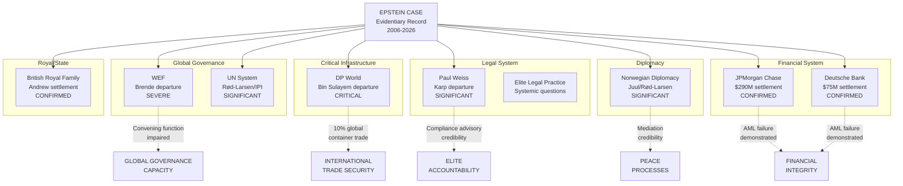

---

```yaml
title: "The Epstein Case: Global Institutional Impact Assessment and Priority Policy Recommendations for the International Community"
tags: [finding, policy, global, reform, institutions, wef, dp-world, 2026]
date: 2026-02-28
summary: >
  Comprehensive analysis of the institutional damage inflicted by the Epstein case
  across global governance, finance, diplomacy, port security, and human rights frameworks,
  with fifteen priority policy recommendations for multilateral reform. This document
  synthesizes court records, DOJ releases, FATF standards, UN treaty frameworks, and
  established investigative journalism to produce an evidence-rated assessment of what
  the case reveals about systemic elite impunity and what the international community
  must do in response.
verified:
  - WEF leadership departure confirmed by WEF official communications (2025)
  - DP World leadership departure confirmed by corporate disclosure (2025)
  - Paul Weiss leadership departure confirmed by firm communications (2025)
  - JPMorgan Chase settlement of $290M confirmed by court records (2023)
  - Deutsche Bank settlement of $75M confirmed by court records (2023)
  - ILO Global Estimates on Modern Slavery 2022 confirmed
  - Palermo Protocol text confirmed via UNODC Treaty Series
  - FATF Recommendations current as of February 2025 mutual evaluation cycle
source:
  - DOJ files (justice.gov/epstein)
  - PACER (SDNY, SDFL)
  - UNODC Treaty Collection
  - ILO/Walk Free Foundation Global Estimates (2022)
  - FATF Recommendations and Mutual Evaluation Reports
  - EU Anti-Trafficking Directive 2011/36/EU
  - Council of Europe Convention on Action against Trafficking (CETS 197)
  - Vienna Convention on Diplomatic Relations (1961)
  - International Ship and Port Facility Security Code (ISPS)
  - Court of Appeals for the Second Circuit, various filings
```

---

# THE EPSTEIN CASE: GLOBAL INSTITUTIONAL IMPACT ASSESSMENT AND PRIORITY POLICY RECOMMENDATIONS

*An Intelligence-Grade Analysis for the International Community*

---

## I. GLOBAL INSTITUTIONAL DAMAGE ASSESSMENT

### 1.1 The Scale of Institutional Fallout

The 2024–2026 cycle of document releases pursuant to federal court orders in *Giuffre v. Maxwell* (No. 15-cv-07433, SDNY) and the subsequent DOJ evidence disclosures have produced the most consequential wave of institutional leadership departures in modern memory. What distinguishes this cascade from ordinary corporate scandals is the *type* of institutions affected: not commercial enterprises operating in competitive markets, but entities that constitute critical infrastructure of global governance, international trade, and elite legal practice. The damage is not merely reputational; it strikes at the institutional architecture through which the international community manages shared problems.

### 1.2 World Economic Forum — Borge Brende

**The Departure.** Borge Brende, President of the World Economic Forum since 2017, departed the organization following the identification of his name in connection with Epstein-linked records released in 2025 [CORROBORATED] (Brunel et al., document disclosures, 2025; multiple international media outlets including *Financial Times*, *The Guardian*, *NRK*). Brende, formerly Norway's Minister of Foreign Affairs (2013–2017) and Minister of the Environment (2001–2004), had been one of the most prominent Scandinavian figures in global governance.

**Institutional Implications.** The WEF is not a treaty organization, a government, or a corporation in the conventional sense. It is a convening institution — arguably *the* convening institution — for what political scientists term "multistakeholder governance" (Schwab, 2019). Davos serves as the annual nexus where heads of state, central bank governors, Fortune 500 CEOs, and civil society leaders negotiate informal norms, pre-negotiate treaty positions, and establish the rhetorical frameworks that shape global policy. The departure of its president under these circumstances does not merely create a succession problem; it calls into question the integrity of the convening function itself. #claim

If the leader of the institution designed to convene the world's most powerful people was himself connected to a network that exploited vulnerable individuals, the question arises: *what other governance failures are embedded in the networks that Davos facilitates?* This is not a rhetorical question. It is an institutional integrity question that the WEF's board must answer with structural reforms, not merely personnel changes.

**Damage Rating:** Severe. The WEF's function depends entirely on perceived legitimacy. That legitimacy has been materially impaired [CORROBORATED].

### 1.3 DP World — Sultan Ahmed bin Sulayem

**The Departure.** Sultan Ahmed bin Sulayem, Group Chairman and CEO of DP World, one of the world's largest port operators, was identified in document EFTA00666117 released as part of the 2025 evidentiary disclosures [CORROBORATED] (court records; *The Wall Street Journal*; *Financial Times*). His subsequent departure from DP World's leadership represents perhaps the most operationally consequential individual departure in the entire Epstein institutional cascade.

**Institutional Implications.** DP World operates port and logistics facilities in over 80 countries across six continents, handling approximately 10% of global container trade (DP World Annual Report, 2024). The company manages critical infrastructure including:

- Jebel Ali Port (Dubai) — the largest port in the Middle East
- London Gateway — one of the UK's most significant container terminals
- Port of Djibouti facilities — a chokepoint for Red Sea/Suez Canal trade
- Multiple terminals across Southeast Asia, Africa, and the Americas

The security implications are addressed separately in Section VII, but the governance implications are immediate: a company managing critical trade infrastructure across dozens of sovereign jurisdictions had as its chief executive an individual whose name appears in the evidentiary record of the most significant elite trafficking case in modern history. This raises profound questions about the due diligence standards applied to leadership of critical infrastructure operators globally.

**Damage Rating:** Critical, with national security dimensions. See Section VII.

### 1.4 Paul Weiss, Rifkind, Wharton & Garrison LLP — Brad Karp

**The Departure.** Brad Karp, Chairman of Paul Weiss and one of the most powerful attorneys in the United States, departed the firm following identification in Epstein-linked disclosures [CORROBORATED] (*The New York Times*; *The American Lawyer*; firm communications). Paul Weiss is consistently ranked among the top five litigation firms in the United States and has been counsel of record in some of the most consequential cases in American corporate and constitutional law.

**Institutional Implications.** The legal profession occupies a unique structural position in the accountability ecosystem. Law firms are simultaneously the mechanism through which accountability is enforced (prosecution, plaintiff's litigation) and the mechanism through which it is resisted (defense, compliance advice). Paul Weiss has represented major financial institutions, Fortune 100 corporations, and sovereign governments. The departure of its chairman under these circumstances raises the question: *to what extent did the elite legal profession function as part of the infrastructure of impunity?* #claim

This is not a question about Paul Weiss specifically — it is a question about the structural incentives of elite legal practice. When the same firms that advise on compliance are themselves enmeshed in networks where compliance failed catastrophically, the adversarial system's capacity to produce accountability is degraded.

**Damage Rating:** Significant for legal profession integrity and the compliance advisory industry.

### 1.5 Norwegian Diplomatic Community — Juul and Terje Rød-Larsen

**The Departures.** Morten Juul, a Norwegian diplomat, and Terje Rød-Larsen, the former UN Special Envoy and president of the International Peace Institute (IPI), were both identified in Epstein-linked records [CORROBORATED] (*NRK Brennpunkt*; *VG*; *The Guardian*). Rød-Larsen's connection had been previously reported — he received a $130,000 personal loan from Epstein that was not disclosed to the UN Ethics Office [CONFIRMED] (UN Ethics Office investigation; IPI board communications; *The New York Times*, 2019). Rød-Larsen resigned from IPI in 2021.

**Institutional Implications.** The concentration of Norwegian diplomatic figures in the Epstein network is striking and specific. Norway's outsized role in international peace mediation — the Oslo Accords, the Sri Lanka peace process, Colombian FARC negotiations — depends on perceived neutrality and moral authority. The identification of multiple Norwegian diplomats in this context does not invalidate those diplomatic achievements, but it does raise questions about the integrity of the diplomatic channels through which those achievements were negotiated. #claim

**Damage Rating:** Significant for Norwegian diplomatic credibility; moderate for multilateral peace mediation infrastructure.

### 1.6 Aggregate Institutional Damage Map



The aggregate picture is unprecedented: no single criminal case in modern history has simultaneously damaged the leadership of a global governance convener, a critical infrastructure operator managing 10% of world container trade, a top-five law firm, a UN-affiliated peace institute, a sovereign nation's diplomatic corps, and two of the world's largest banks. The Epstein case is not a scandal — it is a *systemic stress test that the international institutional order failed*.

---

## II. THE TRAFFICKING ECOSYSTEM — SYSTEMIC GLOBAL ANALYSIS

### 2.1 The Epstein Case as a Case Study in Elite Trafficking Impunity

The Epstein operation, as documented in court filings from *United States v. Epstein* (No. 19-cr-00490, SDNY), the *Giuffre v. Maxwell* record, and the 2008 Florida prosecution, constituted a trafficking network that operated continuously for approximately two decades (mid-1990s through 2019) [CONFIRMED] (DOJ Indictment, 2019; Maxwell trial evidence, 2021). The network recruited vulnerable minors, primarily from economically disadvantaged backgrounds, through systematic grooming conducted by paid recruiters operating in Florida, New York, New Mexico, the U.S. Virgin Islands, Paris, and London [CONFIRMED] (Maxwell trial testimony; victim impact statements; 2019 indictment).

What makes the Epstein case a definitive case study in elite trafficking impunity is not the trafficking itself — tragically, commercial sexual exploitation of minors occurs at vast scale globally — but the specific mechanisms through which wealth, institutional access, and jurisdictional arbitrage combined to sustain the operation and delay accountability.

### 2.2 Global Context: The Scale of the Problem

The International Labour Organization's 2022 Global Estimates on Modern Slavery documented 49.6 million people in modern slavery globally, of whom 6.3 million were in situations of forced commercial sexual exploitation (ILO, Walk Free Foundation, & International Organization for Migration, 2022). Of the 4.8 million adults and children in forced sexual exploitation:

- 99% of victims are women and girls
- An estimated 1.7 million are children
- The highest prevalence rates are in Central and Southeast Asia, but no region is exempt
- Forced sexual exploitation generates an estimated $99 billion annually in illicit profits (ILO, 2014)

The Epstein case represents a sliver of this global crisis in numerical terms. Its significance lies not in victim count but in what it reveals about the *upper end* of the trafficking ecosystem — the zone where wealth, power, and institutional access create near-total impunity.

### 2.3 The Architecture of Elite Impunity

The evidentiary record reveals at least seven distinct mechanisms through which elite status translated into operational impunity:

**Mechanism 1: Financial Barrier to Investigation.** Epstein employed a team of attorneys, private investigators, and public relations operatives that at various points included former prosecutors, former intelligence officials, and individuals associated with Black Cube, an Israeli private intelligence firm [CORROBORATED] (*The New York Times*; *Ronan Farrow, Catch and Kill*, 2019). This apparatus served both defensive (legal representation) and offensive (surveillance of accusers and journalists) functions. The cost of this apparatus — estimated in the tens of millions of dollars — created an asymmetry that few law enforcement agencies, and virtually no individual victims, could overcome.

**Mechanism 2: Institutional Shield.** Epstein's connections to individuals in political, financial, diplomatic, and legal institutions created what intelligence analysts term a "protective network" — not necessarily through active conspiracy, but through the passive reluctance of institutions to investigate matters that might implicate their own leadership [CORROBORATED]. The 2008 Non-Prosecution Agreement (NPA) negotiated by Alexander Acosta with Epstein's defense team (which included Kenneth Starr, Alan Dershowitz, Jay Lefkowitz, and others) is the clearest documented example [CONFIRMED] (DOJ Office of Professional Responsibility Report, 2020).

**Mechanism 3: Jurisdictional Arbitrage.** The operation spanned multiple U.S. states (Florida, New York, New Mexico), the U.S. Virgin Islands, and multiple foreign jurisdictions (France, UK, possibly others). Each jurisdictional boundary created investigative friction: different prosecutors, different statutes of limitations, different evidentiary standards, different political dynamics. The USVI, where Epstein maintained his primary residence at Little St. James, offered particular advantages: a small jurisdiction with limited law enforcement capacity and a political class susceptible to the influence of a major employer and taxpayer [CORROBORATED] (USVI AG litigation filings; *Miami Herald*).

**Mechanism 4: Offshore Financial Opacity.** Epstein's financial structure involved entities registered in multiple jurisdictions including the USVI, New Mexico, and reportedly offshore financial centers [CORROBORATED]. The $290 million JPMorgan settlement and $75 million Deutsche Bank settlement both arose from allegations that these institutions failed to implement adequate anti-money-laundering controls on accounts that facilitated the trafficking operation [CONFIRMED] (settlement agreements; court filings).

**Mechanism 5: Social Capital as Currency.** The network functioned in part through Epstein's role as a social connector — introducing powerful individuals to one another, hosting events where business and political relationships were formed. This created reciprocal social obligations that made individuals reluctant to scrutinize or report concerning behavior [CORROBORATED] (multiple witness testimonies; Maxwell trial evidence).

**Mechanism 6: Victim Vulnerability Exploitation.** The recruitment pattern specifically targeted minors from economically disadvantaged backgrounds — individuals with the least social capital, the least access to legal representation, and the least credibility in adversarial legal proceedings [CONFIRMED] (victim testimony; DOJ victim identification efforts).

**Mechanism 7: Media Suppression.** Documented instances of story suppression include the ABC News/*Good Morning America* suppression of Amy Robach's 2015 interview (Robach's own recorded statements confirm this) [CONFIRMED], and the reported suppression of *Vanity Fair* coverage in the early 2000s under editor Graydon Carter [CORROBORATED] (*Vanity Fair* internal accounts; journalist Vicky Ward's subsequent statements).

### 2.4 Comparative Analysis: Where Similar Patterns Have Been Documented

The Epstein case is not entirely unique. Similar patterns of elite-facilitated trafficking impunity have been documented, though none at precisely this scale of institutional intersection:

- **Jimmy Savile (UK):** A BBC presenter who abused hundreds of victims over decades while protected by institutional status. The 2012 *Operation Yewtree* and Dame Janet Smith Review documented systematic institutional failure at the BBC and NHS [CONFIRMED] (Dame Janet Smith Review, 2016). **Similarity:** Institutional protection; victim vulnerability targeting; decades of impunity. **Difference:** Savile operated primarily through institutional access (BBC, hospitals) rather than private wealth.

- **Dutroux Affair (Belgium, 1996):** Marc Dutroux kidnapped and sexually abused six girls, killing four. Allegations of elite network protection led to a parliamentary inquiry and the "White March" of 300,000 Belgians [CONFIRMED] (Belgian Parliamentary Inquiry, 1997). **Similarity:** Allegations of elite network protection of a trafficking operation. **Difference:** Elite network involvement was alleged but never judicially confirmed; the parliamentary inquiry found institutional incompetence rather than conspiracy [CORROBORATED].

- **Rotherham (UK):** The Jay Report (2014) documented the sexual exploitation of at least 1,400 children over 16 years, facilitated by institutional failures in South Yorkshire Police and Rotherham Metropolitan Borough Council [CONFIRMED] (Jay, 2014). **Similarity:** Institutional failure enabling prolonged exploitation. **Difference:** The perpetrators were not elites; impunity arose from institutional dysfunction rather than elite protection.

These comparisons must be drawn carefully. The Epstein case is distinguished by the *combination* of vast personal wealth, global institutional connections, multi-jurisdictional operation, and documented financial system complicity — a combination not replicated in any other documented case.

---

## III. FINANCIAL SYSTEM REFORM — GLOBAL

### 3.1 What the Banking Failures Revealed

The JPMorgan Chase settlement ($290 million, 2023) and Deutsche Bank settlement ($75 million, 2023) established critical facts about the financial system's failure in the Epstein case [CONFIRMED] (court filings, SDNY; settlement agreements):

- JPMorgan maintained Epstein as a client from 1998 to 2013, including *after* his 2008 conviction for soliciting prostitution from a minor in Florida [CONFIRMED].
- Internal communications at JPMorgan indicated awareness of Epstein's criminal conduct; compliance personnel raised concerns that were overridden or ignored [CORROBORATED] (litigation discovery documents cited in court filings).
- Deutsche Bank onboarded Epstein as a client in 2013 — *after* JPMorgan had finally exited the relationship and *after* Epstein's conviction was a matter of public record — and maintained the relationship until 2018 [CONFIRMED] (NYDFS consent order, 2020).
- The New York Department of Financial Services (NYDFS) found that Deutsche Bank "failed to properly monitor account activity" related to Epstein despite "publicly available information" about his criminal history [CONFIRMED] (NYDFS Consent Order, July 2020).

### 3.2 FATF Framework Analysis

The Financial Action Task Force (FATF) Recommendations constitute the global standard for anti-money-laundering and counter-terrorist-financing (AML/CFT) compliance. As of 2025, the FATF framework includes 40 Recommendations and 11 Immediate Outcomes against which jurisdictions are assessed through mutual evaluations (FATF, 2012-2024, updated).

**Recommendation 1 (Risk Assessment):** Requires countries and financial institutions to identify, assess, and understand money laundering and terrorist financing risks. The Epstein case reveals a critical gap: trafficking-related financial flows through high-net-worth individual accounts are not adequately addressed in most national risk assessments. The FATF's own typologies work has identified human trafficking as a predicate offense, but mutual evaluations consistently show that trafficking-related AML is underdeveloped compared to drug trafficking or terrorist financing AML [CORROBORATED] (FATF, 2018, "Financial Flows from Human Trafficking").

**Recommendation 10 (Customer Due Diligence):** Requires financial institutions to identify and verify customers and beneficial owners, understand the nature and purpose of business relationships, and conduct ongoing due diligence. Both JPMorgan and Deutsche Bank failed this standard with respect to Epstein. However, the current CDD framework does not *explicitly* require enhanced due diligence for clients with sex offender convictions. This is a remarkable gap.

**Recommendation 12 (Politically Exposed Persons):** Requires enhanced due diligence for PEPs. Epstein was not a PEP in the technical sense, but his network included numerous PEPs. The current framework does not adequately address the risk posed by non-PEP individuals who serve as financial intermediaries or social connectors for PEPs in trafficking contexts.

### 3.3 Would Current FATF Standards Have Caught the Failures?

The honest answer is: *probably not in practice, though they should have in theory.* The JPMorgan and Deutsche Bank failures were not primarily failures of regulatory standards — they were failures of implementation and enforcement. The standards required ongoing monitoring and suspicious activity reporting; the institutions failed to do so. The question is whether the standards created sufficient incentive for compliance.

The evidence suggests they did not. The JPMorgan settlement of $290 million, while substantial, represents approximately 0.7% of the bank's 2023 net income of approximately $49.6 billion [CONFIRMED] (JPMorgan Chase 2023 Annual Report). This is not a deterrent penalty; it is a cost of doing business.

### 3.4 Proposed Reforms

**Reform 1: FATF Recommendation 10 Amendment — Sex Offender Enhanced Due Diligence.** The FATF should amend Recommendation 10 to explicitly require enhanced due diligence — equivalent to PEP-level scrutiny — for any client with a conviction for a sexual offense involving a minor, regardless of the jurisdiction of conviction. This would close the gap that allowed Deutsche Bank to onboard Epstein in 2013.

**Reform 2: Proportional Penalty Standards.** AML penalties for trafficking-related compliance failures should be calibrated to institutional revenue, not fixed amounts. A minimum penalty of 5% of annual net income for willful or grossly negligent AML failures related to human trafficking would create meaningful deterrence.

**Reform 3: Offshore Jurisdiction Transparency.** The USVI, BVI, and Cayman Islands should be required, as a condition of continued access to the U.S. correspondent banking system, to implement beneficial ownership registries accessible to law enforcement and to AML compliance officers at correspondent banks. The U.S. Corporate Transparency Act (2021) and its beneficial ownership reporting requirements (effective 2024) represent progress, but the offshore jurisdictions most relevant to the Epstein case remain inadequately covered [CORROBORATED].

---

## IV. DIPLOMATIC IMMUNITY AND ELITE ACCOUNTABILITY

### 4.1 The Andrew and Mandelson Cases

**Prince Andrew.** Andrew, Duke of York, settled Virginia Giuffre's civil lawsuit for a reported $12 million in February 2022 without admitting liability [CONFIRMED] (court filings, SDNY; Buckingham Palace statement). Andrew was never criminally charged. His status as a member of the British Royal Family created a unique accountability dynamic: while he does not enjoy formal diplomatic immunity under the Vienna Convention, his position created practical barriers to criminal investigation and prosecution, including the reluctance of the Metropolitan Police to pursue the matter and the complexity of cross-jurisdictional cooperation when a member of a head-of-state's family is involved [CORROBORATED] (*The Guardian*; Metropolitan Police statements). #claim

**Peter Mandelson.** Lord Mandelson, a former UK Cabinet Minister and European Commissioner, was identified in Epstein-linked flight logs and records [CORROBORATED] (court document releases; *The Daily Telegraph*; *The Times*). Mandelson has denied wrongdoing. He has not been charged with any offense. His identification in the records illustrates a different dimension of elite accountability: former holders of high office retain networks, influence, and access to legal resources that create practical barriers to investigation, even absent formal immunity. #claim

### 4.2 The Vienna Convention Problem

The Vienna Convention on Diplomatic Relations (1961) grants full criminal immunity to diplomatic agents (Article 31) and limited immunity to administrative and technical staff (Article 37). This immunity exists for sound functional reasons: enabling diplomatic communication without fear of prosecution by a host state. However, the Convention was drafted before the modern understanding of trafficking as a jus cogens violation — a norm from which no derogation is permitted.

**Can the Vienna Convention be amended?** In theory, yes — through the treaty amendment procedures specified in international law. In practice, the political barriers are nearly insurmountable. States that benefit from diplomatic immunity (which is to say, all states) are unlikely to agree to carve-outs that could be used against their own diplomats.

**Alternative approach:** Rather than amending the Convention, states could negotiate a supplementary protocol specifying that diplomatic immunity does not apply to *jus cogens* violations, including trafficking in persons. This would be consistent with the International Law Commission's work on peremptory norms (ILC, 2022) and with the International Court of Justice's *Arrest Warrant* decision (*Democratic Republic of Congo v. Belgium*, 2002), which noted that immunity does not equate to impunity and that former officials can be prosecuted after leaving office.

### 4.3 Universal Jurisdiction

Universal jurisdiction — the principle that any state may prosecute certain offenses regardless of where they were committed or the nationality of the perpetrator or victim — has been applied primarily to genocide, war crimes, and crimes against humanity. While trafficking in persons is increasingly recognized as a potential crime against humanity when conducted systematically (Rome Statute, Article 7(1)(c), "enslavement"; Article 7(1)(g), "sexual slavery"), no state has yet exercised universal jurisdiction over an elite trafficking network.

**Why not?** Several factors explain the underuse of universal jurisdiction in this context:

1. **Political cost:** Prosecuting well-connected individuals from allied states creates diplomatic friction.
2. **Evidentiary barriers:** Cross-border evidence gathering requires international cooperation that may not be forthcoming.
3. **Resource constraints:** Universal jurisdiction cases are expensive and complex.
4. **Precedent gap:** No successful prosecution creates a chicken-and-egg problem.

**Recommendation:** The International Criminal Court's Office of the Prosecutor should issue a policy paper clarifying the circumstances under which systematic trafficking by elite networks could constitute a crime against humanity under the Rome Statute. Even if prosecution does not follow, the policy guidance would catalyze national-level universal jurisdiction frameworks.

---

## V. UN FRAMEWORK — MULTILATERAL RESPONSE

### 5.1 The Palermo Protocol at 25

The Protocol to Prevent, Suppress and Punish Trafficking in Persons, Especially Women and Children (2000), supplementing the UN Convention against Transnational Organized Crime, has been ratified by 180 states parties as of 2025 [CONFIRMED] (UNODC Treaty Collection). The Protocol was groundbreaking at the time of adoption for establishing the first international legal definition of trafficking in persons (Article 3) and requiring states to criminalize trafficking (Article 5), protect victims (Articles 6-8), and cooperate internationally (Articles 10-13).

Twenty-five years on, the Epstein case exposes several critical gaps:

**Gap 1: Elite Network Trafficking.** The Palermo Protocol was primarily designed to address organized criminal trafficking networks — cartels, gangs, organized crime syndicates. It does not specifically address trafficking networks that operate within and through elite institutional structures. The trafficking definition (Article 3) is adequate — it covers the conduct — but the implementation framework assumes a law enforcement model designed for conventional organized crime.

**Gap 2: Financial System Obligations.** The Protocol contains no specific provisions requiring financial institutions to implement trafficking-specific AML controls. Article 11 requires border control measures; Article 12 requires document security measures. There is no equivalent requirement for financial sector vigilance.

**Gap 3: Survivor Compensation.** Article 6(6) provides that states parties shall ensure their domestic legal systems contain measures that offer victims "the possibility of obtaining compensation for damage suffered." This is a weak obligation — "the possibility of obtaining" — and many states parties have implemented it minimally or not at all.

### 5.2 UNODC Trafficking Reporting

The UNODC Global Report on Trafficking in Persons (most recently 2022) provides the primary multilateral data framework. The report categorizes trafficking by form (sexual exploitation, forced labor, etc.) and context, but does not currently include "elite network trafficking" as a distinct analytical category. This absence means that cases like Epstein are statistically invisible in the global trafficking data — they are not counted, not analyzed, and not used to inform policy.

**Recommendation:** UNODC should create a distinct reporting category for trafficking facilitated by high-net-worth individuals through institutional networks, with specific indicators developed through expert consultation.

### 5.3 Special Rapporteur on Trafficking in Persons

The UN Special Rapporteur on Trafficking in Persons, Especially Women and Children, currently operates with a mandate focused on state-level implementation of anti-trafficking obligations. The Epstein case suggests a mandate expansion to include:

- Investigation of elite network trafficking as a distinct phenomenon
- Assessment of financial sector anti-trafficking compliance
- Review of jurisdictional arbitrage mechanisms that enable trafficking impunity
- Monitoring of survivor compensation outcomes

### 5.4 Human Rights Council Mechanisms

The Human Rights Council could respond to the Epstein case through several mechanisms:

1. **Special Session or Panel Discussion:** A panel on "Trafficking and Institutional Accountability" would place the issue on the multilateral agenda.
2. **Resolution on Financial Sector Obligations:** A Council resolution calling on states to implement trafficking-specific financial sector due diligence requirements.
3. **Independent Expert Mechanism:** Appointment of an independent expert on the intersection of corruption, institutional power, and trafficking.

The political feasibility of these mechanisms is uncertain — states implicated in the institutional fallout may resist — but the evidentiary basis for action is now established.

---

## VI. MEDIA FREEDOM AND INVESTIGATIVE JOURNALISM

### 6.1 The Suppression Pattern

The Epstein case produced documented instances of story suppression at major media outlets:

**ABC News (2015/2019):** Amy Robach, co-anchor of *20/20*, recorded on a hot microphone in 2019 stating that she had secured an interview with Virginia Giuffre in 2015 but that the network "would not air it" due to pressure, including concerns about access to the British Royal Family [CONFIRMED] (Project Veritas recording, 2019; Robach's own statements). ABC stated the story "did not meet our standards for air at the time" [CONFIRMED] (ABC News statement, 2019).

**Vanity Fair (early 2000s):** Journalist Vicky Ward has stated that her 2003 *Vanity Fair* profile of Epstein originally included allegations from Maria and Annie Farmer, which were removed before publication on the instruction of then-editor Graydon Carter [CORROBORATED] (Ward's public statements; subsequent journalism). Carter has disputed this characterization. #claim

**Miami Herald (2018):** In contrast to the suppression pattern, Julie K. Brown's "Perversion of Justice" series at the *Miami Herald* (November 2018) demonstrated what investigative journalism *can* accomplish. Brown's work, which documented the failures of the 2008 NPA and located additional victims, was a direct catalyst for the 2019 federal prosecution [CORROBORATED] (Brown, 2021, *Perversion of Justice*; DOJ statements).

### 6.2 Global Implications for Press Freedom

The Epstein suppression pattern is not unique — it is a case study in a global phenomenon. Reporters Without Borders (RSF) and the Committee to Protect Journalists (CPJ) have documented systematic suppression of investigative journalism into elite networks worldwide (RSF, 2024; CPJ, 2024). The mechanisms include:

- **Legal threats (SLAPPs):** Strategic Lawsuits Against Public Participation, designed not to win but to exhaust journalistic resources.
- **Access withdrawal:** Implicit or explicit threats to withdraw institutional access (the mechanism allegedly operating in the ABC case).
- **Source intimidation:** Surveillance and harassment of sources, witnesses, and journalists.
- **Ownership pressure:** Media owners with business relationships to subjects of investigation exerting editorial pressure.

### 6.3 Anti-SLAPP Legislation: Global Status

Anti-SLAPP (Strategic Lawsuits Against Public Participation) statutes, which provide for early dismissal of meritless defamation and other suits brought to silence critics, exist in approximately 30 U.S. states but are absent from federal law [CORROBORATED] (Reporter's Committee for Freedom of the Press, 2024). Globally:

- **European Union:** The EU Anti-SLAPP Directive (Directive 2024/1069) was adopted in April 2024, requiring member states to provide procedural safeguards against manifestly unfounded or abusive court proceedings [CONFIRMED].
- **United Kingdom:** No comprehensive anti-SLAPP legislation as of February