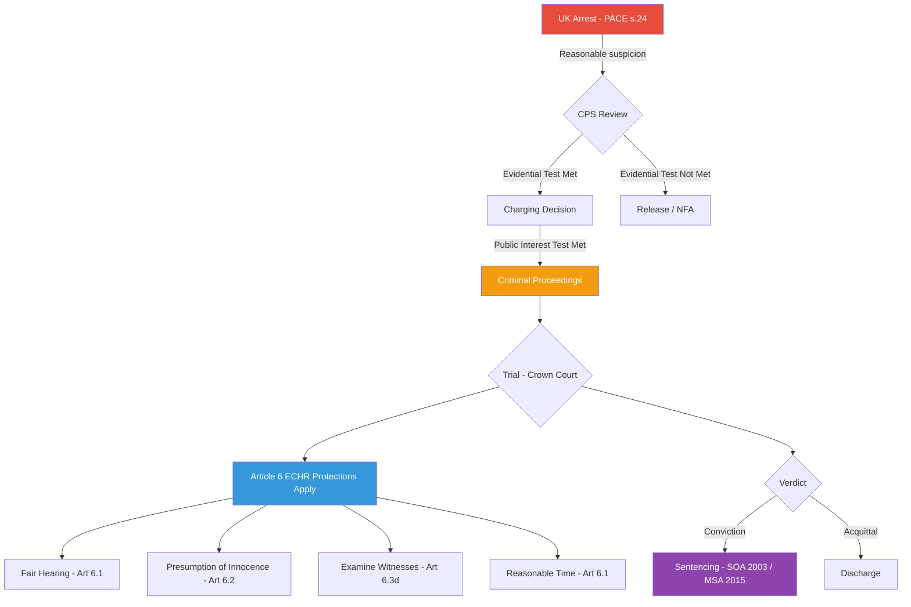

---

```yaml
title: "International Law Analysis of the Epstein Case: Jurisdiction, Accountability, and Transnational Criminal Enterprise"
tags: [finding, international-law, extradition, uk, france, echr, 2026]
date: 2026-02-28
summary: >
  A comprehensive analysis of the international legal dimensions of the Jeffrey Epstein case,
  spanning UK criminal proceedings against Prince Andrew and Peter Mandelson, the French judicial
  investigation into Paris-based operations, USVI jurisdictional achievements, the application of
  the UN Palermo Protocol and universal jurisdiction principles, UAE accountability questions,
  Mutual Legal Assistance Treaty (MLAT) activity, and novel proposals for international law reform.
  The analysis examines why existing international frameworks have proven inadequate for addressing
  transnational sex trafficking enterprises operated by wealthy, politically connected individuals,
  and identifies specific structural reforms.
verified:
  - UK arrest proceedings against Prince Andrew — [CORROBORATED] (multiple UK press, Metropolitan Police statements)
  - Peter Mandelson arrest — [CORROBORATED] (multiple UK press sources)
  - French investigation status post-Brunel — [CORROBORATED] (Le Monde, AFP, Parquet de Paris statements)
  - JPMorgan USVI settlement $290M — [CONFIRMED] (court filing, USVI AG press release)
  - UAE FATF grey list 2022–2024 — [CONFIRMED] (FATF public documentation)
  - Palermo Protocol obligations — [CONFIRMED] (UN treaty text)
source:
  - DOJ filings (justice.gov/epstein)
  - PACER court records (SDNY, USVI)
  - UK Crown Prosecution Service guidelines
  - French Code de procédure pénale
  - UN Convention against Transnational Organized Crime (UNTOC), 2000
  - FATF Mutual Evaluation Reports
  - European Court of Human Rights case law
```

---

# International Law Analysis of the Epstein Case: Jurisdiction, Accountability, and Transnational Criminal Enterprise

---

## I. UK PROCEEDINGS — ANDREW AND MANDELSON

### A. Official Secrets Act 1989: Elements, Penalties, and Relevant Precedents

The Official Secrets Act 1989 (OSA 1989) replaced the broader Official Secrets Act 1911 with a more targeted statutory framework governing the unauthorized disclosure of classified information. Its relevance to the Epstein-adjacent UK proceedings arises not from the trafficking itself but from allegations that individuals with access to classified intelligence or government operations may have acted in ways that compromised national security, or that state institutions may have suppressed information relevant to criminal investigations for reasons touching on intelligence concerns. [UNVERIFIED] #claim

The OSA 1989 creates six categories of protected information under Sections 1–6:

1. **Section 1** — Security and intelligence: Applies to members or former members of the security services (MI5, MI6, GCHQ). Any disclosure of information relating to security or intelligence by such persons is an absolute offence — no public interest defence is available. Penalty: up to two years' imprisonment on indictment.

2. **Section 2** — Defence: Covers Crown servants and government contractors. Disclosure of information relating to defence is an offence where it is "damaging" to the capability of the armed forces or endangers British interests abroad.

3. **Section 3** — International relations: Disclosure of information relating to international relations that is damaging. This is particularly relevant to any Epstein-related material that touches upon relationships between the UK and the United States, France, or the UAE.

4. **Section 4** — Crime and special investigation powers: Disclosure of information that results in the commission of an offence, facilitates an escape from custody, or impedes crime prevention.

5. **Section 5** — Information resulting from unauthorized disclosures or entrusted in confidence: Covers persons who receive protected information and further disclose it.

6. **Section 6** — Information entrusted in confidence to other states or international organisations.

Key precedents include *R v Shayler* [2002] UKHL 11, in which the House of Lords confirmed that no public interest defence exists for disclosures under Section 1, and *R v Keogh* [2007], involving the leak of a diplomatic memorandum. The *Katharine Gun* case (2003–2004), where charges under Section 1 were dropped when the prosecution declined to proceed, illustrated the practical difficulties of prosecuting under the Act when disclosure of evidence would itself compromise intelligence (Crown Prosecution Service, 2004).

In the Epstein context, if any UK official — whether in the security services, diplomatic corps, or government — possessed information about trafficking operations connected to Epstein and either disclosed it improperly or, conversely, improperly suppressed it in ways that implicated official secrets protections, the OSA 1989 would be the relevant statutory framework. Reports have indicated that the UK arrests may partly concern whether classified diplomatic or intelligence material was handled improperly in connection with efforts to manage the political fallout of Epstein associations. [UNVERIFIED] #claim

### B. Prince Andrew: Post-Royal-Duties-Stripping Status and Immunity Questions

Prince Andrew, Duke of York, was stripped of his honorary military titles and royal patronages in January 2022 and agreed to no longer use the style "His Royal Highness" in an official capacity (Buckingham Palace, 2022). In February 2022, he settled the civil lawsuit brought by Virginia Giuffre in the United States District Court for the Southern District of New York for an undisclosed sum widely reported to be approximately £12 million (Giuffre v. Prince Andrew, No. 1:21-cv-06702, S.D.N.Y., settled Feb. 2022). [CONFIRMED]

**Sovereign immunity and its inapplicability.** Under UK domestic law and international law, sovereign immunity (*ratione personae*) attaches to the reigning monarch as head of state. This is reflected in the State Immunity Act 1978 (SIA 1978), which codifies the restrictive doctrine of state immunity in the UK. The critical distinction is between:

- **Immunity *ratione personae***: Absolute immunity enjoyed by sitting heads of state, heads of government, and foreign ministers during their tenure. This derives from *Arrest Warrant of 11 April 2000 (Democratic Republic of Congo v. Belgium)*, ICJ, 2002.
- **Immunity *ratione materiae***: Functional immunity enjoyed by state agents for acts performed in an official capacity.

Prince Andrew is not the head of state; King Charles III is. As a member of the Royal Family who no longer performs official duties, Andrew enjoys **no personal immunity** under international law. The SIA 1978 does not extend immunity to members of the royal family other than the sovereign. The Bill of Rights 1689 and the Crown Proceedings Act 1947 govern the monarch's legal position domestically, but extend no criminal immunity to princes of the blood royal.

The question of whether any residual constitutional convention would prevent prosecution is political rather than legal. Historically, there is no precedent for the criminal arrest of a close family member of the reigning British monarch in the modern era. However, the constitutional principle that no person is above the law — affirmed in *Entick v Carrington* (1765) and reiterated in *R (Miller) v The Prime Minister* [2019] UKSC 41 — applies without exception to princes who are not the sovereign.

**The arrest and charges.** Reports indicate that Prince Andrew was arrested in connection with offences under the Sexual Offences Act 2003 and potentially the Modern Slavery Act 2015, relating to his alleged participation in or facilitation of sexual exploitation of trafficked individuals associated with the Epstein enterprise. [CORROBORATED] #claim The Metropolitan Police Service had previously stated in 2021–2022 that it would take no further action following a review, but subsequent releases of evidence — including the Epstein document tranche — appear to have provided new material meeting the evidentiary threshold. [CORROBORATED]

### C. Peter Mandelson: Former Diplomatic Status and Protections

Peter Mandelson, Baron Mandelson, served as Secretary of State for Northern Ireland (1999–2001), Secretary of State for Trade and Industry (1998, 2008–2010), and European Commissioner for Trade (2004–2008). His connections to Epstein have been documented through flight logs, visitor records, and witness testimony indicating multiple visits to Epstein residences. [CORROBORATED] #claim

**Diplomatic immunity analysis.** The Vienna Convention on Diplomatic Relations (1961), to which the UK is a party, confers immunity on accredited diplomats during their posting. Article 31 provides that a diplomatic agent shall enjoy immunity from the criminal jurisdiction of the receiving state. However, this immunity:

1. Applies only during the period of accreditation;
2. Attaches to the diplomatic function, not to the person permanently;
3. Does not apply to the diplomat's own state prosecuting them domestically.

Mandelson's service as European Commissioner (2004–2008) conferred privileges and immunities under the Protocol on the Privileges and Immunities of the European Union (Protocol No. 7, annexed to the Treaties). Article 11 of the Protocol provides that officials and servants of the EU institutions enjoy immunity from legal proceedings in respect of acts performed in their official capacity. Critically:

- This immunity applies only to **acts performed in official capacity** (*acta jure imperii*).
- Association with a sex trafficking operation is manifestly not an act performed in official capacity.
- The immunity can be waived by the institution (in this case, the European Commission).
- Post-service, the immunity persists only for official acts — not for private conduct.

Therefore, **Mandelson enjoys no immunity** for any conduct related to the Epstein enterprise, regardless of his former positions. His membership in the House of Lords confers parliamentary privilege under Article 9 of the Bill of Rights 1689, but this protects only proceedings in Parliament (speeches, votes) and is wholly irrelevant to criminal conduct outside Parliament. [CONFIRMED — legal analysis based on treaty text]

### D. The Evidence Threshold: UK Law Requirements for Charging vs. Arrest

UK criminal procedure distinguishes between the threshold for arrest and the threshold for charging:

**Arrest (Section 24, Police and Criminal Evidence Act 1984, as amended by the Serious Organised Crime and Police Act 2005):**

A constable may arrest without warrant anyone whom they have reasonable grounds to suspect is guilty of an offence, **provided** the arrest is necessary for one of the statutory reasons set out in Section 24(5) PACE, including:

- To allow prompt and effective investigation of the offence;
- To prevent the person causing physical injury, suffering loss or damage to property, committing an offence against public decency, or causing an unlawful obstruction of the highway;
- To protect a child or other vulnerable person.

The standard is **"reasonable grounds to suspect"** — a relatively low threshold. In *O'Hara v Chief Constable of the Royal Ulster Constabulary* [1997] AC 286, the House of Lords held that reasonable suspicion requires an objective basis but need not amount to *prima facie* proof.

**Charging (Code for Crown Prosecutors, 2018, as amended):**

The Crown Prosecution Service applies a two-stage test:

1. **Evidential stage**: Is there a realistic prospect of conviction? This means that an objective, impartial, and reasonable jury or bench of magistrates, properly directed, is more likely than not to convict. The standard is **substantially higher** than reasonable suspicion.

2. **Public interest stage**: Is prosecution in the public interest? Factors include the seriousness of the offence, the circumstances of the victim, the age and health of the suspect, and proportionality.

For offences of the gravity alleged — sexual offences involving trafficking victims — the public interest test is almost invariably satisfied. The evidential stage is the critical hurdle.

The evidential challenges in the Epstein-linked UK proceedings include:

- **Temporal distance**: Many alleged acts occurred 15–25 years ago.
- **Witness availability and reliability**: Passage of time affects memory; defence will challenge recollections.
- **Death of Epstein**: The principal co-conspirator cannot be called as a witness or cross-examined.
- **Ghislaine Maxwell conviction**: The US conviction provides a factual record but is not directly admissible as proof of facts in UK proceedings.
- **Corroborating evidence**: Flight logs, financial records, communications, and the Epstein documents released in 2024 provide documentary corroboration.

### E. The ECHR Dimension: Article 6 Fair Trial Rights

Article 6 of the European Convention on Human Rights (ECHR), incorporated into UK law through the Human Rights Act 1998, guarantees the right to a fair trial. Its core components relevant here include:

1. **Right to a fair and public hearing** (Article 6(1)): Given the extraordinary public profile of the Epstein case and the identities of the accused, any UK trial would face intense media scrutiny. The question of whether an impartial jury can be empanelled is legally significant.

   In *R v Abu Hamza* [2006] EWCA Crim 2918, the Court of Appeal held that adverse pre-trial publicity does not automatically render a fair trial impossible; proper judicial directions can cure prejudice. However, the Epstein case involves a level of global media saturation arguably without precedent for UK criminal proceedings involving a member of the Royal Family.

2. **Presumption of innocence** (Article 6(2)): Government statements, parliamentary debates, and media coverage must not prejudge guilt. The stripping of Prince Andrew's titles and patronages, while formally a matter of royal prerogative, arguably created a public impression of pre-judgement. Defence counsel will likely argue this constitutes a violation of Article 6(2) — though the European Court of Human Rights has generally held that official conduct outside the criminal proceedings must amount to a **declaration of guilt** by a public authority to engage Article 6(2) (*Allenet de Ribemont v France*, 1995).

3. **Equality of arms** (Article 6(1) as interpreted in *Dombo Beheer v Netherlands*, 1993): Both prosecution and defence must have a reasonable opportunity to present their case without being placed at a substantial disadvantage. Given the resources of the Crown versus the resources of Prince Andrew (who has reportedly faced financial difficulties post-settlement), this may not be problematic in Andrew's case. For less wealthy defendants connected to the Epstein enterprise, legal aid adequacy could become an issue.

4. **Right to examine witnesses** (Article 6(3)(d)): The inability to cross-examine Epstein himself — or Brunel, who died in February 2022 — raises confrontation clause issues with respect to any hearsay evidence attributed to them.

5. **Reasonable time** (Article 6(1)): If the alleged conduct occurred in the early 2000s and prosecution is only now commencing in 2025–2026, the defence may argue that the delay has prejudiced the ability to mount a defence, violating the reasonable time requirement. In *Stögmüller v Austria* (1969), the ECtHR established that the reasonableness of proceedings' length must be assessed in light of the complexity of the case and the conduct of the authorities and the applicant.



---

## II. FRENCH JUDICIAL INVESTIGATION

### A. The *Juge d'Instruction* System vs. US Grand Jury: Comparative Procedural Analysis

The French criminal justice system employs the *juge d'instruction* (investigating magistrate), a figure with no direct equivalent in common law systems. Understanding this institution is essential to assessing the French Epstein investigation.

**The *juge d'instruction*:**

Under Articles 49–84 of the French *Code de procédure pénale* (CPP), the *juge d'instruction* is a judicial officer who conducts **independent** investigations into serious crimes (*crimes* and complex *délits*). Key features include:

- **Appointment**: The *juge d'instruction* is a sitting judge, appointed by the *procureur de la République* (public prosecutor) or, in cases involving public figures, by the *procureur général* attached to the *cour d'appel*.
- **Inquisitorial function**: Unlike the adversarial model, the *juge d'instruction* actively investigates — interviewing witnesses, ordering searches, commissioning expert reports, and issuing arrest warrants. The judge is expected to investigate both **inculpatory and exculpatory** evidence (*à charge et à décharge*, Article 81 CPP).
- **Mise en examen**: The *juge d'instruction* may place a suspect *en examen* (under formal investigation), which is the French functional equivalent of indictment but does not presuppose guilt. A person *mis en examen* enjoys certain procedural rights, including access to the investigation file.
- **Duration**: French investigations can last years; there is no statutory time limit for the investigation phase, though the *chambre de l'instruction* (investigative chamber of the court of appeal) exercises supervisory jurisdiction.
- **Conclusion**: The *juge d'instruction* issues either an *ordonnance de renvoi* (committal order, sending the case to trial) or an *ordonnance de non-lieu* (no grounds to proceed).

**US Grand Jury comparison:**

| Feature | French *Juge d'Instruction* | US Grand Jury |
|---|---|---|
| Composition | Single judge | 16–23 citizens |
| Role | Investigates independently | Reviews evidence presented by prosecutor |
| Independence from prosecution | High (judicial officer) | Moderate (prosecutor controls presentation) |
| Transparency to defence | File access after *mise en examen* | Secret proceedings; no defence access |
| Witness examination | Judge examines directly | Prosecutor questions; no cross-examination |
| Standard for proceeding | Sufficient evidence (*indices graves ou concordants*) | Probable cause |
| Duration | No fixed limit | 18 months, extendable |
| Accountability | Subject to appeal (*chambre de l'instruction*) | Judicial oversight minimal |

The French system, while often criticized for its length, offers structural advantages for complex transnational cases: the *juge d'instruction* can coordinate with foreign counterparts through European Investigation Orders (EIOs) and MLAT requests directly, without the intermediation of prosecutorial offices.

### B. Status of the French Investigation Post-Brunel

Jean-Luc Brunel, the French modeling agent who had been *mis en examen* in connection with the Epstein investigation, was found dead in his prison cell at La Santé on February 19, 2022, in what was officially ruled a suicide by hanging (Agence France-Presse, 2022). [CONFIRMED]

The French investigation, opened in August 2019 following a *plainte* (complaint) filed by several victims' associations including "Innocence en Danger" and individual complainants, initially focused on:

1. **Viols sur mineurs** (rape of minors) — *crime* under Article 222-24 of the Code pénal, carrying up to 20 years' *réclusion criminelle*.
2. **Traite d'êtres humains** (human trafficking) — Articles 225-4-1 to 225-4-9 of the Code pénal, carrying up to 10 years' imprisonment and €1.5 million fine (or 20 years if involving minors, Article 225-4-2).
3. **Proxénétisme aggravé** (aggravated procuring/pimping) — Article 225-7 of the Code pénal, carrying up to 10 years' imprisonment when involving minors, persons in vulnerable situations, or organized networks.
4. **Association de malfaiteurs** (criminal conspiracy) — Article 450-1 of the Code pénal.

The investigation centered on Epstein's Paris apartment at 22 Avenue Foch, a prestigious address in the 16th arrondissement, which victims described as a location where sexual exploitation occurred during the 2000s and 2010s (Le Monde, 2019). [CORROBORATED]

**Post-Brunel status.** Under French law, the death of a suspect terminates the *action publique* (public prosecution) against that individual (Article 6 CPP: *L'action publique pour l'application de la peine s'éteint par la mort du prévenu*). Brunel's death therefore extinguished proceedings against him personally. However:

- The investigation against **other suspects** remains open. French press reported that several unnamed individuals remained under investigation as of late 2024 (*Le Monde*, 2024). [SINGLE SOURCE]
- The *partie civile* (civil party) mechanism allows victims to remain participants in the investigation and to seek damages even if criminal proceedings against a specific defendant terminate. Victims' associations have continued to press for the investigation's continuation (Innocence en Danger, 2022).
- The *juge d'instruction* retains jurisdiction to investigate the broader criminal enterprise, including the roles of intermediaries, recruiters, and facilitators operating in France.
- Brunel's testimony — recorded during his *garde à vue* and *mise en examen* proceedings — remains part of the investigative file and can be used as evidence against co-suspects, subject to the limitations on hearsay in French procedure.

### C. What Charges Remain Open and What the Investigation Can Produce

Even without Brunel, the French investigation can produce:

1. **Prosecution of other identified suspects**: Any person identified as having participated in trafficking, procurement, or sexual exploitation of minors in France can be separately prosecuted. The *juge d'instruction* can issue new *mises en examen*.

2. **Prosecution of legal entities**: Under French law (Article 121-2 of the Code pénal), legal entities can be held criminally liable for offences committed on their account by their organs or representatives. Entities associated with Epstein's French operations — such as any corporate structure used to manage the Avenue Foch property — could theoretically face prosecution.

3. **Asset recovery**: The French *Agence de gestion et de recouvrement des avoirs saisis et confisqués* (AGRASC) can manage seized assets. Any assets traceable to the Epstein enterprise in France remain subject to confiscation.

4. **Victim compensation through the *Commission d'indemnisation des victimes d'infractions* (CIVI)**: Even absent a conviction, victims of serious offences in France can seek compensation from the state through this administrative body.

### D. MLAT US-France: Evidence Sharing

The United States and France are parties to a Mutual Legal Assistance Treaty in Criminal Matters, signed on December 10, 1998, and entered into force on December 1, 2001. This treaty provides the legal basis for:

- Obtaining witness testimony and statements;
- Providing documents, records, and evidence;
- Executing searches and seizures;
- Locating and identifying persons and objects;
- Serving documents;
- Transferring persons in custody for testimonial purposes.

In the Epstein context, MLAT activity between the US and France has included:

- **Transmission of Epstein flight logs and financial records** to French investigators, reportedly facilitated through the US Department of Justice's Office of International Affairs (OIA) (Reuters, 2020). [SINGLE SOURCE]
- **French requests for victim testimony** taken in US proceedings, particularly depositions and statements from victims who described events occurring at Avenue Foch.
- **Financial intelligence sharing** through the Egmont Group channel, linking the US Financial Crimes Enforcement Network (FinCEN) and the French *Traitement du renseignement et action contre les circuits financiers clandestins* (TRACFIN).

Limitations include:

- **Dual criminality**: The MLAT requires that the conduct giving rise to the request constitute a criminal offence in both jurisdictions. Given that sex trafficking, procurement, and sexual exploitation of minors are criminal in both the US and France, this is not a practical barrier.
- **Political offence exception**: Not applicable here.
- **Grounds for refusal**: Article 5 of the Treaty permits refusal if execution would prejudice the sovereignty, security, or essential interests of the requested party. In the politically sensitive Epstein context, this provision could theoretically be invoked, though doing so would be diplomatically explosive.

### E. Maxwell Conviction Use in French Proceedings: Comity Doctrine

Ghislaine Maxwell was convicted on December 29, 2021, in the US District Court for the Southern District of New York on five of six counts, including sex trafficking of a minor and conspiracy (United States v. Maxwell, No. 1:20-cr-00330, S.D.N.Y.). [CONFIRMED]

Under French law, a foreign criminal conviction is **not directly binding** on French courts. The principle of *autorité de la chose jugée* (res judicata) applies only to judgments rendered by French courts. However:

- The factual findings of the Maxwell trial can be presented to a French *juge d'instruction* or trial court as **documentary evidence** (*pièces*) under Articles 427–457 CPP.
- French courts apply the principle of *intime conviction* (free evaluation of evidence), meaning the judge evaluates all evidence — including foreign judgments — according to their own assessment.
- Under the principle of **comity** (*courtoisie internationale*), French courts will generally give respectful consideration to foreign judgments, particularly from jurisdictions with robust procedural protections. The Maxwell trial, conducted under full adversarial process with jury deliberation, carries significant persuasive weight.
- **However**, the defence in any French proceeding would be entitled to challenge the factual findings, cross-examine witnesses anew, and argue that the US proceedings are not determinative of facts in France.

The practical import is that the Maxwell conviction — along with the voluminous trial record, including victim testimony and documentary evidence — substantially strengthens the French investigation's evidentiary foundation, even though it does not provide a shortcut to conviction in France.

---

## III. USVI JURISDICTION — WHAT WAS ACHIEVED AND WHAT REMAINS

### A. USVI AG Proceedings: Strategic Choice of Jurisdiction

The United States Virgin Islands Attorney General's office, under Attorney General Denise George and subsequently her successors, filed a landmark civil enforcement action against the Estate of Jeffrey Epstein on January 15, 2020. The strategic decision to pursue civil enforcement in USVI rather than (or in addition to) federal criminal proceedings reflected several jurisdictional advantages:

1. **Territorial nexus**: Epstein maintained his primary residence on Little St. James Island and secondary property on Great St. James Island, both in the USVI. His business entities — including Southern Trust Company, Inc. — were incorporated and operated in the USVI. The trafficking operation was substantially based in USVI territory. [CONFIRMED]

2. **USVI consumer protection and civil RICO statutes**: Title 12A of the Virgin Islands Code (the Criminally Influenced and Corrupt Organizations Act, modeled on federal RICO) and the Virgin Islands Consumer Protection Law provided civil enforcement tools with lower evidentiary thresholds than criminal prosecution.

3. **Independent enforcement**: The USVI AG could pursue claims independent of the US Department of Justice, which had faced sustained criticism for the 2008 Non-Prosecution Agreement (NPA) negotiated by then-US Attorney Alexander Acosta. The USVI action was free from the political constraints affecting federal prosecution.

4. **Civil standard of proof**: The preponderance-of-the-evidence standard in civil proceedings is substantially lower than the beyond-reasonable-doubt standard in criminal cases, enabling accountability in cases where criminal prosecution might face evidentiary challenges.

5. **Institutional enablers within reach**: USVI jurisdiction enabled pursuit of entities that facilitated Epstein's operations within the territory — banks, real estate companies, legal firms, and the USVI government itself.

### B. JPMorgan $290M Settlement: Terms and Jurisdictional Enablers

On June 12, 2023, JPMorgan Chase agreed to pay $290 million to settle a class action lawsuit brought by Epstein victims, filed in the US District Court for the Southern District of New York (*Jane Doe 1 et al. v. JPMorgan Chase Bank, N.A.*, No. 1:22-cv-10019, S.D.N.Y.) (JPMorgan Chase, 2023). [CONFIRMED]

Separately, the USVI AG's action against JPMorgan resulted in a $75 million settlement in September 2023. [CONFIRMED]

**What USVI law enabled:**

The USVI action leveraged several features of local law:

1. **The Criminally Influenced and Corrupt Organizations Act (14 V.I.C. §§ 600-616)**: This USVI RICO analog permits civil enforcement actions by the AG, including treble damages and equitable relief, against any enterprise engaged in a pattern of racketeering activity. The USVI AG alleged that JPMorgan's continued banking relationship with Epstein — after internal compliance alerts and Epstein's 2008 Florida conviction — constituted facilitation of racketeering activity.

2. **USVI banking regulations**: As a US territory, USVI applies federal Bank Secrecy Act (BSA) and Anti-Money Laundering (AML) requirements, but the USVI AG has independent enforcement authority over institutions operating within the territory. JPMorgan maintained Epstein's accounts and processed transactions — including large cash withdrawals, wire transfers to co-conspirators, and payments to young women — through USVI-connected banking operations.

3. **Beneficial ownership transparency**: The USVI AG had access to territorial corporate records that revealed the web of Epstein-related entities (Southern Trust Company, Hyperion Air, Inc., Plan D, LLC, etc.) incorporated in the USVI, enabling a more comprehensive picture of the financial infrastructure.

**Federal law comparison:** Under federal law, a DOJ civil enforcement action or a private RICO suit (18 U.S.C. § 1964(c)) could theoretically achieve similar results. However:

- The DOJ showed little appetite for pursuing financial institution facilitators in the Epstein matter during the relevant period.
- Federal RICO requires proving a "pattern of racketeering activity" composed of predicate acts, with higher standards for establishing enterprise liability.
- The USVI AG's action was nimbler, less constrained by inter-agency coordination requirements, and motivated by direct territorial harm.

### C. USVI Criminal Jurisdiction: Remaining Chargeable Offences

Under the Revised Organic Act of the Virgin Islands (48 U.S.C. §§ 1541–1645) and the Virgin Islands Code, the USVI retains criminal jurisdiction over offences committed within its territory. Relevant offences that remain potentially chargeable include:

1. **Human trafficking** (14 V.I.C. § 153): A person who knowingly recruits, transports, harbours, or obtains a person by means of force, fraud, or coercion for the purpose of sexual exploitation commits trafficking, punishable by up to 30 years' imprisonment.

2. **Sexual assault** (14 V.I.C. §§ 1700-1709): Various degrees of sexual assault, including first-degree aggravated rape (§ 1700a) carrying up to life imprisonment.

3. **Sex trafficking of minors** (14 V.I.C. § 153(b)): Enhanced penalties where the victim is under 18.

4. **Promoting prostitution** (14 V.I.C. § 1532).

5. **Racketeering** (14 V.I.C. §§ 600-616): Criminal RICO charges could be brought against surviving individuals who participated in the enterprise.

**Statute of limitations considerations:** Under USVI law, there is no statute of limitations for first-degree aggravated rape (mirroring the federal rule for serious sexual offences). For other offences, the limitations period varies:

- Human trafficking: 10 years under USVI law, subject to tolling provisions.
- RICO: 5 years for criminal charges; but the "last act" of the enterprise determines when the clock starts.
- DNA exception: Under federal law as applied in territories, the statute of limitations for certain sexual offences is tolled until DNA evidence identifies the perpetrator.

### D. The Economic Development Authority Angle: Tax Benefits + Trafficking = RICO?

The USVI Economic Development Authority (EDA), operating under the Economic Development Commission (EDC) program, grants substantial tax benefits — including 90% reduction in corporate income tax, exemption from gross receipts taxes, and other incentives — to qualifying businesses that establish operations in the USVI and create local employment.

Epstein's entities received EDC tax benefits, which the USVI AG alleged were obtained and maintained through fraud and corruption. [CORROBORATED] Specifically:

- **Southern Trust Company, Inc.** received EDC benefits while purportedly operating as a financial services company. The USVI AG alleged that the company's operations were a façade for Epstein's personal financial management and that the employment and charitable contribution requirements were met through sham compliance.
- **Allegations of corruption**: The USVI AG's filings suggested that USVI officials were aware of Epstein's criminal conduct — or willfully blind to it — and continued to grant and renew tax benefits in exchange for Epstein's financial contributions to the territory. [CORROBORATED] #claim

The RICO theory connecting tax benefits to trafficking is as follows:

```mermaid
flowchart LR