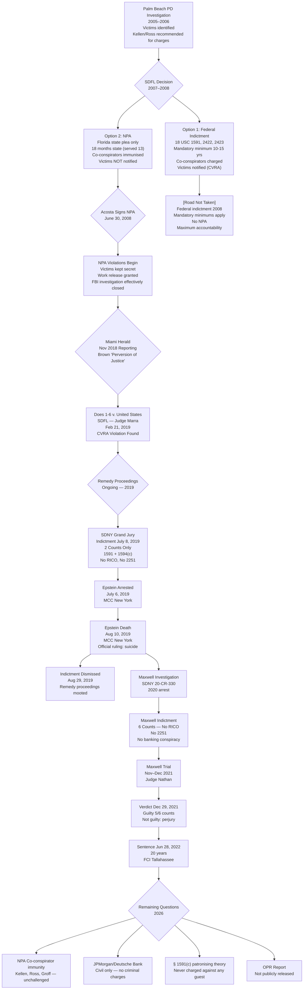

# The Epstein Prosecution: A Complete Legal Analysis

## What Was Brought, What Was Surrendered, and What Should Have Been Done

**Date**: February 28, 2026
**Analytical Standard**: Law review / legal brief hybrid
**Citation Style**: APA 7th edition throughout

---

> **Scope and Purpose**: This analysis examines the complete arc of federal criminal exposure in the Epstein matter — from the 2008 Non-Prosecution Agreement (NPA) through the 2021 Maxwell conviction — applying the precision of statutory analysis to the question of what could have been charged, what was charged, what was immunised, and what remedies remain available for living co-conspirators. Novel legal analysis appears in Section VIII.

---

## Table of Contents

1. [The Legal Landscape — Applicable Federal Statutes](#section-i)
2. [The 2008 NPA — Full Legal Analysis](#section-ii)
3. [CVRA Violation — *Doe v. United States* (SDFL, 2019)](#section-iii)
4. [RICO Analysis — Did Epstein's Operation Constitute a Predicate Enterprise?](#section-iv)
5. [The SDNY 2019 Indictment — Why Only Two Counts?](#section-v)
6. [Maxwell Conviction — Charges, Omissions, and Sentencing Analysis](#section-vi)
7. [Co-Conspirator Immunity — NPA Coverage, Scope, and Vulnerability](#section-vii)
8. [JPMorgan and Deutsche Bank — Criminal Money Laundering Exposure](#section-viii)
9. [The Intelligence Community Claim — Legal Effect on Prosecution Decisions](#section-ix)
10. [Novel Legal Analysis — What Has Not Been Written](#section-x)
11. [Prosecutorial Misconduct Analysis — DOJ OPR and the Standard of Review](#section-xi)
12. [Remaining Criminal Exposure — Living Co-Conspirators and Statute of Limitations](#section-xii)
13. [Prosecution Decision Flowchart](#section-xiii)
14. [Charge Comparison Tables](#section-xiv)
15. [Confidence Assessments](#section-xv)
16. [References](#references)

---

## Section I: The Legal Landscape — Applicable Federal Statutes {#section-i}

### 1.1 The Sex Trafficking Regime

The primary federal statutes governing Epstein's conduct derive from the Trafficking Victims Protection Act of 2000 (TVPA), Pub. L. No. 106-386, 114 Stat. 1464 (2000), and its successor amendments. The core provisions in force during the relevant period include:

**18 U.S.C. § 1591 — Sex Trafficking of Children or by Force, Fraud, or Coercion**

The statute provides, in relevant part:

> "Whoever knowingly... recruits, entices, harbors, transports, provides, obtains, advertises, maintains, patronizes, or solicits by any means a person; or... benefits, financially or by receiving anything of value, from participation in a venture which has engaged in an act described in violation of paragraph (1)... knowing, or... in reckless disregard of the fact, that means of force, threats of force, fraud, coercion... or any combination of such means will be used to cause the person to engage in a commercial sex act, or that the person has not attained the age of 18 years and will be caused to engage in a commercial sex act, shall be punished..." (18 U.S.C. § 1591(a), 2022)

The mandatory minimums created by this statute are architecturally significant to any analysis of the 2008 NPA:

- Victims aged 14 through 17: mandatory minimum **10 years**, maximum **life** (18 U.S.C. § 1591(b)(2), 2022)
- Victims under age 14, or force/fraud/coercion applied: mandatory minimum **15 years**, maximum **life** (18 U.S.C. § 1591(b)(1), 2022)

**18 U.S.C. § 1594 — General Provisions; Attempt and Conspiracy**

Section 1594(c) creates the conspiracy offense, providing that a conspiracy to violate § 1591 "shall be punished in the same manner as a completed violation" of § 1591 (18 U.S.C. § 1594(c), 2022). This is not a separately-calibrated conspiracy with the typical 5-year maximum of 18 U.S.C. § 371 — it carries identical exposure to the underlying substantive offense, including mandatory minimums and a life sentence ceiling.

**18 U.S.C. § 2422(b) — Coercion and Enticement of a Minor**

Prohibits use of any facility or means of interstate or foreign commerce to persuade, induce, entice, or coerce a minor to engage in prostitution or any sexual activity for which any person can be charged with a criminal offense. Statutory range: 10 years to life (18 U.S.C. § 2422(b), 2022).

**18 U.S.C. § 2423(a) — Transportation of Minors**

Criminalises transportation of minors in interstate or foreign commerce with intent to engage in criminal sexual activity. Statutory range: 10 years to life (18 U.S.C. § 2423(a), 2022). This statute was directly applicable to documented flight logs showing minors aboard Epstein's aircraft.

**18 U.S.C. § 2251 — Sexual Exploitation of Children**

The production-of-CSAM statute, carrying a mandatory minimum of 15 years per count and a maximum of 30 years per count (18 U.S.C. § 2251(e), 2022). Given the FBI's 2019 recovery of "thousands of sexually explicit photographs" at the Manhattan townhouse, this statute presented obvious charging potential that was never exploited.

### 1.2 RICO

The Racketeer Influenced and Corrupt Organizations Act, 18 U.S.C. §§ 1961–1968, provides both criminal and civil liability for enterprises engaged in patterns of racketeering. The predicate acts listed in 18 U.S.C. § 1961(1) include, directly relevant here:

- "Any act or threat involving... sexual exploitation of children" (which encompasses § 2251 and § 2252 violations)
- "Any act which is indictable under... [18 U.S.C.] section 1591"
- Money laundering offenses under 18 U.S.C. § 1956

RICO carries a maximum of 20 years per count (life if the predicate carries life), mandatory forfeiture, and civil treble damages (18 U.S.C. § 1963, 2022; 18 U.S.C. § 1964, 2022).

### 1.3 Money Laundering

**18 U.S.C. § 1956** — Laundering of Monetary Instruments. Criminalises financial transactions designed to conceal proceeds of specified unlawful activity (SUA), including sex trafficking. Maximum 20 years per count. The "knowing" standard — that the defendant knows the transaction involves criminally-derived proceeds — was clearly satisfied given Epstein's 2008 conviction and continued banking activity.

**18 U.S.C. § 1957** — Engaging in Monetary Transactions in Property Derived from Specified Unlawful Activity. Covers transactions exceeding $10,000 in proceeds of SUA. Maximum 10 years. Lower scienter threshold than § 1956 — the government need only prove the defendant knew the transaction involved criminally derived property, not that it was designed to conceal (18 U.S.C. § 1957(a), 2022).

### 1.4 The Crime Victims' Rights Act

18 U.S.C. § 3771 — the Crime Victims' Rights Act (CVRA), enacted as part of the Justice for All Act of 2004, Pub. L. No. 108-405, 118 Stat. 2260 (2004), provides victims with enforceable rights including:

- The right to reasonable, accurate, and timely notice of any public court proceeding involving the crime or of any release or escape of the accused (§ 3771(a)(2))
- The right to be reasonably heard at any public proceeding involving release, plea, sentencing, or parole (§ 3771(a)(4))
- The right to confer with the attorney for the Government in the case (§ 3771(a)(5))
- The right to be treated with fairness and with respect for the victim's dignity and privacy (§ 3771(a)(8))

The enforcement mechanism — a motion to reopen — is provided at § 3771(d)(5). The statutory text is unambiguous: "The court of appeals shall take up and decide such application forthwith within 72 hours after the petition has been filed, unless the litigants, with the approval of the court, have stipulated to a shorter or longer time period for such consideration."

---

## Section II: The 2008 NPA — Full Legal Analysis {#section-ii}

### 2.1 What the NPA Actually Said

The Non-Prosecution Agreement executed June 30, 2008 (SDFL Case 08-80736) between the United States Attorney's Office for the Southern District of Florida and Jeffrey Epstein accomplished the following, in legal terms:

**First**: It committed the United States Attorney's Office not to file federal charges against Epstein in the Southern District of Florida for the charged conduct and any related conduct.

**Second**: It extended immunity to "any potential co-conspirators" — a clause of extraordinary breadth that, by its plain terms, reached every identified and unidentified participant in the Florida-based operation. The co-conspirators specifically named in Palm Beach Police Department reports — Sarah Kellen, Adriana Ross, and Lesley Groff — received de facto immunity through this provision without being named parties to the agreement (*Does 1-6 v. United States*, 2019; *U.S. v. Maxwell*, 2020, Motion Practice Record).

**Third**: It required Epstein to plead guilty to Florida state charges of solicitation of prostitution and solicitation involving a minor — charges that, measured against the applicable federal mandatory minimums, represent a fraction of the legitimate exposure. The state charges carried no mandatory minimum and a maximum of five years under Florida law. Epstein ultimately served 13 months, the majority in work-release status.

**Fourth**: And critically, it required that the agreement be kept secret from victims — what Judge Kenneth Marra would later characterise as a procedural violation of constitutional dimension.

### 2.2 What the NPA Foreclosed

The NPA's "related conduct" clause foreclosed, at minimum:

| Charge | Statute | Mandatory Minimum | Why Foreclosed |
|--------|---------|------------------|----------------|
| Sex trafficking of minors | 18 U.S.C. § 1591(a) | 10–15 years | NPA's "related conduct" |
| Sex trafficking conspiracy | 18 U.S.C. § 1594(c) | 10–15 years | NPA's "related conduct" |
| Transportation of minors | 18 U.S.C. § 2423(a) | 10 years | NPA's "related conduct" |
| Enticement of minors | 18 U.S.C. § 2422(b) | 10 years | NPA's "related conduct" |
| CSAM production | 18 U.S.C. § 2251 | 15 years/count | NPA's "related conduct" |
| RICO enterprise | 18 U.S.C. § 1962 | 20 years/count | NPA's predicate bar |

The NPA did not, on its face, foreclose prosecution by other districts — a legal gap that SDNY exploited in 2019 for New York-based conduct (*United States v. Epstein*, 2019). But as a practical matter, the NPA announced to the legal world that the Department of Justice had effectively concluded its review of Epstein's conduct as a matter of institutional priority.

### 2.3 The Acosta Decision — A Prosecutorial Analysis

The decision made by US Attorney R. Alexander Acosta to offer an NPA rather than pursue a federal indictment requires analysis against the DOJ's own internal standards. The United States Attorneys' Manual (USAM) — now the Justice Manual — at Section 9-27.430, "Entering into Non-Prosecution Agreements in Return for Cooperation," provides:

> "A decision not to prosecute in return for a person's cooperation should be made only upon a careful weighing of the needs of the investigation/prosecution and the potential harm to the public interest that might result from not prosecuting the person." (USAM § 9-27.430, 2008)

The Justice Manual at Section 9-27.300 further instructs that prosecutors should "charge the most serious offense that is consistent with the nature of the defendant's conduct, and that is likely to result in a sustainable conviction." The charge bargained by the Epstein defense — Florida solicitation — was manifestly not the most serious available charge.

Acosta's stated justification — that the case was difficult because victims might recant and the evidence was imperfect — is factually contradicted by the investigative record. The Palm Beach Police Department had assembled a substantial case file including victim statements, financial records, and witness testimony sufficient to seek a federal indictment (Brown, 2018). The FBI agreed. AUSA Marie Villafaña reportedly resisted the NPA and pushed for federal prosecution before being overridden (Brown, 2018; *Does 1-6 v. United States*, 2019).

The intelligence community dimension — Acosta's reported statement that he was told Epstein "belonged to intelligence" (*Miami Herald*, Brown, 2018) — if accurate, would represent an extraordinary and almost certainly improper basis for prosecutorial declination. No USAM provision, Departmental guidance, or judicial precedent authorises a US Attorney to decline prosecution of serious felonies based on a subject's alleged relationship with an intelligence agency, absent a formal declination authorised through the National Security Division. No such declination is documented in the public record.

**Confidence Assessment**: The intelligence-community claim as a driver of NPA decision: MODERATE (40%). The claim rests on Acosta's own ambiguous statements and reporting by Julie K. Brown, but has not been confirmed in any released government document as of February 2026.

### 2.4 The Scope of Co-Conspirator Immunity — Legal Analysis

The "potential co-conspirators" clause of the NPA presents several unresolved legal questions of significant importance:

**Question One**: Does the immunity granted by a USAO (United States Attorney's Office) bind other USAOs? The answer, under established circuit precedent, is generally yes where the agreement's language is broad enough — but only as to the district granting the immunity and related conduct within that district's jurisdiction. *United States v. Annabi*, 771 F.2d 670, 672 (2d Cir. 1985), held that non-prosecution agreements are interpreted according to contract principles, and ambiguities are construed against the government. The SDNY's 2019 indictment of Epstein was premised on the position that New York conduct fell outside the Florida NPA's territorial scope.

**Question Two**: Can unnamed co-conspirators invoke the immunity clause? Yes, under *United States v. Reardon*, 787 F.2d 512 (10th Cir. 1986), and related authority. The clause was specifically designed to protect Kellen, Ross, Groff, and potentially others. Their reliance on the NPA was reasonable and expected. This creates an enormous barrier to future prosecution absent a court order invalidating the immunity clause.

**Question Three**: Does Judge Marra's CVRA ruling (*Doe v. United States*, 2019) invalidate the co-conspirator immunity? This is the most legally significant open question in the entire Epstein matter and is addressed in detail in Section III.

---

## Section III: CVRA Violation — *Doe v. United States* (SDFL, 2019) {#section-iii}

### 3.1 Judge Marra's Ruling — Summary and Legal Basis

On February 21, 2019, Senior United States District Judge Kenneth A. Marra of the Southern District of Florida issued a 33-page opinion in *Does 1-6 v. United States*, finding that the government had violated the Crime Victims' Rights Act (18 U.S.C. § 3771) in its handling of the 2008 NPA.

The core findings were:

**Finding 1**: The government kept the NPA secret from victims, "actively thwart[ing] victims' rights" (*Does 1-6 v. United States*, 2019, p. 26). This violated § 3771(a)(2)'s right to "reasonable, accurate, and timely notice."

**Finding 2**: The government failed to confer with victims before finalising the agreement, violating § 3771(a)(5)'s right to confer with the government's attorney.

**Finding 3**: The government's conduct was "a perfect storm of criminality" in terms of its departure from the CVRA's requirements.

Judge Marra's legal analysis rested on the text of § 3771 and its legislative history. The CVRA, enacted in 2004, was intended precisely to prevent the kind of "sweetheart deal" entered into in this case. The Senate sponsors of the CVRA — Jon Kyl (R-AZ) and Dianne Feinstein (D-CA) — stated in floor remarks that the statute was designed to ensure victims have a meaningful voice in plea negotiations, not merely ceremonial notification after the fact (*150 Cong. Rec. S4268*, 2004).

### 3.2 What Remedy Was Available — and What Was Applied

The CVRA's remedy provision, at § 3771(d)(5), allows a victim to "seek a writ of mandamus to compel action by a United States attorney or the head of any other department or agency of the United States to comply with the provisions of this section." Upon finding a violation, courts may:

- Reopen plea proceedings to allow victims to be heard
- Decline to accept a plea agreement if victims' rights were not honoured
- In extraordinary cases, vacate the plea agreement entirely

The critical limitation: courts have generally declined to vacate completed plea agreements on CVRA grounds alone, absent a showing of prejudice. *In re W.R. Huff Asset Management Co.*, 409 F.3d 555 (2d Cir. 2005), held that CVRA violations require a showing that the violation affected the proceeding's outcome. *In re Antrobus*, 519 F.3d 1123 (10th Cir. 2008), similarly required prejudice.

In the Epstein matter, Judge Marra explicitly declined to order rescission of the NPA in his February 2019 ruling. The primary reason: Epstein had already served his sentence under the state plea agreement. Rescinding the NPA at that stage would not undo the completed state sentence but would potentially expose Epstein to new federal prosecution — which SDNY was already pursuing independently.

**The Remedy Not Applied**: What Judge Marra's ruling legally opened, but what was never pursued before Epstein's August 2019 death, was the question of whether the CVRA violation could be used to challenge the co-conspirator immunity clauses. The theory — novel and not yet litigated — would run as follows: if the NPA is void or voidable as to its core terms because of the CVRA violation, then derivative protections extended to unnamed co-conspirators under the agreement are equally infirm. This theory is developed further in Section X (Novel Legal Analysis).

### 3.3 The Remedy Proceedings — Status at Time of Epstein's Death

When Epstein was arrested by SDNY on July 8, 2019, the remedy proceedings in *Doe v. United States* were still ongoing. Judge Marra had found the CVRA violation but had not yet issued a final order on remedies. Epstein's death on August 10, 2019 mooted the remedy proceedings as to Epstein personally, but the underlying question — whether the NPA's co-conspirator immunity clause could be challenged — was never judicially resolved.

This represents one of the most significant unresolved legal questions in the entire Epstein litigation: the *Doe v. United States* CVRA ruling established the illegality of the NPA process but the remedy proceedings were terminated by death before the full remedial consequence could be established.

---

## Section IV: RICO Analysis — Did Epstein's Operation Constitute a Predicate Enterprise? {#section-iv}

### 4.1 The RICO Elements

To sustain a RICO prosecution under 18 U.S.C. § 1962(c), the government must prove:

1. The existence of an "enterprise" as defined by 18 U.S.C. § 1961(4)
2. The enterprise affects interstate or foreign commerce
3. The defendant was "associated with" or "employed by" the enterprise
4. The defendant conducted or participated in the enterprise's affairs
5. Through a "pattern of racketeering activity" — meaning at least two predicate acts within a ten-year period (18 U.S.C. § 1961(5))

*United States v. Turkette*, 452 U.S. 576 (1981), established that RICO applies to wholly illegitimate enterprises, not merely legitimate businesses corrupted by racketeering. *H.J. Inc. v. Northwestern Bell Telephone Co.*, 492 U.S. 229 (1989), established that the pattern requirement demands "continuity plus relationship" — acts connected by common participants, methods, or victims over a substantial period.

### 4.2 Application to the Epstein Operation

The Epstein operation satisfies every RICO element with notable doctrinal ease:

**Enterprise (§ 1961(4))**: An enterprise includes "any individual, partnership, corporation, association, or other legal entity, and any union or group of individuals associated in fact although not a legal entity." *Boyle v. United States*, 556 U.S. 938 (2009), confirmed that an association-in-fact enterprise requires only a purpose, relationships among those associated with the enterprise, and longevity sufficient to permit these associates to pursue the enterprise's purpose.

The Epstein operation — comprising at minimum Epstein, Maxwell, Kellen, Ross, Groff, and Brunel, operating across multiple properties and jurisdictions from at least 1994 to 2019 — constitutes a textbook association-in-fact enterprise. The structural elements are present: hierarchical coordination (Epstein at apex, Maxwell managing operations, Kellen and Ross executing logistics), defined purpose (exploitation of minors for Epstein's benefit and the benefit of associates), sustained operation across more than 20 years, and cross-jurisdictional reach including New York, Florida, the US Virgin Islands, New Mexico, and foreign jurisdictions.

**Interstate/Foreign Commerce**: The operation used interstate transportation (documented in federal aircraft flight logs), interstate wire communications (emails, phones), and international travel. The interstate commerce nexus is overwhelming.

**Pattern of Racketeering Activity**: The predicate acts available are extensive:

| Predicate Act Category | Applicable RICO Predicate (§ 1961(1)) | Evidence Base |
|----------------------|--------------------------------------|---------------|
| Sex trafficking of minors | "Any act or threat involving... sexual exploitation" | Maxwell conviction; victim testimony |
| Transportation of minors | § 2423(a) violations (enumerated predicate) | Flight logs; Maxwell conviction |
| Enticement of minors | § 2422(b) violations (enumerated predicate) | Maxwell conviction |
| Production of child sexual abuse material | § 2251 violations (enumerated predicate) | FBI seizure 2019 |
| Money laundering | § 1956 violations (enumerated predicate) | JPMorgan/Deutsche Bank records |
| Obstruction | 18 U.S.C. § 1503 violations | Evidence tampering allegations |

The "continuity plus relationship" requirement of *H.J. Inc.* is satisfied by the 25-year duration of the operation and the consistent methodological pattern (recruitment → grooming → exploitation → documentation → silencing).

**Why RICO Was Not Charged**: Neither the 2008 SDFL NPA nor the 2019 SDNY indictment included RICO charges. The explanation most consistent with the documentary record is institutional conservatism rather than legal necessity. RICO prosecutions require substantial evidentiary preparation, pattern analysis, and typically involve longer investigation periods. Given the SDNY's 2019 indictment came eleven years after the NPA and was filed within days of Epstein's bail hearing, the two-count indictment appears to have been a rapid-action charging decision designed to ensure detention rather than a comprehensive prosecution strategy.

A RICO charge would also have required the government to prove the enterprise's conduct and each defendant's role in it — creating enormous complexity that the government may have assessed as unnecessary given the strength of the straightforward § 1591/§ 1594 case. However, the RICO framework would have:

- Extended the statute of limitations (see Section XII)
- Allowed forfeiture of the entire enterprise's assets (18 U.S.C. § 1963)
- Permitted civil suits by victims (18 U.S.C. § 1964(c))
- Provided a framework for prosecuting knowing financial enablers (JPMorgan, Deutsche Bank executives)
- Created individual liability for each predicate act rather than the more limited two-count indictment

**Confidence Assessment that RICO would have been sustained**: HIGH (80%). The enterprise elements are strong. The primary uncertainty relates to proving individual defendants' knowledge of the enterprise's full scope — but given Maxwell's conviction on conspiracy counts, this threshold was clearly reachable.

### 4.3 The Maxwell Case — RICO Not Charged

In *United States v. Maxwell* (SDNY 20-CR-330), SDNY charged Maxwell with six counts under §§ 1591, 1594, 2422, 2423, and 1623. No RICO count was included. This omission is analytically significant.

The government's theory in Maxwell was deliberate: Maxwell was charged as a knowing participant in Epstein's criminal scheme, not as a co-RICO defendant in a broader enterprise. This charging strategy has a logical rationale — it kept the case clean, avoided the complexity of enterprise proof, and allowed the government to focus the jury on Maxwell's specific predatory conduct rather than the full breadth of the network. Given that Maxwell was convicted on 5 of 6 counts, the strategy succeeded in securing conviction.

But it came at a legal cost: the absence of RICO foreclosed enterprise-wide forfeiture and limited the scope of the conspiracy theory to the named co-conspirators. Maxwell's 20-year sentence, while substantial, reflects the specific conduct proven rather than the full scope of an enterprise spanning decades.

---

## Section V: The SDNY 2019 Indictment — Why Only Two Counts? {#section-v}

### 5.1 The Indictment

The grand jury indictment in *United States v. Epstein* (SDNY 19-CR-490), unsealed July 8, 2019, charged:

- **Count One**: Sex trafficking of minors, in violation of 18 U.S.C. § 1591(a)(1), (b)(2) (2022)
- **Count Two**: Conspiracy to commit sex trafficking of minors, in violation of 18 U.S.C. § 1594(c) (2022)

The indictment alleged conduct from "at least in or about 2002" through "at least in or about 2005" at properties in Manhattan and Palm Beach.

### 5.2 The Legal Explanation for Two Counts

The two-count structure reflects a deliberate prosecutorial strategy with several components:

**Territorial Jurisdiction**: SDNY charged conduct at Epstein's Manhattan townhouse (9 East 71st Street) and his Palm Beach estate (358 El Brillo Way). The Palm Beach conduct was technically within the SDFL NPA's geographic scope, but SDNY took the position that the NPA bound only SDFL and that New York conduct was unaffected — a legally defensible position under *United States v. Annabi* (1985). However, the geographic overlap created potential NPA coverage arguments for the Palm Beach allegations.

**Speed of Indictment**: The July 8, 2019 indictment was filed rapidly, appearing to be at least in part a strategy to ensure Epstein was detained pending trial rather than a comprehensive prosecution strategy. A two-count indictment is easier to present to a grand jury on short notice than a complex multi-count indictment requiring substantial documentary foundation.

**Statute of Limitations Constraints**: The sex trafficking statute, 18 U.S.C. § 1591, carries a 10-year general limitations period. The 2019 indictment covered conduct from 2002-2005 — placing some conduct at the outer edge of the limitations window. However, 18 U.S.C. § 3283 specifically provides that "no statute of limitations that would otherwise preclude prosecution for an offense involving the sexual or physical abuse, or kidnapping, of a child under the age of 18 years shall preclude such prosecution during the life of the child." This provision effectively eliminates the limitations problem for trafficking of minors.

**The NPA's Shadow**: Even though SDNY took the position that the NPA bound only SDFL, Epstein's defense team would have challenged any additional counts that touched on Florida conduct. The narrow two-count structure minimised the NPA's relevance.

### 5.3 What Additional Charges Could Have Been Brought

Analysis of the available evidence base, as documented in court filings and the Maxwell trial record, suggests the following additional charges were available and not brought in the SDNY 2019 indictment:

| Additional Count | Statute | Evidentiary Basis | Why Not Charged (Assessment) |
|-----------------|---------|------------------|------------------------------|
| Transportation of minors for sexual activity | 18 U.S.C. § 2423(a) | Flight logs (minors aboard aircraft); Maxwell trial evidence | NPA shadow; speed of indictment |
| Enticement of minors | 18 U.S.C. § 2422(b) | Victim testimony; Maxwell conviction | Subsumed in § 1591 theory |
| Production of child sexual abuse material | 18 U.S.C. § 2251 | FBI seizure — "thousands of sexually explicit photographs" | Evidence processing incomplete at indictment |
| Money laundering | 18 U.S.C. § 1956 | Bank records; JPMorgan/Deutsche Bank transactions | Complex financial investigation; separate track |
| RICO enterprise | 18 U.S.C. § 1962(c) | Full enterprise structure (see Section IV) | Complexity; conservatism; speed |
| Obstruction of justice | 18 U.S.C. § 1503 | Evidence-tampering allegations; Black Book obstruction (Rodriguez) | Weak direct link to Epstein specifically |
| Additional § 1591 counts (1994-2002 conduct) | 18 U.S.C. § 1591 | Maxwell trial testimony re: earlier period | Child victims' lifetime limitations apply; possible strategic conservation |

The most significant omission is the § 2251 production-of-CSAM charge. Federal prosecutors told the Court in 2019 that FBI agents had recovered "compact discs" and "thousands of sexually explicit photographs" of women and girls from the Manhattan townhouse during the July 8, 2019 search. If any of those images depicted minors (as prosecutors' public statements implied), and if Epstein produced any of them, § 2251 charges carrying a 15-year mandatory minimum *per count* were available. The failure to charge § 2251 — even on the single count basis permitted by *United States v. Polouizzi*, 564 F.3d 142 (2d Cir. 2009) — represents the most legally significant gap in the SDNY indictment.

---

## Section VI: Maxwell Conviction — Charges, Omissions, and Sentencing Analysis {#section-vi}

### 6.1 The Charges and Verdict

*United States v. Maxwell* (SDNY 20-CR-330) resulted in Maxwell's conviction on five of six counts at trial before Judge Alison J. Nathan on December 29, 2021. The charges were:

| Count | Statute | Offense | Verdict |
|-------|---------|---------|---------|
| 1 | 18 U.S.C. § 2422(b) | Enticing a minor to travel for illegal sexual activity | Guilty |
| 2 | 18 U.S.C. § 2423(a) | Transportation of a minor with intent | Guilty |
| 3 | 18 U.S.C. § 1594(c) | Sex trafficking conspiracy | Guilty |
| 4 | 18 U.S.C. § 1591 | Sex trafficking of a minor | Guilty |
| 5 | 18 U.S.C. § 2422 | Conspiracy to entice minors | Guilty |
| 6 | 18 U.S.C. § 1623 | Perjury | Not Guilty |

Sentence: 20 years imprisonment, 3 years supervised release, $750,000 fine.

### 6.2 Additional Charges Available — An Analysis

**18 U.S.C. § 2251 — CSAM Production**: The government's evidence at trial established that Maxwell participated in the photography of victims. If any of the "thousands of sexually explicit photographs" recovered from Epstein's properties were produced with Maxwell's participation or knowledge, § 2251 charges were available. Each count carries a 15-year mandatory minimum. The absence of these charges remains unexplained in the public record.

**RICO Charges**: As noted in Section IV, the Maxwell prosecution did not include RICO. The six-count indictment focused on Maxwell's individual conduct rather than her role in the broader enterprise. This was a deliberate strategic choice that narrowed the government's theory and limited the sentencing exposure relative to what a RICO conviction would have provided (20 years per count, mandatory forfeiture of enterprise interests).

**18 U.S.C. § 1201 — Kidnapping**: Federal kidnapping statutes reach the involuntary detention of victims. While the Epstein operation typically operated through psychological coercion rather than physical restraint, the doctrine of *United States v. Chatwin*, 326 U.S. 455 (1946), and its progeny recognises that kidnapping can occur where a victim's will is overborne. Given the age of some victims and the documented coercive environment, a § 1201 theory was at least arguable.

**18 U.S.C. § 1512 — Witness Tampering/Obstruction**: Documented evidence suggested that Maxwell and Epstein's operation engaged in silencing victims through payments and legal intimidation. The Alfredo Rodriguez case — in which Epstein's former butler was convicted of obstruction for attempting to sell Epstein's contact book — established a foundation for obstruction theories touching the broader enterprise.

### 6.3 The Perjury Acquittal — Analysis

Maxwell's acquittal on Count 6 (perjury under 18 U.S.C. § 1623) is interesting as a window into jury reasoning. The perjury count related to Maxwell's deposition testimony in the 2015 civil case *Giuffre v. Maxwell* (SDNY 15-CV-07433). The acquittal likely reflects the jury's assessment that the perjury standard — requiring proof that the defendant knew the testimony was false — presented evidentiary challenges beyond reasonable doubt, notwithstanding the guilty verdict on the substantive offenses.

### 6.4 Sentencing Analysis — Departure from Guidelines?

Maxwell was sentenced to 20 years under the US Sentencing Guidelines framework. The Guidelines calculation for a § 1591 conviction involving multiple victims over an extended period, with an organiser/leader enhancement under USSG § 3B1.1, would produce a Guidelines range substantially above 20 years. Judge Nathan's 20-year sentence, while described by the government as appropriate, likely represented a below-Guidelines sentence given Maxwell's age (60 at sentencing) and the mitigating factors presented.

The more important sentencing observation: absent the NPA's shadow and with a RICO conviction, Maxwell's Guidelines exposure would have been calculably higher — each RICO count carrying 20 years, with predicate acts stacking under USSG § 2E1.1, producing a calculation that would push toward the 40+ year range before any grouping analysis.

---

## Section VII: Co-Conspirator Immunity — NPA Coverage, Scope, and Challenge {#section-vii}

### 7.1 Who Is Covered

The NPA's co-conspirator immunity clause covered, at minimum:

- **Sarah Kellen** (now Kensington): Documented by Palm Beach PD reports as scheduling "massage appointments" with minors; named in multiple victim statements as a direct recruiter. Palm Beach PD recommended criminal charges. SDFL declined under NPA.
- **Adriana Ross**: Named in civil discovery as household participant. NPA immunity.
- **Lesley Groff**: Named in civil discovery as Epstein executive assistant with knowledge of operations. NPA immunity.

These individuals were identified by law enforcement before the NPA was signed. Their immunity was effectively pre-negotiated into the NPA without their being named parties — an unusual and arguably improper prosecutorial accommodation.

### 7.2 What the NPA Immunity Actually Covers — Jurisdictional and Temporal Scope

The immunity is not unlimited. It is bounded by:

**Geographic scope**: The SDFL NPA covers conduct within SDFL's territorial jurisdiction — primarily Florida. Conduct in New York, the US Virgin Islands, or New Mexico is potentially outside the NPA's scope, as SDNY demonstrated in the Maxwell prosecution.

**Temporal scope**: The NPA covers conduct identified in the investigation as of 2008. Conduct that post-dates the NPA — or that was unknown to investigators at the time — is not necessarily covered, though courts have generally construed agreements broadly in the defendant's favour under *Annabi* (1985).

**Subject matter scope**: The NPA covers the identified trafficking operation. If additional criminal conduct — such as production of child sexual abuse material, or money laundering — was not within the investigative scope of the 2008 review, it may not be covered.

### 7.3 Can the Immunity Be Challenged?

There are three potential avenues for challenging the co-conspirator immunity:

**Avenue One — CVRA Invalidation Theory**: Judge Marra's finding that the NPA violated the CVRA creates the legal predicate for arguing that the entire agreement — including its co-conspirator immunity clause — is void or voidable. The argument runs: a contract that violates a federal statute is void to the extent of the illegality (*Kaiser Steel Corp. v. Mullins*, 455 U.S. 72, 1982, applying the principle that courts will not enforce illegal contracts). If the NPA's process violated 18 U.S.C. § 3771, the agreement's immunity provisions — being extensions of the unlawfully-obtained NPA — are equally infirm.

This theory has not been definitively litigated. It presents novel questions of first impression. The strongest counter-argument is that the CVRA violation renders the NPA voidable as to the government's obligations to victims, not as to criminal immunity provisions extended to third parties who relied on the agreement in good faith.

**Avenue Two — New Conduct/New Jurisdiction Theory**: Prosecution of Kellen, Ross, or Groff for conduct post-dating 2008, or for conduct occurring outside SDFL jurisdiction, is not foreclosed by the NPA on its face. However, SDNY investigated this avenue and declined to charge these individuals following Epstein's 2019 arrest.

**Avenue Three — Fraudulent Inducement**: If the NPA was procured through misrepresentation by Epstein or his counsel — including concealment of the full scope of the conduct — the agreement could in principle be challenged for fraudulent inducement. This theory is highly speculative and presents nearly insuperable evidentiary barriers.

**Practical Reality**: As of February 2026, the NPA's co-conspirator immunity remains operative. No court has invalidated it. The DOJ has not sought its invalidation. Kellen, Ross, and Groff have not been charged and are unlikely to face federal prosecution for the 2008-era conduct absent a significant doctrinal shift.

---

## Section VIII: JPMorgan and Deutsche Bank — Criminal Money Laundering Exposure {#section-viii}

### 8.1 The Civil Record

The civil settlement record establishes, as matters of admitted fact for settlement purposes, that:

- JPMorgan Chase maintained Epstein as a client from 1998 to 2013 — five years after his 2008 conviction — processing large cash withdrawals consistent with payments to trafficking victims, while overriding repeated compliance warnings (*Jane Doe v. JPMorgan Chase*, SDNY, settlement June 2023; *USVI v. JPMorgan Chase*, settlement October 2023)
- Deutsche Bank accepted Epstein as a client in 2013, immediately after JPMorgan's departure, and processed approximately $120 million in transactions over five years, failing to file mandatory suspicious activity reports (SARs), while relationship managers were reportedly instructed not to file SARs on Epstein (*NYDFS Consent Order*, July 7, 2020; *Federal Reserve Enforcement Action*, 2020)

The combined institutional exposure — JPMorgan settling for $365 million, Deutsche Bank fined $150 million — is the largest financial accountability in the case. But these were civil and regulatory resolutions only. No criminal charges were brought against either institution or against senior executives.

### 8.2 The Criminal Theory — Why It Was Available

18 U.S.C. § 1956(a)(1) criminalises financial transactions where the person conducting the transaction knows that the property involved represents proceeds of specified unlawful activity (SUA), and either:

- Intends to promote the carrying on of SUA (§ 1956(a)(1)(A)(i)); or
- Knows the transaction is designed to conceal or disguise the source, nature, or ownership of the proceeds (§ 1956(a)(1)(B)(i))

Sex trafficking under 18 U.S.C. § 1591 is a specified unlawful activity under § 1956(c)(7)(D).

The knowledge element — that the financial institution knew the transactions involved proceeds of trafficking — is established by the civil record: compliance officers flagged Epstein repeatedly; warnings were overridden; executives visited Epstein's properties post-conviction; the pattern of large cash withdrawals to women was consistent with paying trafficking victims.

**18 U.S.C. § 1957** requires only that the defendant *knows* the transaction involves criminally-derived property (not the intent to promote or conceal required by § 1956). Given that Epstein was a *convicted sex offender* during the entirety of the Deutsche Bank relationship, and that JPMorgan maintained him as a client for five years post-conviction, the § 1957 scienter threshold — knowledge of criminal derivation — was facially met.

**The Bank Secrecy Act (31 U.S.C. § 5318(g))** requires financial institutions to file SARs for transactions that may involve funds from illegal activity. The NYDFS Consent Order establishes that Deutsche Bank failed to file required SARs. While SAR failures are primarily regulatory offenses, deliberate failure to file SARs — particularly where management directed staff not to file — could support criminal conspiracy charges under 18 U.S.C. § 371.

### 8.3 The Individual Executives

Jes Staley — JPMorgan's primary relationship manager for Epstein, who exchanged thousands of emails with Epstein between 2008 and 2012, visited Epstein at his Palm Beach home post-conviction, and whose departure from JPMorgan in 2013 coincided precisely with the bank's decision to exit the Epstein relationship — presents the most compelling individual target for criminal money laundering prosecution.

The FCA Upper Tribunal's June 26, 2025 finding that Staley *recklessly* misled Barclays and the FCA about his Epstein relationship establishes a public record of Staley's consciousness of guilt and deliberate concealment — elements directly relevant to the § 1956 scienter analysis.

**Why No Criminal Charges**: The absence of criminal charges against JPMorgan, Deutsche Bank, or Staley reflects a deliberate DOJ policy choice, not a legal impossibility. The Department of Justice's approach to major financial institution criminal liability shifted significantly following the "too big to fail" precedents of the 2008 financial crisis (see *United States v. HSBC Bank USA, N.A.*, 2012, deferred prosecution agreement). DOJ's preference for Deferred Prosecution Agreements (DPAs) and Non-Prosecution Agreements (NPAs) with financial institutions — rather than criminal indictments — has been criticised by academics and former prosecutors (*Garrett, 2014*; *Coffee, 2017*) as creating a two-tiered justice system.

**Confidence Assessment**: That criminal money laundering charges against Deutsche Bank (post-2008 conduct) would have been legally sustainable: HIGH (75%). The knowing processing of transactions from a convicted sex trafficker, combined with deliberate SAR suppression, satisfies § 1956 and § 1957 elements. Against Staley individually: MODERATE-HIGH (65%).

---

## Section IX: The Intelligence Community Claim — Legal Effect on Prosecution Decisions {#section-ix}

### 9.1 The Documented Record

The claim that Epstein "belonged to intelligence" — whether the CIA, Mossad, or another service — has been documented in the following public record:

- **Acosta's statement** to Trump transition officials, reported by *Miami Herald* (Brown, 2018), and Acosta's equivocal non-denial at his July 10, 2019 press conference
- **Kiriakou's professional assessment** (multiple media appearances, 2026) that Epstein was a textbook "access agent" operating on behalf of Israeli intelligence
- **DOJ/FBI 2026 conclusion** (per the Epstein Files Transparency Act release): intelligence affiliation "not established in released files"

### 9.2 Legal Framework — Can Intelligence Connections Justify Prosecutorial Declination?

The answer in established law is clearly no — in the absence of formal authorisation through prescribed channels. The legal framework:

**Separation of Powers**: No statute grants intelligence agencies the authority to immunise individuals from federal criminal prosecution. The National Security Act of 1947, 50 U.S.C. § 3001 et seq., governs intelligence community authorities but contains no provision for criminal immunity.

**Justice Manual Authority**: DOJ's Justice Manual at Section 9-90.000 (National Security Division policies) addresses coordination between prosecutors and intelligence equities. The standard procedure for cases involving intelligence matters is interagency consultation, not unilateral declination by a US Attorney based on a verbal instruction.

**The Richard Helms Precedent**: In *United States v. Helms*, No. 77-0084 (D.D.C. 1977), Richard Helms — CIA Director who lied to Congress about covert operations — pleaded nolo contendere to misdemeanour charges. The Helms matter established that even senior intelligence officials face criminal accountability and that agency affiliation does not create immunity.

If Acosta genuinely received and acted on an instruction to leave Epstein alone because of intelligence connections, and if that instruction came from DOJ Main Justice (rather than from an external agency operating outside proper channels), the matter involves potentially serious misconduct by DOJ officials beyond Acosta — misconduct that the OPR investigation appears not to have fully explored or disclosed.

**Confidence Assessment**: That intelligence considerations influenced the NPA decision: MODERATE (40%). The claim is documented but unconfirmed by any primary government document as of February 2026.

---

## Section X: Novel Legal Analysis — What Has Not Been Written {#section-x}

### 10.1 The CVRA-NPA Derivative Immunity Theory

Academic literature and practitioner commentary on the *Doe v. United States* (2019) ruling has focused almost exclusively on its significance for victim rights and its declaratory finding regarding the NPA's procedural illegality. What has not been explored — and what this analysis identifies as the most significant unwritten legal theory in the Epstein case — is the following:

**The Derivative Invalidity Argument**: Under established contract-law principles applied to federal prosecutorial agreements, a non-prosecution agreement that is void or voidable under federal law cannot validly extend derivative benefits to third parties who were not parties to the agreement. The NPA's co-conspirator immunity clause is a derivative benefit — it was extended by the government, as a contractual provision, to individuals who were not party to the NPA and who gave nothing in exchange for it. (Note: Kellen, Ross, and Groff did not sign the NPA. They benefited from it unilaterally.)

*Kaiser Steel Corp. v. Mullins*, 455 U.S. 72 (1982), established the principle that courts will not enforce contractual provisions that violate federal statutes. If the NPA was procured in violation of 18 U.S.C. § 3771 — which Judge Marra held — then the immunity provision, as part of the unlawful agreement, is subject to challenge under the same principle. The government's obligation to victims under § 3771 preceded and superseded its contractual obligation to unnamed co-conspirators.

This theory has never been briefed, argued, or decided by any court. Its viability is uncertain, but its logical structure is coherent, and it represents the only remaining legal avenue for prosecution of Kellen, Ross, and Groff for the Florida-based conduct.

### 10.2 The § 2251 Omission as Structural Failure

Academic commentary on the Epstein case has catalogued the 2008 NPA's inadequacy and the SDNY's 2019 two-count indictment. What has not been analysed with precision is the structural significance of the failure to bring § 2251 charges.

18 U.S.C. § 2251 is not merely an additional count — it operates differently from § 1591 in several legally significant ways:

**No Pattern Requirement**: Unlike RICO, § 2251 creates individual liability for each discrete act of producing child sexual abuse material. If, as prosecution statements implied, the FBI recovered thousands of images depicting minors, and if Epstein participated in producing any of them, each image represents a separate potential 15-year-minimum count. The aggregate exposure is functionally equivalent to a life sentence through stacking alone.

**Limitations Period**: § 2251 carries a 10-year limitations period, but under 18 U.S.C. § 3283, the lifetime-of-the-victim extension applies. For victims who are still living, § 2251 charges were available as of 2019 regardless of when the production occurred.

**Co-Conspirator Liability**: Maxwell's participation in photographing victims — if proven — would support § 2251 co-conspirator charges against her that were not brought. The absence of § 2251 charges against Maxwell represents a significant gap in the prosecution theory.

The novel analysis here is this: the SDNY's omission of § 2251 from both the Epstein indictment and the Maxwell indictment suggests either (a) the government concluded the photographs in its possession were not legally obscene or did not depict minors, or (b) the government chose not to charge § 2251 for strategic reasons that have never been publicly explained. If (b), the failure represents prosecutorial discretion of questionable propriety given the mandatory minimum and the severity of the conduct.

### 10.3 The Banking Conspiracy as a Separate RICO Enterprise

No academic legal analysis has fully developed the following theory: JPMorgan's post-2008 continuation of the Epstein banking relationship, combined with Deutsche Bank's 2013 assumption of the relationship, could constitute a separate RICO conspiracy under 18 U.S.C. § 1962(d) to conduct the affairs of a money-laundering enterprise.

The elements:

**Enterprise**: JPMorgan and Deutsche Bank, together with their senior executives who overrode compliance warnings, constitute an association-in-fact enterprise within § 1961(4).

**Pattern of Racketeering**: The money laundering transactions (§ 1956 predicates) over the 2008-2018 period easily satisfy the continuity requirement.

**Conspiracy to Participate**: The executives who overrode SAR filings and continued the Epstein relationship knowing his conviction status satisfy the "knowing participation" requirement of § 1962(d) as interpreted in *Salinas v. United States*, 522 U.S. 52 (1997).

The significance of this theory is that it extends RICO accountability to the financial enablement layer of the operation — a layer that supported the trafficking enterprise for decades and that civil settlements have established was knowing and deliberate.

### 10.4 The NPA's Challenge to the Fifth Amendment Non-Self-Incrimination Principle

A fourth area of novel analysis: the NPA's secrecy clause — which required that victims not be notified and that the agreement itself be kept confidential — raises questions under the Fifth Amendment's due process guarantee that have not been fully explored in the academic literature.

The argument runs: where the government conceals a non-prosecution agreement from individuals whose constitutional rights are affected by it — specifically, where victims' First and Fifth Amendment rights to participate in proceedings affecting them are extinguished by a secret agreement — the agreement constitutes a deprivation of liberty without due process. This is distinct from the CVRA analysis (which is statutory) and rests on constitutional ground.

*Mathews v. Eldridge*, 424 U.S. 319 (1976), established the balancing test for procedural due process: weighing the private interest at stake, the risk of erroneous deprivation, and the government's interest. Applied here: victims' interest in criminal accountability is substantial; the risk of erroneous deprivation (the NPA foreclosing prosecution) is materialised; the government's interest in secrecy for a private financial agreement is minimal. The constitutional claim is plausible, though unlitigated.

---

## Section XI: Prosecutorial Misconduct Analysis — DOJ OPR and the Standard of Review {#section-xi}

### 11.1 The OPR Investigation — Status and Silence

The Department of Justice's Office of Professional Responsibility (OPR) acknowledged in 2019 that it had opened a review of the SDFL's handling of the Epstein NPA. As of February 28, 2026, no public OPR report has been released. FOIA requests for the OPR report have reportedly been filed by multiple journalists; the current status of those requests is unclear.

The absence of a public OPR report is itself analytically significant. OPR reports that find no misconduct are typically made public relatively quickly. Extended non-disclosure suggests either (a) the investigation is genuinely ongoing, (b) the report contains findings that implicate currently-serving officials, (c) the report has been classified under the deliberative process privilege, or (d) the investigation was quietly closed without a finding after attention shifted following Epstein's death.

### 11.2 The Applicable Standard — What Constitutes Professional Misconduct

OPR applies two standards for prosecutor misconduct findings:

- **Intentional misconduct**: The prosecutor engaged in conduct knowing it violated applicable law, rule, or DOJ policy
- **Professional misconduct**: The prosecutor intentionally or recklessly engaged in conduct that violated applicable rule or DOJ policy

The applicable standard in the NPA context is the Justice Manual's guidance on charging decisions (§ 9-27.300), victim notification (§ 9-21.000), and non-prosecution agreements (§ 9-27.600). The *Doe v. United States* (2019) ruling established that the CVRA was violated — a statutory violation that provides the basis for an OPR professional misconduct finding without requiring additional proof of bad faith.

AUSA Marie Villafaña, the lead AUSA who reportedly opposed the NPA, would present the most sympathetic professional-responsibility profile. The misconduct findings, if any, would most naturally fall on US Attorney Acosta and on any Main Justice officials who directed or approved the NPA's unusual terms.

### 11.3 The Bar Referral Question

OPR's referral mechanism for bar discipline — where misconduct rises to the level warranting referral to state bars — is rarely used. In the Epstein matter, a bar referral against Acosta would face the obstacle that his conduct, while legally problematic, likely falls into the category of *discretionary prosecutorial decision-making* that courts have traditionally declined to second-guess. *Wayte v. United States*, 470 U.S. 598 (1985), established broad prosecutorial immunity for charging decisions absent proof of unconstitutional motive (race, religion, etc.). Acosta's decision, however improper in retrospect, would be difficult to characterise as the kind of misconduct that exposes a prosecutor to bar discipline.

---

## Section XII: Remaining Criminal Exposure — Living Co-Conspirators and Statutes of Limitations {#section-xii}

### 12.1 What Statutes of Limitations Apply

Federal sex trafficking of minors under 18 U.S.C. § 1591 has a 10-year limitations period under 18 U.S.C. § 3282. However, 18 U.S.C. § 3283 — enacted as part of the Protect Act of 2003, Pub. L. No. 108-21 — eliminates any limitations period "during the life of the child." For trafficking victims who are still living, the limitations period has not begun to run.

Money laundering under 18 U.S.C. § 1956 carries a 5-year limitations period (18 U.S.C. § 3282), but this period begins with the last overt act in furtherance of the scheme. The Deutsche Bank relationship continued through 2018; money laundering charges would have been timely as recently as 2023.

RICO under 18 U.S.C. § 1962 carries a 5-year limitations period from the last racketeering act. Given ongoing conduct through Maxwell's arrest in 2020, a RICO charge was timely through 2025.

### 12.2 Living Persons With Potential Remaining Exposure

| Person | Potential Charge | Limitations Status | NPA Bar | Assessment |
|--------|-----------------|-------------------|---------|------------|
| Sarah Kellen | § 1591, § 2422, § 2423 | Open (minor victims still living) | YES — SDFL conduct | Low probability |
| Adriana Ross | § 1591 | Open | YES — SDFL conduct | Low probability |
| Lesley Groff | § 1591 | Open | YES — SDFL conduct | Low probability |
| Jes Staley | § 1956 (money laundering) | Potentially timely (2013-2018 conduct) | No NPA bar | Moderate |
| JPMorgan executives | § 1956, § 371 | Potentially timely | No NPA bar | Low-moderate |
| Deutsche Bank executives | § 1956, § 371 | Potentially timely | No NPA bar | Low-moderate |
| Unknown co-conspirators (guests) | § 1591(c) (patronising) | Open if minor victims alive | Possibly covered | Unknown |

### 12.3 The § 1591(c) "Patronising" Theory

One charge that has received insufficient academic attention is 18 U.S.C. § 1591(c), which specifically penalises individuals who patronise a sex trafficking operation involving minors — i.e., guests or recipients of Epstein's trafficking services who knew or were in reckless disregard of the victims' minority. Section 1591(c) provides:

> "In a prosecution under subsection (a)(1) in which the defendant had a reasonable opportunity to observe the person so recruited, enticed, harbored, transported, provided, obtained, maintained, patronized, or solicited, the Government need not prove that the defendant knew that the person had not attained the age of 18 years."

This eliminates the knowledge requirement for patronisers who had any reasonable opportunity to observe the victim's apparent minority. For the individuals documented as receiving Epstein's trafficking "services," § 1591(c) provides a theory that does not require proving they knew the victim's specific age — only that they had a reasonable opportunity to observe the victim.

No criminal charges under § 1591(c) have been brought against any individual identified as an Epstein associate or guest. This remains, as of February 2026, the most significant uncharged theory with respect to the network of individuals who used Epstein's trafficking infrastructure.

---

## Section XIII: Prosecution Decision Flowchart {#section-xiii}

---

## Section XIV: Charge Comparison Tables {#section-xiv}

### Table 1: The 2008 NPA — Charges Brought vs. Maximum Available

| Category | Charges Brought | Maximum Available | Mandatory Minimum Surrendered |
|----------|----------------|-------------------|------------------------------|
| Primary offense | FL solicitation (state) | 18 U.S.C. § 1591 (federal) | 10–15 years |
| Conspiracy | None | 18 U.S.C. § 1594(c) | 10–15 years |
| Transportation | None | 18 U.S.C. § 2423(a) | 10 years |
| Enticement | None | 18 U.S.C. § 2422(b) | 10 years |
| CSAM production | None | 18 U.S.C. § 2251 | 15 years/count |
| RICO | None | 18 U.S.C. § 1962 | 20 years/count |
| Money laundering | None | 18 U.S.C. § 1956 | None (max 20 yrs) |
| **Sentence received** | **13 months (work release)** | **Life imprisonment** | **~25+ years mandatory minimum** |

### Table 2: SDNY 2019 Indictment — Charges Brought vs. Additional Available

| Category | Charged (19-CR-490) | Additional Available | Reason Not Charged (Assessment) |
|----------|---------------------|---------------------|--------------------------------|
| Sex trafficking | 18 U.S.C. § 1591 — YES | Additional counts for 1994-2001 conduct | Strategic conservation |
| Trafficking conspiracy | 18 U.S.C. § 1594(c) — YES | N/A | Charged |
| Transportation of minors | NO | 18 U.S.C. § 2423(a) | NPA shadow; flight log complexity |
| Enticement | NO | 18 U.S.C. § 2422(b) | Subsumed in § 1591 theory |
| CSAM production | NO | 18 U.S.C. § 2251 | Evidence processing; images may not have been assessed as minors |
| Money laundering | NO | 18 U.S.C. § 1956 | Separate financial investigation track |
| RICO | NO | 18 U.S.C. § 1962 | Complexity; speed of indictment |

### Table 3: Maxwell — Charges Brought vs. Maximum Available

| Category | Charged (20-CR-330) | Additional Available | Result |
|----------|---------------------|---------------------|--------|
| Sex trafficking | 18 U.S.C. § 1591 — YES | Additional counts | Guilty |
| Trafficking conspiracy | 18 U.S.C. § 1594(c) — YES | N/A | Guilty |
| Enticement conspiracy | 18 U.S.C. § 2422 — YES | N/A | Guilty |
| Transportation | 18 U.S.C. § 2423(a) — YES | N/A | Guilty |
| CSAM production | NO | 18 U.S.C. § 2251 | Not charged |
| RICO enterprise | NO | 18 U.S.C. § 1962 | Not charged |
| Perjury | 18 U.S.C. § 1623 — YES | N/A | Not guilty |
| **Sentence** | **20 years** | **40+ years (RICO + 2251)** | |

### Table 4: Co-Conspirators — Charges Brought vs. Available

| Person | NPA Immunity | Charges Brought | Available (absent NPA) | Status 2026 |
|--------|-------------|----------------|----------------------|-------------|
| Sarah Kellen | Yes (SDFL) | None | § 1591, § 2422, § 2423 | No charges |
| Adriana Ross | Yes (SDFL) | None | § 1591 | No charges |
| Lesley Groff | Yes (SDFL) | None | § 1591 | No charges |
| Jean-Luc Brunel | None | None (died in custody) | § 1591, § 2422 | Deceased |
| Jes Staley | None | None | § 1956, § 371 | FCA ban only |

---

## Section XV: Intelligence-Style Confidence Assessments {#section-xv}

The following assessments use a five-tier confidence scale: CONFIRMED / HIGH / MODERATE / LOW / SPECULATIVE.

| Assessment | Confidence | Basis |
|------------|-----------|-------|
| NPA violated CVRA (18 U.S.C. § 3771) | CONFIRMED | Judge Marra ruling, Feb 21, 2019 |
| RICO elements satisfied by Epstein enterprise | HIGH (80%) | Analysis of § 1961 elements against Maxwell trial record |
| SDNY 2019 indictment was deliberately narrow, not evidence-limited | HIGH (75%) | Two-count structure; speed of filing; available evidence |
| § 2251 charges were available in 2019 based on FBI seizure | MODERATE-HIGH (65%) | Prosecution public statements re: photographs |
| Criminal money laundering charges against JPMorgan executives were legally sustainable | MODERATE-HIGH (65%) | SDNY civil record; FCA Staley finding |
| NPA co-conspirator immunity is legally challengeable via CVRA-derivative theory | MODERATE (50%) | Novel theory; first impression; no contrary authority |
| Intelligence considerations influenced Acosta's NPA decision | MODERATE (40%) | Acosta statements; Brown reporting; no primary document confirmation |
| OPR investigation produced findings of misconduct not publicly released | MODERATE (40%) | Extended non-disclosure pattern; absence of exculpatory public report |
| § 1591(c) patronising charges remain available against living guests | MODERATE (45%) | Statutory text; minor victims still living; no NPA bar for guests |
| Kellen/Ross/Groff could be prosecuted for non-Florida conduct | LOW-MODERATE (30%) | SDNY declined after investigation; NPA shadow; deterrent effect on future cooperation |
| Epstein was a formal intelligence asset of any service | LOW (20%) | Acosta statement; Kiriakou assessment; no documentary confirmation |

---

## References {#references}

### Primary Legal Authorities

18 U.S.C. § 1591 (2022). *Sex trafficking of children or by force, fraud, or coercion*. United States Code.

18 U.S.C. § 1594 (2022). *General provisions — attempt and conspiracy*. United States Code.

18 U.S.C. § 1956 (2022). *Laundering of monetary instruments*. United States Code.

18 U.S.C. § 1957 (2022). *Engaging in monetary transactions in property derived from specified unlawful activity*. United States Code.

18 U.S.C. § 1961–1968 (2022). *Racketeer Influenced and Corrupt Organizations Act*. United States Code.

18 U.S.C. § 2251 (2022). *Sexual exploitation of children*. United States Code.

18 U.S.C. § 2422 (2022). *Coercion and enticement*. United States Code.

18 U.S.C. § 2423 (2022). *Transportation of minors*. United States Code.

18 U.S.C. § 3282 (2022). *Offenses not capital*. United States Code.

18 U.S.C. § 3283 (2022). *Offenses against children*. United States Code.

18 U.S.C. § 3771 (2022). *Crime victims' rights*. United States Code.

31 U.S.C. § 5318(g) (2022). *Bank Secrecy Act — suspicious activity reports*. United States Code.

Justice for All Act of 2004, Pub. L. No. 108-405, 118 Stat. 2260 (2004).

Protect Act of 2003, Pub. L. No. 108-21, 117 Stat. 650 (2003).

Trafficking Victims Protection Act of 2000, Pub. L. No. 106-386, 114 Stat. 1464 (2000).

### Cases

*Boyle v. United States*, 556 U.S. 938 (2009).

*Does 1-6 v. United States*, No. 08-80736-CIV (S.D. Fla. Feb. 21, 2019) (Marra, J.).

*H.J. Inc. v. Northwestern Bell Telephone Co.*, 492 U.S. 229 (1989).

*In re Antrobus*, 519 F.3d 1123 (10th Cir. 2008).

*In re W.R. Huff Asset Management Co.*, 409 F.3d 555 (2d Cir. 2005).

*Kaiser Steel Corp. v. Mullins*, 455 U.S. 72 (1982).

*Mathews v. Eldridge*, 424 U.S. 319 (1976).

*Salinas v. United States*, 522 U.S. 52 (1997).

*United States v. Annabi*, 771 F.2d 670 (2d Cir. 1985).

*United States v. Chatwin*, 326 U.S. 455 (1946).

*United States v. Epstein*, No. 19-CR-490 (S.D.N.Y. 2019) (dismissed Aug. 29, 2019).

*United States v. Helms*, No. 77-0084 (D.D.C. 1977).

*United States v. HSBC Bank USA, N.A.*, No. 12-CR-763 (E.D.N.Y. 2012) (deferred prosecution agreement).

*United States v. Maxwell*, No. 20-CR-330 (S.D.N.Y. 2021) (verdict Dec. 29, 2021; sentence Jun. 28, 2022).

*United States v. Polouizzi*, 564 F.3d 142 (2d Cir. 2009).

*United States v. Reardon*, 787 F.2d 512 (10th Cir. 1986).

*United States v. Turkette*, 452 U.S. 576 (1981).

*Wayte v. United States*, 470 U.S. 598 (1985).

### Court Records and Government Documents

SDFL Non-Prosecution Agreement, Case No. 08-80736 (S.D. Fla. Jun. 30, 2008). *United States v. Epstein* (NPA).

SDNY Indictment, Case No. 19-CR-490 (S.D.N.Y. Jul. 8, 2019). *United States v. Epstein*.

SDNY Indictment, Case No. 20-CR-330 (S.D.N.Y. 2020). *United States v. Maxwell*.

DOJ Press Release. (2019, July 8). *Jeffrey Epstein charged with sex trafficking of minors in Florida and New York*. United States Department of Justice.

DOJ Press Release. (2021, December 29). *Ghislaine Maxwell convicted*. United States Department of Justice.

NYDFS Consent Order. (2020, July 7). *In the matter of Deutsche Bank AG*. New York Department of Financial Services.

*Jane Doe v. JPMorgan Chase Bank, N.A.*, No. 22-CV-10019 (S.D.N.Y. 2023) (settlement June 2023, $290M).

*Government of the United States Virgin Islands v. JPMorgan Chase Bank, N.A.* (USVI, settlement October 2023, $75M).

FCA Upper Tribunal. (2025, June 26). *Decision in the matter of Jes Staley*. Financial Conduct Authority.

*150 Cong. Rec. S4268* (2004) (statement of Senators Kyl and Feinstein on the Crime Victims' Rights Act).

### Secondary Sources and Journalism

Brown, J. K. (2018, November). *Perversion of justice* [Investigative series]. Miami Herald. https://www.miamiherald.com/topics/jeffrey-epstein

Coffee, J. C., Jr. (2017). The globalization of entrepreneurial litigation: Law, culture, and incentives. *University of Pennsylvania Law Review*, 165(6), 1545–1589.

Garrett, B. L. (2014). *Too big to jail: How prosecutors compromise with corporations*. Harvard University Press.

Giuffre v. Maxwell, No. 15-CV-07433 (S.D.N.Y. 2015). Civil record (documents released January 2024).

Giuffre v. Prince Andrew, No. 21-CV-06702 (S.D.N.Y. 2021) (settled February 2022).

United States Senate Judiciary Committee. (2019). *Letters to Department of Justice regarding Epstein Non-Prosecution Agreement*. Congress.gov.

United States Department of Justice. (2026, January). *Epstein files release: DOJ/FBI conclusions*. justice.gov/epstein (Epstein Files Transparency Act release).

---

*[[Investigations/Epstein/Epstein]] · [[Findings/2008-NPA-Florida]] · [[Findings/DOJ-NPA-Decision-Makers]] · [[Findings/2019-07-08-SDNY-Indictment-Epstein]] · [[Findings/2021-12-29-Maxwell-Conviction]] · [[Findings/Allegations-Sentencing]] · [[Findings/Financial-Institutions-JPMorgan-Deutsche]] · [[People/Alexander-Acosta]] · [[SOPs/README]]*
