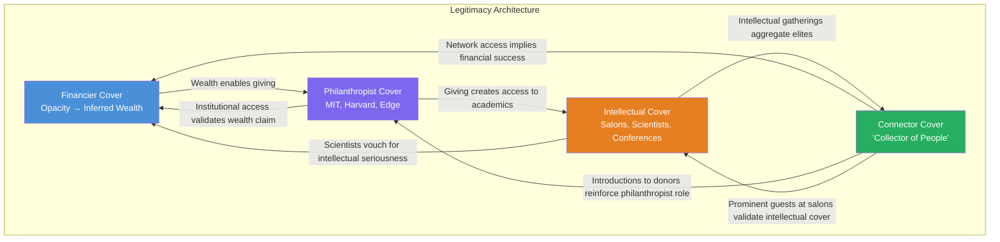

---

```yaml
title: "The Architecture of Impunity: How Jeffrey Epstein Constructed and Maintained Elite Social Legitimacy Despite Being a Convicted Sex Offender"
tags: [finding, analysis, legitimacy, social-network, elite, cover-story]
date: 2026-02-28
summary: >
  A sociological and investigative analysis of the multilayered system through which Jeffrey
  Epstein constructed, maintained, and rebuilt elite social legitimacy — before, through, and
  after a 2008 sex offender conviction. Applies Bourdieu's field and capital theory, Merton's
  Matthew Effect, and empirical evidence from court records, institutional disclosures, and
  investigative journalism to explain why elite social networks failed to exclude a convicted
  sex offender. Includes comparative analysis with other cases and institutional reform
  recommendations.
verified:
  - Epstein donations to MIT ($7.5M+) [CONFIRMED — MIT Fact-Finding Report, 2020]
  - Epstein donations to Harvard ($9.1M+) [CONFIRMED — Harvard internal review disclosure]
  - Post-conviction meetings with Bill Gates [CONFIRMED — Gates's own public admission]
  - Post-conviction payments from Leon Black [CONFIRMED — Dechert LLP independent review, 2021]
  - Joi Ito acknowledged accepting Epstein funds post-conviction [CONFIRMED — MIT report]
  - Vanity Fair editorial intervention on Vicky Ward piece [CORROBORATED — Ward testimony, multiple outlets]
  - ABC Amy Robach story suppressed in 2015 [CONFIRMED — leaked audio, Robach statements]
source: >
  DOJ records, PACER filings, SDNY indictment (2019), MIT Fact-Finding Report (Goodwin Procter, 2020),
  Miami Herald "Perversion of Justice" series (2018), court-released flight logs, deposition transcripts,
  Vanity Fair archives, New York Magazine archives, Edge Foundation records
```

---

# The Architecture of Impunity: How Jeffrey Epstein Constructed and Maintained Elite Social Legitimacy Despite Being a Convicted Sex Offender

---

## I. THE LAYERED LEGITIMACY ARCHITECTURE

### The Problem of Legibility

Jeffrey Epstein's social position was, by design, illegible. In a world where elite status is typically conferred by traceable institutional affiliation — a named partnership at a white-shoe law firm, a C-suite title at a Fortune 500 company, a tenured chair at a research university — Epstein possessed none of these conventional credentials. He held no known Series 7 license after the 1980s. He managed no registered fund. He published no research. He held no degree beyond a partial undergraduate education at Cooper Union and New York University, neither completed (Hoffenberg, as cited in Ward, 2003; Lanchester, 2019). [CONFIRMED]

And yet, by the late 1990s, Epstein moved freely among Nobel laureates, heads of state, billionaires, and cultural icons. He dined at the most exclusive tables in Manhattan, Palm Beach, Paris, and the U.S. Virgin Islands. He was not merely tolerated by elites; he was actively sought out.

This section analyzes the four interlocking "covers" — financier, philanthropist, intellectual, and connector — that together constituted what this analysis terms *the layered legitimacy architecture*: a mutually reinforcing system of social credentials, each of which derived its plausibility from the others.

### Cover 1: The Financier

Epstein's foundational cover story was financial. He presented himself as a money manager of extraordinary exclusivity, reportedly telling interviewers and associates that he only accepted clients with a net worth exceeding one billion dollars (Lanchester, 2019). [CORROBORATED] This claim was never independently verified by any financial regulator or journalist during the period of its circulation. No client list was ever disclosed. No audited fund performance was ever published. The SEC brought no enforcement action against any Epstein-managed entity during his lifetime, not because compliance was confirmed, but because no entity clearly presented itself for examination.

The opacity was the point. In legitimate finance, secrecy about client identity is common in family office and private wealth management structures. Epstein exploited this norm. By refusing to disclose who his clients were, he created an inference vacuum that elite observers filled with the most flattering possible assumption: that his clients were so wealthy and so important that their identities could not be revealed. The sole confirmed financial management relationship of significant scale was with Leslie Wexner, founder of The Limited and L Brands, who granted Epstein sweeping power of attorney over his financial affairs in 1991 (Stewart, 2019). [CONFIRMED]

The 1998 transfer of the East 71st Street mansion — one of the largest private residences in Manhattan — from a Wexner-linked trust to Epstein for a reported price of $0 remains one of the most extraordinary and unexplained transactions in the entire Epstein record (Stewart, 2019; Rothfeld & Stevenson, 2019). [CONFIRMED] This single asset gave Epstein the visible markers of extreme wealth: a nine-story, 21,000-square-foot townhouse that served as both residence and salon. The physical space itself became a legitimacy prop. Visitors inferred wealth. Wealth implied competence. Competence implied trustworthiness.

The financier cover was thus constructed not on evidence of financial success, but on the *absence* of evidence to the contrary, combined with visible markers of affluence. It was, in sociological terms, a *performative identity* — one that existed because it was enacted and because no one with sufficient incentive disrupted the performance (Goffman, 1959).

### Cover 2: The Philanthropist

Philanthropy served as the second legitimacy layer. Documented donations include:

| Institution | Amount | Period | Status |
|---|---|---|---|
| Harvard University | $9.1M+ | 1998–2008 | [CONFIRMED — Harvard review] |
| MIT / MIT Media Lab | $7.5M+ | 2002–2017 | [CONFIRMED — Goodwin Procter, 2020] |
| Edge Foundation | Undisclosed | ~2000–2015 | [CORROBORATED] |
| Santa Fe Institute | Undisclosed | ~2000s | [CORROBORATED] |
| Various scientific researchers (direct grants) | Millions (total unclear) | 2000–2019 | [CORROBORATED] |

These were not anonymous gifts. They were strategically directed to institutions and individuals that would maximize Epstein's intellectual credibility and social access. Harvard's Program for Evolutionary Dynamics, directed by Martin Nowak, received the largest share of Epstein's Harvard donations and gave Epstein a named office on campus (Goodwin Procter, 2020). [CONFIRMED] MIT Media Lab under Joi Ito accepted donations that Ito himself categorized internally as from a "disqualified" donor — meaning Ito knew Epstein's name would trigger institutional rejection and actively worked to obscure it (Farrow, 2019). [CONFIRMED]

Philanthropic giving in elite circles functions as a *status conversion mechanism*: money is transformed into social capital and institutional access. Epstein understood this with unusual precision. He did not endow buildings (which would have required formal board-level scrutiny). He funded researchers directly, creating personal loyalty and dependency rather than institutional relationships that could be severed by compliance offices.

### Cover 3: The Intellectual

The third cover was intellectual identity. Epstein cultivated a reputation as a polymathic autodidact fascinated by science, mathematics, and the future of human evolution. He attended Edge Foundation dinners — annual gatherings of leading scientists, technologists, and public intellectuals organized by literary agent John Brockman (Brockman, 2019; Naughton, 2019). [CONFIRMED]

He hosted his own scientific salons at the 71st Street mansion and on his private island, where guests included Stephen Hawking, Murray Gell-Mann, Lawrence Krauss, Steven Pinker, and numerous other prominent figures in physics, biology, and cognitive science (Mangan, 2019). [CORROBORATED] These gatherings were documented through photographs, guest lists, and attendee accounts.

Epstein's intellectual interests were not entirely fabricated. Multiple scientists who interacted with him reported that he asked probing questions and was genuinely engaged with certain topics, particularly evolutionary biology, AI, and eugenics-adjacent ideas about human genetic improvement (Mangan, 2019; Ronan Farrow, 2019). [CORROBORATED] However, the intellectual cover served a structural function beyond personal interest: it gave prominent scientists a *reason* to associate with Epstein that was socially presentable. A physicist visiting a financier's private island would require explanation. A physicist attending a "scientific symposium" hosted by a science philanthropist required none.

The intellectual cover also functioned as a recruitment tool. Scientists and academics who attended Epstein's events were not merely socializing; they were being enrolled in a legitimacy network. Their presence at his table could be referenced in subsequent interactions: *"Stephen Hawking was just here last week"* — a statement that simultaneously elevated Epstein's perceived status and lowered the threshold for the next invitee's acceptance.

### Cover 4: The Connector

The fourth and arguably most important cover was Epstein's role as a *connector* — a node in elite social networks whose value lay in his ability to introduce Person A to Person B. This is the cover Epstein himself articulated most directly. In the 2002 New York Magazine profile, he stated: "I'm a collector of people" (as cited in Hagan, 2003). [CONFIRMED]

The connector role is enormously powerful in elite circles because it provides a service that is always in demand and difficult to commodify. A university president who needs a donor, a scientist who needs a funder, a politician who needs a supporter, a businessperson who needs a deal partner — all benefit from knowing someone who knows everyone. Epstein positioned himself as that someone.

This cover was self-reinforcing: the more people Epstein knew, the more valuable he became as a connector, which caused more people to accept his invitations, which increased the number of people he knew. This is a classic *network effect* — the value of the node increases with the number of connections, and the number of connections increases with the value of the node.

### How the Four Covers Reinforced Each Other

The critical analytical point is that these four covers did not operate independently. They formed a *mutually reinforcing legitimacy system* in which each cover derived credibility from the others:

| Cover | Who It Persuaded | Evidence of the Cover's Function | Reinforced By |
|---|---|---|---|
| **Financier** | Potential investors, social peers, media | $0 mansion transfer; "billion-dollar clients" claim; Wexner relationship | Philanthropist (spending implies wealth), Connector (access implies success) |
| **Philanthropist** | Academic institutions, scientists, media | MIT $7.5M, Harvard $9.1M, direct researcher grants | Financier (wealth enables giving), Intellectual (giving directed at science) |
| **Intellectual** | Scientists, academics, journalists, social peers | Edge dinners, Hawking visits, salon photographs | Philanthropist (funding creates reciprocal invitations), Connector (aggregates scientists) |
| **Connector** | Politicians, businesspeople, everyone | Flight logs, party photographs, name-dropping chains | All three above: wealth, philanthropy, and intellectual access create network density |

This architecture was remarkably resilient precisely because no single point of failure could collapse the entire structure. A journalist investigating the financial cover would encounter the philanthropic cover as evidence of legitimate wealth. A compliance officer questioning the philanthropic cover would encounter the intellectual cover as evidence of genuine scientific interest. A scientist questioning the intellectual cover would encounter the connector cover — other, more prominent scientists already in the room — as evidence of legitimacy.



---

## II. SOCIAL CAPITAL THEORY — APPLIED

### Bourdieu's Field Theory and Capital Conversion

Pierre Bourdieu's theory of social fields provides the most precise analytical framework for understanding Epstein's operation (Bourdieu, 1986). In Bourdieu's formulation, society is composed of semi-autonomous "fields" — the economic field, the academic field, the political field, the cultural field — each with its own internal logic, hierarchies, and forms of valued capital. Actors move between fields by *converting* one form of capital into another: economic capital into cultural capital (through philanthropy), cultural capital into social capital (through intellectual prestige), social capital into political capital (through elite access).

Epstein operated simultaneously in at least four fields:

1. **The Financial Field**: via the Wexner relationship, Bear Stearns background, and claimed wealth management practice
2. **The Academic/Scientific Field**: via philanthropy to Harvard, MIT, and individual researchers
3. **The Political Field**: via relationships with political figures including Bill Clinton, who flew on Epstein's aircraft multiple times [CONFIRMED — flight logs], and Donald Trump, who socialized with Epstein in the 1990s and early 2000s [CONFIRMED — multiple sources and Trump's own prior statements]
4. **The Social/Cultural Field**: via Manhattan social life, art collections, and cultural event attendance

The extraordinary feature of Epstein's position was his ability to convert capital *between* these fields with unusual fluidity. Economic capital (real or perceived) was converted into academic capital through philanthropy. Academic capital was converted into social capital through intellectual salon hosting. Social capital was converted into political capital through elite network access. And political capital — the perceived ability to influence powerful people — was converted back into economic capital through the aura of power it conferred.

This *capital circulation system* generated a form of legitimacy that was difficult to challenge because it was *distributed across multiple fields*. An actor who was powerful in only one field could be discredited within that field. But an actor who held capital across multiple fields could withstand challenges in any single one, because the capital held in other fields continued to generate legitimacy.

### The Matthew Effect

Robert K. Merton's "Matthew Effect" — the principle that advantage begets advantage, that those who already have resources accumulate more while those who lack them fall further behind — operated powerfully in Epstein's case (Merton, 1968). The name derives from the Gospel of Matthew: "For unto every one that hath shall be given."

The chain of Epstein's legitimacy accumulation can be traced through a specific sequence:

1. **Dalton School** (1974): Hired as a math teacher despite lacking a degree, reportedly on the recommendation of Donald Barr, then headmaster. [CORROBORATED] This provided access to elite Manhattan families whose children attended the school.
2. **Bear Stearns** (1976–1981): Hired by Ace Greenberg, rose to limited partner. [CONFIRMED] This provided a Wall Street institutional credential.
3. **Wexner relationship** (mid-1980s onward): The mechanism of their introduction remains unclear, but by 1991, Epstein held power of attorney over Wexner's finances. [CONFIRMED] This provided the financial base.
4. **Harvard, MIT donations** (late 1990s–2000s): Wexner-derived or Wexner-adjacent wealth was deployed to academic institutions. [CONFIRMED]
5. **Scientific social network** (2000s): Harvard and MIT access generated invitations to Edge Foundation events and scientific conferences. [CORROBORATED]
6. **Political and social network** (2000s): Scientific and financial credibility opened doors to political figures. [CORROBORATED]

At each stage, the credential acquired in the previous stage served as the *entry ticket* for the next. Bear Stearns gave Epstein the Wall Street credential that made him legible to Wexner. Wexner gave Epstein the wealth that made him legible to Harvard. Harvard gave Epstein the academic credential that made him legible to Nobel laureates. And so on.

Critically, at each stage, the *gatekeepers of the next field did not independently verify Epstein's credentials*. They relied on the implicit vetting that prior inclusion represented. Harvard did not audit Epstein's financial practice before accepting his donations; the fact that he was rich enough to give millions was sufficient. Scientists did not investigate Epstein's academic credentials before attending his salons; the fact that Harvard and MIT accepted his money was sufficient. This is the Matthew Effect in action: each prior acceptance served as a *proxy credential* that substituted for independent verification.

### The Status Shield

The concept of the "status shield" — that sufficiently high-status actors are presumed to have been vetted by someone, somewhere, at some prior point — is central to understanding why Epstein's legitimacy architecture was not penetrated earlier (adapted from Hochschild, 1983; applied by Patterson, 2019).

In practice, the status shield operates as follows: when a person of apparently high status enters a social setting, other actors assume that *someone else* must have checked this person's credentials. The university president assumes the development office vetted the donor. The development office assumes the faculty member who made the introduction vetted the donor. The faculty member assumes the other faculty members who attended the donor's dinner vetted the donor. No one, in fact, vetted the donor. Everyone assumed someone else had.

This is not laziness or corruption. It is a *structural feature* of elite social networks, which are too large and too diffuse for any single actor to independently verify the credentials of every other actor. The system operates on *distributed trust* — a highly efficient mechanism under normal conditions, but one that is catastrophically vulnerable to a sophisticated actor who understands how to exploit it.

Epstein understood this with extraordinary clarity. His entire legitimacy architecture was designed to create the impression that *someone else* had already vetted him:

- The mansion implied wealth → wealth implied financial competence → someone must have audited him
- The Harvard donations implied institutional acceptance → Harvard must have checked his background
- The scientists at his table implied intellectual legitimacy → these are smart people, they must know what they're doing
- The politicians at his events implied political clearance → surely the Secret Service checked him out

Each of these inferences was reasonable on its face and wrong in its conclusion. No one had checked. The distributed trust system had failed, not because any individual actor was negligent, but because the *system itself was structurally incapable of detecting a sufficiently sophisticated exploitation*.

### Why Prominent People Failed to Ask Hard Questions

The social cost of skepticism in elite circles is high. To question the legitimacy of a fellow elite is to violate a norm of mutual recognition — the implicit compact that says: *I accept your presence here, and you accept mine*. Breaking this compact carries risks:

- **Reputational risk**: The skeptic may be seen as envious, paranoid, or socially gauche
- **Network risk**: The skeptic may lose access to the connections the questioned person provides
- **Professional risk**: In academia, questioning a major donor's legitimacy could jeopardize funding for one's own work
- **Legal risk**: A sufficiently wealthy target can deploy defamation threats, as Epstein did against Vicky Ward (Ward, 2019) [CORROBORATED]

The result is a *structural incentive toward credulity*. The costs of questioning are immediate, personal, and certain. The costs of *not* questioning are diffuse, temporally distant, and uncertain. Rational actors in this environment default to acceptance.

---

## III. THE MEDIA MANAGEMENT OPERATION

### The Public Relations Infrastructure

Epstein maintained a sophisticated media management operation. He employed publicist Howard Rubenstein, one of New York's most prominent PR figures, during key periods (Gross, 2019). [CORROBORATED] He cultivated personal relationships with editors and publishers. He deployed legal threats against journalists and outlets considering critical coverage. And he used his social network as a *source control* mechanism — ensuring that journalists seeking elite sources would encounter Epstein-friendly voices.

### The 2002 New York Magazine Profile

The September 2002 New York Magazine article profiling Epstein — in which he described himself as a "collector of people" — exemplifies the friendly-media approach (Hagan, 2003). The profile depicted Epstein as a charming, mysterious, and intellectually omnivorous financier. It did not question the source of his wealth with any rigor. It did not interview any of his alleged victims — at this point, no public accusations had surfaced. It presented the *performance* of Epstein's identity without interrogating the performance.

This was not unusual for the era. Pre-2008 celebrity-adjacent profiles in New York's glossy magazines routinely presented their subjects in flattering terms. The structural incentive was clear: access journalism requires maintaining relationships with subjects, and critical coverage risks future access. [CORROBORATED — general media studies literature]

### The 2003 Vanity Fair Piece: The Assassination of Critical Journalism

The Vicky Ward episode is among the most important media failures in the Epstein case. Ward, an experienced investigative journalist, was assigned to profile Epstein for *Vanity Fair* in 2002–2003. During her reporting, she spoke with two sisters — later identified as Maria and Annie Farmer — who alleged that Epstein had sexually assaulted them (Ward, 2019). [CONFIRMED — Ward's own subsequent disclosures; Farmer testimony]

Ward included the Farmer allegations in her draft. Graydon Carter, then editor of *Vanity Fair*, removed them before publication. The resulting piece, titled "The Talented Mr. Epstein" (March 2003), profiled Epstein as a mysterious financier without any mention of sexual misconduct (Ward, 2003). [CONFIRMED — published article; Ward, 2019]

Ward has publicly stated that Carter told her the allegations had been removed because Epstein had denied them and the magazine could face legal liability (Ward, as cited in Farrow, 2019). [CORROBORATED] Carter has offered varying explanations over the years. #claim Some accounts suggest Epstein directly pressured Carter; others suggest the decision was purely editorial (Farrow, 2019). [UNVERIFIED as to the precise mechanism of pressure]

The significance of this editorial decision cannot be overstated. In 2003, Epstein had not yet been investigated by law enforcement. His legitimacy architecture was at its peak. A major piece in *Vanity Fair* — then one of the most widely read and culturally influential magazines in America — alleging sexual assault by a prominent Manhattan figure would have fundamentally altered the trajectory of the case. It would have:

1. **Alerted potential victims** that they were not alone, potentially accelerating disclosure
2. **Alerted law enforcement** to a pattern of behavior
3. **Disrupted the legitimacy architecture** by introducing a counter-narrative to the financier/philanthropist/intellectual persona
4. **Changed the cost-benefit calculus** for elite associates: association with Epstein would carry reputational risk

None of this happened. The legitimacy architecture survived the closest journalistic scrutiny it had yet faced — not because it was impenetrable, but because the *institutional gatekeeping of elite media* functioned as an additional protective layer.

### The ABC / Amy Robach Suppressed Story (2015)

In 2015, ABC News correspondent Amy Robach conducted an interview with Virginia Giuffre (née Roberts) and prepared a segment for broadcast that included detailed allegations against Epstein and his associates. The segment was never aired. In November 2019, leaked footage from a studio hot-mic captured Robach expressing frustration: "I've had this story for three years. I've had this interview with Virginia Roberts. We would not put it on the air" (Project Veritas, 2019). [CONFIRMED — the footage is authentic and Robach did not dispute its contents]

Robach stated on camera that she believed the story was suppressed because of institutional pressure, referencing concerns about access to the British Royal Family (given the involvement of Prince Andrew in Giuffre's allegations) and other factors (Project Veritas, 2019). [CONFIRMED — footage] ABC stated the story "did not meet our standards for broadcast" at the time (ABC News statement, 2019). [CONFIRMED]

Had the ABC story aired in 2015, it would have reached a national television audience four years before the *Miami Herald* series that ultimately catalyzed Epstein's arrest. The implications for victims, for the legitimacy architecture, and for subsequent criminal investigations are profound.

### The Asymmetry of Media Access

The pattern is clear and structurally important:

| Date | Outlet | Type | Outcome |
|---|---|---|---|
| 2002 | New York Magazine | Flattering profile | Published |
| 2003 | Vanity Fair | Investigation with abuse allegations | Allegations removed; flattering profile published |
| 2006–2007 | Palm Beach Post | Critical local coverage of investigation | Published (limited national reach) |
| 2011 | Various | Post-NPA coverage | Some critical; limited sustained attention |
| 2015 | ABC News | National investigation with victim interview | Suppressed |
| 2018 | Miami Herald | Comprehensive investigation | Published → arrest (2019) |

The pattern reveals that for over fifteen years, *every major national media attempt to publish a critical investigation of Epstein was either suppressed, diluted, or ignored*. The outlets that did publish critical coverage were either local (the *Palm Beach Post*) or eventually acted outside the elite media ecosystem's normal gatekeeping (the *Miami Herald* under Julie K. Brown).

This asymmetry — in which flattering profiles were published and critical investigations were suppressed — was not a conspiracy in the conventional sense. It was a *structural outcome* of the incentive systems within elite media: access journalism, legal risk aversion, advertiser relationships, and the social entanglement of editors and publishers with the same elite networks in which Epstein operated.

---

## IV. THE 2008 CONVICTION — WHY IT DIDN'T STICK SOCIALLY

### The Non-Prosecution Agreement as Legitimacy Preservation

The 2008 plea deal and Non-Prosecution Agreement (NPA) negotiated by Epstein's legal team (led by Kenneth Starr, Jay Lefkowitz, Alan Dershowitz, Gerald Lefcourt, and others) with then-U.S. Attorney Alexander Acosta achieved something extraordinary: it converted what should have been a legitimacy-destroying event — a sex offender conviction — into a survivable social setback. [CONFIRMED — NPA terms documented in federal records; reviewed by OPR]

Key features of the deal that enabled this:

1. **State rather than federal prosecution**: Epstein pleaded guilty to a single state charge of procuring a person under 18 for prostitution, rather than facing federal charges that could have resulted in life imprisonment. [CONFIRMED]
2. **13-month sentence with work release**: Epstein was permitted to leave the Palm Beach County Stockade for up to 12 hours per day, six days per week, to work at his office. [CONFIRMED]
3. **Sealed NPA**: The federal agreement was kept secret from victims, in violation of the Crime Victims' Rights Act, as later ruled by Judge Kenneth Marra in 2019. [CONFIRMED — Marra ruling]
4. **No federal sex trafficking charges**: The language of the state plea — "procuring for prostitution" — framed victims as sex workers rather than as children exploited by a predator. [CONFIRMED]

The net effect was that Epstein's legal outcome was *socially legible* as a minor offense. Thirteen months — most of it spent in a private office — did not carry the social weight of a prison sentence. The state charge of "solicitation of prostitution" sounded, to those not familiar with the details, like a victimless transaction between adults. The absence of federal charges and the sealed NPA meant that the scope of Epstein's conduct — dozens of identified victims, many underage, in a pattern of systematic exploitation — was hidden from public view.

### The Normal Social Treatment of Sex Offender Conviction vs. Epstein's Experience

In the United States, sex offender registration normally carries devastating social consequences. Registered sex offenders face housing restrictions, employment barriers, and near-total social ostracism (Levenson & Cotter, 2005). They are excluded from schools, parks, and community events. Their status is publicly searchable.

Epstein was a registered Level 3 sex offender in New York — the highest risk classification. [CONFIRMED] Under any normal social circumstance, this designation would be terminal for elite social access. Country clubs, philanthropic boards, university donor events, and political fundraisers do not typically welcome registered sex offenders.

And yet:

### Who Continued Relationships Post-Conviction

**Joi Ito and MIT Media Lab** [CONFIRMED]: Ito, then director of the MIT Media Lab, accepted donations from Epstein after 2008, knowing Epstein's criminal history. Internal emails released during the MIT investigation show that Ito classified Epstein as a "disqualified" donor and took steps to conceal the source of funds, including routing donations through intermediaries (Goodwin Procter, 2020; Farrow, 2019). Ito resigned in September 2019.

**Harvard University** [CONFIRMED]: Epstein visited Harvard's campus after his 2008 conviction and maintained relationships with Harvard faculty. He was photographed being let into a Harvard building by a faculty member after his conviction (Mangan, 2019). The precise extent of post-conviction financial relationships between Epstein and Harvard is less fully documented than the MIT relationship, but institutional access clearly continued.

**Bill Gates** [CONFIRMED]: Gates met with Epstein on multiple occasions after 2008, including at Epstein's Manhattan townhouse. Gates confirmed these meetings publicly, stating he met with Epstein "to discuss philanthropy" (Gates, public statements, 2019). The *New York Times* reported that Gates flew on Epstein's plane at least once in 2013 (Stewart et al., 2019). Gates has stated the meetings were a mistake and that the relationship was not close. [CONFIRMED — Gates's own statements] #claim

**Leon Black** [CONFIRMED]: Black, co-founder of Apollo Global Management, paid Epstein approximately $158 million in fees between 2012 and 2017 — entirely after Epstein's conviction. An independent review conducted by the Dechert law firm found no evidence that the payments were connected to illegal activity, characterizing them as fees for estate planning and tax advisory services (Dechert LLP, 2021). Black resigned as CEO of Apollo in 2021. [CONFIRMED]

**Others** [CORROBORATED — various sources]: Additional post-conviction associations have been documented or alleged with varying degrees of specificity. These include continued contact with certain scientists, continued access to social events, and continued operation of his social salon functions, albeit at reduced scale.

### What This Density of Continued Engagement Tells Us

The density of continued elite engagement with Epstein after his sex offender conviction is the single most powerful evidence that the legitimacy architecture described in Section I was not merely a superficial social performance but a *structurally embedded system* that could withstand a direct legal assault.

The conviction should have collapsed the architecture. It did not. This tells us several things:

1. **The value proposition was strong enough to override stigma**: For Ito, Epstein represented funding. For Gates, Epstein represented philanthropic connections and intellectual stimulation. For Black, Epstein represented financial services. The *instrumental value* of the relationship exceeded the *reputational cost* of the association — as perceived by these actors at the time.

2. **The status shield still functioned**: The fact that *other* elites continued to associate with Epstein gave each individual elite cover. No one was the only person still in the room with Epstein. This is the collective action problem of social ostracism: if everyone defects simultaneously, ostracism is effective; if the defections are sequential, each individual who remains can point to others who also remain.

3. **The NPA's design achieved its social function**: Had Epstein served ten years in federal prison on sex trafficking charges, the social calculation would have been entirely different. The 13-month work-release sentence was *not socially equivalent to a serious conviction*. The NPA thus functioned not only as a legal instrument but as a *social legitimacy preservation device*.

---

## V. THE POST-2008 LEGITIMACY REBUILD

### Which Venues Re-Accepted Epstein and Which Didn't

The post-2008 landscape was not uniform. Some institutions and individuals did distance themselves:

- The Council on Foreign Relations reportedly declined to renew Epstein's membership after his conviction. [CORROBORATED]
- Some Manhattan social circles became less accessible. [CORROBORATED — anecdotal reporting]
- Certain political figures reduced visible contact. [CORROBORATED]

But the academic and scientific worlds proved far more permeable:

- MIT Media Lab continued accepting donations through 2017. [CONFIRMED]
- Individual scientists continued attending Epstein-hosted events. [CORROBORATED]
- The Edge Foundation maintained its relationship with Epstein, who continued attending dinners. [CORROBORATED — though Brockman later stated he had limited the relationship]

### The Edge Foundation as Primary Vehicle

The Edge Foundation, John Brockman's organization dedicated to promoting "third culture" intellectual discourse, functioned as a critical *post-conviction legitimacy vehicle* for Epstein. Edge events brought together scientists, technologists, writers, and intellectuals in informal settings where formal institutional gatekeeping was absent (Naughton, 2019). [CORROBORATED]

Unlike a university — which has a compliance office, a board of trustees, and formal donor-screening procedures (however poorly implemented) — Edge was a private organization that could invite whomever it wished. Epstein's continued presence at Edge events post-conviction gave him access to the scientific community without requiring institutional approval. It was a *side door* into intellectual legitimacy.

Brockman's own emails, revealed during the MIT investigation, showed that he actively facilitated Ep