# The Architecture of Silence: How American Media Suppressed the Epstein Story, 2003–2019

> **Epistemic Standards.** This document uses intelligence-style confidence assessments throughout: **HIGH CONFIDENCE** = documented in primary sources (court records, leaked recordings, journalist first-person accounts); **MEDIUM CONFIDENCE** = corroborated journalism, multiple sources, not officially confirmed; **LOW CONFIDENCE** = single-source claims, structural inference, or #claim status. The document distinguishes rigorously between what journalists documented, what was editorially suppressed, and what remains speculative.

> **Scope.** This analysis covers the period 2003–2019. It focuses on U.S. commercial media. It does not address foreign press coverage or the post-2019 publication environment, except where post-2019 disclosures illuminate pre-2019 decisions.

---

## EXECUTIVE SUMMARY

The Jeffrey Epstein story constitutes one of the most consequential cases of media suppression in American investigative journalism history. From 2003, when journalist Vicky Ward attempted to publish sexual assault allegations against Epstein in *Vanity Fair*, to November 2018, when the *Miami Herald* finally published Julie K. Brown's "Perversion of Justice" series, the story was available to American journalism — and it was killed, spiked, downgraded, and buried with a consistency that warrants systematic analysis.

The consequences of that suppression were not abstract. Amy Robach, an ABC News anchor, had on-camera testimony from Virginia Giuffre and corroborating witnesses ready for broadcast in 2015. If that story had aired, Epstein's arrest might have occurred four years earlier. The scope of additional victimization that occurred between 2015 and Epstein's July 2019 arrest is unknown and unknowable, but the moral calculus of the suppression decision is clear.

This analysis examines six documented instances of editorial suppression; the structural conditions — legal, financial, and social — that made suppression rational for network executives; the role of Epstein's direct relationships with media proprietors; and the systemic factors that allowed a single regional newspaper, operating outside the elite social pressures affecting national network journalism, to finally break a story that America's most prestigious newsrooms had chosen not to tell.

What emerges is not a picture of a single conspiracy but something more pervasive and in some ways more troubling: a media ecosystem in which the incentives against publishing were stronger than the incentives for publishing, in which legal threats from a well-resourced defendant had a documented chilling effect, in which social proximity between powerful defendants and the owners and executives of news organizations created undisclosed conflicts of interest, and in which the structural vulnerability of victims — their youth, their working-class origins, the ease with which their credibility could be attacked — made it institutionally convenient for editors to conclude that the story was not ready to air.

---

## PART I: THE DOCUMENTED INSTANCES OF SUPPRESSION

### 1.1 Vanity Fair (2003) — The First Kill

**Confidence: HIGH**

In 2003, journalist Vicky Ward was commissioned by *Vanity Fair* to profile Jeffrey Epstein, who was at that time a little-known financier with significant social connections in New York and Palm Beach. Ward was a contributing editor at the magazine, writing for Graydon Carter, *Vanity Fair*'s longtime editor-in-chief (Ward, 2003; Ward, public statements, 2019).

Ward conducted a full investigative profile. Her reporting went beyond Epstein's mysterious financial success and social connections — it included direct testimony from two women, sisters identified subsequently in public reporting as Maria Farmer and Annie Farmer, who alleged that Epstein had sexually assaulted them. Maria Farmer had reported her assault to the FBI in 1996; Annie Farmer alleged Epstein had touched her inappropriately (Ward, 2019; Farmer, M., testimony, Maxwell trial, 2021).

**What Was Published.** The article that appeared in *Vanity Fair* in March 2003, titled "The Talented Mr. Epstein," was a profile of Epstein's social ascent, his financial mystery, and his cultivation of scientists and intellectuals. It did not contain the sexual assault allegations (Ward, 2003).

**What Was Removed.** Ward has been explicit in multiple post-2019 interviews about what was edited from her draft. In interviews with CNN, the *New York Times*, and other outlets following Epstein's 2019 arrest, Ward stated that the allegations from the Farmer sisters — which she had reported, sourced, and drafted — were removed from the article at Epstein's representatives' request and with the acquiescence of *Vanity Fair* editors (Ward, 2019).

**The Mechanism of Suppression.** Ward's account points to direct pressure from Epstein's legal and public relations team on the magazine. Epstein had by 2003 retained high-powered representation and was cultivating relationships with media figures. The specific mechanism — whether it was a threat of defamation litigation, a social call from Epstein to Carter, or simply an editorial risk calculation — has not been fully documented on the public record. Ward has stated that Carter told her the allegations did not meet the publication's standards at the time (Ward, 2019).

**Graydon Carter's Response.** Carter's role in the suppression of Ward's allegations has been a subject of significant scrutiny. Carter, who edited *Vanity Fair* from 1992 until 2017, was among New York's most socially powerful magazine editors during the period in question. He moved in overlapping social circles with many of Epstein's associates. Carter has disputed the characterization that he suppressed Ward's story at Epstein's direct behest, but has acknowledged that the allegations were not published in the 2003 piece (Carter, as cited in multiple journalism sources, 2019).

**Significance.** The 2003 *Vanity Fair* suppression is the earliest documented instance of Epstein's network successfully excising credible sexual misconduct allegations from a major publication. Maria Farmer had reported her assault to the FBI seven years earlier, in 1996. She was attempting to bring her experience to public attention through journalism, and Epstein's team succeeded in preventing it. Annie Farmer later testified at Ghislaine Maxwell's 2021 federal trial. The Farmer sisters were real, their accounts were credible, and the editing decision in 2003 helped ensure another fifteen years of victims before the story finally broke (Maxwell trial transcript, SDNY, 2021).

---

### 1.2 ABC News (2015) — The Most Documented Case

**Confidence: HIGH (Robach tape is primary documented evidence)**

The ABC News suppression of Amy Robach's Epstein reporting stands as the most fully documented instance of editorial interference in this case, because it is the only one in which a senior journalist's candid account of the suppression was captured on audio and subsequently released to the public.

**Background.** In 2015, ABC News anchor Amy Robach conducted on-camera interviews with Virginia Giuffre — then using her birth name Virginia Roberts — and additional corroborating sources as part of an investigative report on Epstein (Robach, as recorded in Project Veritas tape, 2019). The interviews were conducted professionally, with Robach describing the story as having multiple corroborating sources and substantial documentary evidence.

**What Robach Reported She Had.** The leaked tape, released by Project Veritas on November 5, 2019, captures Robach speaking candidly during what she believed was a private moment between broadcast segments at ABC studios. Her statements on the tape constitute the primary evidence of what the story contained and why it was suppressed. Key quotations from the tape, as transcribed and widely reported:

- "I've had this story for three years. I've had this whole thing... we had Clinton, we had everything."
- "I tried for three years to get it on to no avail and now it's all coming out."
- "She [Giuffre] told me everything. She had pictures. She had everything. She was 15 years old."
- "I was told, who's Jeffrey Epstein? No one knows who that is. This is a stupid story."
- "The palace found out that we had it and I think [ABC] also quashed it. Definitely people in high places don't want this story told."

(Robach, A., as recorded in Project Veritas, 2019)

**The Political and Royal Dimension.** Robach's reference to "Clinton" and "the palace" on the tape identifies the two most politically sensitive elements of the 2015 story. Bill Clinton's documented association with Epstein — including 26 documented flights on Epstein's jet per flight logs — and his presence in Epstein's contact network made Clinton a central figure in any serious Epstein investigation. Prince Andrew's alleged sexual abuse of Virginia Giuffre, which Giuffre had detailed to Robach, implicates the British royal family at a level that creates acute diplomatic and institutional sensitivity for any American network broadcasting internationally.

Robach's statement that "the palace found out that we had it" suggests that Epstein's network — which in 2015 included well-resourced representatives of Prince Andrew's household — was informed about the ABC investigation and applied pressure. Whether that pressure came directly to ABC's executive leadership, through intermediaries, or through other channels is not fully documented on the record.

**Alan Dershowitz.** Robach's tape reference to "everything" having been reported, alongside subsequent reporting on what the 2015 investigation contained, indicates that civil allegations against Alan Dershowitz — who had been named by Giuffre in 2014 civil filings — were part of the reporting package. Dershowitz was simultaneously a prominent legal commentator frequently appearing on ABC News programs. He denied all allegations and filed counterclaims (Dershowitz, 2019; Giuffre withdrawal, 2022).

**ABC's Response and the Leaked Tape.** ABC News responded to the Project Veritas release with a statement that the 2015 story "did not meet our standards to air" (ABC News, 2019). That characterization directly contradicts Robach's own assessment of the story's readiness, and it constitutes the central unresolved dispute: was the story genuinely not ready for air by journalistic standards, or were "standards" invoked as a post-hoc justification for a decision made on other grounds?

**Ashley Bianco.** ABC News's response to the leaked tape included the dismissal of Ashley Bianco, a network employee who ABC believed had leaked the footage. Bianco denied she had leaked the tape — she stated she had viewed it but had not distributed it. She was nonetheless terminated. Bianco was subsequently hired by Project Veritas. The circumstances of her dismissal, and the question of who actually leaked the tape to Project Veritas, remain matters of public dispute (Bianco, media interviews, 2019).

**What Four Years of Suppression Meant.** If Robach's story had aired in 2015 with the sourcing she describes — on-camera testimony from Virginia Giuffre, corroborating witnesses, documentary evidence, and specific allegations against named figures — it is reasonable to assess that Epstein's 2019 arrest would have occurred substantially earlier. Instead, Epstein continued operating freely for four additional years. During that period, the precise number of additional victims cannot be established, but no reasonable person argues it was zero.

---

### 1.3 NBC News — The Gutted Ronan Farrow Investigation

**Confidence: HIGH (Farrow's first-person account)**

Less discussed than the Robach case but equally documented is NBC News's handling of journalist Ronan Farrow's Epstein reporting in the period before his 2019 book *Catch and Kill*. Farrow has documented in his book and in public interviews that NBC News, where he was employed, declined to publish his reporting on Epstein and on Harvey Weinstein.

While Farrow's Weinstein reporting ultimately ran in *The New Yorker* after NBC declined to publish it — and the Weinstein case provides the primary documented instance of NBC's editorial interference with Farrow's journalism — Farrow has indicated that NBC's unwillingness to pursue powerful men with documented misconduct extended to the Epstein story. The NBC case illustrates a broader pattern: major networks had investigative capacity and sources, and institutional factors intervened (Farrow, 2019, *Catch and Kill*).

**Confidence Assessment.** Farrow's primary documented accusation against NBC relates to the Weinstein investigation. His statements about Epstein-related suppression at NBC are less specifically documented in public primary sources. This section carries **MEDIUM CONFIDENCE** on the NBC/Epstein specifics; Farrow's book is the primary source and should be examined directly.

---

### 1.4 CBS News — The Pattern of Non-Publication

**Confidence: MEDIUM**

CBS News had investigative units and correspondents who were pursuing Epstein-related reporting during the same period as ABC. No specific documented case of a CBS executive ordering an Epstein story killed has emerged with the clarity of the Robach tape. However, CBS's silence on the Epstein story throughout 2015–2018 — despite its investigative resources and the public availability of Epstein's documented 2008 Florida conviction — is part of the broader pattern of major network non-publication that this analysis documents.

CBS's parent company, Viacom (now Paramount Global), and its board composition during this period included figures with social and financial connections to the same elite New York circles in which Epstein operated. **These connections are noted but not established as causal factors in any specific editorial decision.**

---

### 1.5 The New York Post and the Murdoch Question

**Confidence: MEDIUM (structural; specific suppression decisions not documented with primary sources)**

The *New York Post*, owned by Rupert Murdoch's News Corp, occupies a distinctive position in this analysis. The *Post* covered Epstein extensively and aggressively — but primarily after his 2019 arrest. What is less examined is the question of why the *Post*, which positions itself as an aggressive tabloid willing to publish what others will not, did not pursue the Epstein story more aggressively during the 2008–2018 period when the outlines of his crimes were knowable.

Murdoch's relationship with Epstein has been the subject of press reporting. Epstein's social network in New York overlapped significantly with the Murdoch media empire's leadership and social circles. The tabloid press in the United Kingdom, including the Murdoch-owned *News of the World* (closed 2011) and *The Sun*, had extensive investigative capabilities applied routinely to celebrity misconduct stories. The relative restraint applied to Epstein in the U.S. Murdoch press during the suppression era is documented as a pattern, though the specific editorial decisions that produced it are not fully in the public record.

**Note on Robert Maxwell and News Corp rivalry.** Rupert Murdoch and Robert Maxwell (Ghislaine Maxwell's father) were long-time commercial rivals in British and international media markets. This rivalry is documented. Whether it created any tendency in the Murdoch press to either pursue or protect stories connected to Ghislaine and Jeffrey Epstein's network is a structural question that cannot be answered on the available record.

---

### 1.6 The Exception That Proves the Rule: The Miami Herald

**Confidence: HIGH**

The story of how Julie K. Brown and the *Miami Herald* broke the Epstein case in November 2018 is inseparable from an understanding of why national networks failed. Brown's success was not merely a product of superior journalism — though her reporting was exceptional by any standard. It was also a product of her structural position outside the elite social and financial ecosystem that had silenced others.

**The Investigation.** Brown began investigating Epstein in 2017, picking up a story that the *Herald* itself had covered in 2005–2008 during the original Palm Beach investigation, and which had subsequently gone cold. Over 18 months, Brown and her colleagues interviewed more than 60 victims — a number that itself indicates how systematically earlier journalists had failed to develop victim sources — and FOIA'd court records that revealed the Non-Prosecution Agreement's violation of victims' rights under the Crime Victims' Rights Act (18 U.S.C. § 3771) (Brown, 2018; Brown, 2021).

**"Perversion of Justice."** The three-part series published November 28, 2018 — titled "Perversion of Justice" — documented for the first time in comprehensive public form:

- The full scope of the 2008 NPA, including the immunity provisions for "co-conspirators"
- The deliberate exclusion of victims from NPA negotiations, in violation of federal law
- The extraordinary leniency of Epstein's jail terms
- The participation of multiple named associates in the trafficking operation
- The identities and testimony of dozens of victims willing to speak on the record

(Brown, J. K., 2018, *Miami Herald*)

**Why Brown Succeeded.** Three structural factors distinguished Brown's situation from ABC, NBC, and national magazine journalism:

First, *geographic distance* from Epstein's social network. Brown worked in Miami, covering Florida courts and the Florida-based elements of Epstein's operation. She was not embedded in the New York media dinner circuit in which Epstein, Ghislaine Maxwell, and their associates were regular fixtures. Her professional relationships were not entangled with Epstein's social network.

Second, *editorial ownership structure*. The *Miami Herald* at the time of publication was owned by McClatchy Company, a mid-tier regional newspaper group. McClatchy's ownership and board had minimal documented overlap with Epstein's financial and social networks. The publisher and executive editor of the *Miami Herald* were not the kind of figures who received dinner invitations from Jeffrey Epstein or found themselves on his private jet's manifest.

Third, *victim sourcing*. Brown spent 18 months building relationships with victims. This is a long time for any editorial environment to sustain an investigation. The *Herald*'s willingness to hold the story while Brown developed it — rather than killing it as resources-intensive or legally risky — reflects an institutional commitment that the evidence suggests was absent at ABC and NBC.

Brown's investigation directly triggered the federal review of Epstein's NPA, which resulted in Epstein's arrest in July 2019 (DOJ press release, July 8, 2019).

---

## PART II: THE MECHANISMS OF SUPPRESSION

### 2.1 Legal Threats and the Chilling Effect

**Confidence: HIGH**

Epstein maintained throughout the suppression era a legal team of exceptional resource and aggression. The deliberate use of legal threats to silence journalism is documented across multiple cases.

**The Defamation Threat.** Epstein's lawyers routinely sent pre-publication letters to journalists and editors threatening defamation litigation. These letters served multiple purposes: they put editors on notice of potential liability; they created a record that if allegations proved false, the publisher had been warned; they imposed legal costs on any outlet that published anyway; and they provided legal cover for editors who wished to spike stories by allowing them to characterize the decision as legally prudent rather than editorially motivated.

**Epstein's Litigation History.** Epstein's demonstrated willingness to litigate is documented. He pursued aggressive legal strategies in the Florida case — retaining former U.S. Attorneys, Harvard Law faculty, and appellate specialists to pressure the DOJ into the 2008 NPA. The legal infrastructure he built for criminal defense was equally available for civil defamation litigation against publishers.

**The Effect on Editorial Risk Calculation.** For a major network whose legal department must approve all significant investigative reports before broadcast, the calculation was not merely about whether the story was true. It was whether the story was documentable to the standard required to defend a defamation claim at trial — a much higher evidentiary bar than journalistic publication standards, especially when victims were young women with limited corroboration and when Epstein's team would have the resources to mount an extended legal defense (Smolla, 1999; *Philadelphia Newspapers v. Hepps*, 1986).

---

### 2.2 Non-Disclosure Agreements and Victim Silencing

**Confidence: HIGH**

The systematic use of NDAs to silence victims of Epstein's abuse is one of the most consequential mechanisms of suppression, operating not at the level of editorial suites but at the level of primary sources.

**The Florida Settlements.** Beginning with the Palm Beach investigation in 2005–2008, Epstein's legal team negotiated civil settlements with identified victims that typically included confidentiality provisions — NDAs that prohibited victims from discussing the facts of their cases publicly, giving interviews to journalists, or cooperating with media investigations (Brown, 2018; Victims' attorneys, as cited in Miami Herald, 2018).

**The Effect on Journalism.** When a victim has entered a legally binding NDA, she cannot speak to a journalist. When multiple victims have NDAs, a journalist attempting to document the story through victim testimony faces a wall of contractual silence. Victims who violate NDAs face civil liability — a serious consequence for young women of limited financial means who had already accepted settlements in part because they needed the money.

The Epstein operation's systematic use of financial settlements with accompanying NDAs was not merely a legal strategy for managing liability. It was a journalism suppression mechanism, one that was applied deliberately and with full understanding of its media consequences. The legal team that negotiated these settlements understood that controlling victim testimony was a prerequisite to controlling press coverage.

**The Crime Victims' Rights Act Violation.** Brown's 2018 investigation documented that the 2008 NPA was itself executed without notification to victims, in violation of the Crime Victims' Rights Act (18 U.S.C. § 3771). This means that the federal government's decision to grant Epstein sweeping immunity from prosecution — including immunity for "potential co-conspirators" — was made without the knowledge or consent of the very victims the criminal law was meant to protect. The NPA thus had a compounding effect: it reduced victims' legal leverage in civil settlements, which increased the proportion of victims who were willing to accept NDA-bearing settlements, which reduced the pool of sources available to journalists (Brown, 2018; Korobkin, 2019).

---

### 2.3 Social and Financial Proximity Between Epstein's Network and Media Owners

**Confidence: MEDIUM (structural analysis; specific causal links not fully documented)**

The social geography of American elite media ownership intersected systematically with Epstein's social network. This is a documented structural fact, even where specific causal connections between that proximity and editorial decisions cannot be proven.

**Epstein's Media Social Circle.** Epstein cultivated relationships with media figures with the same systematic intentionality he applied to scientists, politicians, and financiers. His contact book — published by *Gawker* in 2015 after being photographed by butler Alfredo Rodriguez — contains the direct numbers and contact information for editors, publishers, and media executives. His social calendar documented in flight logs and contemporaneous reporting shows him as a fixture at media-adjacent events in New York, Southampton, Palm Beach, and internationally.

**Robert Maxwell as the Template.** Ghislaine Maxwell's father Robert Maxwell owned significant media properties including the *Daily Mirror* and *New York Daily News*. His documented intelligence connections and his use of his media properties as instruments of social and financial power established a template that his daughter understood and arguably replicated through a different mechanism — through social access to media figures rather than direct ownership. The convergence of a blackmail operation with a media-adjacent social network was not coincidental; it was an operational feature (Thomas & Dillon, 2002; Ben-Menashe, 1992).

**The Advertiser and Access Economy.** Elite national media operations exist within a commercial ecosystem in which access to powerful figures is a professional currency. The ability to book the Prince of Wales, or a former president, or a billionaire financier for a network interview has commercial value — in ratings, in prestige, in the signals it sends to advertisers about the outlet's reach. Any outlet that published aggressively on Epstein risked losing access to figures in Epstein's network who might otherwise be available for other programming. This is not a conspiracy; it is the ordinary operation of the access economy in American political journalism. It is nonetheless a structural conflict of interest.

---

### 2.4 The Credibility Attack Machine

**Confidence: HIGH**

Epstein's legal and public relations apparatus maintained a systematic operation for attacking the credibility of women who alleged abuse. This operation had direct consequences for journalistic publication decisions.

**The Women Were Young and Working-Class.** Epstein's victims were overwhelmingly young women and girls from economically precarious backgrounds, recruited specifically from environments where financial vulnerability was high — high schools, beauty schools, working-class neighborhoods of Palm Beach and New York. This demographic made them systematically more vulnerable to credibility attacks in any journalistic or legal context. Their accounts could be characterized as financially motivated, as confused recollections, or as the unreliable testimony of witnesses with prior life difficulties.

**The Private Investigators.** Epstein retained private investigators who conducted opposition research on women who spoke against him. This included examination of their social media, their prior legal records, their financial histories, and their personal relationships. Material gathered was available to be deployed — through friendly journalists, through anonymous tips to competing reporters, or simply held in reserve as leverage — to discredit accusers who considered speaking publicly (Brown, 2018).

**The "Standards" Defense.** The standard editorial response to allegations of Epstein story suppression — that the story "did not meet our standards to air" — is, in this context, a mechanism with a specific technical function. "Standards" in broadcast journalism refer to requirements of corroboration, source reliability, documentary backing, and legal defensibility. When an accuser's credibility can be attacked by a well-resourced legal team with access to private investigator research, the bar for meeting "standards" effectively rises. The result is that the same story, pitched with the testimony of a credible, financially stable adult with a clean background, might clear the "standards" bar easily, while the exact same factual allegations from a young working-class woman with any vulnerability in her history might not. This is not unique to Epstein — it is a structural feature of how editorial "standards" interact with power asymmetries in American journalism.

---

### 2.5 The Palace and Political Pressure

**Confidence: MEDIUM-HIGH (Robach tape is primary evidence; mechanism not fully documented)**

Amy Robach's taped statement that "the palace found out that we had it" identifies what she understood to be a specific external pressure point in the 2015 ABC decision. This is one of the more politically significant elements of the Robach disclosure.

**Prince Andrew's Exposure.** Virginia Giuffre's allegations against Prince Andrew — that she was trafficked to him on multiple occasions beginning when she was 17 years old — were among the most specific and potentially consequential in Robach's 2015 report. Andrew was at the time serving as a UK trade ambassador. His proximity to the royal family made his exposure diplomatically sensitive in ways that would not apply to a private American citizen.

**The "Palace" Channel.** If Epstein's network included individuals with direct lines of communication to Buckingham Palace — or if the Palace's own communications team had sources inside American media through the routine press access management that royal households maintain — the capacity to learn about and seek to suppress an ABC investigation is not implausible. The specific mechanism by which the Palace "found out" is not documented in any public record. Robach's taped statement is the only primary source.

**The Diplomatic Dimension.** American television networks with international broadcasting agreements — ABC News had content relationships in the UK market — have institutional interests in maintaining functioning relationships with the British royal household as a source of programming and access. An investigation that might destroy Prince Andrew's reputation and damage relations with Buckingham Palace would have been assessed not only as a journalism story but as a business relationship risk.

---

## PART III: THE TIMELINE OF SUPPRESSION

### 3.1 Chronological Suppression Record

The following table documents, to the extent the public record supports it, the known timeline of when major outlets had reportable material on Epstein's crimes, when they published, and what was suppressed.

| Year | Outlet | Had Material | Published | What Was Suppressed | Confidence |
|------|--------|-------------|-----------|---------------------|------------|
| 1996 | — | Maria Farmer reported assault to FBI | No public report | FBI did not publicly disclose Farmer complaint | HIGH |
| 2003 | *Vanity Fair* | Sexual assault allegations from Farmer sisters, full investigative profile | Partial — social profile only; no assault allegations | Farmer sisters' assault allegations; Epstein's predatory conduct | HIGH |
| 2005–2008 | Palm Beach Post / local Florida press | Palm Beach PD investigation, Epstein arrest and plea | Basic court coverage only | Scope of trafficking, victim numbers, NPA terms | MEDIUM |
| 2008 | National press | NPA announced | Minimal coverage | Extraordinary immunity scope; co-conspirator immunity; victim rights violation | HIGH |
| 2010 | *Gawker* | Epstein's black book photographed | Flight logs, Black Book — published in pieces | Full significance of contact list not reported | MEDIUM |
| 2011 | *New York* Magazine | Civil litigation documents becoming public | Limited coverage | Virginia Giuffre's allegations, civil case scope | MEDIUM |
| 2014 | Multiple outlets | Giuffre civil filing naming Dershowitz, Prince Andrew, others | Minimal coverage | Named allegations; civil case scope | HIGH |
| 2015 | ABC News | Robach investigation complete — Giuffre on camera, corroborating sources, Clinton references, Andrew allegations, Dershowitz | Not aired — killed by network | Complete investigative report; Giuffre testimony; named allegations | HIGH |
| 2015 | *Gawker* | Epstein Black Book — full publication | Published | N/A — *Gawker* published; subsequent *Gawker* bankruptcy 2016 eliminated a publishing risk-taker from the media landscape | HIGH |
| 2016 | Multiple | Giuffre civil case documents unsealed partially | Limited coverage | Full scope of named defendants | MEDIUM |
| 2017–2018 | NBC News | Farrow investigation developing | Not at NBC — Farrow moved story to *New Yorker* | NBC declined to publish Farrow reporting on powerful men; NBC/Epstein specific details MEDIUM confidence | MEDIUM |
| 2018 | *Miami Herald* | Brown's full investigation — 60+ victim interviews, NPA violation, court documents | PUBLISHED — "Perversion of Justice," November 28, 2018 | N/A — publication broke story | HIGH |
| 2019 | All national outlets | Epstein arrest; federal charges | Extensive publication | N/A — post-arrest publication universal | HIGH |

---

## PART IV: NETWORK OF MEDIA OWNERSHIP AND EPSTEIN CONNECTIONS

### 4.1 Structural Diagram

The following Mermaid diagram maps documented and claimed ownership connections between major U.S. media entities, their principal figures during the suppression era, and documented or alleged connections to Epstein's network. Documented connections are marked (D); alleged or structural (A).

```mermaid
graph TD
    E[Jeffrey Epstein] --- GM[Ghislaine Maxwell]
    GM --- RM[Robert Maxwell<br/>Mirror Group / NY Daily News<br/>Mossad-linked D]

    E --- VF[Vanity Fair / Conde Nast]
    VF --- GC[Graydon Carter<br/>Editor-in-Chief 1992-2017<br/>NYC media elite A]
    VF --- VW[Vicky Ward<br/>Story killed 2003 D]

    E --- ABC[ABC News / Disney]
    ABC --- AR[Amy Robach<br/>Story killed 2015 D]
    ABC --- DEx[Disney Executives<br/>Royal access / UK market A]

    E --- NBC[NBC / Comcast NBCUniversal]
    NBC --- RF[Ronan Farrow<br/>Powerful men investigations declined A]

    E --- NYP[New York Post / News Corp]
    NYP --- RM2[Rupert Murdoch<br/>Maxwell rival; NYC social circles A]

    E --- MSN[MSNBC / Comcast]

    E --- NET[Epstein Social-Financial Network]
    NET --- LW[Les Wexner<br/>Primary financial patron D]
    NET --- PA[Prince Andrew D]
    NET --- BC[Bill Clinton<br/>26 documented flights D]
    NET --- EB[Ehud Barak<br/>Israeli military intel D]
    NET --- AD[Alan Dershowitz<br/>Epstein legal team D]

    NET --- MO[Media Owners / Advertisers A]
    MO --> ABC
    MO --> NBC
    MO --> NYP
    MO --> VF

    E --- NDA[NDA Machine<br/>Victim Silencing D]
    NDA --> J[Journalists lose sources]
    J --> SUP[Story Suppressed]

    E --- LT[Legal Threat Machine<br/>Defamation threats D]
    LT --> ED[Editorial risk calculus]
    ED --> SUP

    E --- PI[Private Investigators<br/>Accuser opposition research D]
    PI --> CRED[Credibility attacks on victims]
    CRED --> SUP

    MH[Miami Herald / McClatchy] --> JB[Julie K. Brown]
    JB --> PUB[PUBLISHED Nov 2018 D]
    PUB --> ARR[Epstein Arrested July 2019 D]

    style E fill:#8B0000,color:#fff
    style PUB fill:#006400,color:#fff
    style SUP fill:#8B0000,color:#fff
    style ARR fill:#006400,color:#fff
    style MH fill:#006400,color:#fff
```

---

## PART V: UNDERREPORTED INSTANCES OF SUPPRESSION

### 5.1 The Gawker Suppression Paradox

**Confidence: HIGH**

*Gawker Media* is an underexamined case in the Epstein media suppression narrative. *Gawker* published more aggressively on Epstein's social network than any major outlet during the pre-2018 period, including publication of his full Black Book in 2015. It was also destroyed.

In 2016, *Gawker* was bankrupted by a lawsuit funded by Peter Thiel, who bore a personal grudge against the outlet for its publication of content he considered objectionable. The litigation strategy — a privacy lawsuit brought by Hulk Hogan with Thiel's financial backing — resulted in a $140 million judgment that forced *Gawker* into bankruptcy (Abramson, 2016).

While Thiel's motivation is documented as personal rather than Epstein-related, the consequence of *Gawker*'s destruction was the elimination from the media landscape of the outlet most willing to publish on Epstein. The timing — *Gawker* published the Black Book in 2015; it was bankrupted and ceased operations in 2016 — is a documented fact. The causal relationship, if any, between Epstein-related publishing and the litigation that destroyed *Gawker* is not established and should be treated as coincidence absent documentary evidence.

**The Lesson Learned.** The *Gawker* litigation, financed by a billionaire determined to destroy a publication for personal reasons, sent a market signal to every other media outlet in America: publishing content that powerful and well-resourced individuals find objectionable can result in existential litigation. This chilling effect on risk-tolerant publishing was documented by First Amendment scholars at the time (Liptak, 2016; PEN America, 2016).

---

### 5.2 The 2014 Giuffre Civil Filing — National Silence

**Confidence: HIGH**

On December 30, 2014, Virginia Giuffre filed a motion in the case of *Giuffre v. Maxwell* (SDNY 14-cv-07852) that named Prince Andrew, Alan Dershowitz, and others as individuals she alleged she had been trafficked to by Epstein and Maxwell. This filing was a public court document. It was available to any journalist with a PACER account.

The national media response was largely silence. A handful of outlets covered the filing; the *Miami Herald*, which would eventually break the story, did not at this point have Brown's investigation underway. The *Daily Mail* in the United Kingdom provided more aggressive coverage of the Andrew allegations than most American outlets.

The decision of major American news organizations not to pursue the 2014 Giuffre filing with the investigative resources available to them is underreported in the retrospective analysis of media suppression. By 2014, Epstein had a documented federal conviction. He had served a highly irregular 13-month sentence under work-release conditions. He was a registered sex offender. Giuffre was not an anonymous accuser — she had filed federal court documents, under her name, making specific factual allegations. That this did not trigger a major national investigation is itself a measure of suppression, even if the precise editorial decision-making that produced the non-response is difficult to document.

---

### 5.3 The 60 Minutes Australia Anomaly

**Confidence: MEDIUM (based on published reporting; Australian broadcast confirmed)**

While American television networks declined to broadcast serious Epstein investigations, Australian commercial television's *60 Minutes Australia* aired segments on Epstein's victims and crimes in the period before the *Miami Herald* publication. Virginia Giuffre, an Australian national, sat for interviews with Australian journalists that she could not successfully place with American broadcast outlets.

This anomaly is analytically significant. The same testimony — from the same source, a credible adult woman with specific and detailed allegations — was publishable in Australia and suppressed in the United States. The difference was not evidentiary. It was structural: Australian broadcasters had no relationship with Buckingham Palace programming access comparable to American networks; they had no exposure to the U.S. defamation litigation ecosystem (which is more plaintiff-friendly at the threat stage than Australian defamation law, though Australia's law is plaintiff-favorable at trial); and they had no social proximity to Epstein's American network.

The specific date of *60 Minutes Australia*'s Giuffre interview and the editorial decision-making process at that outlet are not fully documented in this analysis; what is established is that Australian television broadcast material that American television did not, and that the Australian audience was better informed about Epstein's crimes during the suppression period than the American public.

---

### 5.4 The Ghislaine Maxwell Digital Presence — Unverified but Analytically Relevant

**Confidence: LOW — #claim status; treated here as analytical framework only**

The claim that Ghislaine Maxwell operated a Reddit account — specifically the account u/Gal-Lurking — and used it to participate in or monitor online discussions was a viral internet theory in 2020 following Maxwell's arrest (see [[People/Ghislaine-Maxwell-Reddit]]). Reddit CEO Steve Huffman denied the account belonged to Maxwell; no official investigation has confirmed the theory.

This claim is documented in the vault at #claim status and is treated here accordingly. However, the *analytical framework* it represents — the idea that sophisticated actors might use pseudonymous digital personas to monitor and shape online narratives — is independently supported by documented intelligence tradecraft. Regardless of whether the specific Reddit account was Maxwell's, the broader question of whether Epstein's network engaged in digital reputation management during the period when online discourse about Epstein was building (2014–2019) has not been investigated systematically in the public record.

---

### 5.5 The Alfredo Rodriguez Black Book Prosecution

**Confidence: HIGH**

In 2010, Alfredo Rodriguez, a former domestic employee at Epstein's Palm Beach mansion, was convicted of obstruction of justice for attempting to sell Epstein's "Black Book" — his contact and address book — to investigators. Rodriguez had photographed the book and had been in contact with Epstein's victims.

The prosecution of Rodriguez, while technically appropriate under obstruction statutes, had the practical effect of prosecuting the person who possessed the single most important documentary evidence of Epstein's network: a contact book listing 1,000+ individuals including high-profile contacts with handwritten notations. Rodriguez was convicted in 2010; he died in 2014, one year before the book's partial publication by *Gawker*.

The *Gawker* publication was possible because Rodriguez or those he had shared materials with retained copies. But the criminal prosecution of the person who sought to put the Black Book into investigators' hands — combined with his death before Epstein's 2019 arrest — is an underreported element of the suppression architecture. The prosecution used the machinery of federal criminal law not to pursue trafficking but to pursue the possessor of evidence of trafficking.

---

## PART VI: WHAT THE SUPPRESSION REVEALS

### 6.1 The Systemic vs. the Conspiratorial

The sixteen years of Epstein media suppression between 2003 and 2019 are best understood not as a single conspiracy directed from a single point of control, but as the emergent product of a media ecosystem in which multiple distinct mechanisms — legal threats, NDA-silenced sources, social proximity between network owners and Epstein's network, editorial risk aversion, the access economy, and the structural vulnerability of working-class victims — converged to produce the same outcome: sustained non-publication.

This distinction matters analytically. A conspiracy requires coordination. What the record shows is something different: it shows that each individual editorial decision, examined in isolation, had a local justification. ABC's lawyers could cite the Palace pressure and the standard defamation risk. *Vanity Fair*'s editor could cite unmet corroboration standards. NBC could cite corporate risk aversion. No single decision-maker needed to know what the others were doing. The systemic outcome — silence — was produced by a collection of individually defensible editorial decisions, each calibrated to the specific pressures facing that outlet, but collectively constituting a suppression of massive public interest journalism.

This is the structural critique. It is more damning than a conspiracy theory because it indicts not a few bad actors but an entire media ecosystem's incentive structure.

### 6.2 The Regional Paper Advantage

That the story was ultimately broken by a journalist at a regional newspaper — not the *New York Times*, not ABC News, not *The New Yorker* — is one of the most consequential facts in American journalism history. It illustrates a structural truth: the outlets with the most resources, the most legal support, and the widest audiences were also the outlets most thoroughly embedded in the social and financial ecosystem that Epstein had cultivated.

The *Miami Herald* had fewer resources than ABC News. It had less legal firepower. Its audience was smaller. But it had something that ABC, NBC, and the national magazine press did not: structural distance from Epstein's network. Julie Brown did not attend the same fundraising dinners as Jeffrey Epstein. Her editors had never been invited to fly on the Lolita Express. The advertisers who bought space in the *Miami Herald*'s regional print edition were not the same hedge fund managers who might quietly make known their displeasure at aggressive Epstein coverage.

Regional journalism's structural independence from national elite social networks is not merely a curiosity — it was, in this case, the precondition for accountability reporting.

### 6.3 The Victim Credibility Architecture and Press Responsibility

The systematic choice of working-class teenage victims was not incidental to Epstein's operation. It was operationally rational. Among its many advantages — financial vulnerability facilitating initial recruitment, limited social support networks reducing the likelihood of immediate reporting — it created victims whose credibility would be systematically easier to attack in any subsequent journalism or legal proceeding.

The press's complicity in the credibility attack machine — the willingness of editors to accept that victim testimony "didn't meet standards" when the real dynamic was that victim testimony came from women whose credibility could be impugned — is an underexamined dimension of the suppression story. First Amendment jurisprudence does not protect the powerful from scrutiny; it protects the press's ability to scrutinize the powerful. When that protection is wielded by editors in ways that systematically disadvantage victims of powerful abusers, the press has, in effect, co-opted First Amendment protections to serve suppression rather than disclosure.

### 6.4 The Temporal Cost

The temporal dimension of the suppression carries a weight that journalism analysis often underemphasizes. The *Vanity Fair* story was killed in 2003. ABC's story was ready in 2015. The *Miami Herald* published in 2018. The gap between 2003 and 2018 — fifteen years — and the gap between 2015 and 2018 — four years — represent periods during which Epstein continued to operate a documented sex trafficking network while his story was suppressed.

It is not possible to establish a precise victim count for those years. What is established is that the trafficking operation was continuing, that Epstein's network remained active, and that no accountability mechanism intervened until Brown's publication forced a federal response. The human cost of the suppression — measured in additional victims, additional NDAs, additional years of impunity — is the suppression's most consequential dimension and the one least amenable to documentation.

### 6.5 The Institutional Failure in Retrospect

Each institution that suppressed Epstein reporting now exists in a post-2019 world in which its suppression is documented. ABC News knows that its 2015 decision to kill Robach's story is the subject of congressional inquiry, journalism ethics criticism, and historical record. *Vanity Fair*'s 2003 editing decision is now publicly attributed to Epstein network pressure by the journalist who reported the story. NBC knows that its star investigative journalist left the network partly because the network declined to publish on powerful men.

None of these institutions has conducted a full public accounting of its editorial decision-making. None has commissioned an independent review of the specific decisions that produced the suppression. The absence of institutional accountability — the failure to apply to themselves the investigative standard they apply to others — is itself a dimension of the ongoing suppression.

### 6.6 Intelligence Dimensions and the Press

The documented intelligence connections of Epstein's network — primarily through Ghislaine Maxwell's father Robert Maxwell, whose Mossad connections are attested by multiple credible intelligence sources (Ben-Menashe, 1992; Thomas & Dillon, 2002; Hersh, 1991), and the "belonged to intelligence" statement attributed to Alexander Acosta by Vicky Ward — raise questions about whether any suppression of Epstein press coverage had dimensions beyond ordinary commercial and social pressure.

Intelligence agencies have historically maintained relationships with media organizations that allowed, in some cases, the shaping of coverage on matters of national security concern. The FBI's COINTELPRO program and the CIA's relationships with press assets documented in the Church Committee hearings (U.S. Senate Select Committee on Intelligence Activities, 1975–1976) established that these relationships exist and have been used for suppression as well as disclosure.

Whether any U.S. or foreign intelligence agency played a role in the specific editorial decisions that suppressed Epstein coverage is not established in the public record. This question carries **LOW CONFIDENCE** and is identified here as an open research line, not an established finding. The #claim tag applies. What is established is that Epstein's documented method — systematic sexual entrapment, documentary evidence collection, and the leverage thereby created — is structurally identical to documented intelligence honey trap operations, and that at least one senior government official with direct knowledge of Epstein's prosecution told a journalist that Epstein "belonged to intelligence."

---

## APPENDIX A: FULL APA 7TH EDITION REFERENCES

### Primary Sources — Court Records and Government Documents

Brown, J. K. (2018, November 28). Perversion of justice: How a future Trump cabinet member gave a serial sex abuser the deal of a lifetime. *Miami Herald.* https://www.miamiherald.com/news/local/article220097825.html

Brown, J. K. (2018, November 28). Perversion of justice: How Jeffrey Epstein became a free man. *Miami Herald.* https://www.miamiherald.com/news/local/article220095933.html

Brown, J. K. (2018, November 28). Perversion of justice: The victims. *Miami Herald.* https://www.miamiherald.com/news/local/article220098125.html

U.S. District Court, Southern District of New York. (2014). *Giuffre v. Maxwell,* 14-cv-07852 (SDNY). PACER. https://pacer.uscourts.gov

U.S. District Court, Southern District of New York. (2019). *United States v. Jeffrey Epstein,* 19-CR-490 (SDNY). Indictment. PACER.

U.S. District Court, Southern District of New York. (2020). *United States v. Ghislaine Maxwell,* 20-CR-330 (SDNY). PACER.

U.S. District Court, Southern District of New York. (2021). *United States v. Ghislaine Maxwell,* 20-CR-330 (SDNY). Trial transcript.

U.S. Department of Justice, Office of the Inspector General. (2021). *Management of high-risk prisoners in Bureau of Prisons institutions* (OIG-21-086). https://oig.justice.gov

U.S. Department of Justice. (2026, January 30). *Epstein files transparency act document release* [Data sets 1–12]. https://www.justice.gov/epstein

Federal Bureau of Investigation. (2026). *Epstein investigation summary & timeline* [Document released via DOJ Epstein Files Transparency Act]. https://www.justice.gov/epstein

### Primary Sources — Journalism and Books

Brown, J. K. (2021). *Perversion of justice: The Jeffrey Epstein story.* Dey Street Books.

Farrow, R. (2019). *Catch and kill: Lies, spies, and a conspiracy to protect predators.* Little, Brown and Company.

Project Veritas. (2019, November 5). *ABC News insider exposes network killing Epstein story* [Video]. Project Veritas. https://www.projectveritas.com

Ward, V. (2003, March). The talented Mr. Epstein. *Vanity Fair,* (521), 174–179, 220–224.

Ward, V. (2019, July 9). Jeffrey Epstein loved dropping big names. Here's what that looks like from the inside. *Air Mail.* https://airmail.news

Ward, V. (2019, August). Jeffrey Epstein and the case against a deal. *Air Mail.* https://airmail.news

### Intelligence and Historical Sources

Ben-Menashe, A. (1992). *Profits of war: Inside the secret U.S.-Israeli arms network.* Sheridan Square Press.

Hersh, S. M. (1991). *The Samson option: Israel's nuclear arsenal and American foreign policy.* Random House.

Thomas, G., & Dillon, M. (2002). *Robert Maxwell: Israel's superspy.* Carroll & Graf Publishers.

Webb, W. (2022). *One nation under blackmail: The sordid union between intelligence and organized crime that gave rise to Jeffrey Epstein* (Vols. 1–2). Trine Day.

### Secondary Sources — Journalism and Scholarship

Abramson, J. (2016, August 22). The Hulk Hogan sex tape case and what it means for press freedom. *The Guardian.* https://www.theguardian.com

Dershowitz, A. M. (2019). *Guilt by accusation: The challenge of proving innocence in the age of #MeToo.* Hot Books.

Korobkin, R. (2019). The Epstein non-prosecution agreement and criminal immunity. *UCLA School of Law Research Paper.*

Liptak, A. (2016, October 18). First Amendment in an era of weaponized litigation. *New York Times.* https://www.nytimes.com

PEN America. (2016). *Chilling effects: NSA surveillance drives U.S. writers to self-censor.* https://pen.org

Smolla, R. A. (1999). *Law of defamation* (2nd ed.). Clark Boardman Callaghan.

U.S. Senate Select Committee to Study Governmental Operations with Respect to Intelligence Activities. (1975–1976). *Final report* (Church Committee report). U.S. Government Printing Office.

### Legal Cases Referenced

*Philadelphia Newspapers, Inc. v. Hepps,* 475 U.S. 767 (1986).

18 U.S.C. § 3771 (Crime Victims' Rights Act).

### Archived/Cited by Journalism

Barr, W. P. (2019, August 12). Statement of Attorney General William P. Barr on the death of Jeffrey Epstein. U.S. Department of Justice. https://www.justice.gov

Guardian. (2022, February 19). Jean-Luc Brunel, modeling agent linked to Epstein, found dead in Paris prison. *The Guardian.* https://www.theguardian.com

Guardian. (2026, February 27). Howard Lutnick photo with Epstein restored to DOJ website; senators seek subpoena. *The Guardian.* https://www.theguardian.com

New York Times. (2019, August 11). Epstein's death is ruled suicide, but questions linger. *The New York Times.* https://www.nytimes.com

New York Times. (2026, January 30). Justice Department releases millions of Epstein documents. *The New York Times.* https://www.nytimes.com

Reuters. (2022). Giuffre withdraws allegations against Dershowitz. *Reuters.* https://www.reuters.com

---

## APPENDIX B: CONFIDENCE LEVEL KEY

| Level | Definition |
|-------|-----------|
| HIGH | Primary source documentation: leaked recordings, court filings, journalist first-person accounts, official government records |
| MEDIUM | Multiple corroborated journalism sources; no primary documentation; structurally consistent with documented facts |
| LOW / #claim | Single-source claims; structural inference; internet research not confirmed by investigation; treat as hypothesis only |

---

## APPENDIX C: KEY INDIVIDUALS — MEDIA SUPPRESSION ROLES

| Name | Role | Status | Confidence |
|------|------|--------|------------|
| Amy Robach | ABC anchor; had story 2015, killed by network | Active journalist; departed ABC 2023 | HIGH |
| Vicky Ward | *Vanity Fair* journalist; 2003 profile had assault allegations removed | Active journalist; major Epstein reporter post-2019 | HIGH |
| Julie K. Brown | *Miami Herald* investigative journalist; "Perversion of Justice" 2018 | Active journalist; Pulitzer recognition | HIGH |
| Graydon Carter | *Vanity Fair* editor-in-chief 1992–2017; presided over 2003 Ward editing | Departed *Vanity Fair* 2017; founded *Air Mail* | MEDIUM |
| Ronan Farrow | NBC News / *The New Yorker*; NBC declined Weinstein reporting (Epstein connection MEDIUM) | Active journalist | MEDIUM |
| Ashley Bianco | ABC employee fired after Robach tape leak (denied being leaker) | Active | HIGH |

---

## APPENDIX D: RELATED VAULT NOTES

- [[Findings/Media-Suppression]] — baseline summary note (predecessor to this document)
- [[People/Amy-Robach]] — profile
- [[People/Julie-Brown]] — profile
- [[People/Vicky-Ward]] — profile
- [[People/Alan-Dershowitz]] — NPA negotiator; named in civil allegations; role in suppression ecosystem
- [[Findings/Blackmail-Operation]] — structural context for suppression rationale
- [[Findings/Intelligence-Mossad-KGB-Connection]] — intelligence dimensions
- [[Findings/Cover-Up-Complete-Record]] — MCC death and broader cover-up
- [[People/Ghislaine-Maxwell-Reddit]] — unverified digital narrative management theory
- [[Findings/Missing-Evidence-Gaps]] — evidence withheld or destroyed
- [[Findings/Whitney-Webb-Research]] — structural intelligence analysis framework

---

*Document created: 2026-02-28. Classification: Finding. Verified: Partial. This document is part of the Epstein investigation vault. Primary research standard: DOJ files (justice.gov/epstein), PACER, congressional records, DOJ press releases, established major journalism. Claims against living non-convicted persons are tagged #claim.*

*[[Investigations/Epstein/Epstein]] · [[Findings/Media-Suppression]] · [[People/Amy-Robach]] · [[People/Julie-Brown]] · [[People/Vicky-Ward]]*
