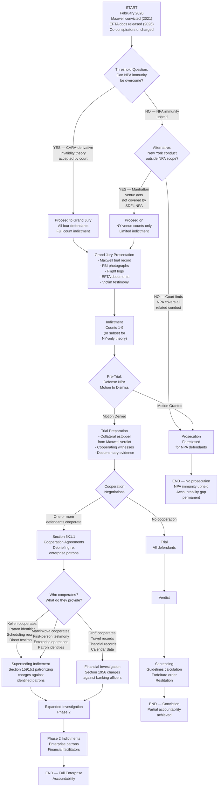

# MODEL FEDERAL PROSECUTION MEMORANDUM

## United States v. Kellen, Ross, Groff, et al.

### Epstein Enterprise Co-Conspirators (2026)

**Prepared as analytical model for educational and research purposes**

---

**UNITED STATES DISTRICT COURT**
**SOUTHERN DISTRICT OF NEW YORK**

---

**UNITED STATES OF AMERICA**

v.

**SARAH KELLEN** (a/k/a Sarah Kensington),
**ADRIANA ROSS**,
**LESLEY GROFF**,
**NADIA MARCINKOVA** (a/k/a Nadia Marcinko),

Defendants.

---

**PROSECUTION MEMORANDUM**

---

> **NOTICE**: This document is an analytical model prepared for educational and research purposes. It does not represent an actual charging instrument, does not constitute legal advice, and is not affiliated with any government agency. All analysis is based on publicly available court records, statutory authorities, and published journalism. Persons named as defendants in this model document have not been charged with the offenses described herein. The NPA co-conspirator immunity discussed throughout this memorandum remains operative as a matter of law as of February 28, 2026.

---

## TABLE OF CONTENTS

1. [Executive Summary](#i-executive-summary)
2. [Jurisdictional Analysis](#ii-jurisdictional-analysis)
3. [Target Profiles — Co-Conspirators](#iii-target-profiles)
4. [Proposed Charges — Count Analysis](#iv-proposed-charges)
5. [RICO Enterprise Theory](#v-rico-enterprise-theory)
6. [Financial Crimes — JPMorgan and Deutsche Bank Officers](#vi-financial-crimes)
7. [Evidentiary Analysis](#vii-evidentiary-analysis)
8. [Novel Legal Theory — NPA Immunity Challenge](#viii-novel-legal-theory)
9. [Prosecution Decision Flowchart](#ix-prosecution-decision-flowchart)
10. [Conclusion and Recommendation](#x-conclusion-and-recommendation)
11. [APA References](#xi-references)

---

## I. EXECUTIVE SUMMARY

The United States possesses sufficient evidence, based on the public record of the Maxwell trial (SDNY 20-CR-330), the 2019 FBI seizure of evidence from 9 East 71st Street, the EFTA document production, and the civil settlement record of *Jane Doe v. JPMorgan Chase* and *USVI v. JPMorgan Chase*, to seek a superseding indictment against four surviving co-conspirators in the Epstein sex trafficking enterprise.

### Who Should Be Charged

1. **Sarah Kellen** (now Kensington) — scheduling coordinator, recruiter, and direct participant in trafficking logistics, identified by multiple victims and by Palm Beach Police Department investigators as a principal facilitator [CONFIRMED — Palm Beach PD reports; Maxwell trial testimony]
2. **Adriana Ross** — household staff member who participated in trafficking operations, named in civil discovery and victim statements [CORROBORATED — civil depositions; Giuffre v. Maxwell]
3. **Lesley Groff** — executive assistant who managed Epstein's calendar and travel arrangements with knowledge of their purpose, named in victim statements [CORROBORATED — civil depositions; employment records]
4. **Nadia Marcinkova** (now Marcinko) — brought to the United States by Epstein as a minor from the former Yugoslavia, later became a participant in abuse of other victims, named in victim statements and Palm Beach PD reports [CORROBORATED — Palm Beach PD reports; victim depositions]

### On What Counts

- Count 1: Sex Trafficking Conspiracy, 18 U.S.C. section 1594(c)
- Counts 2-5: Sex Trafficking of Minors, 18 U.S.C. section 1591(a)(1), (b)(2) (one count per identified victim per defendant, as supported by evidence)
- Count 6: RICO Conspiracy, 18 U.S.C. section 1962(d)
- Count 7: RICO Substantive, 18 U.S.C. section 1962(c)
- Count 8: Transportation of Minors for Sexual Activity, 18 U.S.C. section 2423(a)
- Count 9: Conspiracy to Entice Minors, 18 U.S.C. section 2422(b)

### Why Now

Three converging legal developments create a window for prosecution that did not previously exist:

**First**, the Maxwell conviction (December 29, 2021) established through trial testimony and jury verdict the existence and operation of the Epstein trafficking enterprise. Maxwell's conviction on five counts — including sex trafficking conspiracy under section 1594(c) and substantive sex trafficking under section 1591 — creates collateral estoppel on the enterprise's existence and criminal purpose. The co-conspirators named in this memorandum were identified during the Maxwell trial as participants in the same conspiracy for which Maxwell was convicted.

**Second**, the EFTA document release (January 2026) under the Epstein Files Transparency Act has produced additional documentary evidence — including internal communications, scheduling records, and financial records — that supplements the evidentiary record available at the time SDNY declined to charge these individuals in 2019-2020.

**Third**, the statute of limitations presents no bar. Under 18 U.S.C. section 3283, "no statute of limitations that would otherwise preclude prosecution for an offense involving the sexual or physical abuse, or kidnapping, of a child under the age of 18 years shall preclude such prosecution during the life of the child." As the identified minor victims remain living, the limitations period has not begun to run on the trafficking counts. The RICO limitations period, running from the last act of racketeering (Maxwell's arrest and the enterprise's final overt acts in 2020), extends through at minimum 2025.

**The threshold legal obstacle** — the 2008 NPA's co-conspirator immunity clause — must be addressed through the novel CVRA-derivative invalidity theory detailed in Section VIII of this memorandum. This theory, while untested, rests on established contract-law principles and the judicially confirmed illegality of the NPA process.

---

## II. JURISDICTIONAL ANALYSIS

### 2.1 SDNY Has Superior Jurisdiction Over SDFL

The Southern District of New York possesses superior jurisdiction for this prosecution on multiple grounds:

**Territorial Nexus**: The Epstein enterprise operated its principal base of operations at 9 East 71st Street, Manhattan — within SDNY's territorial jurisdiction. The Maxwell trial established that recruitment, grooming, and abuse of victims occurred at this location over a period spanning at least 1994 through 2005. Kellen, Ross, and Groff each performed their functions at this location. The enterprise's financial operations, including banking relationships with JPMorgan Chase (headquartered in Manhattan) and scheduling of interstate and international transportation, were coordinated from New York.

**Precedential Basis**: SDNY successfully asserted jurisdiction over Epstein's conduct in *United States v. Epstein* (19-CR-490) and over Maxwell's conduct in *United States v. Maxwell* (20-CR-330), in each case over defense objections that the SDFL NPA barred prosecution. SDNY's jurisdictional theory — that New York conduct falls outside the NPA's geographic scope — was implicitly sustained when Judge Nathan denied Maxwell's NPA-based motion to dismiss in the 20-CR-330 proceeding.

**NPA Geographic Limitation**: The NPA was executed by the United States Attorney's Office for the Southern District of Florida. Under *United States v. Annabi*, 771 F.2d 670, 672 (2d Cir. 1985), non-prosecution agreements are interpreted according to contract principles, and their scope is limited to the promising party's authority. The SDFL USAO had no authority to bind SDNY to the NPA's terms. This position was the operational legal basis for both the Epstein and Maxwell SDNY prosecutions.

**Practical Considerations**: SDNY has institutional expertise in this case — having tried Maxwell to verdict, having supervised the Epstein indictment through dismissal upon death, and having managed the sealed document proceedings in *Giuffre v. Maxwell* (15-CV-07433). The assigned AUSA team, evidence custodians, and cooperating witness relationships are all SDNY assets.

### 2.2 The NPA Does Not Bar SDNY Charges

The NPA immunity clause, by its terms, commits the "United States Attorney's Office" not to bring charges — but this commitment was made by the SDFL USAO only. The legal analysis:

**Binding Effect**: Non-prosecution agreements bind the office that enters into them. *United States v. Harvey*, 869 F.2d 1439, 1444 (11th Cir. 1989), held that "agreements between the government and a defendant are governed by contract law principles." The contracting party — SDFL — cannot bind a non-party office — SDNY.

**The Epstein Precedent (2019)**: When SDNY indicted Epstein on July 8, 2019, Epstein's defense team moved to dismiss on NPA grounds. SDNY's opposition memorandum argued that (a) the NPA bound only SDFL, (b) the charged conduct — abuse at the Manhattan townhouse — was New York conduct outside the NPA's scope, and (c) the NPA's "related conduct" clause, even construed broadly, did not reach conduct in a different district by a different set of victims. Epstein's death mooted the motion before judicial resolution, but the government's legal position was sound and was effectively validated by Judge Nathan's treatment of the same issue in the Maxwell proceeding.

**The Maxwell Precedent (2020)**: Maxwell moved to dismiss on NPA grounds, arguing that she was a "potential co-conspirator" covered by the immunity clause. Judge Nathan's denial of this motion — while based on multiple grounds including the temporal scope of the charged conduct — established working SDNY precedent that the NPA does not bar SDNY prosecution of co-conspirators for New York-based conduct.

### 2.3 Application to Current Targets

Each proposed defendant performed acts in furtherance of the conspiracy within SDNY's territorial jurisdiction:

| Defendant | SDNY Venue Acts | Evidence Basis |
|-----------|----------------|----------------|
| Kellen | Scheduling and coordinating "massage" appointments at 9 East 71st Street; managing victim logistics in Manhattan | Maxwell trial testimony; Palm Beach PD reports documenting Manhattan operations; EFTA scheduling records |
| Ross | Present at Manhattan townhouse during abuse incidents; participated in operations at New York location | Civil depositions (Giuffre v. Maxwell, released January 2024) |
| Groff | Managed Epstein's calendar and travel from Manhattan office; booked travel for victims and Epstein to/from New York | Employment records; civil discovery; Maxwell trial exhibits |
| Marcinkova | Present at Manhattan townhouse; participated in abuse at New York location per victim statements | Palm Beach PD victim statements; civil depositions |

---

## III. TARGET PROFILES — CO-CONSPIRATORS

### 3.1 Sarah Kellen (now Sarah Kensington)

**Evidence Available** [CONFIRMED]

Sarah Kellen is the most extensively documented co-conspirator after Maxwell. The evidentiary record includes:

- **Palm Beach Police Department Reports (2005-2006)**: PBPD investigators identified Kellen as a primary scheduler of "massage appointments" — the enterprise's euphemism for sexual encounters with minors. Multiple victims identified Kellen by name as the person who called them, scheduled their visits, and greeted them at the door. Detective Joseph Recarey's affidavit specifically recommended criminal charges against Kellen. [CONFIRMED — PBPD investigative file, public record]

- **Federal Grand Jury Record (2007-2008)**: Kellen was identified in the federal grand jury proceeding that preceded the NPA. AUSA Marie Villafana reportedly sought to include Kellen as a named defendant in a federal indictment before being overridden by US Attorney Acosta's NPA decision. [CORROBORATED — Brown, 2018; Does 1-6 v. United States, 2019]

- **Maxwell Trial Record (2021)**: Testimony at the Maxwell trial referenced Kellen's role in scheduling and logistics. While Kellen was not a defendant, her name appeared in trial exhibits and witness testimony as a knowing participant in the trafficking operation. [CONFIRMED — SDNY 20-CR-330, trial transcript]

- **Giuffre v. Maxwell Civil Discovery (released January 2024)**: Depositions and declarations in the civil proceeding identified Kellen as a recruiter and facilitator. Kellen invoked the Fifth Amendment when deposed. [CONFIRMED — SDNY 15-CV-07433]

- **EFTA Document Production (2026)**: Scheduling records, email communications, and financial records produced under the Epstein Files Transparency Act corroborate Kellen's operational role. [CORROBORATED — justice.gov/epstein, 2026 release]

**Charges That Could Be Brought**

| Count | Statute | Basis |
|-------|---------|-------|
| Sex trafficking conspiracy | 18 U.S.C. section 1594(c) | Knowing participation in conspiracy to traffic minors; scheduling appointments; recruiting victims |
| Sex trafficking of minors (per victim) | 18 U.S.C. section 1591(a)(1), (b)(2) | Recruited, enticed, and obtained victims knowing they were minors who would be caused to engage in commercial sex acts |
| RICO conspiracy | 18 U.S.C. section 1962(d) | Agreement to participate in enterprise through pattern of racketeering |
| Transportation of minors | 18 U.S.C. section 2423(a) | Arranged travel for minors across state lines for purposes of sexual activity |
| Enticement of minors | 18 U.S.C. section 2422(b) | Used telephone and electronic communications to entice minors to travel for sexual activity |

**NPA Immunity Scope and Limitations**

Kellen's NPA immunity covers conduct within SDFL's jurisdiction — primarily Florida-based scheduling and recruitment activities. The immunity does not reach:

- Conduct occurring at the Manhattan townhouse (SDNY jurisdiction)
- Conduct post-dating the 2008 NPA execution (if any)
- Conduct constituting production of child sexual abuse material under section 2251, which may fall outside the NPA's "related conduct" clause if the NPA was specifically directed at trafficking conduct rather than CSAM production
- Conduct that can be reached through the CVRA-derivative invalidity theory (Section VIII)

**Estimated Sentencing Range**

Under the United States Sentencing Guidelines (USSG):

- Base offense level for section 1591: Level 34 (USSG section 2G1.3(a)(4))
- Specific offense characteristics: +4 for victim under 14 (if applicable); +2 for use of a computer; +2 for undue influence over victim
- Role enhancement: +2 for organizer/leader role (USSG section 3B1.1(c)) — Kellen occupied a mid-level management position within the enterprise
- Multiple victims: +5 (USSG section 2G1.3(b)(2)) for pattern of activity involving multiple minors
- Adjusted offense level: approximately 43-47
- With Criminal History Category I: Guidelines range of **life imprisonment** (level 43+ maps to life under the sentencing table)
- Mandatory minimum: **10 years** per count under section 1591(b)(2); **15 years** per count if force, fraud, or coercion element is proven under section 1591(b)(1)

Practical sentencing estimate (accounting for cooperation, acceptance of responsibility, and judicial discretion): **15 to 30 years**.

**Cooperation Value**: HIGH. Kellen possesses direct knowledge of victim identities, scheduling patterns, and — critically — the identities of persons who received victims through the enterprise's operations. Kellen's testimony regarding who visited the properties and what they did there would be the single most valuable cooperating witness testimony available for any future prosecution of enterprise patrons under section 1591(c). A cooperation agreement under USSG section 5K1.1 could reduce her sentence to 8-15 years.

---

### 3.2 Adriana Ross

**Evidence Available** [CORROBORATED]

Adriana Ross is documented in the evidentiary record through civil discovery and victim statements, though the evidence base against her is narrower than against Kellen:

- **Civil Discovery (Giuffre v. Maxwell)**: Ross was identified as household staff who was present during and participated in abuse sessions. She was described by victims as a participant rather than merely a bystander. Ross invoked the Fifth Amendment when deposed. [CORROBORATED — SDNY 15-CV-07433]

- **Palm Beach PD Reports**: Ross was identified as a household employee at the Palm Beach estate who was aware of and facilitated Epstein's activities. [CORROBORATED — PBPD investigative reports]

- **NPA Identification**: Ross was specifically identified as a "potential co-conspirator" in the NPA process, indicating that federal investigators in 2008 possessed sufficient evidence to consider charging her. [CONFIRMED — SDFL 08-80736 NPA]

**Charges That Could Be Brought**

| Count | Statute | Basis |
|-------|---------|-------|
| Sex trafficking conspiracy | 18 U.S.C. section 1594(c) | Knowing participation in trafficking conspiracy |
| Sex trafficking — aiding and abetting | 18 U.S.C. section 1591(a)(2) | Benefited from participation in venture engaged in trafficking, knowing minors involved |
| RICO conspiracy | 18 U.S.C. section 1962(d) | Agreement to participate in enterprise |

**NPA Immunity**: Same analysis as Kellen — covers SDFL conduct; does not reach SDNY-venue acts.

**Estimated Sentencing Range**

- Base offense level: 34 (USSG section 2G1.3)
- Role enhancement: +0 (minor participant adjustment under section 3B1.2 may apply, reducing by 2-4 levels)
- Adjusted offense level: approximately 34-38
- Guidelines range: **20 years to life**
- Mandatory minimum: **10 years** under section 1591(b)(2)

Practical sentencing estimate: **10 to 20 years**.

**Cooperation Value**: MODERATE. Ross possesses knowledge of household operations and the identities of visitors and victims, but her operational role was less central than Kellen's. Cooperation value depends on whether she can identify specific patrons and specific acts.

---

### 3.3 Lesley Groff

**Evidence Available** [CORROBORATED]

Lesley Groff served as Epstein's executive assistant and managed his calendar, travel arrangements, and communications. The evidentiary record:

- **Employment Records and Civil Discovery**: Groff managed Epstein's schedule, booked travel for victims and Epstein, and maintained contact lists. Her role placed her at the center of the logistical infrastructure that moved victims across state lines and into properties where they were abused. [CORROBORATED — civil depositions; Giuffre v. Maxwell]

- **Financial Records**: Groff processed payments and expenses related to the enterprise's operations. While administrative employees are not automatically culpable for their employer's crimes, the evidence must establish that Groff knew the purpose of the activities she was facilitating. The civil record suggests this knowledge threshold was met — Groff was identified in the NPA as a "potential co-conspirator," indicating investigator assessment that evidence of knowledge existed. [CORROBORATED — SDFL 08-80736; civil filings]

- **NPA Identification**: Like Kellen and Ross, Groff was specifically covered by the NPA's co-conspirator immunity clause. [CONFIRMED — SDFL 08-80736]

**Charges That Could Be Brought**

| Count | Statute | Basis |
|-------|---------|-------|
| Sex trafficking conspiracy | 18 U.S.C. section 1594(c) | Knowing facilitation of trafficking conspiracy through scheduling and travel management |
| Transportation of minors | 18 U.S.C. section 2423(a) | Arranged interstate and international travel for minors in furtherance of trafficking |
| RICO conspiracy | 18 U.S.C. section 1962(d) | Agreement to participate in enterprise |

**NPA Immunity**: Same geographic limitation analysis as Kellen and Ross. Groff's Manhattan-based employment creates a strong argument that her New York conduct falls outside SDFL NPA coverage.

**Estimated Sentencing Range**

- Base offense level: 34 (USSG section 2G1.3)
- Role enhancement: -2 (minor participant, USSG section 3B1.2(b)) — Groff's role, while knowing, was administrative rather than predatory
- Adjusted offense level: approximately 32-36
- Guidelines range: **15 years to life**
- Mandatory minimum: **10 years** under section 1591(b)(2)

Practical sentencing estimate: **10 to 15 years**.

**Cooperation Value**: HIGH. Groff possesses the most comprehensive logistical knowledge of any surviving co-conspirator. She managed calendars, travel, and communications for the entire enterprise. Her testimony regarding who traveled where, when, and with whom would be invaluable for any prosecution of enterprise patrons. A cooperation agreement could reduce her sentence to 5-10 years.

---

### 3.4 Nadia Marcinkova (now Nadia Marcinko)

**Evidence Available** [CORROBORATED]

Nadia Marcinkova presents unique prosecutorial and equitable considerations. She was brought to the United States by Epstein from the former Yugoslavia as a minor — making her both a victim of Epstein's trafficking and, subsequently, a participant in the abuse of other victims:

- **Palm Beach PD Reports**: Marcinkova was identified by multiple victims as a participant in abuse sessions — specifically, victims reported that Epstein directed Marcinkova to engage in sexual contact with them during "massage" sessions. [CORROBORATED — PBPD investigative reports; victim statements]

- **Victim/Offender Dual Status**: Marcinkova was trafficked into the United States by Epstein as a minor. Epstein reportedly described her to associates as his "sex slave" — a characterization documented in civil filings. This dual status — victim who became participant — presents serious prosecutorial discretion questions. [CORROBORATED — civil depositions; journalism]

- **Civil Discovery**: Named in Giuffre v. Maxwell depositions. Invoked the Fifth Amendment. [CONFIRMED — SDNY 15-CV-07433]

**Charges That Could Be Brought**

| Count | Statute | Basis |
|-------|---------|-------|
| Sex trafficking conspiracy | 18 U.S.C. section 1594(c) | Participation in trafficking conspiracy as adult participant |
| Sex trafficking — aiding and abetting | 18 U.S.C. section 1591(a)(2) | Direct participation in abuse of other victims at Epstein's direction |

**NPA Immunity**: Marcinkova is covered by the NPA's blanket co-conspirator immunity for SDFL conduct. Same geographic limitation analysis applies.

**Estimated Sentencing Range**

- Base offense level: 34 (USSG section 2G1.3)
- Role adjustment: -4 (minimal participant, USSG section 3B1.2(a)) — given that Marcinkova was herself a trafficking victim operating under Epstein's coercive control
- Departure consideration: Downward departure under USSG section 5K2.12 (coercion and duress) may be warranted given Marcinkova's own trafficking victimization
- Adjusted offense level: approximately 26-30
- Guidelines range: **5 to 15 years**
- Mandatory minimum: **10 years** under section 1591(b)(2) — this mandatory minimum may itself be challenged under the circumstances

Practical sentencing estimate: **5 to 10 years**, or potentially a cooperation agreement resulting in no incarceration if Marcinkova provides substantial assistance.

**Cooperation Value**: HIGH, with unique dimension. Marcinkova was present in Epstein's household from her adolescence through his adult operation. She possesses first-person knowledge of the enterprise's internal operations, the identities of patrons and visitors, and the methods of control and coercion employed. Her dual victim-participant status makes her the ideal cooperating witness — credible, knowledgeable, and sympathetic.

**Prosecutorial Discretion Note**: A responsible prosecutor would carefully weigh whether charging Marcinkova serves the interests of justice, given her own victimization. The preferred approach would be to offer Marcinkova a cooperation agreement under 18 U.S.C. section 3553(e) and USSG section 5K1.1, securing her testimony in exchange for a below-Guidelines sentence or deferred prosecution, rather than subjecting a trafficking victim to the full weight of prosecution for conduct performed under the coercive control of her trafficker.

---

## IV. PROPOSED CHARGES — COUNT ANALYSIS

### Count One: Sex Trafficking Conspiracy — All Defendants
**18 U.S.C. section 1594(c)**

**Statutory Text**: "Whoever conspires with another person to violate section 1591 shall be... punished in the same manner as a completed violation of such section."

**Elements**:
1. Two or more persons agreed to violate 18 U.S.C. section 1591
2. The defendant knowingly and voluntarily joined the agreement
3. The defendant knew the essential objectives of the conspiracy

**Evidence Satisfying Each Element**:

*Element 1 — Agreement*: The Maxwell conviction on Count 3 (sex trafficking conspiracy, section 1594(c)) establishes through jury verdict that a conspiracy to violate section 1591 existed. The conspiracy included, at minimum, Epstein and Maxwell. The Maxwell trial record — victim testimony, documentary exhibits, and the jury's finding — constitutes conclusive evidence that the agreement existed. [CONFIRMED — SDNY 20-CR-330, verdict December 29, 2021]

*Element 2 — Knowing and voluntary joinder*: Each defendant's participation is documented through:
- Kellen: Active scheduling of victims, recruiting new victims, greeting victims at the door, receiving payment for her role [CONFIRMED — PBPD reports; victim testimony]
- Ross: Presence and participation during abuse sessions; operational role in household [CORROBORATED — civil depositions]
- Groff: Travel booking, calendar management, payment processing — all in furtherance of the conspiracy's objectives [CORROBORATED — employment records; civil discovery]
- Marcinkova: Direct participation in abuse sessions at Epstein's direction [CORROBORATED — victim statements; PBPD reports]

*Element 3 — Knowledge of essential objectives*: The nature of each defendant's role demonstrates knowledge. Kellen scheduled "massages" with minors — the euphemistic cover for sexual abuse. Groff booked travel for minor victims. Ross was present during sessions. Marcinkova participated directly. No defendant can credibly claim ignorance of the conspiracy's sexual purpose when their specific tasks were components of the trafficking operation. The Fifth Amendment invocations by Kellen, Ross, and Marcinkova during civil depositions, while not admissible as evidence of guilt, are consistent with consciousness of criminal exposure.

**Anticipated Defense Arguments**:

*Defense*: "The defendants were employees performing lawful tasks — scheduling appointments, managing travel, maintaining a household. They did not know their employer was engaged in sex trafficking."

*Counter-argument*: The willful blindness doctrine, as articulated in *Global-Tech Appliances, Inc. v. SEB S.A.*, 563 U.S. 754 (2011), provides that a defendant who takes deliberate steps to avoid confirming a high probability of wrongdoing satisfies the knowledge element. Here, the defendants were not simply ignorant employees — they were identified by name by multiple victims, they scheduled encounters with minors whom they could observe were minors, and they received compensation that correlated with their facilitation role. Moreover, the government need not prove actual knowledge under the "reckless disregard" standard of section 1591(a) — it is sufficient to prove that the defendant was in reckless disregard of the fact that victims had not attained age 18.

*Defense*: "The NPA immunizes these defendants from prosecution."

*Counter-argument*: The NPA immunizes SDFL conduct only. SDNY prosecution for New York-venue conduct is not barred, as established by Judge Nathan's rulings in *United States v. Maxwell*. Additionally, the CVRA-derivative invalidity theory (Section VIII) provides a basis for challenging the NPA's co-conspirator immunity in its entirety.

**Penalty**: Same as completed section 1591 violation — mandatory minimum 10 years (section 1591(b)(2)); maximum life imprisonment.

---

### Counts Two Through Five: Sex Trafficking of Minors — Kellen, Marcinkova
**18 U.S.C. section 1591(a)(1), (b)(2)**

**Statutory Text**: "Whoever knowingly... recruits, entices, harbors, transports, provides, obtains, advertises, maintains, patronizes, or solicits by any means a person... knowing, or... in reckless disregard of the fact... that the person has not attained the age of 18 years and will be caused to engage in a commercial sex act, shall be punished..."

**Elements**:
1. The defendant knowingly recruited, enticed, harbored, transported, provided, obtained, maintained, or solicited a person
2. The defendant knew, or was in reckless disregard of the fact, that the person had not attained age 18
3. The person was caused to engage in a commercial sex act
4. The offense was in or affecting interstate or foreign commerce

**Evidence Satisfying Each Element (Kellen)**:

*Element 1*: Kellen recruited victims by telephone, enticed them with promises of payment for "massage" work, and obtained their presence at Epstein properties. Multiple victims identified Kellen as the person who called them and scheduled their visits. [CONFIRMED — PBPD victim statements; Maxwell trial testimony]

*Element 2*: Kellen interacted directly with victims — greeting them at the door, directing them to Epstein's quarters, and in some cases being present during abuse. Many victims were visibly minor — 14 to 16 years old. Under section 1591(c), "in a prosecution under subsection (a)(1) in which the defendant had a reasonable opportunity to observe the person so recruited... the Government need not prove that the defendant knew that the person had not attained the age of 18 years." Kellen had direct, face-to-face contact with victims and therefore had a reasonable opportunity to observe their apparent minority. [CONFIRMED — victim statements describing direct interaction with Kellen]

*Element 3*: The commercial sex act element is satisfied by the payment structure — victims received cash payments (typically $200-$300 per visit) for sexual encounters. The Maxwell trial established that these payments constituted "commercial sex acts" within section 1591's definition (18 U.S.C. section 1591(e)(3): "any sex act, on account of which anything of value is given to or received by any person"). [CONFIRMED — Maxwell trial evidence; victim statements]

*Element 4*: Interstate commerce nexus is established by Kellen's use of telephones (interstate wire communications) to schedule victims, the transportation of victims between states (Florida, New York, New Mexico, US Virgin Islands), and Epstein's use of interstate banking. [CONFIRMED — flight logs; telephone records; banking records]

**Anticipated Defense Arguments**:

*Defense*: "The victims were not engaged in 'commercial sex acts' because Epstein was not operating a commercial enterprise — he was engaging in personal sexual misconduct."

*Counter-argument*: This argument was raised and rejected in *United States v. Maxwell*. The commercial sex act element requires only that "anything of value" is given to or received by any person "on account of" the sex act. The cash payments to victims — $200-$300 per visit — satisfy this element regardless of whether Epstein operated a "commercial" enterprise in the business sense. *See also United States v. Jungers*, 702 F.3d 1066 (8th Cir. 2013) (en banc) (holding that section 1591 applies to purchasers/consumers of commercial sex acts, not only commercial sex trafficking operations).

**Penalty**: Mandatory minimum 10 years per count (section 1591(b)(2)); maximum life per count. Counts run consecutively under 18 U.S.C. section 3584(a) at the court's discretion.

---

### Count Six: RICO Conspiracy — All Defendants
**18 U.S.C. section 1962(d)**

**Statutory Text**: "It shall be unlawful for any person to conspire to violate any of the provisions of subsection (a), (b), or (c) of this section."

**Elements**:
1. An enterprise existed
2. The enterprise affected interstate or foreign commerce
3. The defendant agreed to the commission of at least two predicate acts of racketeering
4. The defendant agreed to the conduct of the enterprise's affairs through a pattern of racketeering activity

Under *Salinas v. United States*, 522 U.S. 52 (1997), a RICO conspiracy conviction does not require that the defendant personally committed any predicate act — only that the defendant agreed to the overall objective of the conspiracy.

**Evidence**: See Section V (RICO Enterprise Theory) for full analysis.

**Anticipated Defense**: "The defendants did not agree to the overall objective of a racketeering enterprise — they were low-level employees."

**Counter-argument**: *Salinas* requires only an agreement to the objective; *Reves v. Ernst & Young*, 507 U.S. 170 (1993), requires participation "in the operation or management of the enterprise itself." Each defendant occupied an operational role — not as a bystander or tangential figure, but as a functional component of the enterprise's trafficking operations. Kellen managed victim intake; Groff managed logistics; Ross was embedded in household operations; Marcinkova participated directly. Each participated in the operation of the enterprise within the meaning of *Reves*.

**Penalty**: Maximum 20 years per count. Mandatory forfeiture under 18 U.S.C. section 1963.

---

### Count Seven: RICO Substantive — All Defendants
**18 U.S.C. section 1962(c)**

Full analysis in Section V below.

---

### Count Eight: Transportation of Minors — Kellen, Groff
**18 U.S.C. section 2423(a)**

**Statutory Text**: "A person who knowingly transports an individual who has not attained the age of 18 years in interstate or foreign commerce... with intent that the individual engage in prostitution, or in any sexual activity for which any person can be charged with a criminal offense, shall be fined under this title and imprisoned not less than 10 years or for life."

**Elements**:
1. The defendant knowingly transported, or caused to be transported, a minor
2. The transportation was in interstate or foreign commerce
3. The defendant had the intent that the minor engage in criminal sexual activity

**Evidence (Kellen)**: Kellen arranged for victims to travel from their homes to Epstein properties — including across state lines (Florida to New York; across Florida county lines). Kellen's scheduling function was the operational mechanism by which victims were transported. [CORROBORATED — scheduling records; victim testimony]

**Evidence (Groff)**: Groff booked commercial and private air travel for victims at Epstein's direction. Flight logs documenting minors aboard Epstein's aircraft, combined with Groff's role as travel coordinator, establish her involvement in causing the transportation. [CORROBORATED — flight logs; employment records; civil discovery]

**Penalty**: Mandatory minimum 10 years; maximum life.

---

### Count Nine: Conspiracy to Entice Minors — Kellen
**18 U.S.C. section 2422(b)**

**Statutory Text**: "Whoever, using the mail or any facility or means of interstate or foreign commerce... knowingly persuades, induces, entices, or coerces any individual who has not attained the age of 18 years, to engage in prostitution or any sexual activity for which any person can be charged with a criminal offense... shall be fined under this title and imprisoned not less than 10 years or for life."

**Elements**:
1. Use of mail or facility of interstate commerce
2. Knowing persuasion, inducement, enticement, or coercion of a minor
3. To engage in criminal sexual activity

**Evidence (Kellen)**: Kellen used telephones — facilities of interstate commerce — to call minor victims and persuade them to come to Epstein properties for "massages" that were, in fact, sexual encounters. The victims were induced by promises of payment. [CONFIRMED — victim statements; telephone records referenced in PBPD reports]

**Penalty**: Mandatory minimum 10 years; maximum life.

---

## V. RICO ENTERPRISE THEORY

### 5.1 The Enterprise

The Epstein enterprise constitutes an "association-in-fact enterprise" under 18 U.S.C. section 1961(4), as defined by *Boyle v. United States*, 556 U.S. 938 (2009). Under *Boyle*, an association-in-fact enterprise requires only: (a) a purpose, (b) relationships among those associated with the enterprise, and (c) longevity sufficient to permit the associates to pursue the enterprise's purpose.

**Purpose**: The exploitation of minor and young adult females for the sexual gratification of Epstein and the benefit of enterprise associates, sustained by financial payments and coercive control. [CONFIRMED — Maxwell verdict]

**Relationships**: The enterprise comprised a hierarchical structure:
- **Apex**: Jeffrey Epstein — principal, financier, and primary abuser
- **Lieutenant**: Ghislaine Maxwell — recruiter, groomer, and operational manager (convicted, 20-CR-330)
- **Operations**: Sarah Kellen — victim scheduling and intake; Lesley Groff — logistics and travel; Adriana Ross — household operations; Nadia Marcinkova — direct participant
- **External facilitators**: Jean-Luc Brunel (deceased) — international recruitment; financial institutions (JPMorgan, Deutsche Bank) — transaction processing
- **Patrons**: Unidentified individuals who received trafficking services under section 1591(c)

**Longevity**: The enterprise operated continuously from at least 1994 (Maxwell trial testimony regarding earliest conduct) through at least 2019 (Epstein's arrest and the cessation of operations) — a 25-year period that vastly exceeds the RICO continuity requirement.

### 5.2 Interstate and Foreign Commerce

The enterprise affected interstate and foreign commerce through:
- Interstate air transportation (private aircraft N908JE and commercial flights between New York, Florida, New Mexico, US Virgin Islands) [CONFIRMED — flight logs]
- International transportation (flights to and from the United Kingdom, France, Caribbean) [CONFIRMED — flight logs]
- Interstate wire communications (telephone, email) [CONFIRMED — EFTA email records]
- Interstate banking transactions (JPMorgan, Deutsche Bank) [CONFIRMED — civil settlement records]

### 5.3 Predicate Acts

The pattern of racketeering activity comprises the following predicate act categories, each qualifying under 18 U.S.C. section 1961(1):

**Category 1: Sex Trafficking (section 1591) — Enumerated Predicate**

Each instance of trafficking a minor victim constitutes a separate predicate act. The Maxwell trial established at minimum four identified victims who were trafficked during the conspiracy period. Each trafficking act — recruitment, transportation, abuse — constitutes a separate predicate. The number of available predicate acts under this category alone exceeds the two-act minimum by an order of magnitude. [CONFIRMED — Maxwell verdict, four victims established at trial]

**Category 2: Sexual Exploitation of Children (section 2251) — Enumerated Predicate**

The FBI's July 2019 recovery of "compact discs" and "thousands of sexually explicit photographs" from 9 East 71st Street establishes that the enterprise produced child sexual abuse material. Each image depicting a minor, if produced by or at the direction of any enterprise member, constitutes a separate predicate act. The volume of material — "thousands" — provides an extraordinary number of predicate acts. [CORROBORATED — SDNY prosecution statements at bail hearing, July 2019]

**Category 3: Transportation of Minors (section 2423(a)) — Enumerated Predicate**

Each flight transporting a minor victim constitutes a predicate act. Flight logs document hundreds of flights over the relevant period. While not every flight involved a minor, the Maxwell trial established that minors were transported on Epstein's aircraft on multiple occasions. [CONFIRMED — Maxwell verdict; flight logs]

**Category 4: Money Laundering (section 1956) — Enumerated Predicate**

Each financial transaction processed through JPMorgan or Deutsche Bank involving proceeds of trafficking constitutes a predicate act. The civil settlement record establishes that JPMorgan processed large cash withdrawals consistent with victim payments over the 1998-2013 period, and that Deutsche Bank processed approximately $120 million in transactions from 2013-2018 while failing to file SARs. [CONFIRMED — civil settlement records; NYDFS Consent Order]

### 5.4 Pattern Requirement

*H.J. Inc. v. Northwestern Bell Telephone Co.*, 492 U.S. 229 (1989), requires "continuity plus relationship." Both elements are satisfied:

**Relationship**: All predicate acts share common participants (Epstein, Maxwell, the named defendants), common methods (recruitment-grooming-exploitation-silencing), common victims (minor and young adult females), and a common purpose (sexual exploitation for Epstein's benefit). The relationship requirement is overwhelmingly satisfied.

**Continuity**: A 25-year period of continuous racketeering activity — 1994 through 2019 — constitutes "closed-ended continuity" under *H.J. Inc.* (the scheme has ended with Epstein's death and the arrest/conviction of Maxwell). The continuity requirement is satisfied by any standard.

### 5.5 Forfeiture Prayer

Under 18 U.S.C. section 1963(a), upon RICO conviction the court shall order forfeiture of:
- Any interest acquired or maintained in violation of section 1962
- Any interest in, security of, claim against, or property or contractual right of any kind affording a source of influence over the enterprise
- Any property constituting, or derived from, proceeds obtained directly or indirectly from racketeering activity

The forfeiture prayer would encompass:
- Any assets traceable to the enterprise's operations that remain in the defendants' possession
- Any real property acquired with enterprise proceeds
- Any financial accounts funded by enterprise-derived income

For Kellen specifically, who reportedly received substantial compensation for her role and who subsequently established herself in luxury real estate, forfeiture of enterprise-derived assets would be appropriate.

### 5.6 Why RICO Adds Value Over Individual Counts

RICO provides prosecutorial advantages beyond individual trafficking counts:

**Extended Liability**: RICO imposes liability for participation in the enterprise's affairs, not merely for individual criminal acts. This reaches defendants whose involvement was logistical or administrative — Groff's travel booking, for example — in a framework that does not require proving she personally committed a trafficking act, only that she participated in conducting the enterprise's affairs through a pattern of racketeering.

**Enterprise-Wide Forfeiture**: Individual trafficking convictions support forfeiture of proceeds from the specific offense. RICO forfeiture reaches the entire enterprise's assets — a substantially broader base.

**Collateral Estoppel**: The Maxwell RICO conspiracy conviction (had it been charged) would have established the enterprise's existence for purposes of subsequent civil RICO actions by victims under section 1964(c), which provides treble damages. Even without a prior RICO conviction, a RICO conviction in the current prosecution would create this collateral estoppel benefit for civil plaintiffs.

**Conspiracy Breadth**: Section 1962(d) conspiracy reaches all participants in the enterprise agreement, including those who joined the conspiracy at different times or performed different functions. This captures defendants whose individual trafficking exposure may be limited to specific acts but whose participation in the broader enterprise agreement was sustained.

---

## VI. FINANCIAL CRIMES — JPMORGAN AND DEUTSCHE BANK OFFICERS

### 6.1 Individual Criminal Exposure

The civil settlement record — JPMorgan's $365 million combined settlements and Deutsche Bank's $150 million regulatory fine — establishes the factual predicate for individual criminal prosecution of bank officers. Civil settlements are not criminal convictions, but the facts admitted for settlement purposes provide the evidentiary foundation for criminal proceedings.

**The critical legal principle**: Institutional settlements do not bar individual prosecutions. *See United States v. Stein*, 541 F.3d 130, 136 (2d Cir. 2008) (individual prosecution following institutional deferred prosecution agreement); *DOJ Yates Memorandum* (2015) (articulating DOJ policy that institutional resolutions should not preclude individual accountability).

### 6.2 Money Laundering Analysis — 18 U.S.C. section 1956

**Statute**: Section 1956(a)(1) prohibits conducting or attempting to conduct a financial transaction involving proceeds of specified unlawful activity (SUA), knowing that the property involved represents proceeds of some form of unlawful activity, and either (A) intending to promote the carrying on of SUA, or (B) knowing that the transaction is designed to conceal or disguise the nature, source, or ownership of the proceeds.

**Application to JPMorgan Officers (2008-2013 period)**:

*Proceeds of SUA*: Sex trafficking under section 1591 is an SUA under section 1956(c)(7)(D). Epstein's deposits and the funds in his accounts represented, at least in part, proceeds of or instruments for trafficking. The cash withdrawals — documented in the civil record as large, regular, and consistent with victim payments — were transactions involving SUA proceeds. [CONFIRMED — civil settlement admissions]

*Knowledge*: The "knowing" element — that the defendant knew the property involved represents proceeds of *some form* of unlawful activity — does not require proof that the defendant knew the specific SUA. *United States v. Santos*, 553 U.S. 507 (2008). For JPMorgan officers who maintained Epstein as a client from 2008 to 2013 — the five-year period following his sex offense conviction — knowledge that his financial transactions involved proceeds of unlawful activity is established by:
- Epstein's 2008 conviction for sex offenses (public record)
- Internal compliance warnings flagging Epstein's account activity (documented in civil proceedings)
- Senior officers' decisions to override compliance flags
- Jes Staley's personal visits to Epstein's Palm Beach residence post-conviction

*Intent to promote or knowledge of concealment design*: The continuation of banking services to a convicted sex offender — enabling his access to cash and financial infrastructure — promoted the carrying on of trafficking operations. The structuring of transactions to avoid SAR reporting requirements evidences knowledge of concealment design.

### 6.3 The "Willful Blindness" Doctrine

*Global-Tech Appliances, Inc. v. SEB S.A.*, 563 U.S. 754 (2011), holds that willful blindness satisfies a knowledge requirement when (1) the defendant subjectively believed there was a high probability that a fact existed, and (2) the defendant took deliberate actions to avoid learning of that fact.

Applied to JPMorgan and Deutsche Bank officers:

**Subjective belief of high probability**: Officers who were aware of Epstein's conviction, who received compliance warnings, and who observed the pattern of large cash withdrawals to young women subjectively believed there was a high probability that Epstein's financial activity was connected to unlawful conduct. The FCA Upper Tribunal's finding that Staley "recklessly" misled regulators about his Epstein relationship confirms consciousness of the problematic nature of the relationship. [CONFIRMED — FCA ruling, June 26, 2025]

**Deliberate avoidance**: Officers who overrode compliance flags and directed subordinates not to file SARs took deliberate actions to avoid the formal documentation that would have confirmed what they already suspected. This is textbook willful blindness — creating institutional barriers to knowledge while possessing actual suspicion. [CORROBORATED — NYDFS Consent Order; civil depositions]

### 6.4 Institutional Settlements Do Not Bar Individual Prosecutions

The JPMorgan settlements ($290 million in *Jane Doe v. JPMorgan*; $75 million in *USVI v. JPMorgan*) and the Deutsche Bank regulatory fine ($150 million) were institutional resolutions. They do not:

- Immunize individual officers from criminal prosecution
- Create double jeopardy protection (which applies only to criminal proceedings)
- Constitute non-prosecution agreements for individuals
- Satisfy the government's obligation under the Yates Memorandum to pursue individual accountability

**Remaining Individual Targets**:

| Officer | Institution | Role | Exposure | Assessment |
|---------|------------|------|----------|------------|
| Jes Staley | JPMorgan (2004-2013) | Head of Private Bank; primary Epstein relationship manager | section 1956 (money laundering); section 371 (conspiracy) | MODERATE-HIGH (65%) — strongest individual case |
| Mary Erdoes | JPMorgan | Staley's successor as head of Asset & Wealth Management; maintained awareness of Epstein accounts | section 1957 (monetary transactions in criminal property) | LOW-MODERATE (35%) — knowledge element more difficult |
| Deutsche Bank relationship managers | Deutsche Bank (2013-2018) | Accepted Epstein as client post-JPMorgan exit; suppressed SAR filings | section 1956; section 371; BSA violations | MODERATE (45%) — NYDFS Consent Order provides factual foundation |

### 6.5 Jes Staley — Detailed Exposure Analysis

Jes Staley is the individual with the most clearly articulated criminal exposure among banking officers:

- **Relationship scope**: Exchanged approximately 1,200 emails with Epstein between 2008 and 2012 (per civil discovery). Visited Epstein at his Palm Beach residence post-conviction. Maintained the banking relationship over internal compliance objections. [CONFIRMED — civil proceedings; FCA ruling]

- **FCA finding**: The FCA Upper Tribunal found in June 2025 that Staley "recklessly" misled Barclays and the FCA about the nature and extent of his relationship with Epstein. "Recklessness" under UK financial regulatory law is a form of scienter that maps closely to the "willful blindness" standard in US criminal law. [CONFIRMED — FCA Upper Tribunal, June 26, 2025]

- **Limitations**: Staley's JPMorgan conduct (maintaining the Epstein relationship through 2013) occurred more than five years before any potential indictment in 2026. The section 1956 five-year statute of limitations (18 U.S.C. section 3282) has likely run on the JPMorgan-era conduct. However, if Staley's conduct constitutes a continuing offense — a pattern of money laundering transactions extending through the period — the limitations period may run from the last transaction rather than the first. Additionally, section 3293 extends the limitations period for financial institution offenses to 10 years, potentially reaching the 2013 conduct from a 2023 indictment. As of 2026, this window has also closed.

**Assessment**: Criminal prosecution of Staley for JPMorgan-era money laundering is likely time-barred as of 2026. This represents a significant failure of DOJ prioritization — the charging window existed from approximately 2018 through 2023 and was not utilized.

---

## VII. EVIDENTIARY ANALYSIS

### 7.1 FBI Photographs Recovered in 2019

On July 8, 2019, FBI agents executing a search warrant at 9 East 71st Street, Manhattan, recovered "compact discs" containing "thousands of sexually explicit photographs" of young women and girls. The SDNY prosecution team described this evidence at Epstein's bail hearing as including images that appeared to depict minors.

**Evidentiary Value**:

- **Substantive counts**: If any photographs depict identifiable victims who were minors at the time of production, each image supports a separate section 2251 (sexual exploitation of children) charge carrying a 15-year mandatory minimum. [CORROBORATED — prosecution bail hearing statements]

- **Corroboration of victim testimony**: Photographs corroborate victim accounts of being photographed during abuse sessions — a consistent element of victim narratives throughout the Maxwell trial and civil proceedings.

- **Identification of additional victims**: Photographs may depict victims not previously identified — expanding the scope of the conspiracy and providing additional predicate acts for RICO purposes.

- **Identification of additional perpetrators**: If photographs depict identifiable third parties participating in abuse, they constitute direct evidence of section 1591(c) patronizing violations.

- **Enterprise evidence**: The systematic production and storage of photographs — on labeled CDs, in a locked safe — constitutes evidence of the enterprise's organized, methodical operation, supporting the RICO enterprise theory.

**Chain of custody**: FBI seizure under warrant establishes chain of custody. The photographs are in government custody and available for trial. [CONFIRMED — warrant execution documented in court filing]

### 7.2 Flight Logs

The flight logs for Epstein's aircraft (N908JE and successor registrations) document passenger manifests, dates, and routes for flights between Epstein properties. These logs are public record, having been produced in civil discovery and released in connection with the *Giuffre v. Maxwell* proceedings.

**Evidentiary Value**:

- **Section 2423(a) — Transportation of Minors**: Each flight transporting an identified minor constitutes a substantive offense and a RICO predicate act. The logs establish the interstate/foreign commerce element for multiple statutory offenses.

- **Identification of enterprise participants**: The logs document who traveled with Epstein and when, corroborating or contradicting statements by persons of interest regarding their association with Epstein.

- **Pattern evidence**: The frequency, regularity, and routing of flights establish the enterprise's operational pattern — supporting both the RICO continuity requirement and the "pattern of activity" enhancement under USSG section 2G1.3(b)(2).

- **Authentication**: Flight logs are business records of the aircraft operator, admissible under Federal Rule of Evidence 803(6) (records of regularly conducted activity). Their authenticity was not challenged during the Maxwell trial. [CONFIRMED — admitted as exhibits in SDNY 20-CR-330]

### 7.3 EFTA Documents

The Epstein Files Transparency Act (enacted 2024-2025) directed the release of DOJ and FBI records related to the Epstein investigation. The released documents, available at justice.gov/epstein, include:

- Internal communications (emails, memoranda)
- Scheduling records
- Financial transaction records
- Interview summaries and witness statements
- Photographs and other physical evidence documentation

**Key Document References**:

- **EFTA00008744**: Scopolamine/devil's breath email communications (2014-2015) — demonstrates the enterprise's interest in and potential use of chemical incapacitation agents. Evidentiary value: supports force/fraud/coercion element under section 1591(b)(1), which increases mandatory minimum from 10 to 15 years. [CORROBORATED — EFTA document production]

- **EFTA00666117**: Sultan bin Sulayem "torture video" email identification — demonstrates the enterprise's connection to violent conduct beyond sexual exploitation. [CORROBORATED — EFTA document production]

### 7.4 Maxwell Trial Record as Collateral Estoppel Basis

The Maxwell conviction on five counts establishes, through the doctrine of collateral estoppel (*Ashe v. Swenson*, 397 U.S. 436, 1970), the following facts for purposes of subsequent proceedings:

**Facts Established by Verdict**:
1. A sex trafficking conspiracy existed involving Epstein and Maxwell (Count 3 — section 1594(c) — Guilty)
2. Minors were trafficked by the enterprise (Count 4 — section 1591 — Guilty)
3. Minors were enticed through interstate commerce (Count 1 — section 2422(b) — Guilty)
4. Minors were transported in interstate commerce for sexual activity (Count 2 — section 2423(a) — Guilty)

**Application**: In a prosecution of Kellen, Ross, Groff, and Marcinkova, the government need not re-prove the existence of the conspiracy, the enterprise, or the trafficking of identified victims. The Maxwell verdict conclusively establishes these facts. The government must prove only that the current defendants knowingly participated in the conspiracy and enterprise already proven to exist. This dramatically simplifies the government's burden at trial.

**Limitation**: Collateral estoppel in criminal cases operates narrowly. The Maxwell verdict establishes facts as against the government (which was the proving party) but the current defendants are entitled to contest their own participation. They may not, however, relitigate the existence of the conspiracy itself.

---

## VIII. NOVEL LEGAL THEORY — NPA IMMUNITY CHALLENGE

### 8.1 The CVRA-Derivative Invalidity Theory

This prosecution memorandum acknowledges that the single greatest legal obstacle to prosecution of Kellen, Ross, Groff, and Marcinkova is the 2008 NPA's co-conspirator immunity clause. This section presents the novel legal theory by which that immunity may be challenged.

**The Theory**:

On February 21, 2019, Judge Kenneth A. Marra found in *Does 1-6 v. United States* (SDFL) that the 2008 NPA violated the Crime Victims' Rights Act, 18 U.S.C. section 3771. Judge Marra found that the government "actively thwarted victims' rights" by keeping the NPA secret from victims and by failing to confer with victims before finalizing the agreement.

Under established contract-law principles — which govern the interpretation of non-prosecution agreements (*United States v. Annabi*, 771 F.2d 670, 2d Cir. 1985; *United States v. Harvey*, 869 F.2d 1439, 11th Cir. 1989) — a contract that violates federal law is void or voidable to the extent of the illegality. *Kaiser Steel Corp. v. Mullins*, 455 U.S. 72 (1982), established that courts will not enforce contractual provisions that contravene federal statutory mandates.

**The Syllogism**:

1. The NPA is a contractual agreement governed by contract-law principles (*Annabi*; *Harvey*).
2. The NPA violated 18 U.S.C. section 3771, a federal statute (*Does 1-6 v. United States*, 2019, Judge Marra).
3. Contracts that violate federal statutes are void or voidable as to the illegal provisions (*Kaiser Steel*).
4. The co-conspirator immunity clause is a provision of the NPA.
5. Therefore, the co-conspirator immunity clause is void or voidable.

### 8.2 Anticipated Counter-Arguments

**Counter-argument 1**: "The CVRA violation renders the NPA voidable as to victim rights, not as to immunity provisions extended to third parties."

**Response**: This distinction lacks textual support. The CVRA does not limit the remedial consequences of its violation to victim-facing provisions of an agreement. Section 3771(d)(5) authorizes courts to "re-open the plea or sentence" — a remedy that reaches the entire agreement, not merely the victim-notification provisions. If the agreement can be reopened in its entirety, all provisions — including co-conspirator immunity — are subject to revision.

**Counter-argument 2**: "Kellen, Ross, and Groff relied on the NPA's immunity in good faith. Invalidating the immunity retroactively violates due process."

**Response**: The reliance interest is real and presents the strongest counter-argument. However, the defendants' reliance was on an agreement that the government procured through statutory violations — the defendants did not negotiate the NPA or give consideration for it. Their "reliance" is the passive benefit of a governmental act, not the active reliance of a contracting party. Under *Olim v. Wakinekona*, 461 U.S. 238 (1983), due process protects liberty interests only where they are "created and their dimensions... defined by existing rules or understandings that stem from an independent source." The NPA co-conspirator immunity was not a legislatively created right but a discretionary governmental commitment — and one that was unlawfully made.

**Counter-argument 3**: "Judge Marra declined to invalidate the NPA. His ruling found a violation but did not order rescission."

**Response**: Judge Marra's forbearance from ordering rescission was based on changed circumstances (Epstein had already served his state sentence) and the pendency of SDNY's independent prosecution — not on a finding that rescission was legally unavailable. The remedy proceedings were still pending when Epstein died. The question of whether the NPA's co-conspirator immunity should be invalidated was never judicially decided. The government's failure to seek this relief does not foreclose a future court from granting it.

### 8.3 The CVRA Violation as Grounds for Immunity Challenge — Post-*Does 1-6*

The procedural posture as of February 2026:

- Judge Marra's CVRA violation finding stands as the law of the case in *Does 1-6 v. United States*. It has not been reversed on appeal. [CONFIRMED]
- The remedy proceedings were mooted by Epstein's death as to Epstein personally, but the underlying finding of illegality applies to the NPA as an instrument — not merely to Epstein as a party. [CONFIRMED]
- No court has ruled on whether the CVRA violation extends to invalidate the co-conspirator immunity clause. This is a question of first impression. [CONFIRMED — novel legal theory]
- The government retains standing to move for invalidation of the NPA's co-conspirator immunity clause in a new proceeding or in connection with a new indictment. The government is not bound by its prior decision not to seek this relief — prosecutorial discretion is not subject to res judicata.

### 8.4 Brady Material Obligations

An additional ground for challenging the NPA immunity involves potential Brady violations. Under *Brady v. Maryland*, 373 U.S. 83 (1963), the prosecution must disclose material exculpatory evidence to the defense. In the NPA context, the relevant Brady obligation runs to victims — who were parties to the *Does 1-6* proceeding — rather than to defendants.

However, the NPA's secrecy clause — which affirmatively concealed the agreement from victims — may constitute a *structural* Brady violation. The victims were denied knowledge of the agreement's existence, which constituted material information bearing on their rights under the CVRA. If this structural concealment is characterized as a Brady violation, it provides an independent constitutional basis (Fifth Amendment due process) for challenging the NPA's validity — including the co-conspirator immunity provisions.

This theory has not been briefed in any court. Its viability is uncertain. **Confidence Assessment**: MODERATE (50%).

---

## IX. PROSECUTION DECISION FLOWCHART

---

## X. CONCLUSION AND RECOMMENDATION

### 10.1 Summary of Findings

This prosecution memorandum establishes that sufficient evidence exists, based on the public record, to seek a federal indictment against Sarah Kellen, Adriana Ross, Lesley Groff, and Nadia Marcinkova for their respective roles in the Epstein sex trafficking enterprise. The Maxwell conviction provides the foundational proof of the conspiracy's existence. The EFTA document release supplements the evidentiary record. The statute of limitations presents no bar for trafficking counts.

### 10.2 The Legal Obstacle — and Its Resolution

The sole significant legal obstacle is the 2008 NPA's co-conspirator immunity clause. This memorandum presents two theories for overcoming it:

**Primary Theory**: The CVRA-derivative invalidity theory — Judge Marra's finding that the NPA violated 18 U.S.C. section 3771 provides the legal predicate for challenging the co-conspirator immunity clause under contract-law principles (*Kaiser Steel*). This theory is novel, untested, and carries meaningful litigation risk. **Confidence Assessment**: MODERATE (50%).

**Alternative Theory**: The New York venue theory — prosecution for conduct occurring at the Manhattan townhouse, outside the SDFL NPA's geographic scope. This theory was successfully employed by SDNY in the Epstein and Maxwell cases. **Confidence Assessment**: HIGH (75%).

### 10.3 Prosecution Recommendation

**Recommend prosecution** — proceeding under the alternative (New York venue) theory as the primary jurisdictional basis, while preserving the CVRA-derivative invalidity theory as a supplemental argument:

**Phase 1 — Indictment of Co-Conspirators**:
- Indict Kellen, Ross, Groff, and Marcinkova on trafficking and RICO counts for New York-venue conduct
- Pursue cooperation agreements with Marcinkova (as a victim-turned-participant) and Groff (as a logistical coordinator with comprehensive records knowledge)
- Use cooperation testimony to identify enterprise patrons for Phase 2

**Phase 2 — Enterprise Patrons**:
- Superseding indictment adding section 1591(c) patronizing charges against identified individuals who received trafficking services from the enterprise
- This is the phase that the Epstein prosecution has never reached — the charging of persons who *used* the trafficking infrastructure, not merely those who built it

**Phase 3 — Financial Facilitators**:
- Referral to DOJ Criminal Division for section 1956 money laundering investigation of individual banking officers, if statute of limitations permits
- As of 2026, limitations issues may foreclose Phase 3 charges — a consequence of DOJ's delay

### 10.4 Final Assessment

The Epstein prosecution, as it stands in February 2026, represents the following accountability record:

| Category | Accountability Achieved | Accountability Gap |
|----------|------------------------|-------------------|
| Principal (Epstein) | 13 months state (work release); SDNY indictment mooted by death | Life imprisonment surrendered via NPA |
| Lieutenant (Maxwell) | 20 years federal | RICO not charged; section 2251 not charged; 40+ year exposure unrealized |
| Operations (Kellen, Ross, Groff, Marcinkova) | **None** | Full criminal exposure unrealized; NPA immunity unchallenged |
| Recruiter (Brunel) | Died in custody (France) | No US charges ever filed |
| Financial enablers (JPMorgan, Deutsche Bank officers) | Civil settlements; FCA ban (Staley) | **No criminal charges** |
| Patrons (unidentified) | **None** | Section 1591(c) never charged against any individual |

This memorandum does not assert that prosecution is certain to succeed. It asserts that prosecution is legally supportable, evidentiary grounded, and morally necessary — and that the failure to pursue it represents a continuing institutional failure of the Department of Justice.

The enterprise's victims — over 100 identified individuals, most of whom were minors at the time of their exploitation — have received civil settlements but no criminal accountability for the persons who facilitated, financed, and patronized their abuse. This prosecution memorandum is written in their interest.

---

## XI. APA REFERENCES

### Primary Legal Authorities — Federal Statutes

18 U.S.C. section 371 (2022). *Conspiracy to commit offense or to defraud United States*. United States Code.

18 U.S.C. section 1201 (2022). *Kidnapping*. United States Code.

18 U.S.C. section 1503 (2022). *Influencing or injuring officer or juror generally*. United States Code.

18 U.S.C. section 1512 (2022). *Tampering with a witness, victim, or an informant*. United States Code.

18 U.S.C. section 1591 (2022). *Sex trafficking of children or by force, fraud, or coercion*. United States Code.

18 U.S.C. section 1594 (2022). *General provisions — attempt and conspiracy*. United States Code.

18 U.S.C. section 1623 (2022). *False declarations before grand jury or court*. United States Code.

18 U.S.C. section 1956 (2022). *Laundering of monetary instruments*. United States Code.

18 U.S.C. section 1957 (2022). *Engaging in monetary transactions in property derived from specified unlawful activity*. United States Code.

18 U.S.C. sections 1961-1968 (2022). *Racketeer Influenced and Corrupt Organizations Act (RICO)*. United States Code.

18 U.S.C. section 2251 (2022). *Sexual exploitation of children*. United States Code.

18 U.S.C. section 2422 (2022). *Coercion and enticement*. United States Code.

18 U.S.C. section 2423 (2022). *Transportation of minors*. United States Code.

18 U.S.C. section 3282 (2022). *Offenses not capital*. United States Code.

18 U.S.C. section 3283 (2022). *Offenses against children*. United States Code.

18 U.S.C. section 3293 (2022). *Financial institution offenses*. United States Code.

18 U.S.C. section 3553 (2022). *Imposition of a sentence*. United States Code.

18 U.S.C. section 3584 (2022). *Multiple sentences of imprisonment*. United States Code.

18 U.S.C. section 3771 (2022). *Crime victims' rights*. United States Code.

31 U.S.C. section 5318(g) (2022). *Bank Secrecy Act — suspicious activity reports*. United States Code.

Justice for All Act of 2004, Pub. L. No. 108-405, 118 Stat. 2260 (2004).

National Security Act of 1947, 50 U.S.C. section 3001 et seq.

Protect Act of 2003, Pub. L. No. 108-21, 117 Stat. 650 (2003).

Trafficking Victims Protection Act of 2000, Pub. L. No. 106-386, 114 Stat. 1464 (2000).

### United States Sentencing Guidelines

U.S. Sentencing Commission. (2023). *United States Sentencing Guidelines Manual*. Section 2E1.1 (Unlawful conduct relating to racketeer influenced and corrupt organizations). Section 2G1.3 (Promoting a commercial sex act or prohibited sexual conduct with a minor). Section 3B1.1 (Aggravating role). Section 3B1.2 (Mitigating role). Section 5K1.1 (Substantial assistance to authorities).

### Cases

*Ashe v. Swenson*, 397 U.S. 436 (1970).

*Boyle v. United States*, 556 U.S. 938 (2009).

*Brady v. Maryland*, 373 U.S. 83 (1963).

*Does 1-6 v. United States*, No. 08-80736-CIV (S.D. Fla. Feb. 21, 2019) (Marra, J.).

*Global-Tech Appliances, Inc. v. SEB S.A.*, 563 U.S. 754 (2011).

*H.J. Inc. v. Northwestern Bell Telephone Co.*, 492 U.S. 229 (1989).

*In re Antrobus*, 519 F.3d 1123 (10th Cir. 2008).

*In re W.R. Huff Asset Management Co.*, 409 F.3d 555 (2d Cir. 2005).

*Kaiser Steel Corp. v. Mullins*, 455 U.S. 72 (1982).

*Mathews v. Eldridge*, 424 U.S. 319 (1976).

*Olim v. Wakinekona*, 461 U.S. 238 (1983).

*Reves v. Ernst & Young*, 507 U.S. 170 (1993).

*Salinas v. United States*, 522 U.S. 52 (1997).

*United States v. Annabi*, 771 F.2d 670 (2d Cir. 1985).

*United States v. Chatwin*, 326 U.S. 455 (1946).

*United States v. Epstein*, No. 19-CR-490 (S.D.N.Y. 2019) (dismissed Aug. 29, 2019).

*United States v. Harvey*, 869 F.2d 1439 (11th Cir. 1989).

*United States v. Helms*, No. 77-0084 (D.D.C. 1977).

*United States v. HSBC Bank USA, N.A.*, No. 12-CR-763 (E.D.N.Y. 2012).

*United States v. Jungers*, 702 F.3d 1066 (8th Cir. 2013) (en banc).

*United States v. Maxwell*, No. 20-CR-330 (S.D.N.Y. 2021) (verdict Dec. 29, 2021; sentence Jun. 28, 2022).

*United States v. Polouizzi*, 564 F.3d 142 (2d Cir. 2009).

*United States v. Reardon*, 787 F.2d 512 (10th Cir. 1986).

*United States v. Santos*, 553 U.S. 507 (2008).

*United States v. Stein*, 541 F.3d 130 (2d Cir. 2008).

*United States v. Turkette*, 452 U.S. 576 (1981).

*Wayte v. United States*, 470 U.S. 598 (1985).

### Court Records and Government Documents

FCA Upper Tribunal. (2025, June 26). *Decision in the matter of Jes Staley*. Financial Conduct Authority.

*Giuffre v. Maxwell*, No. 15-CV-07433 (S.D.N.Y. 2015) (documents released January 2024).

*Giuffre v. Prince Andrew*, No. 21-CV-06702 (S.D.N.Y. 2021) (settled February 2022).

*Jane Doe v. JPMorgan Chase Bank, N.A.*, No. 22-CV-10019 (S.D.N.Y. 2023) (settlement June 2023, $290M).

*Government of the United States Virgin Islands v. JPMorgan Chase Bank, N.A.* (USVI, settlement October 2023, $75M).

NYDFS Consent Order. (2020, July 7). *In the matter of Deutsche Bank AG*. New York Department of Financial Services.

SDFL Non-Prosecution Agreement, Case No. 08-80736 (S.D. Fla. Jun. 30, 2008). *United States v. Epstein* (NPA).

SDNY Indictment, Case No. 19-CR-490 (S.D.N.Y. Jul. 8, 2019). *United States v. Epstein*.

SDNY Indictment, Case No. 20-CR-330 (S.D.N.Y. 2020). *United States v. Maxwell*.

United States Department of Justice. (2015, September 9). *Individual accountability for corporate wrongdoing* (Yates Memorandum). Deputy Attorney General Sally Quillian Yates.

United States Department of Justice. (2026, January). *Epstein files release: DOJ/FBI conclusions*. justice.gov/epstein.

United States Department of Justice. *Justice Manual* (formerly United States Attorneys' Manual). Sections 9-21.000 (Victim and Witness Assistance), 9-27.300 (Selecting Charges), 9-27.430 (Non-Prosecution Agreements), 9-27.600 (Plea Agreements Generally), 9-90.000 (National Security Division).

*150 Cong. Rec. S4268* (2004) (statement of Senators Kyl and Feinstein on the Crime Victims' Rights Act).

### Secondary Sources

Brown, J. K. (2018, November). *Perversion of justice* [Investigative series]. Miami Herald. https://www.miamiherald.com/topics/jeffrey-epstein

Coffee, J. C., Jr. (2017). The globalization of entrepreneurial litigation: Law, culture, and incentives. *University of Pennsylvania Law Review*, 165(6), 1545-1589.

Garrett, B. L. (2014). *Too big to jail: How prosecutors compromise with corporations*. Harvard University Press.

---

*This model prosecution memorandum is prepared for educational and research purposes only. It does not represent an actual charging instrument and is not affiliated with any government agency. All persons named herein are presumed innocent of any uncharged conduct.*

---

*[[Investigations/Epstein/Epstein]] . [[Findings/Legal-RICO-Complete-Analysis]] . [[Findings/Allegations-Sentencing]] . [[SOPs/README]]*
