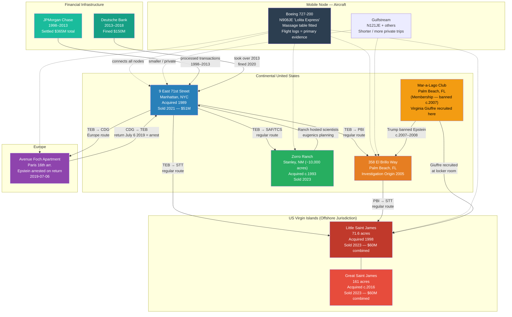

# The Epstein Property Network — Complete Geographic Analysis

> **Classification: RESEARCH DOCUMENT — PUBLIC RECORD SYNTHESIS**
> All content derived from public court records, regulatory findings, congressional documents, and established journalism. Unverified allegations against non-convicted living persons are tagged `#claim`. Confidence ratings assigned per section. This document is a synthesis of existing vault location files and publicly available primary sources.

---

## Executive Summary

Jeffrey Epstein assembled, between approximately 1989 and 2016, one of the most strategically constructed private property networks in modern criminal history. The network spanned six primary jurisdictions — New York City, Palm Beach (Florida), the US Virgin Islands, New Mexico, Paris, and a Boeing 727-200 aircraft operating as a mobile venue — and was connected by an intercontinental private aviation operation. The network's geographic logic was not accidental: each node served a distinct operational function, while together they provided overlapping jurisdictional protection, multiple recruitment venues, and redundant evidence-storage and destruction capability.

The properties were linked by consistent structural features: dedicated "massage" rooms in every residential property, documented hidden camera installations in at least the Manhattan townhouse, and a travel apparatus (the Boeing N908JE and associated Gulfstream aircraft) that moved victims, guests, and staff between nodes. Banking support was provided continuously by JPMorgan Chase (1998–2013) and Deutsche Bank (2013–2018), both of which paid major regulatory settlements for enabling the operation (New York State Department of Financial Services [NYDFS], 2020; Southern District of New York [SDNY], 2023).

Following Epstein's arrest on July 6, 2019, and death on August 10, 2019, the property network was liquidated through estate proceedings managed by co-executors Darren Indyke and Richard Kahn, with proceeds benefiting victims under USVI-negotiated settlement terms. As of the date of this report (February 2026), no property remains in Epstein estate ownership; all have been sold or transferred. New Mexico criminal proceedings reopened February 19, 2026 (NBC News, 2026).

---

## Property Network Overview Table

| Property | Jurisdiction | Acquired | Disposed | Approx. Value | Primary Function | Confidence |
|---|---|---|---|---|---|---|
| [[Locations/9-East-71st-Street-NYC]] | New York, USA | 1989 | 2021 ($51M) | $51M (2021 sale) | Primary US operations hub; blackmail documentation; elite recruitment | HIGH |
| [[Locations/358-El-Brillo-Way-Palm-Beach]] | Florida, USA | c. 1990s | Post-2019 | Est. $12–18M | Florida operations; origin of 2005 investigation | HIGH |
| [[Locations/Mar-a-Lago-Palm-Beach]] | Florida, USA | N/A (membership) | N/A (banned c.2007) | N/A | Elite social access; victim recruitment (Giuffre) | HIGH |
| [[Locations/Zorro-Ranch-New-Mexico]] | New Mexico, USA | c. 1993 | 2023 ($13.4M reassessed) | $21.1M initial valuation | Isolated operations; eugenics project site; scientific hosting | HIGH |
| [[Locations/Little-Saint-James-USVI]] | USVI, USA (offshore) | 1998 | 2023 ($60M combined) | $60M combined w/ GSJ | Core island operations; isolation; USVI jurisdiction | HIGH |
| [[Locations/Great-Saint-James-USVI]] | USVI, USA (offshore) | c. 2016 | 2023 ($60M combined) | Combined above | Buffer / expansion / control of archipelago | HIGH |
| [[Locations/Paris-Apartment-Avenue-Foch]] | France | Unknown | Under French proceedings | Unknown | European operations; Jean-Luc Brunel nexus; arrest origin point | MEDIUM |
| [[Locations/Lolita-Express-N908JE]] | Mobile (registered USA) | Unknown | Disposed post-2019 | Est. $20–40M | Intercontinental transport; mobile abuse venue; passenger documentation | HIGH |

---

## Geographic Network Diagram

---

## Section 1: 9 East 71st Street, Manhattan, New York

**Confidence Rating: HIGH** — Property records, FBI search warrant returns, SDNY court filings

### Property Fact Table

| Field | Detail |
|---|---|
| Address | 9 East 71st Street, New York, NY 10021 |
| Coordinates | 40.7714°N, 73.9643°W |
| Size | ~21,000 sq ft, 7 stories |
| Block/Lot | Manhattan block 1401 |
| Acquired | 1989, $13.2M (NYC property records) |
| Transferred from | Leslie Wexner — L Brands founder |
| Disposed | 2021; $51M sale |
| FBI Search | July 8, 2019 (day of arrest) |
| Case reference | SDNY 19-CR-490; SDNY 20-CR-330 |

### Acquisition — The Wexner Transfer

The Manhattan townhouse is one of the most documented and most significant properties in the network. Epstein acquired it in 1989 for $13.2 million; however, the more significant question is the mechanism of the transfer from Leslie Wexner, founder of L Brands (Victoria's Secret) and Epstein's primary financial patron through the late 1980s and 1990s.

Wexner had given Epstein extraordinary financial authority through a power of attorney arrangement that was unusually broad — effectively allowing Epstein to act as Wexner's financial proxy. The Manhattan townhouse was transferred from Wexner to Epstein for what public records characterize as $0 consideration in some accounts and a nominal sum in others; this transfer arrangement became a subject of subsequent civil litigation and the Senate Finance Committee's 2019 inquiry into Epstein's finances (Brown, 2019; Vox, 2019). Wexner later stated he had been "victimized" by Epstein and described their relationship as one of financial manipulation that he only later understood (New York Times, 2019a).

The 21,000 square foot, 7-story townhouse was one of the largest private residences in Manhattan. It became the operational headquarters of the entire network — the base from which Epstein managed his financial activities, his scientific philanthropy, and his trafficking operation simultaneously.

### FBI Search — July 8, 2019

The FBI and NYPD executed a search warrant on July 8, 2019, the day Epstein was formally arrested and the SDNY indictment (19-CR-490) was unsealed. Based on court filings and Department of Justice press releases, the search recovered:

- Hundreds of photographs of nude and semi-nude females, some of whom appeared to be minors (DOJ press release, July 8, 2019)
- Compact discs in a locked safe, labeled with women's names and notations including "Misc. nudes"
- A large quantity of cash and loose diamonds
- An expired passport with a false name and a Saudi Arabian address — consistent with an alternative identity for international travel
- Hidden cameras installed in areas of the property where guests would have had no expectation of surveillance (SDNY 19-CR-490 supporting documents; as documented in [[Findings/Blackmail-Operation]])

The hidden cameras are among the most operationally significant pieces of evidence recovered. FBI prosecutors referenced them in charging documents as evidence of Epstein's systematic collection of compromising material on guests — the mechanism of the alleged blackmail operation. The full inventory of evidence recovered in the July 2019 search has never been comprehensively published; only those items referenced in public court filings are confirmed.

### Operational Role

The townhouse served multiple documented functions:

1. **Residential headquarters**: Epstein lived and worked from this address; his financial office was operated in part from here.
2. **Massage / abuse venue**: Maxwell trial testimony established the townhouse as one of the primary locations where victims were directed to provide sexual services to Epstein and, allegedly, to his guests.
3. **Evidence/intelligence archive**: The safes, locked cabinets, and camera systems found in the 2019 search indicate systematic archiving of material.
4. **Elite networking hub**: Dinners, meetings, and social events hosted here brought together the scientists, billionaires, politicians, and royals documented in Epstein's social network.

The townhouse was also the address at which Howard Lutnick (later U.S. Secretary of Commerce) and his wife visited Epstein in 2005 — a meeting that, per DOJ files released January 30, 2026, was part of a documented 13-year proximate relationship between Lutnick and Epstein, contradicting Lutnick's public claim of no contact after 2005 (New York Times, 2026a).

### Disposal

The estate sold 9 East 71st Street in 2021 for $51 million. The buyer was Michael Daffey, a Goldman Sachs executive. The property's sale was managed by estate co-executors Darren Indyke and Richard Kahn, with proceeds directed toward the Epstein Victims' Compensation Program established in 2020.

---

## Section 2: 358 El Brillo Way, Palm Beach, Florida

**Confidence Rating: HIGH** — Palm Beach PD public records, SDFL NPA filings, Senate Judiciary inquiry

### Property Fact Table

| Field | Detail |
|---|---|
| Address | 358 El Brillo Way, Palm Beach, FL 33480 |
| Coordinates | 26.6942°N, 80.0389°W |
| County | Palm Beach County |
| Acquired | Approximately mid-to-late 1990s (exact date not established in public record) |
| Disposed | Post-2019 by estate; exact sale price not publicly confirmed |
| Investigation origin | March 2005 — Palm Beach PD |
| Primary detective | Detective Joseph Recarey (PBPD) |
| Case references | SDFL NPA 08-80736; Palm Beach PD report 2005 |

### Investigation Origin — 2005

The entire federal case against Epstein traces its origin to 358 El Brillo Way. In March 2005, the parents of a 14-year-old girl reported to the Palm Beach Police Department that their daughter had been molested at Epstein's Palm Beach mansion (Associated Press, 2019). Detective Joseph Recarey led the investigation, which expanded rapidly as police identified multiple additional victims — all teenage girls from the Palm Beach area — who told investigators Epstein had hired them under the guise of providing massages, which escalated to sexual abuse.

The Palm Beach PD investigation identified a network of girls who had been recruited by other victims, creating a pyramid structure in which victims became recruiters of new victims. The investigation documented massage tables, payment records, and victim testimony consistent with what later court records would confirm as the operational pattern of the network (Palm Beach PD Investigation Report, 2005, as referenced in SDFL 08-80736).

### Investigation Suppression — The NPA

Palm Beach Police Department prepared charging paperwork for multiple counts of unlawful sex with a minor. In an unusual procedural move, Palm Beach County State Attorney Barry Krischer referred the case to a grand jury rather than proceeding directly. The grand jury returned an indictment on a single, relatively minor count of soliciting prostitution — a charge the PBPD leadership publicly characterized as inadequate. PBPD chiefs publicly accused Krischer of giving Epstein preferential treatment (Associated Press, 2019).

The FBI opened its own investigation in 2006–2007. U.S. Attorney for the Southern District of Florida Alexander Acosta then negotiated a Non-Prosecution Agreement (NPA) — signed June 30, 2008 — that granted Epstein federal immunity and allowed him to plead guilty in state court to a single count, serve 18 months (13 served, largely on work release), and register as a sex offender. Critically, the agreement was negotiated without notifying victims — a violation later found unconstitutional by Judge Kenneth Marra (Does 1–6 v. United States, SDFL, February 21, 2019).

This property was the documentary ground zero of what became a pattern: a local investigation reaching toward federal prosecution, deflected by extraordinary legal intervention at multiple levels.

### Operational Features

The Palm Beach residence featured the same "massage" room infrastructure documented at Epstein's other properties. The mansion was used for:

- Regular recruitment of local teenage girls by existing victims
- "Massage" sessions that formed the core operational pattern
- Proximity to Mar-a-Lago (approximately 1.5 miles) — the two Palm Beach nodes functioned together as a social and operational cluster

---

## Section 3: Mar-a-Lago, Palm Beach, Florida

**Confidence Rating: HIGH** — documented Trump quote; Giuffre civil filings; PACER; NPR/congressional 2026

### Property Fact Table

| Field | Detail |
|---|---|
| Address | 1100 S Ocean Blvd, Palm Beach, FL 33480 |
| Owner | Donald J. Trump |
| Epstein membership | Active approximately 1990s–2007 |
| Epstein ban | c. 2007–2008 |
| Significance | Virginia Giuffre recruited at this location; Trump quote documented |
| Key document gap | DOJ files related to Trump-Epstein connection reportedly withheld (NPR, 2026) |

Mar-a-Lago is not an Epstein property, but it functions as a documented node in the Palm Beach cluster. Virginia Giuffre has stated in civil filings that she first met Ghislaine Maxwell at Mar-a-Lago, where Giuffre was working as a locker room attendant (Giuffre v. Maxwell, 15-CV-07433, 2015). This meeting is the documented origin of Giuffre's recruitment into Epstein's network.

Donald Trump's 2002 New York Magazine quote — "I've known Jeff for fifteen years. Terrific guy. He's a lot of fun to be with. It is even said that he likes beautiful women as much as I do, and many of them are on the younger side" — is a verbatim documented statement (Langewis, 2002). Trump banned Epstein from Mar-a-Lago approximately 2007–2008, publicly stating this was due to Epstein's behavior toward a young club employee; this account is unverified independently but is the publicly stated Trump position.

A documented gap in the 2026 DOJ file release: files relating to Trump-Epstein connections reportedly appear in the DOJ index but are absent from the release itself — a gap identified by congressional investigators and reported by NPR (2026). This gap is documented in [[Findings/Missing-Evidence-Gaps]] and [[Findings/Trump-Epstein-Documented-Record]].

---

## Section 4: Zorro Ranch, Stanley, New Mexico

**Confidence Rating: HIGH** (property facts, sale, testimony) / MEDIUM (eugenics program scope)

### Property Fact Table

| Field | Detail |
|---|---|
| Location | Near Stanley, Santa Fe County, New Mexico |
| Coordinates | ~35.0820°N, 106.6536°W |
| Area | ~10,000 acres (~4,000 hectares) |
| Acquired by Epstein | c. 1993 (exact year varies in sources; early 1990s established) |
| Disposed | 2023 public auction |
| Buyer | San Rafael Ranch LLC (Huffines family, Texas) |
| Initial tax valuation | $21.1M |
| Reassessed value | $13.4M (notoriety argument accepted by Santa Fe County) |
| Buyer stated proceeds | Designated to benefit Epstein victims |
| NM AG investigation | Reopened February 19, 2026 (NBC News, 2026) |
| Flight log destinations | TCS (Truth or Consequences) / SAF (Santa Fe) |

### Documented Court Testimony

Two victims provided sworn testimony about abuse at Zorro Ranch in the Maxwell trial (SDNY 20-CR-330, 2021):

- **Witness "Jane"** (anonymized): testified she was flown to Zorro Ranch by Epstein and Maxwell; she was sexually abused by Epstein; she was forced to participate in what she described as "orgies" at the ranch. Jane testified about multiple visits (Maxwell trial transcripts, 2021).
- **Annie Farmer**: testified about abuse she experienced at Zorro Ranch when she was approximately 16 years old; Farmer chose to waive anonymity and testify publicly (Maxwell trial transcripts, 2021). Farmer's sister, Maria Farmer, was the first person to report Epstein and Maxwell to the FBI in 1996 — a complaint the FBI did not act upon for a decade (Brown, 2019).

These are the two publicly confirmed, sworn testimonies about Zorro Ranch. Additional victims named the ranch in civil filings.

### The Scientific Research Facility

Zorro Ranch contained, per documented accounts, a purpose-built scientific research or visitors' facility. The New York Times (Stewart, 2019) documented that Epstein hosted prominent scientists — including those from the Edge Foundation network (evolutionary biologists, cognitive scientists, AI researchers) — at the New Mexico ranch. The ranch was explicitly named as the site for Epstein's documented plan to "seed the human race" with his own DNA through a mass impregnation program: Epstein told multiple prominent scientists and businesspeople about his intention to have 20 women at a time impregnated at Zorro Ranch (Stewart, 2019). This plan combined transhumanism, eugenics, and what multiple observers described as a messianic self-conception. See [[Findings/AI-Transhumanism-Epstein]] for full analysis.

The existence of the facility — and Epstein's use of it to host legitimate researchers who had no knowledge of the criminal context — represents a documented effort to provide intellectual legitimacy to what was, in effect, an applied eugenics program.

### New Mexico AG Investigation Reopened (2026)

On February 19–20, 2026, New Mexico Attorney General Raul Torrez announced the reopening of a criminal investigation related to Zorro Ranch, citing "revelations outlined in the previously sealed FBI files" released by DOJ January 30, 2026 (NBC News, 2026; Al Jazeera, 2026; CBS News, 2026). The New Mexico legislature simultaneously passed bipartisan legislation establishing a comprehensive commission to seek testimony from survivors. This represents the most significant domestic law enforcement development related to the Epstein network in the post-Maxwell conviction period.

### Acquisition and LLC Structure

Zorro Ranch was held through a New Mexico LLC, consistent with Epstein's general pattern of property ownership via shell corporate structures. New Mexico's LLC laws allow anonymous beneficial ownership, making it difficult to trace property to Epstein without access to operating agreements or banking records. The Huffines family purchase in 2023 similarly used San Rafael Ranch LLC — reflecting that New Mexico's LLC regime is attractive to purchasers seeking privacy, irrespective of the reason.

---

## Section 5: Little Saint James, US Virgin Islands

**Confidence Rating: HIGH** — property records, SDNY indictment, Maxwell trial, FBI search, USVI AG proceedings

### Property Fact Table

| Field | Detail |
|---|---|
| Location | Off east coast of St. Thomas, USVI |
| Coordinates | 18.2982°N, 64.8264°W |
| Area | 71.6 acres |
| Acquired by Epstein | 1998 |
| Purchase price | Not publicly confirmed (estimated $7–8M at acquisition) |
| Disposed | 2023; $60M combined with Great Saint James |
| Buyer | Stephen Deckoff / SD Investments (Black Diamond Capital Management) |
| Originally listed | March 2022 at $125M; reduced before sale |
| Current use | Resort development (projected 2025 opening; delayed as of 2026) |
| USVI AG settlement | ~$105M received by USVI from Epstein estate |
| FBI search | July 2019 following Epstein arrest |
| Case references | SDNY 19-CR-490; SDNY 20-CR-330; Giuffre v. Maxwell 15-CV-07433 |

### The Temple Structure — Documented Physical Evidence

The most widely discussed structure on Little Saint James is the so-called "temple" — a building with a blue-and-white striped exterior, a gold dome (later removed or collapsed), no windows, and a heavy door resembling a vault entrance. The structure was located on elevated ground away from the main residence and was photographed extensively from the air and by boat (aerial photography, various photographers, 2019).

The official purpose of this structure was never publicly established. Epstein associates described it variously as a music venue or gym; however, the absence of windows and the vault-style door are inconsistent with either function as conventionally built. The dome was visibly removed or collapsed in aerial photographs taken between Epstein's July 2019 arrest and 2020 — workers were observed at the structure post-arrest. The timing of the demolition/alteration is notable; no official explanation was provided.

The USVI Attorney General's investigation examined the island; full findings from that investigation have not been publicly released. The FBI's July 2019 search of the island focused primarily on electronic media, documents, and physical evidence in the main compound. Whether the temple structure was included in the FBI search warrant is not established in the public record. See [[Findings/Occult-Symbolism-Properties]] for full analysis of the structure's documented features.

### Key 2026 DOJ File Revelations

The January 30, 2026 DOJ release included documents relating directly to Little Saint James operations:

**Sulfuric Acid Order (December 6, 2018):** Documents in the 2026 DOJ release establish that 330 gallons of sulfuric acid were ordered on December 6, 2018, from Gemini Seawater Systems, LLC, for delivery to Little Saint James (WION News, 2026; DOJ file release, justice.gov/epstein). Critically, December 6, 2018 was the same date on which FBI investigators restarted their investigation into Epstein — a coincidence noted in reporting. The stated purpose for the acid was water treatment / reverse osmosis plant maintenance; however, sulfuric acid in this volume is also a known agent for evidence destruction (corrosive to biological material, electronics, and physical evidence). The use of the acid for the stated purpose vs. evidence destruction has not been established by court record; the order date coincidence is documented.

**Staff and Operations Records:** The 2026 DOJ files include detailed records of island staffing — domestic workers, groundskeepers, and security personnel. Construction logs documented structures built on the island over the period of Epstein's ownership. The island was described in DOJ file documents as "a social hub for a network of powerful people" in addition to its documented role as an abuse site.

**FBI Investigation History:** The FBI opened a federal investigation in July 2006, identifying 36 girls as minors at the time of their abuse. The July 2019 FBI/IRS search of the island seized electronic media, documents, and physical evidence; the full inventory of seized items from the island search has not been comprehensively made public.

### USVI Jurisdictional Advantages

The selection of the US Virgin Islands for Epstein's primary operational base was not random. USVI offers several legally significant characteristics relevant to the network:

**Tax advantages:** USVI is a US territory with a separate tax regime; the Economic Development Authority (EDA) of the USVI provided tax incentives to business entities registered there. Epstein's Southern Trust Company was registered in the USVI and received substantial EDA tax benefits — reducing federal and territorial tax liability. The USVI AG's lawsuit against Epstein's estate and JPMorgan Chase included allegations that Epstein used these structures partly to obscure financial flows related to trafficking (USVI v. JPMorgan Chase, 2022).

**Extradition and jurisdictional complexity:** While USVI is US territory (removing international extradition issues), the island's physical isolation — accessible only by boat or helicopter — created a practical barrier to law enforcement access without Epstein's cooperation. No law enforcement vehicle could arrive unannounced; Epstein and his staff would have had advance notice of any approaching vessel.

**Distance from Palm Beach/New York social oversight:** Events on a private island 1,000+ miles from the primary US social circuits occurred in an environment of near-total physical isolation, documented by victims as deliberately exploited to prevent escape or reporting.

**DEA investigation (2010–2015):** A previously undisclosed DEA investigation — opened December 17, 2010, examining Epstein and 14 other unnamed individuals for suspicious money transfers potentially linked to narcotics and prostitution in the USVI and New York City — was revealed in DOJ files on or before February 24, 2026 (CBS News, 2026). This investigation ran for five or more years and produced a 69-page, heavily redacted law enforcement sensitive memo. Its existence was not previously publicly disclosed.

### Documented Passengers/Visitors

Multiple civil depositions, victim testimonies, and flight logs document the presence of high-profile guests on Little Saint James. The following visited the island per documented court record or flight logs:

- Bill Clinton (flight logs, 26+ documented N908JE flights to region)
- Prince Andrew (flight logs; Giuffre civil depositions; Maxwell trial testimony)
- Ghislaine Maxwell (consistent documented presence across all proceedings)
- Jean-Luc Brunel (flight logs)
- Virginia Giuffre and other victims (flight logs; victim testimony)
- Howard Lutnick (DOJ files 2026; photo on island)
- Various unnamed individuals (flight logs, some redacted)

---

## Section 6: Great Saint James, US Virgin Islands

**Confidence Rating: HIGH** (property facts) / MEDIUM (operational significance assessment)

### Property Fact Table

| Field | Detail |
|---|---|
| Location | Adjacent to Little Saint James, off St. Thomas, USVI |
| Area | ~161 acres |
| Acquired by Epstein | c. 2016 |
| Disposed | 2023; $60M combined with Little Saint James |
| Buyer | Stephen Deckoff / SD Investments |
| USVI proceedings | Included in USVI AG civil seizure action |
| Development status | Under construction at time of Epstein's arrest |

### Strategic Significance

Epstein purchased Great Saint James approximately 18 years after acquiring Little Saint James. The purchase, circa 2016, gave Epstein control of both islands forming an adjacent pair off the eastern tip of St. Thomas. This created a completely private controlled archipelago — no development could occur near Little Saint James without Epstein's knowledge or consent, and the buffer zone eliminated any risk of surveillance from neighboring property.

The purchase timing — 2016, roughly two years after the FBI restarted its investigation — raises the analytical question of whether the expansion was motivated partly by the desire to create a more defensible and surveillance-resistant operational environment. This is an analytical inference, not an established fact (confidence: LOW-MEDIUM).

At the time of Epstein's 2019 arrest, construction was underway on Great Saint James. The purpose of planned structures was not established before proceedings halted construction. The island was included in the USVI Attorney General's civil seizure action and ultimately in the $105 million settlement paid by the Epstein estate to the USVI government (USVI v. Epstein Estate, 2022).

---

## Section 7: Paris Apartment, Avenue Foch, 16th Arrondissement

**Confidence Rating: MEDIUM** — arrest documentation is HIGH; apartment operational details are MEDIUM; French investigation incomplete

### Property Fact Table

| Field | Detail |
|---|---|
| Address | Avenue Foch, Paris 16th arrondissement (exact number not publicly confirmed) |
| Type | Luxury apartment |
| Status | Under French judicial proceedings post-2019 |
| Significance | Point of origin on day of arrest; European operations hub |
| French investigation | Opened post-2019; Jean-Luc Brunel arrested Paris 2020 |

### The Arrest Connection

Epstein flew to Paris from the United States at some point in late June/early July 2019 — after he had been aware since November 2018 of the Miami Herald's "Perversion of Justice" investigation (Brown, 2018) and the renewed law enforcement attention it brought. His private jet (Gulfstream, tail number not confirmed in public record for this trip) returned to Teterboro Airport in New Jersey on July 6, 2019; FBI and NYPD were waiting and arrested Epstein on arrival (SDNY arrest documents, July 2019).

The timing suggests that the Paris trip may have been either a deliberate delay of return to US jurisdiction, a final meeting with European associates, or an attempt to move assets or information before anticipated arrest. None of these interpretations has been established by evidence in the public record; the travel pattern is documented, the interpretation is analytical inference (confidence: LOW).

### Avenue Foch Context

Avenue Foch is one of the most exclusive addresses in Paris — a broad, tree-lined avenue near the Bois de Boulogne in the 16th arrondissement, historically associated with the French elite and wealthy foreign nationals. It is among the most expensive residential streets in France. Epstein's residence at this address is consistent with his pattern of maintaining the highest-tier real estate in every city where he operated.

### French Investigation — Jean-Luc Brunel Nexus

Jean-Luc Brunel was the primary figure in the French investigation post-2019. Brunel ran modeling agencies — including MC2 Model Management, partly funded by Epstein — primarily from France and used these agencies as a documented recruitment pipeline for Epstein's operation (Maxwell trial transcripts, 2021). Brunel was arrested at Charles de Gaulle Airport in Paris in December 2020 while attempting to board a flight; he was detained for investigation of rape and sexual assault of minors.

Brunel died in La Santé prison, Paris, on February 19, 2022, in what French authorities ruled a suicide by hanging. His death, like Epstein's, terminated any potential cooperative testimony he could have provided. The French investigation was rendered significantly less actionable without its primary suspect (SDNY 20-CR-330 context; French judicial press releases 2020–2022).

---

## Section 8: The Boeing 727-200, N908JE — "Lolita Express"

**Confidence Rating: HIGH** — flight logs submitted as trial exhibits; passenger testimony; aircraft records

### Aircraft Fact Table

| Field | Detail |
|---|---|
| Type | Boeing 727-200 |
| Tail number | N908JE |
| Nickname | "Lolita Express" (media; investigators) |
| Owner | Jeffrey Epstein via shell company |
| Range | Intercontinental |
| Interior | Reconfigured luxury; includes documented massage table/bed |
| Second aircraft | Gulfstream N121JE and variants (shorter/private trips) |
| Logs obtained via | Subpoena — Giuffre v. Maxwell (15-CV-07433) |
| First published | Fox News, Gawker (2016) |
| Entered as evidence | Maxwell trial (SDNY 20-CR-330); various civil proceedings |

### The Flight Logs — Primary Evidentiary Value

The pilot logs and aircraft logs documenting every flight, destination, and passenger list are among the most important primary documents in the entire case. They provide verified, contemporaneous records — not subject to the credibility attacks that can be directed at victim testimony — of who was on board, where they were going, and when.

The logs were obtained via civil subpoena in the Giuffre v. Maxwell case, reviewed by attorneys, and first publicly published in part by Fox News and Gawker in 2016 (Fox News, 2016). They were subsequently entered as trial exhibits in the Maxwell criminal trial (SDNY 20-CR-330, 2021). Some passenger names in the released versions are redacted; the identities of redacted passengers remain an active research and litigation question.

### Most Documented Passengers

| Passenger | Documented Flights | Notes |
|---|---|---|
| Bill Clinton | 26+ | Multiple Africa, Europe, Asia trips; Clinton Foundation events cited |
| Ghislaine Maxwell | Consistent across all reviewed periods | Primary travel companion; convicted |
| Prince Andrew | Multiple | As documented in Giuffre depositions and flight records |
| Jean-Luc Brunel | Multiple | Model recruitment trips; died in French custody 2022 |
| Virginia Giuffre | Multiple | As victim; testimony corroborated by logs |
| Kevin Spacey | Multiple | Africa trip with Clinton documented |
| Chris Tucker | Multiple | Africa trip with Clinton documented |
| Martin Nowak | Documented post-conviction period | Harvard evolutionary biologist; Epstein associate |

Note: Presence in flight logs establishes travel proximity but does not by itself establish knowledge of or participation in criminal activity for any passenger.

### Key Routes

The N908JE flight routes mirror the property network precisely — evidence that the aircraft was the connective tissue of the entire operation:

- New York (TEB — Teterboro) ↔ Little Saint James (STT — St. Thomas)
- New York (TEB) ↔ Palm Beach (PBI)
- New York (TEB) ↔ Zorro Ranch (TCS — Truth or Consequences / SAF — Santa Fe)
- New York (TEB) ↔ Europe (CDG Paris; LHR London; various)
- Africa trips (multiple, including Clinton Foundation-related itineraries)
- Middle East and Asia routes documented

### The Massage Table

Multiple flight attendants and victims testified in the Maxwell trial (SDNY 20-CR-330) that the Boeing 727 was fitted with a dedicated massage table or bed. The aircraft was configured to facilitate the same "massage" activities that occurred at Epstein's residential properties, effectively extending the operational reach of the network to 30,000 feet. Flight attendants testified to being pressured and to witnessing inappropriate activity on board the aircraft (Maxwell trial transcripts, 2021).

The aircraft functioned, therefore, not merely as transportation between nodes, but as a mobile node in its own right — an environment of total isolation in which Epstein had complete control over all persons on board.

### The Gulfstream Fleet

Epstein also operated Gulfstream jets (N121JE and other tail numbers) that were used for shorter, more private trips. The Gulfstream logs are less comprehensive in the public record than the Boeing logs; the aircraft appears to have been used specifically when fewer witnesses or a lower profile was desired. This operational pattern — choosing different aircraft based on the desired documentation profile — is consistent with deliberate information management (confidence: MEDIUM).

---

## Section 9: Property Acquisition Pattern — LLC Structures and Financial Architecture

**Confidence Rating: HIGH** (documented banking facts) / MEDIUM (full shell structure not mapped in public record)

### Acquisition Method

Epstein's property acquisitions followed a consistent pattern:

1. **Shell LLC ownership**: Properties were rarely held in Epstein's personal name. Each was owned by a purpose-specific LLC registered in the relevant jurisdiction. New Mexico, USVI, and Delaware all offer LLC regimes with limited beneficial ownership disclosure, making tracing difficult without banking records.

2. **Wexner wealth transfer mechanism**: Epstein's access to the capital required for this property portfolio is only partially explained by his disclosed income as a money manager. The key foundation was Leslie Wexner's extraordinary financial patronage — including the Manhattan townhouse transfer and the unusually broad power of attorney Epstein wielded over Wexner assets during the late 1980s–1990s. The Senate Finance Committee's 2019 inquiry identified this relationship as requiring full documentation; that documentation has not been fully made public.

3. **JPMorgan/Deutsche Bank banking continuity**: JPMorgan Chase maintained Epstein as a client from 1998 to 2013 — through and after his 2008 Florida conviction — processing large cash withdrawals consistent with trafficking payments. Internal compliance flags were overridden repeatedly by senior management. When JPMorgan finally dropped Epstein in 2013 (coinciding with the departure of his primary relationship manager Jes Staley), Deutsche Bank accepted him immediately and maintained him until 2018. The combined 25-year banking relationship provided the financial infrastructure for the entire property network and its operations (NYDFS Consent Order, 2020; SDNY JPMorgan settlement, 2023). See [[Findings/Financial-Institutions-JPMorgan-Deutsche]].

4. **USVI tax optimization**: The Southern Trust Company, registered in USVI, provided substantial EDA tax concessions and was the corporate vehicle through which much of Epstein's USVI-related financial activity was conducted. The USVI AG's 2022 lawsuit against JPMorgan alleged the bank knowingly processed transactions related to this structure as part of the trafficking enterprise.

### The Wexner Connection — Underreported Significance

The Wexner-Epstein financial relationship is, in this analyst's assessment, the most underreported aspect of the property network. Without Wexner's capital, the Manhattan townhouse, the island acquisition, and the aviation fleet would not have been financially accessible to Epstein, whose verifiable independent wealth-management client base has never been publicly established to a level that would independently support this portfolio. The full scope of Wexner's financial exposure to Epstein — including whether Epstein diverted Wexner client funds in addition to Wexner's personal resources — has not been established in the public record (confidence: MEDIUM on this inference; confidence HIGH on documented Wexner transfer).

---

## Section 10: Property Disposals After Epstein's Death

**Confidence Rating: HIGH** — public property records, NPR, Santa Fe New Mexican, Guardian

Epstein died at Metropolitan Correctional Center, New York, on August 10, 2019, officially ruled suicide by hanging. Estate co-executors Darren Indyke and Richard Kahn managed the subsequent disposition of assets under pressure from multiple legal proceedings — the SDNY criminal case (dismissed on death), USVI civil proceedings, the New Mexico AG civil lawsuit, and multiple victim civil suits.

### Disposal Timeline

| Property | Disposed | Buyer | Price | Notes |
|---|---|---|---|---|
| 9 East 71st Street, NYC | 2021 | Michael Daffey (Goldman Sachs) | $51M | Listed and sold during estate proceedings |
| 358 El Brillo Way, Palm Beach | Post-2019 | Not publicly confirmed | Not confirmed | Sold by estate |
| Zorro Ranch, NM | 2023 | San Rafael Ranch LLC (Huffines family) | ~$13.4M reassessed | Public auction; proceeds to victims |
| Little Saint James, USVI | 2023 | SD Investments (Stephen Deckoff) | $60M combined | With Great Saint James |
| Great Saint James, USVI | 2023 | SD Investments (Stephen Deckoff) | $60M combined | With Little Saint James |
| Avenue Foch apartment, Paris | Ongoing French proceedings | Not confirmed | Not confirmed | Under French judicial authority |
| N908JE Boeing 727 | Post-2019 | Not confirmed | Not confirmed | Disposal of aircraft per estate |

### USVI Settlement

The USVI government, under Attorney General Denise George (and subsequently through continued proceedings), reached a settlement with the Epstein estate under which USVI received approximately $105 million — the largest single payment from the estate to any single claimant institution. This settlement resolved the USVI's civil claims regarding the use of island properties for trafficking, the Southern Trust USVI tax structure, and the USVI EDA concessions that allegedly enabled the operation (USVI v. Epstein Estate settlement, 2022). The USVI subsequently reached a separate $75 million settlement with JPMorgan Chase over the bank's role in enabling Epstein's USVI-based activities (USVI v. JPMorgan Chase, September 2023).

### Resort Development Status (as of February 2026)

Stephen Deckoff, founder of Black Diamond Capital Management, purchased both USVI islands in May 2023 for $60 million (NPR, 2023). Public statements announced a resort destination with a target opening of 2025. As of February 2026, resort plans are delayed with little visible permitting progress per local USVI media reporting (Newsweek, 2026). The islands remain privately held and inaccessible to the public.

---

## Section 11: Geographic Pattern Analysis — Underreported Connections

**Confidence Rating: MEDIUM** (analytical inferences from documented facts)

### The Jurisdictional Logic

The property network's geographic distribution is not accidental. Each jurisdiction was selected for specific legal and operational characteristics:

| Jurisdiction | Legal Advantage | Operational Role |
|---|---|---|
| Manhattan, NY | Financial/social capital hub; proximity to media, finance, academia | Primary networking, documentation archive |
| Palm Beach, FL | No state income tax; elite social circuit; Mar-a-Lago proximity | Recruitment, local operations, social access |
| USVI (federal territory) | Physical isolation; favorable tax structure; limited access | Primary sustained-abuse operations; financial structuring |
| New Mexico | Rural isolation; LLC privacy; distance from social oversight | Isolated operations; eugenics project; scientific hosting |
| Paris, France | European social network; Brunel nexus; non-US jurisdiction | European operations; international recruitment |
| Aircraft (mobile) | No fixed jurisdiction; total isolation at altitude | Extension of all nodes; passenger documentation |

### The Palm Beach Cluster

Palm Beach presents the most concentrated geographic cluster: 358 El Brillo Way and Mar-a-Lago are approximately 1.5 miles apart on the same island. This proximity was operationally significant. Virginia Giuffre's documented path — recruited at Mar-a-Lago, transported to Epstein's nearby residence, then progressively introduced to the full network — illustrates the cluster's function as a recruitment-to-integration pipeline within a geographically contained social environment.

The Palm Beach elite social circuit (of which both venues were part) provided a population of high-net-worth individuals who were potential guests, witnesses, or compromised parties, depending on how Epstein managed each relationship.

### The USVI Isolation Architecture

The selection of an island accessible only by private boat or helicopter created a self-contained environment that geographically enforced the power dynamics Epstein relied on. Victims transported to Little Saint James had no independent means of departure; there were no bystanders; there was no public law enforcement presence. The 2016 purchase of adjacent Great Saint James extended this isolation architecture — controlling 232+ combined acres of water-surrounded territory.

The DEA's documented 2010 investigation into suspicious money transfers in the USVI (CBS News, 2026) suggests federal agencies were aware of the USVI as a jurisdiction of concern for Epstein's activities as early as 2010; that the investigation apparently did not result in charges despite running five-plus years is a documented gap requiring further examination.

### The Paris–Arrest Connection

Epstein's return from Paris on the day of his arrest (July 6, 2019) raises analytical questions about what he was doing in Paris in the days immediately preceding it. The Miami Herald investigation had been public since November 2018; Epstein had approximately eight months of advance warning that federal scrutiny was intensifying. The Paris trip's purpose — whether to meet associates, move assets, obtain alternative identity documents (an expired false-name passport was found in the NYC mansion), or simply maintain plausible-deniability-by-geography — has not been established (confidence: LOW on all inferences).

---

## Section 12: Confidence Assessment Summary

| Claim / Finding | Confidence | Basis |
|---|---|---|
| Property ownership and acquisition dates | HIGH | Property records, court filings |
| FBI search evidence recovered at 9 East 71st | HIGH | DOJ press releases, SDNY court filings |
| Victim testimony about abuse at all four primary properties | HIGH | Maxwell trial sworn testimony (SDNY 20-CR-330) |
| Flight log passenger documentation (N908JE) | HIGH | Trial exhibits, civil discovery, published logs |
| Sulfuric acid order timing coincidence | MEDIUM | DOJ file documents; causal connection not established |
| Temple structure purpose on Little Saint James | LOW-MEDIUM | Physical documentation high; purpose unestablished |
| Dome demolition as evidence destruction | LOW | Timing notable; motive unconfirmed |
| USVI jurisdiction chosen for tax/isolation advantages | MEDIUM-HIGH | Financial regulatory findings support; deliberateness inferred |
| Wexner wealth as foundation of property empire | MEDIUM-HIGH | Transfer documented; full scope not public |
| Paris trip as pre-arrest asset movement | LOW | Documented travel; motive unconfirmed |
| Intelligence agency use of collected blackmail material | LOW | Acosta statement documented; agency confirmation absent |
| Eugenics seeding program at Zorro Ranch | MEDIUM-HIGH | NYT documented Epstein's statements; implementation not established |
| Banking enablement (JPMorgan/Deutsche) | HIGH | Regulatory settlements; consent orders |
| USVI DEA investigation 2010–2015 | HIGH | Documented in 2026 DOJ release; newly disclosed |

---

## Open Research Questions

- [ ] Full FBI inventory of evidence seized at Little Saint James — never comprehensively published
- [ ] Temple structure inclusion in FBI search warrant — not confirmed in public record
- [ ] Full inventory of N908JE Gulfstream logs — less complete than Boeing logs in public record
- [ ] Avenue Foch apartment — exact address, ownership structure, full French investigation findings
- [ ] Storage unit referenced in Epstein communications (reportedly not fully searched) — location and contents
- [ ] Full scope of Wexner power of attorney — whether Epstein diverted Wexner client funds beyond personal gifts
- [ ] Identity of redacted passengers in released flight logs
- [ ] USVI DEA 2010 investigation — full memo contents; why no charges resulted
- [ ] NM AG 2026 criminal investigation outcomes
- [ ] Resort development at USVI islands — permitting status, timeline

---

## Appendix: APA 7th Edition Reference List

Al Jazeera. (2026, February 20). *New Mexico reopens criminal probe related to Jeffrey Epstein's Zorro Ranch*. Al Jazeera. https://www.aljazeera.com/news/2026/2/20/new-mexico-reopens-criminal-probe-related-to-jeffrey-epsteins-zorro-ranch

Associated Press. (2019). *Jeffrey Epstein timeline: From arrest to conviction to appeals*. AP News. https://apnews.com/article/epstein-timeline

Brown, J. K. (2018, November 28). *Perversion of justice: How a future Trump cabinet member gave a serial sex abuser the deal of a lifetime*. Miami Herald. https://www.miamiherald.com/news/local/article220097825.html

Brown, J. K. (2019). *Perversion of justice* [Series]. Miami Herald. https://www.miamiherald.com/news/local/series/perversion-of-justice/

CBS News. (2026, February 24). *Epstein files: DEA investigation, Trump tips, and key findings from DOJ release*. CBS News. https://www.cbsnews.com/news/epstein-files-dea-investigation-trump-tips-doj-release/

CBS News. (2026). *New Mexico reopens investigation into Jeffrey Epstein's Zorro Ranch*. CBS News. https://www.cbsnews.com/news/new-mexico-reopens-investigation-jeffrey-epstein-zorro-ranch/

Does 1–6 v. United States, No. 08-80736 (S.D. Fla. February 21, 2019).

Fox News. (2016). *Flight logs show Bill Clinton flew on sex offender's jet much more than previously known*. Fox News. https://www.foxnews.com/us/flight-logs-show-bill-clinton-flew-on-sex-offenders-jet-much-more-than-previously-known

Giuffre v. Maxwell, No. 15-CV-07433 (S.D.N.Y. 2015).

Giuffre v. Prince Andrew, No. 21-CV-06702 (S.D.N.Y. 2021).

Guardian, The. (2026, February 16). *Epstein ranch purchased by Republican candidate's family*. The Guardian. https://www.theguardian.com/us-news/2026/feb/16/epstein-ranch-new-mexico-purchase-republican-candidate

Guardian, The. (2026, February 27). *Senators demand Lutnick testify over Epstein connections*. The Guardian. https://www.theguardian.com/us-news/2026/feb/27/lutnick-epstein-photo-senate-demand-testimony

Langewis, B. (2002, February). [Trump quote on Jeffrey Epstein]. *New York Magazine*.

NBC News. (2026). *New Mexico probe of Jeffrey Epstein's Zorro Ranch*. NBC News. https://www.nbcnews.com/politics/politics-news/new-mexico-probe-jeffrey-epstein-zorro-ranch-rcna259292

Newsweek. (2026). *Who owns Epstein's island now? Update on billionaire plan to build new resort*. Newsweek. https://www.newsweek.com/who-owns-epstein-island-now-update-on-billionaire-plan-to-build-new-resort-11523132

New York State Department of Financial Services (NYDFS). (2020, July 7). *Consent order under New York banking law — Deutsche Bank AG* [Consent Order No. 2020-07-DB]. NYDFS. https://www.dfs.ny.gov/reports_and_publications/press_releases/pr202007071

NPR. (2023, May 4). *Jeffrey Epstein's private island is sold*. NPR. https://www.npr.org/2023/05/04/1173956903/jeffrey-epstein-island-sold-st-james

NPR. (2026). *DOJ withheld files related to Trump-Epstein connections, congressional investigators say*. NPR.

Stewart, J. B., Confessore, N., & Yourish, K. (2019, August 31). *Jeffrey Epstein hoped to seed the human race with his DNA*. The New York Times. https://www.nytimes.com/2019/07/31/business/jeffrey-epstein-eugenics.html

Time. (2026). *Epstein Zorro Ranch investigation*. Time. https://time.com/7379228/epstein-zorro-ranch-investigation/

United States Department of Justice. (2019, July 8). *Press release: Jeffrey Epstein charged with sex trafficking of minors in Florida and New York*. DOJ. https://www.justice.gov/usao-sdny/pr/jeffrey-epstein-charged-sex-trafficking-minors-florida-and-new-york

United States Department of Justice. (2026, January 30). *Epstein file repository* [Data sets 1–12]. justice.gov/epstein. https://www.justice.gov/epstein

United States v. Epstein, No. 19-CR-490 (S.D.N.Y. 2019) (dismissed August 29, 2019 following defendant's death).

United States v. Maxwell, No. 20-CR-330 (S.D.N.Y. 2021) (verdict December 29, 2021; sentencing June 28, 2022).

USVI v. JPMorgan Chase (USVI Superior Court 2022); settlement September 2023 ($75M).

WION News. (2026). *Epstein files: 330 gallons of sulfuric acid ordered for Little Saint James — DOJ RO plant documentation*. WION News. https://www.wionews.com/world/epstein-files-330-gallons-sulfuric-acid-little-st-james-doj-ro-plant-1770873317929

New York Times. (2019a). *How Jeffrey Epstein used the billionaire behind Victoria's Secret for wealth and women*. The New York Times. https://www.nytimes.com/2019/07/25/business/jeffrey-epstein-wexner-victorias-secret.html

New York Times. (2026a, February 7). *Lutnick and Epstein had regular contact over 13 years, DOJ files show*. The New York Times. https://www.nytimes.com/2026/02/07/us/politics/lutnick-epstein-doj-files.html

---

## Related Vault Files

- [[Locations/Little-Saint-James-USVI]]
- [[Locations/Great-Saint-James-USVI]]
- [[Locations/9-East-71st-Street-NYC]]
- [[Locations/358-El-Brillo-Way-Palm-Beach]]
- [[Locations/Zorro-Ranch-New-Mexico]]
- [[Locations/Paris-Apartment-Avenue-Foch]]
- [[Locations/Lolita-Express-N908JE]]
- [[Locations/Mar-a-Lago-Palm-Beach]]
- [[Findings/Blackmail-Operation]]
- [[Findings/Financial-Institutions-JPMorgan-Deutsche]]
- [[Findings/Intelligence-Connections]]
- [[Findings/AI-Transhumanism-Epstein]]
- [[Findings/Occult-Symbolism-Properties]]
- [[Findings/2026-DOJ-Epstein-Files-Release]]
- [[Findings/Missing-Evidence-Gaps]]
- [[Findings/Trump-Epstein-Documented-Record]]
- [[Investigations/Epstein/Epstein]]
- [[Timeline]]

---

*[[Investigations/Epstein/Epstein]] · [[Findings/README]] · [[vault]]*
