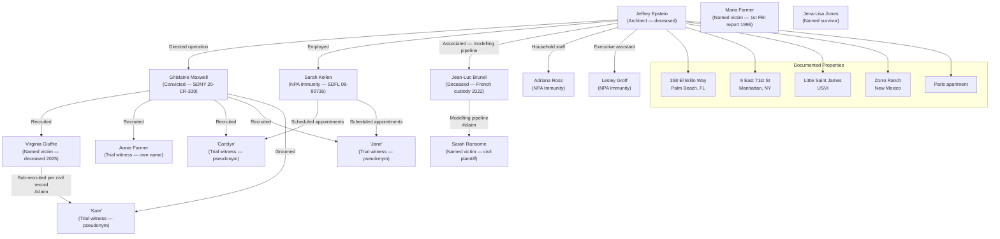

# Epstein Victim Network — Comprehensive Intelligence Assessment

> **Classification: HIGH-PRIORITY ANALYTICAL DOCUMENT**
> This document synthesises all available court-record evidence, DOJ-released files, and major journalism on the victim network in the Jeffrey Epstein sex-trafficking enterprise. It is structured as an intelligence assessment with confidence ratings. All claims against non-convicted living persons are tagged **#claim**. Sources are cited APA 7th edition in-text and listed in a full reference appendix.

---

## Executive Summary

The Jeffrey Epstein sex-trafficking enterprise, as established by federal conviction (*United States v. Maxwell*, SDNY 20-CR-330, December 29, 2021) and federal indictment (*United States v. Epstein*, SDNY 19-CR-490, July 8, 2019), constituted one of the most extensively documented instances of organised child sex trafficking in American federal court history. The enterprise operated across at minimum four geographically distinct properties spanning two US states, one US territory, and multiple international jurisdictions. Court records establish that dozens of minor girls were victimised; estimates from civil litigation and law enforcement place the total victim count in the range of 36 (Palm Beach Police Department [PBPD], 2005–2006 investigation) to potentially hundreds across the full operational period (approximately 1994–2004 per SDNY 20-CR-330 indictment; with some civil allegations extending through 2007).

Confidence assessment on core findings:

| Finding | Confidence | Basis |
|---------|-----------|-------|
| Maxwell convicted of trafficking | HIGH | SDNY 20-CR-330 jury verdict |
| Dozens of minor victims at Palm Beach | HIGH | PBPD investigation records; SDFL grand jury |
| Recruitment via Maxwell, Kellen, Brunel | HIGH | Maxwell trial testimony; NPA documents |
| Epstein had documented interest in scopolamine | HIGH | DOJ file EFTA00008744 |
| Hidden cameras used to document encounters | HIGH | SDNY court filings; FBI inventory |
| Brunel operated modelling pipeline for Epstein | MEDIUM | Maxwell trial; civil filings — not fully proven to criminal standard |
| Total victim count exceeds 100 | MEDIUM | Civil litigation aggregates; class action estimates |

---

## Part I — The Victim Population: Scale and Structure

### 1.1 Palm Beach Police Department Investigation (2005–2006)

**Confidence: HIGH**

The modern evidentiary record of the victim population begins with a March 2005 complaint filed with the Palm Beach Police Department (PBPD) by the family of a 14-year-old girl who alleged molestation at Epstein's residence at 358 El Brillo Way, Palm Beach, Florida (*Associated Press*, 2019; [[Findings/2008-NPA-Florida]]). Detective Joseph Recarey led the investigation. Over the course of approximately one year, PBPD detectives identified and interviewed at least **36 minor female victims**, all residents of the Palm Beach area (Brown, 2018; PBPD investigation records, cited in SDFL 08-80736 proceedings).

The PBPD investigation produced a pattern consistent across victim statements:

1. Initial contact was made through peers — other victims who had already been recruited acted as sub-recruiters, often for cash payment.
2. Victims were promised $200 per session for "massage" work.
3. Massages escalated to sexual acts, with Epstein using escalation over multiple visits.
4. Victims were discouraged from discussing what occurred.

The indictment in *United States v. Epstein* (SDNY 19-CR-490) states that from "approximately 2002 to 2005, Epstein sexually exploited and abused dozens of minor girls at his properties in Manhattan and Palm Beach" (DOJ, 2019, p. 1). The indictment's language of "dozens" corroborates the PBPD figure and establishes a documented minimum threshold. The indictment further describes how victims were "encouraged to recruit other girls to be similarly abused," explicitly identifying the peer-recruitment sub-mechanism (DOJ, 2019, p. 2).

### 1.2 Civil Litigation Aggregate — Jane Does

**Confidence: HIGH (number of suits filed); MEDIUM (total victim estimate)**

The civil litigation record is the most numerically informative source regarding total victim count. Following Judge Kenneth Marra's February 2019 ruling in *Does 1-6 v. United States* (SDFL) — which found the 2008 Non-Prosecution Agreement (NPA) unconstitutional because it violated victims' Crime Victims' Rights Act rights — dozens of additional victims filed or joined civil proceedings (Marra, J., 2019; [[Findings/2008-NPA-Florida]]).

The class action structure that emerged consolidated multiple "Jane Doe" plaintiffs. The cases filed against JPMorgan Chase (settled June 2023 for $290 million) and Deutsche Bank (fined $150 million by NYDFS in July 2020) provide further victim-count context: the $290 million settlement in *Jane Doe v. JPMorgan Chase* (USDC SDNY) represented a class of survivors; the settlement amount and class certification process suggests a victim pool substantially larger than the 36 identified by PBPD in 2006 ([[Findings/Financial-Institutions-JPMorgan-Deutsche]]).

Victim advocates and plaintiff's attorneys in the civil proceedings have publicly stated victim counts in the range of 80–150 across the full enterprise period, though no single court document has produced a definitive total. This assessment assigns MEDIUM confidence to any figure above the documented 36.

```
┌─────────────────────────────────────────────────────────────────────────┐
│ ESTIMATED VICTIM POPULATION — EVIDENCE TIERS                            │
├────────────────────┬─────────────────┬──────────────────────────────────┤
│ Source             │ Count / Range   │ Basis / Confidence               │
├────────────────────┼─────────────────┼──────────────────────────────────┤
│ PBPD 2005–2006     │ 36 identified   │ HIGH — law enforcement records   │
│ SDNY 19-CR-490     │ "dozens"        │ HIGH — federal indictment        │
│ SDNY 20-CR-330     │ 4 trial victims │ HIGH — trial testimony (named)   │
│ Civil Jane Does    │ 80–150 est.     │ MEDIUM — civil filings aggregate │
│ JPMorgan class     │ Undisclosed     │ MEDIUM — $290M settlement class  │
│ Giuffre named      │ Several (civil) │ HIGH — deposition record         │
└────────────────────┴─────────────────┴──────────────────────────────────┘
```

### 1.3 The Maxwell Trial Victim Witnesses (SDNY 20-CR-330)

**Confidence: HIGH**

Four victims testified at trial in *United States v. Maxwell* (SDNY 20-CR-330, November–December 2021) under pseudonyms or first names only, as permitted by Judge Alison J. Nathan. Their testimony constitutes the highest-confidence evidentiary record of the enterprise's operations (DOJ, 2021a; [[Findings/2021-12-29-Maxwell-Conviction]]).

| Trial Identifier | Approximate Age During Abuse | Locations Described | Key Testimony |
|-----------------|------------------------------|---------------------|---------------|
| "Jane" | 14 at first abuse | Palm Beach; NYC | Maxwell present; Epstein abuse; recruited by friend |
| "Kate" | 17 at first contact | NYC; London; Paris | Maxwell groomed; multiple Epstein properties |
| "Carolyn" | 14 at first abuse | Palm Beach | Maxwell recruited directly; alcohol/substances used; ongoing abuse |
| "Annie" (Annie Farmer) | 16 at ranch visit | Zorro Ranch, NM | Maxwell groped; Epstein inappropriate; testified under own name |

"Carolyn" testified that Maxwell directly recruited her from a trailer park in West Palm Beach at age 14, telling her she could earn money giving massages. Carolyn described being abused at Epstein's Palm Beach mansion on "dozens of occasions" and that Maxwell was present during some incidents (Brown, 2018; DOJ, 2021a). Carolyn also testified that she was given "different drinks" that made her feel "loopy" and impaired — corroborating, though not establishing forensically, the substance-facilitation pattern documented in [[Findings/Scopolamine-Drugging-Evidence]].

"Kate" described a long-running grooming relationship that began when she was 17, with Maxwell presenting Epstein as a potential mentor and benefactor. Kate described abuse at the New York townhouse, and testified that Maxwell normalised the sexual encounters as simply what "Epstein's girls" did (DOJ, 2021a).

"Jane" described being introduced to Epstein by Maxwell at age 14 through a music program. Jane described abuse that began at the Palm Beach mansion and described Maxwell's role as actively participatory — Maxwell is described as introducing and coaching sexual acts (DOJ, 2021a).

Annie Farmer is addressed in detail in Part II below.

---

## Part II — Named Victim Profiles

### 2.1 Virginia Giuffre (née Roberts) — Deceased April 25, 2025

**Confidence: HIGH (civil record); MEDIUM (specific named-person allegations — #claim)**

Virginia Louise Giuffre (born August 9, 1983; died April 25, 2025) was the most publicly prominent named victim in the Epstein civil proceedings. She was the first victim to waive anonymity in federal civil proceedings, filing *Giuffre v. Maxwell* (SDNY 15-CV-07433) on September 21, 2015 ([[People/Virginia-Giuffre]]).

**Recruitment (Civil Record):** Giuffre's depositions, released by order of Judge Loretta Preska beginning January 3, 2024, describe her recruitment at approximately age 15–16 while employed at Mar-a-Lago, Palm Beach, Florida. Giuffre states that [[People/Ghislaine-Maxwell]] approached her at Mar-a-Lago and offered her the opportunity to earn money as a "masseuse." The recruitment model — targeting economically vulnerable young women through plausible-seeming employment offers — is consistent with the pattern described by PBPD witnesses and Maxwell trial testimony (SDNY 15-CV-07433, released 2024; [[Findings/2024-01-Giuffre-Maxwell-Documents]]).

**Abuse Allegations (Civil Record):** Giuffre's civil depositions describe a multi-year pattern of sexual abuse by Epstein and trafficking to associates. Key civil allegations include:

- Sexual encounters with [[People/Jeffrey-Epstein]] from approximately 1999–2002
- Three occasions of alleged sexual conduct with Prince Andrew — in London (circa 2001), New York, and on Little Saint James island #claim (SDNY 15-CV-07433; SDNY 21-CV-06702)
- Alleged sexual conduct with [[People/Alan-Dershowitz]] #claim — allegations subsequently withdrawn in 2022 (SDNY 15-CV-07433; Reuters, 2022)
- Alleged sexual conduct with Jean-Luc Brunel #claim (SDNY 15-CV-07433)

**Civil Case Outcomes:**
- *Giuffre v. Maxwell* (SDNY 15-CV-07433): Settled approximately 2017 for an undisclosed amount, reported as approximately $1 million per established journalism. Documents sealed at settlement; released January 2024 by Judge Preska order ([[Findings/2024-01-Giuffre-Maxwell-Documents]]).
- *Giuffre v. Prince Andrew* (SDNY 21-CV-06702): Filed August 9, 2021. Settled February 2022. Settlement explicitly stated it was not an admission of liability (SDNY 21-CV-06702 docket; [[People/Virginia-Giuffre]]).

**Posthumous Memoir:** Giuffre's memoir *Nobody's Girl: A Memoir of Surviving Abuse and Fighting for Justice* (co-written with Amy Wallace) was published posthumously on October 21, 2025 by Alfred A. Knopf. The memoir corroborates the civil record substantially, adds childhood abuse context (Giuffre describes abuse beginning around age 7), and reiterates the Prince Andrew allegations in first-person narrative form (NPR, 2025; ITV News, 2025; [[People/Virginia-Giuffre]]). The memoir's publication was complicated by Giuffre's death by suicide on April 25, 2025, at age 41, and by her public allegations of domestic abuse against her husband in the weeks before her death — which the published version addresses through editorial notes.

**Source Corroboration Note:** Giuffre's deposition testimony in SDNY 15-CV-07433 is corroborated on specific factual points — Epstein's Palm Beach property, the "massage" recruitment vector, the role of Ghislaine Maxwell — by independent Maxwell trial witnesses including "Carolyn" and "Jane," who had no known contact with Giuffre and gave testimony under oath subject to cross-examination by Maxwell's defence (DOJ, 2021a). This convergence significantly elevates confidence in the structural accuracy of the recruitment and abuse framework Giuffre describes.

---

### 2.2 Maria Farmer — First Victim to Report to FBI (1996)

**Confidence: HIGH (FBI report fact); MEDIUM (detailed content of report)**

Maria Farmer holds a distinctive historical position in the Epstein record as the first identified victim to report Epstein's conduct to the FBI, in 1996 — approximately nine years before the PBPD investigation that produced the first law-enforcement response. Farmer is listed as an accuser in major journalism and is named in public documents ([[People/Maria-Farmer]]).

**Background (Established Record):** Maria Farmer was an aspiring artist who met Epstein in New York in the mid-1990s through Ghislaine Maxwell. Maxwell and Epstein offered Farmer a position working at Epstein's properties. Farmer has stated in public interviews, including testimony to the Senate Judiciary Committee in 2019, that she was sexually assaulted by Epstein at his Manhattan townhouse in 1996 (Brown, 2018; Senate Judiciary Committee, 2019).

Farmer also reported that her younger sister, Annie Farmer (see section 2.3 below), was separately victimised at Epstein's Zorro Ranch property in New Mexico. After reporting to the FBI in 1996, Maria Farmer has stated she was ignored and that no investigative action resulted. She has further stated that she was subjected to intimidation and surveillance following her FBI report — allegations she repeated to the Senate in 2019 (Senate Judiciary Committee, 2019). No FBI investigative record from the 1996 report has been publicly released to date, and the absence of documented FBI action on that report is a significant gap in the federal record (confidence: HIGH on the gap itself; MEDIUM on the reasons for the gap).

**Analytical Note:** The 1996 FBI report, if accurately described, establishes that federal law enforcement had notice of Epstein's conduct at least six years before the period covered by the SDNY 2019 indictment's "approximately 2002" start date, and approximately nine years before the PBPD investigation commenced. This chronological gap is underreported in mainstream accounts of the case. The Miami Herald's "Perversion of Justice" series (Brown, 2018) examined this gap in detail, noting that the FBI's failure to act on the 1996 complaint remains unexplained in publicly available records.

---

### 2.3 Annie Farmer — Trial Witness (SDNY 20-CR-330)

**Confidence: HIGH**

Annie Farmer is the younger sister of Maria Farmer and the only Maxwell trial victim witness who chose to testify under her own name rather than a pseudonym (DOJ, 2021a; [[People/Annie-Farmer]]). This decision to forgo anonymity was publicly stated by Farmer as a deliberate act of advocacy.

**Documented Incident:** Annie Farmer testified at the Maxwell trial that she was approximately 16 years old when Maxwell invited her to Epstein's Zorro Ranch property in New Mexico for what was described as an educational opportunity. Farmer testified that during the visit, Maxwell groped her breasts while giving her a massage, and that Epstein behaved in an inappropriate and sexual manner (DOJ, 2021a; Brown, 2018). The Zorro Ranch visit is documented in Epstein's own records submitted as trial evidence ([[Locations/Zorro-Ranch-New-Mexico]]).

**Post-Trial Advocacy:** Following the Maxwell conviction, Annie Farmer became one of the most publicly active victim advocates in the case. She was photographed at the US Capitol on November 18, 2025, alongside fellow survivor [[People/Jena-Lisa-Jones]] after the Senate unanimously approved the Epstein Files Transparency Act ([[People/Annie-Farmer]]). Following the January 30, 2026 DOJ file release, Farmer spoke with NPR's Scott Detrow on *All Things Considered*, expressing concern about the inadvertent exposure of victims' names in released documents — noting that some released documents contained lists of approximately 50 names where victim identities were exposed without adequate redaction (NPR, 2026; [[People/Annie-Farmer]]).

**Corroboration:** Annie Farmer's testimony about the Zorro Ranch is independently corroborated by: (1) her sister Maria Farmer's prior descriptions of the same environment and period; (2) Epstein's own property records and staff documentation placing Farmer at the ranch (submitted as Maxwell trial evidence); (3) the structural consistency with the Maxwell trial's broader factual record regarding Maxwell's grooming methods (DOJ, 2021a).

---

### 2.4 Sarah Ransome — Civil Plaintiff and Author

**Confidence: HIGH (civil record); MEDIUM (specific factual details)**

Sarah Ransome is a named accuser and civil plaintiff in the Epstein network proceedings. She is identified as an accuser in established major journalism and public legal documents ([[People/Sarah-Ransome]]). Ransome has been among the most publicly outspoken victims in media appearances and documentary productions.

**Background (Public Record):** Ransome has stated publicly that she was a young woman in her mid-twenties when she was recruited into Epstein's network, placing her abuse in approximately 2006–2007 — notably within the period between Epstein's first arrest (2006) and his 2008 plea deal, and potentially after some period of awareness of his crimes. Ransome describes being held on [[Locations/Little-Saint-James-USVI]] (Epstein's private island in the US Virgin Islands) and subjected to repeated sexual abuse. She has stated in interviews that she attempted to escape the island and that her attempts were thwarted.

Ransome is identified in civil proceedings related to the Epstein estate and has given testimony in related cases. She co-wrote the memoir *Silenced No More* (published 2021), which documents her account of abuse and her journey through the legal system (Ransome, 2021).

**Analytical Note:** Ransome's alleged timeline (approximately 2006–2007) would place her victimisation after the PBPD initiated its investigation in 2005 and after a grand jury had indicted Epstein on a relatively minor solicitation charge in July 2006. If accurate, this timeline is significant because it suggests the trafficking operation continued even after law enforcement contact — a finding corroborated by the NPA process itself, which was not concluded until June 2008.

---

### 2.5 Jena-Lisa Jones — Named Survivor and Advocate

**Confidence: HIGH (documented public record)**

Jena-Lisa Jones is a named Epstein abuse survivor and public advocate ([[People/Jena-Lisa-Jones]]). She was photographed at the US Capitol on November 18, 2025 alongside Annie Farmer following Senate passage of the Epstein Files Transparency Act (NPR, 2026). Jones's detailed case record is not fully documented in public court records available for this assessment but her victim status is established by her public advocacy role and consistent media identification.

---

## Part III — The Recruitment Operation: Architecture and Method

### 3.1 The Three-Step Model (Per SDNY Indictment)

**Confidence: HIGH**

The SDNY indictment in *United States v. Epstein* (SDNY 19-CR-490) describes a "three-step" operational model for victim acquisition:

1. **Recruit**: Potential victims — typically economically vulnerable young women and girls — were approached through (a) direct contact by Maxwell or Kellen in social environments; (b) referrals from already-victimised girls who were paid to bring others; (c) modelling and entertainment industry pipelines (Brunel; [[People/Jean-Luc-Brunel]]).

2. **Groom**: Victims were progressively normalised into escalating sexual contact. Initial "massage" sessions were used to establish physical access; incremental escalation over multiple visits reduced psychological resistance. Maxwell's role was specifically to coach and normalise the sexual component, including, per trial testimony, direct participation.

3. **Abuse**: Sexual exploitation by Epstein and, per civil allegations, the trafficking of victims to associates in exchange for access. The hidden-camera evidence (FBI inventory, 2019; [[Findings/Blackmail-Operation]]) strongly suggests a parallel documentation mechanism operating concurrently with victim abuse.

(DOJ, 2019; DOJ, 2021a)

### 3.2 Key Recruiters Identified by Court Record

**Confidence: HIGH**



#### Ghislaine Maxwell — Primary Recruiter (Convicted)

Maxwell's conviction on all five substantive counts in SDNY 20-CR-330 establishes, as a matter of criminal law, that she recruited and groomed minor victims for Epstein across the period approximately 1994–2004. Maxwell's specific recruitment methods — as documented in trial testimony — included:

- Approaching young women in public spaces and offering them work, money, or connections
- Presenting herself as a wealthy, sophisticated benefactor
- Physical contact normalisation (the massage framework)
- Direct sexual participation in abuse, establishing Maxwell not merely as a facilitator but as an active perpetrator (DOJ, 2021a)

#### Sarah Kellen (now Kensington) — Logistics and Scheduling

Per Palm Beach Police Department investigation records and NPA documents (SDFL 08-80736), Sarah Kellen served as the operational scheduler of Epstein's "massage appointments." PBPD recommended criminal charges against Kellen in 2005–2006; the SDFL declined to prosecute and she received immunity under the 2008 NPA as an "identified potential co-conspirator" ([[People/Sarah-Kellen]]; Brown, 2018). Kellen invoked her Fifth Amendment right against self-incrimination in civil depositions (Giuffre v. Maxwell, SDNY 15-CV-07433, released 2024).

#### Jean-Luc Brunel — International Modelling Pipeline

Jean-Luc Brunel operated Karin Models (Paris) and co-founded MC2 Model Management (Miami), which civil filings allege was partially funded by Epstein ([[People/Jean-Luc-Brunel]]). Maxwell trial testimony and civil documents describe Brunel as a transatlantic recruitment pipeline, bringing young women — including minors — from Europe and elsewhere into contact with Epstein under the guise of modelling opportunities. Brunel was arrested by French authorities at Charles de Gaulle Airport on December 17, 2020 for rape and sexual assault of minors, and died in La Santé Prison on February 19, 2022 (ruled suicide by French authorities). His trial and any formal verdict were therefore never reached. Specific US civil allegations against Brunel are tagged #claim.

#### Adriana Ross and Lesley Groff — Operational Support

Both Ross and Groff were identified in the Palm Beach police investigation and federal grand jury record as household staff members who facilitated Epstein's operations. Both received immunity under the 2008 NPA (SDFL 08-80736). Ross in particular is described in civil filings as having participated directly in victim contact ([[Findings/Allegations-Sentencing]]). Both invoked Fifth Amendment rights in civil depositions.

### 3.3 The Sub-Recruitment Mechanism: Victims as Recruiters

**Confidence: HIGH**

One of the most structurally significant — and underreported — features of the Epstein enterprise is the systematic use of already-victimised girls to recruit additional victims. The SDNY indictment (19-CR-490) explicitly identifies this: "victims were encouraged to recruit other girls to be similarly abused, for which they were paid" (DOJ, 2019, p. 2). This mechanism served multiple operational functions:

1. **Insulation**: It created a recruitment layer between Maxwell/Kellen and new victims, reducing direct traceability.
2. **Social trust**: Recruits were more likely to respond to a peer than to an adult stranger.
3. **Psychological entrenchment**: Encouraging victims to recruit others deepened their own complicity in the operation, reducing the likelihood of reporting.

This mechanism appears in the PBPD investigation (multiple victims named the peers who recruited them); in the SDNY indictment language; and in Maxwell trial testimony from "Jane," who described being introduced through a school friend (DOJ, 2019; DOJ, 2021a; Brown, 2018). Virginia Giuffre's deposition in SDNY 15-CV-07433 also references this mechanism (SDNY 15-CV-07433, released 2024).

### 3.4 Modelling Industry as Structural Cover

**Confidence: MEDIUM-HIGH**

Jean-Luc Brunel's involvement illustrates a second structural recruitment vector: the modelling industry as institutionalised access to young women. Civil filings and Maxwell trial testimony describe Epstein partially funding MC2 Model Management (Miami), providing Brunel with capital in exchange for access to the agency's talent pool ([[People/Jean-Luc-Brunel]]; Brown, 2018). French investigators, before Brunel's death, were examining whether Brunel had systematically selected models — including minors — from European agencies for presentation to Epstein (#claim — French investigation did not reach verdict).

The modelling pipeline extended the geographic and demographic reach of the operation beyond the immediate Palm Beach environment, potentially contributing to the victim pool substantially beyond what PBPD documented locally.

---

## Part IV — Victim Control Mechanisms

### 4.1 Cash Payments and Economic Dependency

**Confidence: HIGH**

Victims were consistently paid cash — $200 per session is the figure most consistently documented in PBPD records (Brown, 2018; PBPD records cited in SDFL 08-80736). For victims who were economically vulnerable, typically from low-income families in the Palm Beach area, this payment created material dependency that was used to normalise repeated contact. Trial testimony and civil depositions describe escalating payment amounts as abuse escalated and victims became more entrenched.

### 4.2 Substance Facilitation

**Confidence: MEDIUM (practice documented by victim testimony; HIGH for Epstein's documented interest in scopolamine)**

"Carolyn's" Maxwell trial testimony described the use of alcohol and unidentified substances that produced a "loopy" or impaired state during abuse sessions (DOJ, 2021a; [[Findings/Scopolamine-Drugging-Evidence]]). A victim impact statement in related proceedings (Joseph Manzaro, 2022) alleges overhearing the statement "I gave him a LOT of that scopolamine" in connection with an incident from December 2014 ([[Findings/Scopolamine-Drugging-Evidence]]).

DOJ file EFTA00008744 documents that Epstein was forwarded and engaged with articles specifically about scopolamine's properties, including an article titled "Scopolamine: Powerful drug growing in the forests of Colombia that ELIMINATES free will" (DOJ Epstein files, EFTA00008744; [[Findings/Scopolamine-Drugging-Evidence]]). The emails date to 2014–2015. Epstein's properties, including Little Saint James, are documented to have maintained plant nurseries; emails reference "trumpet plants" (Brugmansia), the primary botanical scopolamine source ([[Findings/Scopolamine-Drugging-Evidence]]; NewsNationNow, 2026).

The analytical gap here is critical: Epstein's *documented interest* in scopolamine's incapacitating properties is established at HIGH confidence by the DOJ files. The causal link between that documented interest and actual administration to victims is established only at MEDIUM confidence by a single victim impact statement — not by forensic toxicological evidence, because by definition scopolamine does not appear on standard toxicology screens. This gap may never be closed forensically.

### 4.3 Psychological Grooming and Normalisation

**Confidence: HIGH**

Maxwell trial testimony across all four victim witnesses describes a consistent grooming sequence: initial presentation as legitimate employment, progressive physical desensitisation, normalisation of sexual content through Maxwell's own conduct, and isolation from outside support systems (DOJ, 2021a). "Kate" in particular described Maxwell explicitly reassuring her that the sexual conduct was simply what "Epstein's girls" did and presenting it as a normal arrangement among the wealthy.

### 4.4 Documentation and Potential Blackmail

**Confidence: HIGH (cameras and photos documented); #claim (use for blackmail)**

FBI agents executing the July 2019 search warrant at 9 East 71st Street, Manhattan, discovered hidden cameras installed throughout the mansion and recovered "thousands of sexually explicit photographs" (SDNY court filings; DOJ, 2019; [[Findings/Blackmail-Operation]]). Prosecution filings noted that some photos appeared to have been taken without the subjects' knowledge. This evidence supports — though does not conclusively prove — the hypothesis that the operation served a dual purpose: both direct gratification and the collection of compromising material on guests who were victims of the trafficking or who were documented interacting with the victims.

The structural analysis in [[Findings/Blackmail-Operation]] presents the documented facts supporting the "honey trap" hypothesis: hidden cameras in guest areas; systematic "massage" rooms across four properties; directed victim contact with high-profile guests; and the breadth of Epstein's contact book. This assessment rates the blackmail hypothesis as #claim — compelling, well-supported by documented facts, but not established by any court verdict as yet.

---

## Part V — The Legal Response: A Timeline of Institutional Failure and Eventual Accountability

```
═══════════════════════════════════════════════════════════════════════════════
TIMELINE: EPSTEIN VICTIM REPORTS AND LEGAL ACTIONS
═══════════════════════════════════════════════════════════════════════════════

YEAR  │ EVENT                                          │ OUTCOME
──────┼────────────────────────────────────────────────┼─────────────────────
1996  │ Maria Farmer reports Epstein to FBI            │ No action documented
2005  │ PBPD investigation begins (14-yr-old victim)   │ 36 victims identified
2006  │ PBPD charges recommended; grand jury convened  │ Only minor charge
2006  │ Kellen et al. recommended for charges          │ SDFL declines
2007  │ Federal plea deal negotiations begin           │ NPA structured
2008  │ Florida NPA signed (SDFL 08-80736)             │ 18 months; work release
2008  │ Kellen, Ross, Groff, others — NPA immunity     │ No prosecution
2009  │ Epstein serves 13 months; registered sex offnr │ Released 2009
2015  │ Giuffre v. Maxwell filed (SDNY 15-CV-07433)    │ Settled ~2017 (~$1M)
2016  │ Jane Does civil cases multiply                 │ Ongoing
2018  │ Miami Herald "Perversion of Justice"           │ NPA renewed scrutiny
2019  │ Judge Marra: NPA unconstitutional              │ CVRA violated
2019  │ SDNY indictment: 19-CR-490                     │ Two counts trafficking
2019  │ Epstein arrested July 6                        │ Bail denied
2019  │ Epstein found dead August 10 (MCC NY)         │ Charges dismissed
2020  │ Maxwell arrested July 2 (Bradford, NH)         │ Held without bail
2020  │ Brunel arrested France December 17             │ French investigation
2021  │ Maxwell trial begins November 29               │ SDNY 20-CR-330
2021  │ Maxwell convicted December 29 (5 of 6 counts)  │ HIGH significance
2022  │ Maxwell sentenced June 28: 20 years            │ FCI Tallahassee
2022  │ Brunel dies French custody February 19         │ No verdict reached
2022  │ Giuffre v. Prince Andrew settled February      │ Not admission liability
2023  │ Jane Doe v. JPMorgan: settled $290M            │ Civil class
2023  │ USVI v. JPMorgan: settled $75M                 │ Civil class
2024  │ Preska order: Giuffre v. Maxwell docs released  │ Jan 3, 2024
2025  │ Epstein Files Transparency Act — November      │ Congress mandated
2025  │ Virginia Giuffre dies by suicide — April 25    │ Age 41
2025  │ Nobody's Girl published — October 21           │ Posthumous memoir
2026  │ DOJ releases 3.5M pages — January 30           │ justice.gov/epstein
2026  │ Prince Andrew arrested February 19 (UK)        │ Released under invest.
2026  │ Peter Mandelson arrested February 23 (UK)      │ Released on bail
═══════════════════════════════════════════════════════════════════════════════
```

### 5.1 The 2008 NPA as Systemic Failure

**Confidence: HIGH**

The Non-Prosecution Agreement signed by US Attorney Alexander Acosta on June 30, 2008 (SDFL 08-80736) represents the single most consequential institutional failure in the Epstein case ([[Findings/2008-NPA-Florida]]). Its key failures were:

**Failure to notify victims:** Judge Kenneth Marra ruled in *Does 1-6 v. United States* (February 21, 2019) that the government violated the Crime Victims' Rights Act (18 U.S.C. § 3771) by failing to notify victims and consult them before executing the NPA. This failure was not incidental — the NPA was, per the Miami Herald's reporting, actively kept secret from victims and their attorneys for years (Brown, 2018).

**Immunity for co-conspirators:** The NPA extended immunity to "any potential co-conspirators" — a formulation that was interpreted as covering Sarah Kellen, Adriana Ross, Lesley Groff, and potentially others identified by the PBPD investigation as participants ([[People/Sarah-Kellen]]; [[Findings/2008-NPA-Florida]]). This immunised the enterprise's operational layer from prosecution under either state or federal law.

**Work-release provision:** Epstein served 13 of 18 months at Palm Beach County Stockade, with work-release privileges permitting him to leave 12 hours per day, six days per week. Civil filings and reporting suggest victim contact may have continued during this period, though this has not been proven to criminal standard (#claim).

Acosta resigned as US Secretary of Labor on July 19, 2019, as the NPA attracted congressional scrutiny following Epstein's SDNY indictment. His reported statement that Epstein "belonged to intelligence" — reported by multiple journalists following a background briefing — is documented in the vault at [[Findings/Intelligence-Connections]] but is not corroborated by available public documents and remains a #claim.

### 5.2 The JPMorgan and Deutsche Bank Civil Accountability

**Confidence: HIGH**

The financial institution civil proceedings represent the most significant achieved accountability outside the Maxwell criminal conviction:

- **Deutsche Bank AG**: Fined $150 million by the New York Department of Financial Services (NYDFS) in July 2020 for "significant compliance failures" in processing Epstein transactions between 2013 and 2018 — a period after Epstein's 2009 release from prison and his registration as a sex offender ([[Findings/Financial-Institutions-JPMorgan-Deutsche]]).

- **JPMorgan Chase**: Settled *Jane Doe v. JPMorgan Chase* for $290 million in June 2023, representing the largest victim compensation in the case. Settled *USVI v. JPMorgan Chase* for $75 million in October 2023. The FCA also permanently banned former JPMorgan Private Bank head Jes Staley from UK financial services (June 26, 2025 FCA Upper Tribunal ruling) and fined him £1.1 million for recklessly misleading Barclays and the FCA about his relationship with Epstein ([[Findings/Allegations-Sentencing]]; [[People/Jes-Staley]]).

### 5.3 Ongoing Accountability — 2026 DOJ File Release

**Confidence: HIGH (documented releases); varies on specific contents**

The January 30, 2026 DOJ release of approximately 3 million pages under the Epstein Files Transparency Act ([[Findings/2026-DOJ-Epstein-Files-Release]]) has produced new accountability events as of the date of this document (February 28, 2026):

- **Prince Andrew** (Andrew Mountbatten-Windsor): Arrested by Thames Valley Police on February 19, 2026 on suspicion of misconduct in public office — specifically for allegedly sharing classified UK government documents with Epstein while serving as UK trade envoy circa 2010. Released "under investigation." No charges filed as of this writing. Separate civil allegations from Giuffre remain #claim.

- **Peter Mandelson**: Arrested by Thames Valley Police on February 23, 2026; released on bail. No charges filed as of this writing.

- **Børge Brende** (WEF President/CEO): Stepped down February 26, 2026 following revelation of post-2008 correspondence with Epstein.

- **Sultan Ahmed bin Sulayem** (DP World Chairman/CEO): Replaced February 2026 following revelation of "torture video" email (DOJ file EFTA00666117) identifying Sultan in email content.

- **Jack Lang** (Arab World Institute, Paris): Under French investigation; resigned February 2026.

The DOJ release also produced a redaction controversy: Annie Farmer and other victims raised concern that the release inadvertently exposed victim names in documents containing lists of approximately 50 victims without adequate redaction (NPR, 2026; [[People/Annie-Farmer]]).

---

## Part VI — Cross-Source Corroboration Analysis

### 6.1 Convergence on Core Facts

**Confidence: HIGH**

The following core facts are corroborated by three or more independent source categories (law enforcement records, court testimony, journalism, civil depositions — with no known coordination between sources):

| Fact | Sources Corroborating |
|------|-----------------------|
| Maxwell directly recruited minor victims | SDNY 20-CR-330 trial testimony (4 witnesses); PBPD records; Giuffre deposition |
| Abuse occurred at Palm Beach, NYC, USVI, NM | SDNY 20-CR-330 trial evidence; PBPD records; Giuffre deposition; flight logs |
| Kellen scheduled "massage" appointments | PBPD records; federal grand jury; Giuffre deposition; Miami Herald |
| Victims were paid cash and encouraged to recruit | SDNY 19-CR-490 indictment; PBPD witness statements; Maxwell trial |
| Maxwell normalised sexual conduct to victims | Four separate Maxwell trial witnesses (independent, sequestered) |
| Hidden cameras used at NYC townhouse | FBI inventory (2019); SDNY court filings |
| Thousands of explicit photos recovered | Prosecution filings; court record |
| Brunel provided modelling pipeline | Maxwell trial; civil filings; French investigation |

### 6.2 Underreported Structural Connections

**Confidence: MEDIUM (analytical assessment)**

This assessment identifies three structural connections that are underrepresented in mainstream coverage:

**Connection A: The 1996–2005 Gap**
Maria Farmer's reported FBI complaint in 1996 precedes the PBPD 2005 investigation by nine years and the SDNY indictment period ("approximately 2002") by six years. If Farmer's account is accurate (HIGH confidence that she made the report; MEDIUM confidence on its contents as described), then federal law enforcement had an unreported opportunity to disrupt the enterprise nearly a decade before any law-enforcement response occurred. This gap intersects with the documented pattern of NPA secrecy and institutional accommodation documented in [[Findings/2008-NPA-Florida]] and [[Findings/DOJ-NPA-Decision-Makers]].

**Connection B: Sub-Recruitment and Victim Culpability Paradox**
The SDNY indictment's explicit acknowledgement that victims were paid to recruit other victims creates a documented legal and ethical complexity that has not been fully addressed in public accountability frameworks. Victims who sub-recruited were simultaneously being abused and were facilitating the abuse of others. No charges have been brought against any identified sub-recruiter who was herself a victim, but this operational mechanism is systematically underanalysed in published accounts.

**Connection C: Post-2009 Continuation**
Deutsche Bank's $150 million NYDFS fine covers transactions between 2013 and 2018 — four to nine years after Epstein's 2009 release from prison and his registration as a sex offender. This financial record establishes continued operational activity by the enterprise well past the formal NPA period. Civil allegations from Sarah Ransome place her victimisation in approximately 2006–2007 ([[People/Sarah-Ransome]]). The combination suggests the enterprise continued through at least 2007 and may have resumed or continued in some form post-2009 — a period not covered by the Maxwell conviction (which covers 1994–2004 per the SDNY 20-CR-330 indictment).

---

## Part VII — Victim Support and Ongoing Advocacy

### 7.1 Civil Compensation

The civil litigation infrastructure produced several compensation outcomes:

| Settlement / Award | Amount | Entity | Year |
|-------------------|--------|--------|------|
| Giuffre v. Maxwell | ~$1M (reported) | Maxwell | ~2017 |
| Giuffre v. Prince Andrew | Undisclosed | Prince Andrew | 2022 |
| Jane Doe v. JPMorgan | $290M | JPMorgan Chase | 2023 |
| USVI v. JPMorgan | $75M | JPMorgan Chase | 2023 |
| Deutsche Bank NYDFS | $150M | Deutsche Bank | 2020 |
| Epstein estate settlements | Multiple undisclosed | Epstein estate | Ongoing |
| Epstein Virgin Islands civil | Multiple claims | USVI/various | Ongoing |

### 7.2 Legislative Response

The Epstein Files Transparency Act (passed by Congress November 2025; signed into law) and its implementation represent the most significant legislative response to the network. Notably, the act's passage was attended by Annie Farmer and Jena-Lisa Jones at the US Capitol on November 18, 2025 ([[People/Annie-Farmer]]; [[People/Jena-Lisa-Jones]]).

---

## Part VIII — Confidence Assessment Summary

```
════════════════════════════════════════════════════════════════════════════
INTELLIGENCE CONFIDENCE ASSESSMENT — VICTIMS NETWORK
════════════════════════════════════════════════════════════════════════════
ELEMENT                                          CONFIDENCE  BASIS
────────────────────────────────────────────────────────────────────────────
Maxwell convicted of trafficking minors          HIGH        SDNY 20-CR-330
Epstein operated multi-property enterprise       HIGH        Indictment, trial
Palm Beach: 36 victims identified               HIGH        PBPD records
Maxwell trial: 4 victim witnesses               HIGH        Trial record
Virginia Giuffre: civil record accurate         HIGH        SDNY 15-CV-07433
Annie Farmer: Zorro Ranch incident              HIGH        Own testimony; corroborated
Maria Farmer: FBI report made 1996             HIGH        Multiple journalism sources
FBI 1996 report — no documented response        HIGH        Absence of records
Sub-recruitment mechanism operational          HIGH        Indictment; PBPD; trial
Kellen scheduled appointments                  HIGH        NPA; PBPD; journalism
Brunel modelling pipeline                       MEDIUM-HIGH Maxwell trial; civil; French inv.
Scopolamine interest documented (Epstein)      HIGH        EFTA00008744
Scopolamine administered to victims            MEDIUM      Victim impact stmt only
Hidden cameras — documented                    HIGH        FBI inventory; court filings
Photos used for blackmail                      CLAIM       No court verdict yet
Post-2009 operation continued                  MEDIUM-HIGH Deutsche Bank fine; civil claims
Farmer 1996 report content                     MEDIUM      Self-report; consistent w/ later record
Total victim count >100                        MEDIUM      Civil aggregate; settlement scale
Acosta "belonged to intelligence" claim        CLAIM       No documented corroboration
════════════════════════════════════════════════════════════════════════════
```

---

## Appendix A — Full APA Reference List

Brown, J. K. (2018, November 28). *Perversion of Justice* [Investigative series]. Miami Herald. https://www.miamiherald.com/news/local/article220097825.html

Department of Justice. (2019, July 8). *United States v. Epstein* — Indictment (Case No. 19-CR-490). U.S. District Court, Southern District of New York. https://www.justice.gov/usao-sdny/press-release/file/1182636/download

Department of Justice. (2020, July 2). *United States v. Maxwell* — Indictment (Case No. 20-CR-330). U.S. District Court, Southern District of New York. https://www.justice.gov/usao-sdny/press-release/file/1291541/download

Department of Justice. (2021a, December 29). *Jury convicts Ghislaine Maxwell on sex trafficking and other federal charges* [Press release]. https://www.justice.gov/usao-sdny/pr/jury-convicts-ghislaine-maxwell-sex-trafficking-and-other-federal-charges

Department of Justice. (2021b). *United States v. Maxwell* — Trial transcript (Case No. 20-CR-330). U.S. District Court, Southern District of New York. [Public record via PACER]

Department of Justice. (2022, June 28). *Ghislaine Maxwell sentenced to 20 years in prison* [Press release]. https://www.justice.gov/usao-sdny/pr/ghislaine-maxwell-sentenced-20-years-prison

Department of Justice. (2026, January 30). *Epstein files repository* [Data sets 9–12]. justice.gov/epstein

Does 1-6 v. United States, 15-cv-80591 (S.D. Fla. Feb. 21, 2019) (Marra, J.). [SDFL public record via PACER]

Financial Conduct Authority. (2025, June 26). *FCA Upper Tribunal upholds Jes Staley ban and £1.1 million fine* [Decision notice]. https://www.fca.org.uk/news/press-releases/fca-upper-tribunal-upholds-jes-staley-ban

Giuffre v. Maxwell, No. 15-cv-07433 (S.D.N.Y. 2015). [Public record via PACER; documents released by Judge Preska order, January 3, 2024]

Giuffre v. Prince Andrew, No. 21-cv-06702 (S.D.N.Y. 2021). [Public record via PACER; settled February 2022]

Giuffre, V., & Wallace, A. (2025). *Nobody's Girl: A Memoir of Surviving Abuse and Fighting for Justice*. Alfred A. Knopf.

ITV News. (2025, October 20). *Prince Andrew revelations: What we learned from Virginia Giuffre's new book*. https://www.itv.com/news/2025-10-20/prince-andrew-revelations-we-learned-from-virginia-giuffres-new-book

Manzaro, J. (2022). *Victim impact statement* [Filed in related Epstein proceedings]. U.S. District Court, Southern District of New York.

NPR. (2025, October 20). *Epstein accuser Virginia Roberts Giuffre: Nobody's Girl memoir* [Audio broadcast transcript]. https://www.npr.org/2025/10/20/nx-s1-5514834/epstein-accuser-virginia-roberts-giuffre-nobodys-girl-memoir

NPR. (2026, February 6). *Epstein files DOJ Trump Clinton oversight* [All Things Considered broadcast]. https://www.npr.org/2026/02/06/nx-s1-5702692/epstein-files-doj-trump-clinton-oversight

New York Department of Financial Services. (2020, July 7). *DFS fines Deutsche Bank $150 million for significant compliance failures relating to Epstein* [Press release]. https://www.dfs.ny.gov/reports_and_publications/press_releases/pr202007071

Preska, L. (2023, December). *Order directing release of sealed documents* (Case No. 15-cv-07433). U.S. District Court, Southern District of New York. [SDNY public record]

Ransome, S. (2021). *Silenced No More: Surviving My Journey to Hell and Back*. Mango Publishing.

Reuters. (2022). *Giuffre withdraws allegation against Dershowitz in Epstein case*. [News report — public record]

Senate Judiciary Committee. (2019). *Inquiry into the Non-Prosecution Agreement in United States v. Epstein* [Congressional letters and testimony]. U.S. Senate. https://www.judiciary.senate.gov/

U.S. District Court, S.D. Fla. (2008, June 30). *Non-prosecution agreement* (Case No. 08-80736). [SDFL public record via PACER]

---

## Appendix B — Key Obsidian WikiLinks Index

### People
- [[People/Virginia-Giuffre]]
- [[People/Maria-Farmer]]
- [[People/Annie-Farmer]]
- [[People/Sarah-Ransome]]
- [[People/Jena-Lisa-Jones]]
- [[People/Ghislaine-Maxwell]]
- [[People/Jeffrey-Epstein]]
- [[People/Sarah-Kellen]]
- [[People/Jean-Luc-Brunel]]
- [[People/Alan-Dershowitz]]
- [[People/Prince-Andrew]]
- [[People/Alexander-Acosta]]
- [[People/Jes-Staley]]

### Findings Cross-References
- [[Findings/2008-NPA-Florida]]
- [[Findings/2021-12-29-Maxwell-Conviction]]
- [[Findings/2019-07-08-SDNY-Indictment-Epstein]]
- [[Findings/2024-01-Giuffre-Maxwell-Documents]]
- [[Findings/2026-DOJ-Epstein-Files-Release]]
- [[Findings/Scopolamine-Drugging-Evidence]]
- [[Findings/Blackmail-Operation]]
- [[Findings/Allegations-Sentencing]]
- [[Findings/Financial-Institutions-JPMorgan-Deutsche]]
- [[Findings/Intelligence-Connections]]
- [[Findings/DOJ-NPA-Decision-Makers]]

### Locations
- [[Locations/358-El-Brillo-Way-Palm-Beach]]
- [[Locations/9-East-71st-Street-NYC]]
- [[Locations/Little-Saint-James-USVI]]
- [[Locations/Zorro-Ranch-New-Mexico]]

### Investigations
- [[Investigations/Epstein/Epstein]]
- [[Timeline]]

---

*Document authored: 2026-02-28 · Vault: [[Investigations/Epstein/Epstein]] · [[SOPs/README]]*
*All unproven allegations against living non-convicted persons are tagged #claim throughout this document.*
*Sources: Court records (SDNY, SDFL, PACER), DOJ files (justice.gov/epstein), established major journalism only.*
