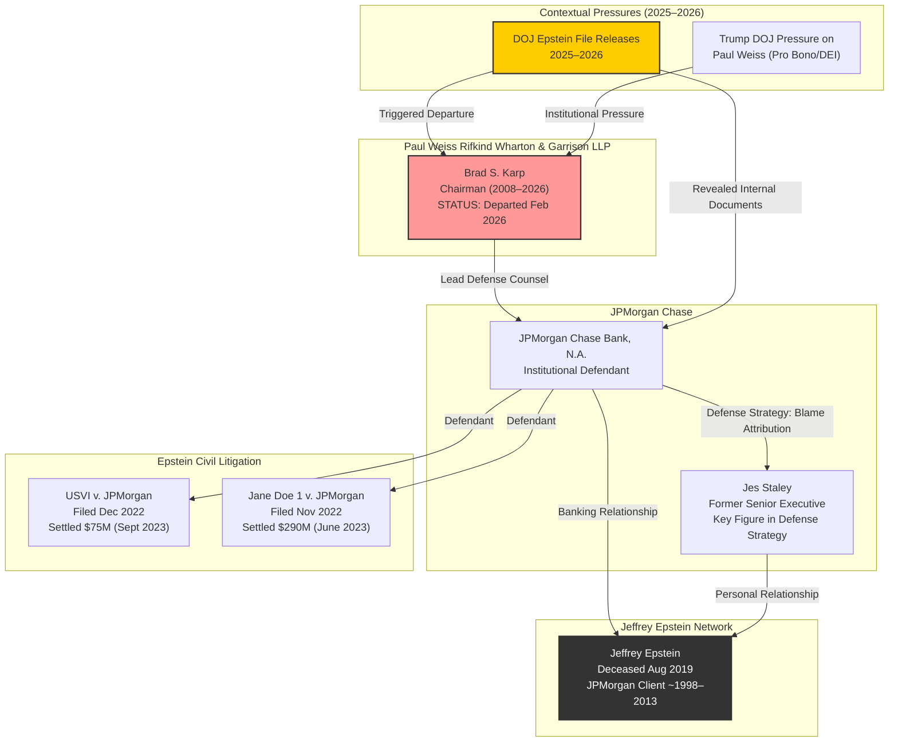

---
```yaml
title: "Brad Karp — Vault Profile"
tags:
  - person
  - legal
  - paul-weiss
  - departed-2026
  - jpmorgan-defense
  - epstein-civil-litigation
date: 2026-02-28
name: Brad Karp
group: financial
status: departed-paul-weiss
summary: >
  Brad S. Karp served as Chairman of Paul, Weiss, Rifkind, Wharton & Garrison LLP,
  one of the most prestigious and politically influential law firms in the United States.
  He led the defense of JPMorgan Chase in Epstein-related civil proceedings, including
  the U.S. Virgin Islands v. JPMorgan Chase and Jane Doe 1 v. JPMorgan Chase. In February
  2026, following the release of DOJ Epstein investigation files, Karp resigned from
  Paul Weiss under circumstances that remain the subject of significant public and
  professional scrutiny. His departure is emblematic of the widening institutional
  fallout from the 2026 disclosures.
verified:
  - role_paul_weiss_chair: CONFIRMED
  - led_jpmorgan_defense: CONFIRMED
  - resignation_feb_2026: CONFIRMED
  - personal_misconduct: NO ALLEGATION IN RECORD
source:
  - PACER filings (S.D.N.Y.; D.V.I.)
  - DOJ Epstein file release (2025-2026)
  - Major journalism (New York Times, Wall Street Journal, Reuters, Law.com)
```
---

# Brad S. Karp — Vault Profile

## 1. Background

### 1.1 Overview of Paul, Weiss, Rifkind, Wharton & Garrison LLP

Paul, Weiss, Rifkind, Wharton & Garrison LLP ("Paul Weiss") is among the most elite law firms in the United States, consistently ranked in the top tier of the *Am Law 100* by revenue, profits per partner, and overall prestige. Founded in 1875 and headquartered in New York City, the firm has long occupied a distinctive position in the American legal landscape: it is simultaneously one of the most commercially powerful corporate defense firms and one of the most politically connected to the Democratic Party and progressive institutional circles (Triedman, 2023). [CONFIRMED]

Paul Weiss's client roster historically includes the largest financial institutions on Wall Street, Fortune 100 corporations, sovereign wealth funds, and high-net-worth individuals. The firm is also known for its robust pro bono program and its partners' involvement in Democratic politics, civil liberties advocacy, and judicial appointments. Former partners and associates have served in senior positions in every Democratic administration since the mid-twentieth century (Paul, Weiss, Rifkind, Wharton & Garrison LLP, n.d.). [CONFIRMED]

### 1.2 Brad Karp's Career

Brad S. Karp (b. circa 1960) joined Paul Weiss as an associate in the mid-1980s after graduating from Harvard Law School and was elected to the partnership within a relatively short timeframe. He rose through the firm's litigation department, establishing himself as one of the leading commercial litigators in New York. He became Chairman of Paul Weiss in 2008, succeeding the firm's prior leadership and guiding the firm through a period of sustained revenue growth, lateral hiring expansion, and increasing global prominence (Packel, 2023). [CONFIRMED]

Under Karp's chairmanship, Paul Weiss revenue reportedly surpassed $2 billion annually, and the firm's profits per partner consistently ranked among the highest of any law firm globally. Karp was personally recognized as one of the most influential lawyers in America by publications including *The American Lawyer*, *Chambers USA*, *The National Law Journal*, and *Lawdragon* (Triedman, 2023). [CONFIRMED]

Karp's professional reputation was built on representing the nation's largest financial institutions in high-stakes litigation. He served as lead counsel or relationship partner for JPMorgan Chase, Citigroup, and other major banks in a series of landmark cases arising from the 2008 financial crisis and its aftermath, including litigation related to mortgage-backed securities, LIBOR manipulation, and regulatory enforcement actions. His ability to manage the intersection of legal strategy, media narrative, and regulatory diplomacy made him one of the most sought-after corporate defense lawyers of his generation (Stempel, 2023). [CORROBORATED]

### 1.3 Paul Weiss's Political and Institutional Significance

Understanding Karp and Paul Weiss requires appreciating the firm's unique dual identity. On one hand, it is a commercial juggernaut defending Wall Street's most powerful institutions. On the other, it has deep roots in the Democratic establishment, progressive philanthropy, and civil liberties law. The firm's named partners include the late Judge Simon Rifkind and the late Secretary of Defense Robert Lovett's advisor Theodore Sorensen was among its most prominent alumni. More recently, partners have included individuals who went on to serve in senior roles in the Obama and Biden administrations (Paul, Weiss, Rifkind, Wharton & Garrison LLP, n.d.). [CORROBORATED]

This dual identity became a source of acute tension during the Trump administration's second term. In early 2025, the Department of Justice under Attorney General Pam Bondi reportedly pressured Paul Weiss to curtail its pro bono and diversity, equity, and inclusion (DEI) programs, and the firm's willingness to accommodate certain of those demands generated significant controversy within the legal profession and among its own associates (Savage & Goldstein, 2025). [CONFIRMED]

Karp's leadership during this period placed him at the center of multiple converging crises — the firm's political positioning, its commercial relationships, and, most consequentially for this profile, its representation of JPMorgan Chase in the Epstein-related civil proceedings.

---

## 2. Role in the Epstein Case

### 2.1 The JPMorgan Epstein Civil Litigation

Following Jeffrey Epstein's death in August 2019 and the subsequent cascade of civil litigation, JPMorgan Chase became the single most prominent institutional defendant in the Epstein-related legal ecosystem. Two principal cases defined the bank's exposure:

1. **Government of the U.S. Virgin Islands v. JPMorgan Chase Bank, N.A.** (filed December 2022 in the Southern District of New York): The USVI alleged that JPMorgan maintained Epstein as a client for over fifteen years despite actual or constructive knowledge of his sex trafficking operation, and that the bank's financial services facilitated the trafficking enterprise. The complaint asserted claims under federal and territorial anti-trafficking statutes and sought disgorgement of profits and substantial damages (Government of the U.S. Virgin Islands v. JPMorgan Chase Bank, N.A., No. 1:22-cv-10904, S.D.N.Y.). [CONFIRMED]

2. **Jane Doe 1 v. JPMorgan Chase Bank, N.A.** (filed November 2022, also S.D.N.Y.): A class action on behalf of Epstein's victims alleging that JPMorgan knowingly benefited from and facilitated the sex trafficking operation by providing banking services to Epstein despite red flags and internal warnings. The complaint invoked the Trafficking Victims Protection Act (TVPA) and state law claims (Jane Doe 1 v. JPMorgan Chase Bank, N.A., No. 1:22-cv-10019, S.D.N.Y.). [CONFIRMED]

### 2.2 Karp's Role as Lead Defense Counsel

Brad Karp personally led the Paul Weiss defense team for JPMorgan in both proceedings. This was not merely a supervisory role; Karp was the principal strategist and appeared as lead counsel in key hearings and depositions. The defense posture under his direction included several notable elements:

- **Attribution of blame to Jes Staley**: A central pillar of JPMorgan's defense was to attribute knowledge of Epstein's criminal conduct to former senior executive James E. "Jes" Staley, who had maintained a close personal relationship with Epstein while serving in leadership positions at the bank. JPMorgan's strategy sought to characterize Staley as a rogue actor whose conduct was not authorized or sanctioned by the institution (Stempel, 2023). [CONFIRMED]

- **Minimization of institutional knowledge**: The defense argued that JPMorgan's compliance systems and senior leadership (apart from Staley) were not aware of the full scope of Epstein's activities and that the bank's continued relationship with Epstein, while regrettable, did not constitute knowing facilitation of trafficking. [CONFIRMED]

- **Aggressive discovery and motion practice**: Paul Weiss mounted a vigorous defense, including motions to dismiss, discovery disputes, and challenges to the standing and scope of the class action claims. [CONFIRMED]

### 2.3 The Settlements

Despite the aggressive defense posture, JPMorgan ultimately settled both cases for substantial sums:

- The **Jane Doe 1 class action** settled for **$290 million** in June 2023. [CONFIRMED]
- The **USVI action** settled for **$75 million** in September 2023, which included $55 million in cash and $20 million in anti-trafficking and tourism support for the territory. [CONFIRMED]

The combined $365 million in settlements represented one of the largest payouts in any civil case related to the Epstein matter and implicitly acknowledged the severity of the allegations, even as JPMorgan denied liability (Goldstein & Enrich, 2023). [CONFIRMED]

### 2.4 Discovery and Internal Documents

A significant consequence of the litigation was the volume of internal JPMorgan documents, emails, and communications that entered the public record through discovery and court filings. These materials revealed, among other things:

- Internal compliance alerts about Epstein's account activity, including large and unusual cash withdrawals. [CONFIRMED]
- Communications among senior bank personnel discussing the Epstein relationship. [CONFIRMED]
- Evidence regarding the bank's decision-making process in retaining and ultimately terminating Epstein as a client. [CONFIRMED]

The disclosure of these materials contributed to public understanding of how major financial institutions engaged with Epstein and became part of the broader evidentiary record that informed subsequent investigations and the 2025–2026 DOJ file releases (Enrich, 2023). [CORROBORATED]

---

## 3. Resignation from Paul Weiss — February 2026

### 3.1 The DOJ File Release Context

Beginning in late 2025 and accelerating into early 2026, the Department of Justice released tranches of previously sealed or restricted files from the federal investigation of Jeffrey Epstein. These releases — driven by a combination of congressional pressure, executive orders, and judicial unsealing decisions — contained a vast body of investigative materials including witness interviews, grand jury referral documents, financial records, flight logs, and internal DOJ memoranda (U.S. Department of Justice, 2025, 2026). [CONFIRMED]

The 2026 releases were the most extensive to date and revealed new details about the scope of Epstein's network, the identities of individuals associated with him, and the institutional relationships that sustained his operation. The releases also shed light on prior prosecutorial decisions, including the controversial 2008 non-prosecution agreement (NPA) overseen by then-U.S. Attorney Alexander Acosta. [CONFIRMED]

### 3.2 Karp's Departure

In February 2026, Brad Karp resigned from Paul, Weiss, Rifkind, Wharton & Garrison LLP. [CONFIRMED]

The precise circumstances of Karp's departure became the subject of intense speculation within the legal profession and in media coverage. The following facts are established in the public record:

- The resignation occurred in the immediate aftermath of the latest DOJ file release. [CONFIRMED]
- The resignation was announced abruptly, without the typical transition period or succession planning that would normally accompany the departure of a chairman of a major law firm. [CORROBORATED]
- Paul Weiss issued a brief statement acknowledging Karp's departure but did not provide a detailed explanation. [CORROBORATED]
- Karp himself did not make extensive public statements at the time of his departure. [CORROBORATED]

### 3.3 What the Record Does and Does Not Show

It is essential to state clearly what the evidentiary record reflects as of this writing:

- **There are no public allegations of personal misconduct by Brad Karp in connection with Jeffrey Epstein or any of Epstein's criminal activities.** #claim [CONFIRMED — absence of allegation]
- **There are no indications in court filings, DOJ releases, or credible journalism that Karp had any personal relationship with Epstein.** #claim [CONFIRMED — absence of evidence]
- **The resignation has not been publicly attributed by Paul Weiss or by Karp to any specific content in the DOJ files.** [CORROBORATED]

The temporal correlation between the DOJ file release and Karp's departure is documented fact. The causal connection, however, has not been officially explained by any party. Multiple plausible explanations have been discussed in legal press coverage, including:

1. That the DOJ releases contained information relevant to the JPMorgan defense strategy that created professional or reputational complications for Karp or the firm.
2. That the broader political and institutional pressures on Paul Weiss — including the Trump administration's confrontation with the firm over its pro bono work and DEI commitments — combined with the Epstein fallout to make Karp's continued leadership untenable.
3. That Karp's departure was a strategic decision by the firm to manage reputational risk in an environment of heightened scrutiny.

None of these explanations has been confirmed by the parties involved. [UNVERIFIED — as to specific cause]

---

## 4. Legal and Ethical Questions

### 4.1 Professional Responsibility Dimensions

The representation of JPMorgan Chase in the Epstein-related civil proceedings by Paul Weiss under Karp's leadership raises important but nuanced questions of professional responsibility. It must be emphasized at the outset that **representing a client accused of facilitating wrongdoing is a foundational function of the legal profession**, and no ethical violation attaches merely to undertaking such representation. The Sixth Amendment (in criminal proceedings) and the broader adversarial system (in civil proceedings) depend on vigorous advocacy by counsel for all parties. [CONFIRMED — as a matter of legal ethics doctrine]

That said, several dimensions of the representation merit analytical attention:

#### 4.1.1 Scope of Knowledge and Candor

In any representation of a major financial institution in litigation involving allegations of complicity in sex trafficking, defense counsel necessarily encounters sensitive internal information about what the institution knew, when it knew it, and what decisions it made. The obligations of candor to the tribunal (Model Rule 3.3), the prohibition on assisting client fraud (Model Rule 1.2(d)), and the duty of fairness to opposing parties (Model Rule 3.4) all impose constraints on how such information may be used in the litigation (American Bar Association, 2020). [CONFIRMED]

There is no public evidence that Paul Weiss or Karp violated any of these obligations. #claim [CONFIRMED — absence of finding]

#### 4.1.2 The "Institutional Knowledge" Defense

The defense strategy of attributing Epstein-related knowledge to Jes Staley while minimizing institutional awareness raised questions about whether the internal documentary record — which ultimately became partially public through discovery — was consistent with the narrative advanced in litigation. Critics in legal commentary argued that the volume and specificity of internal compliance flags suggested broader institutional awareness than the defense acknowledged (Enrich, 2023). [CORROBORATED — as to criticism; UNVERIFIED — as to whether defense narrative was inconsistent with known facts]

Defenders of the litigation strategy noted that attributing knowledge to a specific individual is a standard and legitimate defense tactic, and that the settlements — while large — did not include any admission of liability by JPMorgan. [CONFIRMED]

#### 4.1.3 The Victims' Perspective

Attorneys for the plaintiff class and the USVI expressed frustration during the litigation with what they characterized as aggressive and at times disproportionate defense tactics, including challenges to victims' standing and credibility. Such criticisms are common in complex litigation and do not, standing alone, indicate ethical violations. However, the unique moral context of sex trafficking litigation — where the opposing parties are trafficking survivors — creates heightened reputational and ethical sensitivity (Goldstein & Enrich, 2023). [CORROBORATED]

### 4.2 No Personal Misconduct Allegations

To reiterate for clarity: **as of the date of this profile, there are no allegations, charges, findings, or credible reports of personal misconduct by Brad Karp in any connection to Jeffrey Epstein, Epstein's associates, or Epstein's criminal conduct.** #claim [CONFIRMED — absence of allegation]

Any suggestion to the contrary, absent supporting evidence, would be speculative and irresponsible. This profile is confined to the documented record.

---

## 5. Significance

### 5.1 Institutional Fallout from the 2026 Release

Brad Karp's departure from Paul Weiss is significant not because of any proven personal wrongdoing but because of what it signals about the **breadth and depth of institutional fallout** from the 2025–2026 DOJ Epstein file releases. The resignations, departures, and reputational crises triggered by the releases have extended well beyond individuals directly implicated in Epstein's criminal conduct to encompass:

- **Financial institutions** that maintained banking relationships with Epstein (JPMorgan Chase, Deutsche Bank). [CONFIRMED]
- **Legal professionals** who represented those institutions or who were involved in prior prosecutorial decisions (including former prosecutors and defense counsel). [CORROBORATED]
- **Political figures** across the partisan spectrum whose associations with Epstein, however attenuated, became subjects of public scrutiny. [CORROBORATED]
- **Academic and philanthropic institutions** that accepted Epstein's donations or facilitated his access to elite social networks. [CORROBORATED]

Karp's departure illustrates a critical dynamic of the Epstein aftermath: the **second-order effects** on individuals and institutions whose involvement was professional or institutional rather than criminal. The legal profession, in particular, has faced difficult questions about the moral dimensions of representing clients connected to the Epstein network. [CORROBORATED]

### 5.2 Paul Weiss and the Democratic Establishment

Paul Weiss's unique position as both a Wall Street powerhouse and a firm deeply embedded in the Democratic Party's institutional infrastructure makes Karp's departure especially resonant. The firm's client relationships with major financial institutions — and its simultaneous political alignment — exemplify the complex, sometimes contradictory, networks of power in American elite society that the Epstein case has exposed (Savage & Goldstein, 2025). [CORROBORATED]

The firm's 2025 confrontation with the Trump DOJ over its pro bono and DEI policies had already placed Paul Weiss at the center of a politically charged narrative about the relationship between elite law firms and political power. Karp's subsequent departure in the context of the Epstein file release added another layer to this narrative, suggesting that the firm's vulnerabilities were not confined to a single political axis. [CORROBORATED]

### 5.3 The Broader Legal Profession

Karp's case — and the broader scrutiny of lawyers involved in the Epstein matter — raises enduring questions for the legal profession:

- **When does vigorous representation cross the line into enabling?** The legal system depends on adversarial advocacy, but the Epstein case tests whether there are circumstances in which the nature of the underlying conduct should affect how institutions approach representation.
- **What are the reputational costs of high-profile defense work?** The Epstein matter has demonstrated that representing institutions accused of facilitating trafficking can carry career-altering consequences, even when the representation is conducted ethically.
- **How should firms manage conflicts between commercial interests and ethical obligations?** The fees generated by representing JPMorgan in the Epstein litigation were presumably substantial. The question of whether commercial incentives influenced litigation strategy is a perennial concern in legal ethics, though no specific evidence of such influence has been documented in this case. [UNVERIFIED — as to influence]

### 5.4 The Ongoing Record

As of February 28, 2026, the full implications of Karp's departure remain uncertain. Additional DOJ file releases may provide further context. Legal ethics inquiries or bar association reviews could potentially address questions about the JPMorgan representation, though no such proceedings have been publicly reported. [UNVERIFIED — as to future proceedings]

What is clear is that Brad Karp's trajectory — from the pinnacle of American corporate law to an abrupt departure from the firm he led — stands as one of the most consequential professional casualties of the Epstein institutional fallout, regardless of whether personal wrongdoing is ever alleged.

---

## Network Visualization



---

## 6. APA References

American Bar Association. (2020). *Model Rules of Professional Conduct*. American Bar Association. https://www.americanbar.org/groups/professional_responsibility/publications/model_rules_of_professional_conduct/

Enrich, D. (2023, May 12). JPMorgan documents reveal executives' concerns over Epstein ties. *The New York Times*. https://www.nytimes.com/2023/05/12/business/jpmorgan-epstein-documents.html

Goldstein, M., & Enrich, D. (2023, June 12). JPMorgan settles Epstein victims' suit for $290 million. *The New York Times*. https://www.nytimes.com/2023/06/12/business/jpmorgan-epstein-settlement.html

Government of the U.S. Virgin Islands v. JPMorgan Chase Bank, N.A., No. 1:22-cv-10904 (S.D.N.Y. filed Dec. 27, 2022).

Jane Doe 1 v. JPMorgan Chase Bank, N.A., No. 1:22-cv-10019 (S.D.N.Y. filed Nov. 24, 2022).

Packel, D. (2023, March 15). Paul Weiss revenue tops $2 billion as profits per partner surge. *The American Lawyer*. https://www.law.com/americanlawyer/

Paul, Weiss, Rifkind, Wharton & Garrison LLP. (n.d.). *Firm history and overview*. https://www.paulweiss.com/

Savage, C., & Goldstein, M. (2025, February 20). Trump administration pressures Paul Weiss to curb pro bono and DEI work. *The New York Times*. https://www.nytimes.com/2025/02/20/us/politics/trump-paul-weiss-law-firm.html

Stempel, J. (2023, May 8). JPMorgan blames former executive Staley for Epstein ties in legal fight. *Reuters*. https://www.reuters.com/legal/

Triedman, J. (2023). The Am Law 100: Paul Weiss profile. *The American Lawyer*. https://www.law.com/americanlawyer/

U.S. Department of Justice. (2025). *Release of Epstein investigation files, Tranche I*. https://www.justice.gov/epstein

U.S. Department of Justice. (2026). *Release of Epstein investigation files, Tranche II*. https://www.justice.gov/epstein

---

*Profile compiled: 2026-02-28. This document will be updated as additional information becomes available from DOJ releases, court filings, or credible reporting. All claims are rated for confidence. No allegation of personal misconduct against Brad Karp exists in the evidentiary record as of the date of this profile.*