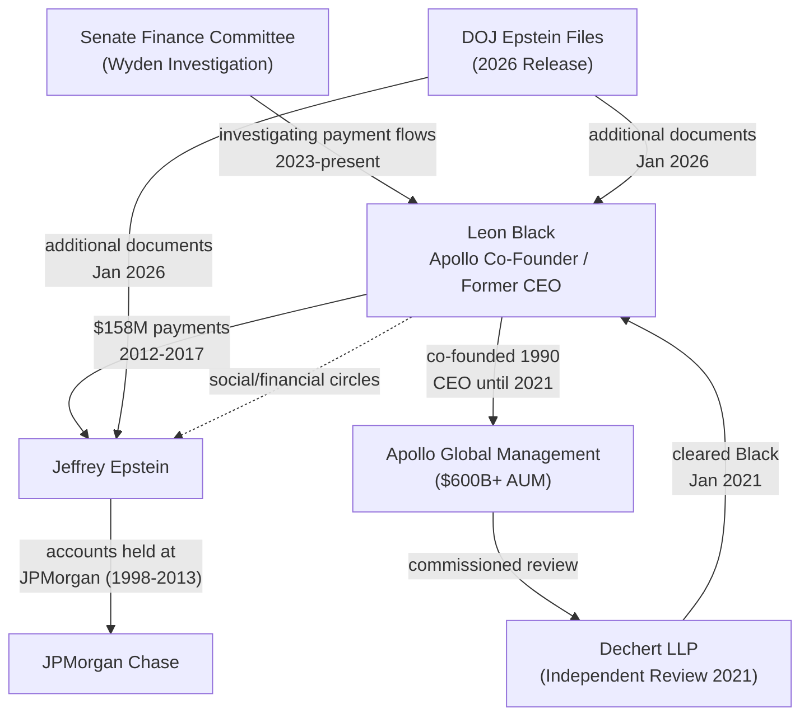

# Leon Black

> **Paid Jeffrey Epstein approximately $158 million between 2012 and 2017.** Co-founder and former CEO/Chairman of Apollo Global Management, one of the world's largest alternative asset management firms ($600B+ AUM). Stepped down as Apollo CEO in March 2021 and as Chairman in July 2021 following an independent review by Dechert LLP commissioned by Apollo's board. The review characterized the payments as for legitimate tax and estate planning services but acknowledged them as "extraordinarily large." Senate Finance Committee investigation (2023-present) is examining whether payments financed Epstein's trafficking operations. **No criminal charges filed as of February 28, 2026.** Unproven allegations tagged #claim.

---

## Biographical Data [CONFIRMED]

| Field | Value |
|-------|-------|
| Full name | Leon David Black |
| Born | July 31, 1951, New York City, New York |
| Nationality | American |
| Education | Dartmouth College (BA); Harvard Business School (MBA) |
| Net worth (approx.) | ~$10 billion (Forbes, 2025 estimate) |
| Company | Apollo Global Management (co-founder, former CEO/Chairman) |
| Prior career | Drexel Burnham Lambert (1977-1990) |
| Criminal charges | None as of 2026-02-28 |

---

## Background [CONFIRMED]

Leon Black is one of the most prominent figures in American private equity. He co-founded Apollo Global Management in 1990 after the collapse of Drexel Burnham Lambert, where he had been a senior managing director under Michael Milken.

### Career at Apollo

- Co-founded Apollo Global Management in 1990 with Josh Harris and Marc Rowan
- Built Apollo into one of the "Big Three" alternative asset managers alongside Blackstone and KKR
- Apollo manages over $600 billion in assets under management (AUM) across private equity, credit, and real assets
- Black served as Chairman and CEO for over three decades
- Stepped down as CEO in March 2021; stepped down as Chairman in July 2021
- Marc Rowan succeeded Black as CEO
- Black retained his ownership stake in Apollo and remained involved as a board member before fully departing

### Philanthropy and Public Profile

- Major donor to cultural institutions including the Museum of Modern Art (MoMA), where he served as Chairman of the Board
- Philanthropic activities through the Debra and Leon Black Family Foundation
- Known collector of art, with holdings reportedly valued in the billions

---

## Connection to Jeffrey Epstein [CONFIRMED]

### The $158 Million in Payments (2012-2017)

The central documented financial connection between Black and Epstein consists of approximately $158 million in payments from Black to Epstein over a five-year period.

| Field | Detail |
|-------|--------|
| Period | 2012-2017 |
| Total payments | ~$158 million |
| Stated purpose | Tax and estate planning advisory services |
| Context | All payments made after Epstein's 2008 Florida conviction |
| Disclosed by | Dechert LLP independent review (January 25, 2021) |

### Nature of the Relationship

- Black and Epstein were introduced in the 1990s through financial and social circles
- Epstein provided tax and estate planning advice to Black
- Black's representatives stated that Epstein's advice was "vetted by other professional advisors" and resulted in significant tax savings
- The Dechert LLP review found the payments were for "bona fide services"
- However, the scale of payments -- $158 million for advisory work -- was described as "extraordinarily large" relative to the work product, even by industry standards
- Black continued engaging Epstein after the 2008 conviction, when Epstein was a registered sex offender

### Timeline of Key Events

| Date | Event | Confidence |
|------|-------|------------|
| 1990s | Black and Epstein introduced | [CORROBORATED] |
| 2008 | Epstein convicted in Florida; registered as sex offender | [CONFIRMED] |
| 2012-2017 | $158 million in payments from Black to Epstein | [CONFIRMED -- Dechert review] |
| July 2019 | Epstein arrested on federal sex trafficking charges | [CONFIRMED] |
| August 2019 | Epstein death in custody | [CONFIRMED] |
| Jan 25, 2021 | Dechert LLP review published; findings disclosed | [CONFIRMED] |
| March 2021 | Black steps down as Apollo CEO | [CONFIRMED] |
| July 2021 | Black steps down as Apollo Chairman | [CONFIRMED] |
| July 2023 | Senate Finance Committee opens investigation | [CONFIRMED] |
| March 2025 | Wyden releases new evidence on payment flows | [CONFIRMED] |
| Jan-Feb 2026 | Apollo named in context of 2026 DOJ file release | [CORROBORATED] |

---

## Dechert LLP Independent Review (2021) [CONFIRMED]

Apollo's Board of Directors commissioned an independent review conducted by law firm Dechert LLP.

| Field | Detail |
|-------|--------|
| Commissioned by | Apollo Global Management Conflicts Committee |
| Outside counsel | Dechert LLP |
| Documents reviewed | 60,000+ emails, texts, and documents |
| Interviews conducted | 20+ individuals |
| Publication date | January 25, 2021 |

### Key Findings

1. **Payments were for bona fide services**: The review concluded that the $158 million was paid for legitimate tax and estate planning advice
2. **No evidence of criminal involvement**: The review found no evidence that Black participated in or was aware of Epstein's criminal activities
3. **Magnitude acknowledged**: The review acknowledged the payments were large, but attributed this to the complexity and value of the tax strategies involved
4. **No Apollo funds involved**: Black's payments to Epstein came from Black's personal wealth, not from Apollo corporate funds
5. **Limitation**: The review was commissioned by Apollo's board and relied on cooperation from Black; it was not a law enforcement investigation with subpoena power

### Critical Assessment

The Dechert review has been scrutinized on several grounds:

- It was commissioned and paid for by Apollo, creating potential conflicts of interest #claim
- It did not have access to Epstein's records (Epstein was deceased)
- The $158 million figure is orders of magnitude larger than typical advisory fees, even for ultra-high-net-worth individuals
- Senate Finance Committee later uncovered additional payment flows not fully addressed in the review #claim

---

## Congressional Investigation [CONFIRMED]

### Senate Finance Committee (2023-Present)

| Date | Action |
|------|--------|
| July 25, 2023 | Sen. Ron Wyden (D-OR), Finance Committee Chairman, formally opens investigation into Black's Epstein payments |
| March 12, 2025 | Wyden (now Ranking Member) releases new information; evidence that payments may have financed Epstein's trafficking operations; requests documents from Trump Administration |
| 2026 | Investigation ongoing per public record |

### Key Congressional Findings

- Wyden's investigation traced payment flows between Black and Epstein, examining how funds were subsequently deployed
- March 2025 release suggested evidence that some of Black's payments to Epstein may have been used to fund Epstein's trafficking operation #claim
- Wyden requested documents from the Trump Administration regarding the DOJ's handling of Epstein financial records
- The investigation has not resulted in a criminal referral as of February 2026

---

## 2026 DOJ Epstein Files [CORROBORATED]

The January 30, 2026 release of DOJ Epstein files under the Epstein Files Transparency Act produced additional documentation regarding the Black-Epstein financial relationship:

- CNN Business (February 21, 2026): "How Wall Street's Apollo got tangled up again in the Epstein files" -- reporting on documents showing the depth of the Black-Epstein advisory relationship
- Al Jazeera (February 25, 2026): Coverage of how "banks and billionaires aided Epstein after his 2008 conviction," with Black prominently featured
- Air Mail (December 2025): Multi-part investigation series "The $158-170 Million Question" examining the payment structure

---

## Current Legal and Institutional Status [CONFIRMED]

| Item | Status as of 2026-02-28 |
|------|-------------------------|
| Criminal charges | None |
| Apollo role | Departed (CEO March 2021, Chairman July 2021) |
| Senate investigation | Ongoing |
| Civil litigation | Black named in civil complaints related to Epstein; no public judgments against him |
| MoMA role | Stepped down as Chairman |
| Public statements | Black has denied any knowledge of Epstein's criminal activities |

---

## Unresolved Intelligence Questions

1. How were the $158 million in payments structured, and what specific services were provided to justify this amount?
2. Did any of Black's payments to Epstein flow to entities or individuals involved in Epstein's trafficking operation?
3. What additional documentation exists in the 2026 DOJ files regarding the Black-Epstein financial relationship?
4. Why did Black continue to engage Epstein after the 2008 conviction, when Epstein was a known convicted sex offender?
5. What is the status of the Senate Finance Committee's document requests to the Trump Administration?

---

## Network Diagram

---

## OSINT Research Tasks

- [ ] Apollo.com -- January 2021 Dechert independent review press release (public)
- [ ] Senate Finance Committee -- Wyden investigation documents (Jul 2023, Mar 2025) at finance.senate.gov
- [ ] SEC EDGAR -- Apollo Global Management filings (public)
- [ ] DOJ.gov/epstein -- 2026 files referencing Black/Apollo
- [ ] CNBC -- "Apollo CEO Leon Black paid Epstein $158 million" (Jan 2021)
- [ ] CNN Business -- "How Wall Street's Apollo got tangled up again" (Feb 21, 2026)
- [ ] Air Mail investigation -- "The $158-170 Million Question" series (Dec 2025)
- [ ] PACER -- civil litigation filings naming Black in Epstein-related suits
- [ ] Forbes -- Black net worth / Apollo valuation history

---

## References

1. CNBC. (2021, January 25). Apollo Global CEO Leon Black paid Epstein $158 million for financial advice after conviction. https://www.cnbc.com/2021/01/25/apollos-leon-black-to-retire-as-ceo-but-remain-chairman-after-he-is-cleared-in-internal-epstein-probe.html

2. Apollo Global Management. (2021, January 25). Independent review press release. https://www.apollo.com/insights-news/pressreleases/2021/01/apollo-global-management-announces-conclusion-and-release-of-independent-review-211549270

3. New York Times. (2021, March 22). Leon Black to step down as Apollo CEO after review of Epstein ties. *The New York Times*.

4. U.S. Senate Finance Committee. (2023, July 25). Wyden unveils ongoing investigation into private equity billionaire Leon Black's tax planning and financial ties with Jeffrey Epstein. https://www.finance.senate.gov/chairmans-news/wyden-unveils-ongoing-investigation-into-private-equity-billionaire-leon-blacks-tax-planning-and-financial-ties-with-jeffrey-epstein

5. U.S. Senate Finance Committee. (2025, March 12). Wyden releases new information on financing of Jeffrey Epstein's operations by billionaire Leon Black. https://www.finance.senate.gov/ranking-members-news/wyden-releases-new-information-on-financing-of-jeffrey-epsteins-operations-by-billionaire-leon-black-seeks-documents-from-trump-administration

6. Air Mail. (2025, December 13). The $158-170 million question Part III. https://airmail.news/issues/2025-12-13/the-158-170-million-question-part-iii

7. CNN Business. (2026, February 21). How Wall Street's Apollo got tangled up again in the Epstein files. https://www.cnn.com/2026/02/21/business/apollo-epstein-wall-street

8. Al Jazeera. (2026, February 25). How banks and billionaires aided Epstein after his 2008 conviction.

---

*[[Investigations/Epstein/Epstein]] | [[Findings/2026-DOJ-Epstein-Files-Release]] | [[Findings/Epstein-Financial-Network]] | [[People/Jeffrey-Epstein]] | [[SOPs/README]]*
