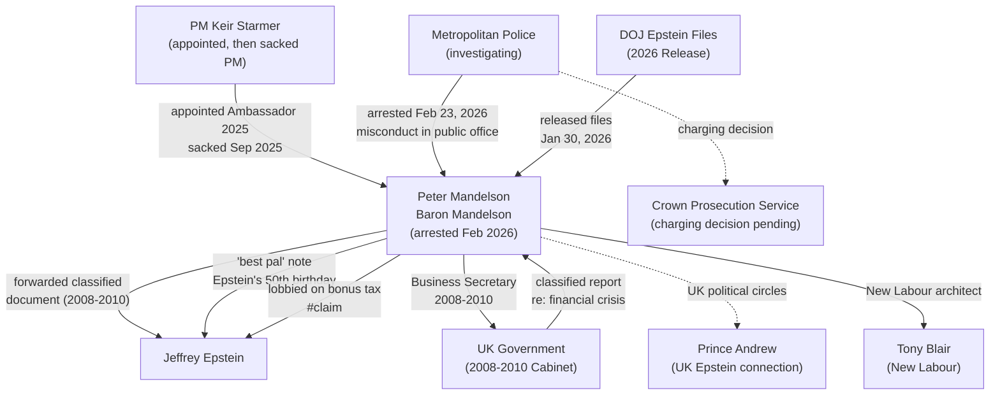

# Peter Mandelson

> **Arrested February 23, 2026 by Metropolitan Police (London).** Peter Benjamin Mandelson, Baron Mandelson -- former UK Ambassador to the United States, former Secretary of State for Business, former EU Trade Commissioner, and key architect of New Labour under Tony Blair and Gordon Brown. Released on bail February 24, 2026. Under investigation for suspected misconduct in public office: specifically, the alleged passing of a classified UK government report to Jeffrey Epstein during the 2008 financial crisis. Previously sacked as UK Ambassador to the US in September 2025 following earlier Epstein file revelations. **Not charged as of February 28, 2026.** Unproven allegations tagged #claim.

---

## Biographical Data [CONFIRMED]

| Field | Value |
|-------|-------|
| Full name | Peter Benjamin Mandelson, Baron Mandelson |
| Born | October 21, 1953, Hampstead Garden Suburb, London |
| Nationality | British |
| Party | Labour |
| Peerage | Created Baron Mandelson, 2008 (Life Peer) |
| Education | St Catherine's College, Oxford (PPE) |
| Criminal charges | Not charged as of 2026-02-28; under investigation |

---

## Background [CONFIRMED]

Peter Mandelson is one of the most consequential and controversial figures in modern British politics. As a principal architect of "New Labour," he was instrumental in transforming the Labour Party in the 1990s and engineering Tony Blair's 1997 election victory.

### Political Career

| Period | Position |
|--------|----------|
| 1992-2004 | Member of Parliament for Hartlepool |
| 1997-1998 | Secretary of State for Trade and Industry (first cabinet stint) |
| 1999-2001 | Secretary of State for Northern Ireland (second cabinet stint) |
| 2004-2008 | European Commissioner for Trade (Brussels) |
| 2008-2010 | Secretary of State for Business, Innovation and Skills; First Secretary of State; Lord President of the Council |
| 2008 | Created Baron Mandelson (Life Peer) |
| 2025 | UK Ambassador to the United States (appointed by PM Keir Starmer) |
| Sep 2025 | Sacked as US Ambassador over Epstein file revelations |

### Prior Controversies

Mandelson resigned from cabinet twice before the Epstein connection emerged:

1. **1998**: Resigned as Trade Secretary over an undisclosed home loan from fellow minister Geoffrey Robinson
2. **2001**: Resigned as Northern Ireland Secretary over the Hinduja passport affair

These prior incidents established a pattern of controversy around Mandelson's judgment regarding personal relationships and financial entanglements, though neither involved criminal conduct.

---

## Connection to Jeffrey Epstein [CORROBORATED]

### Overview of Relationship

Mandelson's connection to Epstein became a matter of significant public concern through multiple waves of disclosure:

1. **Pre-2025**: Mandelson had previously acknowledged knowing Epstein socially but denied any knowledge of criminal activity
2. **2025 (first tranche)**: Epstein files released in 2025 revealed a handwritten note from Mandelson to Epstein calling him "my best pal" for Epstein's 50th birthday
3. **January 30, 2026 (second tranche)**: Full DOJ file release under the Epstein Files Transparency Act revealed correspondence showing Mandelson forwarded classified UK government material to Epstein

### The Classified Document Allegation [CORROBORATED]

The most serious allegation against Mandelson, and the basis for his arrest, involves the forwarding of classified UK government material to Epstein.

| Field | Detail |
|-------|--------|
| Period | 2008-2010 (when Mandelson was Business Secretary) |
| Document type | Internal UK government report |
| Subject matter | How the UK might raise funds in the aftermath of the 2008 financial crisis |
| Classification | Internal/classified government document (not publicly released) |
| Allegation | Mandelson forwarded this report to Epstein via email |
| Source | DOJ Epstein files (January 30, 2026 release) |
| Confidence | [CORROBORATED] -- based on multiple reporting sources citing DOJ documents |

This is the primary basis for the Metropolitan Police investigation and the arrest on suspicion of misconduct in public office.

### The Bonus Tax Lobbying Allegation [SINGLE SOURCE]

A separate email in the DOJ files appears to show Mandelson telling Epstein that he would lobby other UK government officials to reduce a tax on bankers' bonuses. #claim

- This allegation is under investigation
- If substantiated, it could indicate that Mandelson used his cabinet position to advance Epstein's financial interests
- No independent verification beyond the email itself has been publicly reported

### The "Best Pal" Note [CONFIRMED]

| Field | Detail |
|-------|--------|
| Disclosed | 2025 (first tranche of Epstein files) |
| Content | Handwritten note from Mandelson to Epstein for Epstein's 50th birthday |
| Text | Called Epstein "my best pal" |
| Consequence | Led to Mandelson's sacking as UK Ambassador in September 2025 |

---

## Arrest and Legal Proceedings [CONFIRMED]

### Arrest Details

| Field | Detail |
|-------|--------|
| Date arrested | February 23, 2026 |
| Arresting force | Metropolitan Police Service (London) |
| Location | London |
| Suspicion | Misconduct in public office |
| Released | February 24, 2026 (approximately 2:00 AM); released on bail |
| Maximum sentence (if charged/convicted) | Life imprisonment under UK law |
| Status as of 2026-02-28 | Under investigation; **not charged** |

### Legal Context

Misconduct in public office is a common law offence in England and Wales. It requires proof that:

1. A public officer
2. In the course of or connected to their public office
3. Willfully neglected to perform their duty and/or willfully misconducted themselves
4. To such a degree as to amount to an abuse of the public's trust

If the allegation that Mandelson forwarded classified government material to Epstein is substantiated, this would potentially meet all four elements of the offence.

---

## Political Fallout [CONFIRMED]

### Timeline of Consequences

| Date | Event |
|------|-------|
| 2025 | Appointed UK Ambassador to US by PM Keir Starmer |
| 2025 | "Best pal" note disclosed in first tranche of Epstein files |
| September 2025 | Sacked as UK Ambassador by PM Starmer |
| January 30, 2026 | DOJ releases second tranche of Epstein files; classified document forwarding revealed |
| February 23, 2026 | Arrested by Metropolitan Police |
| February 24, 2026 | Released on bail |

### Impact on UK Government

- The appointment and subsequent sacking of Mandelson caused significant embarrassment to PM Starmer's government
- Starmer faced questions about the vetting process for Mandelson's ambassadorial appointment
- The arrest further intensified UK political and media scrutiny of British figures in the Epstein files

---

## Current Status as of February 28, 2026 [CONFIRMED]

| Item | Status |
|------|--------|
| Criminal charges | Not charged |
| Investigation | Ongoing (Metropolitan Police) |
| Bail conditions | Released on bail (conditions not publicly disclosed) |
| UK Parliament | Retains life peerage (Baron Mandelson) |
| Ambassadorial role | Terminated September 2025 |
| Public statements | Has not made a detailed public response to the 2026 allegations |
| CPS charging decision | Pending |

---

## Unresolved Intelligence Questions

1. What was the specific classified document forwarded to Epstein, and what was its classification level?
2. Did Epstein use the UK government financial crisis document for personal trading advantage or share it with third parties?
3. What was the full extent of Mandelson's lobbying on Epstein's behalf regarding the bankers' bonus tax?
4. Were other UK officials or ministers involved in or aware of the information sharing?
5. When will the Crown Prosecution Service make a charging decision?
6. What was the vetting failure that allowed Mandelson to be appointed Ambassador despite known Epstein connections?

---

## Network Diagram

---

## OSINT Research Tasks

- [ ] DOJ.gov/epstein -- search for Mandelson correspondence (public files)
- [ ] UK Parliament records -- Mandelson ministerial history (public)
- [ ] NPR -- arrest report Feb 23, 2026 (primary source)
- [ ] CNN -- arrest report Feb 23, 2026 (primary source)
- [ ] Washington Post -- arrest report (primary source)
- [ ] Wikipedia -- "Relationship of Peter Mandelson and Jeffrey Epstein" (sourced article)
- [ ] UK Crown Prosecution Service announcements (future charging decisions)
- [ ] UK Hansard -- parliamentary questions regarding Mandelson's ambassadorial appointment
- [ ] Metropolitan Police statements regarding investigation progress

---

## References

1. NPR. (2026, February 23). U.K. ex-envoy to U.S. Peter Mandelson arrested in Epstein probe. https://www.npr.org/2026/02/23/g-s1-111196/uk-peter-mandelson-epstein-misconduct-investigation

2. CNN. (2026, February 23). Former UK ambassador to US Peter Mandelson arrested amid Epstein probe. https://www.cnn.com/2026/02/23/uk/peter-mandelson-arrested-gbr-intl

3. Washington Post. (2026, February 23). Peter Mandelson, former U.K. ambassador, arrested amid Epstein revelations. https://www.washingtonpost.com/world/2026/02/23/mandelson-peter-arrest-epstein-ambassador/

4. CNBC. (2026, February 23). Epstein files: Ex-UK ambassador to U.S. Peter Mandelson released on bail after arrest. https://www.cnbc.com/2026/02/23/epstein-files-peter-mandelson-london-uk.html

5. Al Jazeera. (2026, February 24). Epstein files: The arrests and the resignations. https://www.aljazeera.com/news/2026/2/24/epstein-files-the-arrests-and-the-resignations

6. Wikipedia. (n.d.). Relationship of Peter Mandelson and Jeffrey Epstein. https://en.wikipedia.org/wiki/Relationship_of_Peter_Mandelson_and_Jeffrey_Epstein

7. BBC News. (2025, September). Lord Mandelson sacked as UK Ambassador over Epstein files.

8. U.S. Department of Justice. (2026). Epstein files. https://www.justice.gov/epstein

---

*[[Investigations/Epstein/Epstein]] | [[Findings/2026-DOJ-Epstein-Files-Release]] | [[People/Prince-Andrew]] | [[People/Jeffrey-Epstein]] | [[SOPs/README]]*
