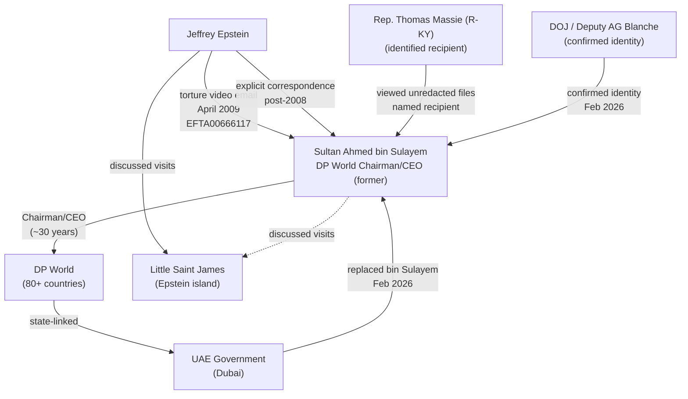

# Sultan Ahmed bin Sulayem

> **Named in DOJ Epstein files (2026 release). Replaced as DP World Chairman/CEO in February 2026.** Identified by the U.S. Department of Justice as the recipient of Jeffrey Epstein's April 2009 email referencing a "torture video" (DOJ file EFTA00666117). Led DP World -- one of the largest port logistics operators in the world, operating across 80+ countries -- for approximately three decades. **No criminal charges have been filed as of February 28, 2026.** All unproven allegations against this living, non-convicted individual are tagged #claim.

---

## Biographical Data [CONFIRMED]

| Field | Value |
|-------|-------|
| Full name | Sultan Ahmed bin Sulayem |
| Nationality | Emirati (United Arab Emirates) |
| Born | c. 1955, Dubai, UAE |
| Position (former) | Chairman and CEO, DP World |
| Position (former) | Chairman, Port & Free Zone World (PCFC) |
| Position (former) | Chairman, Dubai Customs |
| Replaced | February 2026 |
| Criminal charges | None as of 2026-02-28 |

---

## Background [CONFIRMED]

Sultan Ahmed bin Sulayem is a prominent Emirati businessman and one of the most influential figures in global maritime logistics. He served as the Chairman and CEO of DP World, the Dubai-government-linked port operator that is among the five largest in the world by throughput volume.

### Career Overview

- Rose to prominence within Dubai's state-linked economic infrastructure during the emirate's rapid expansion in the 1990s and 2000s
- Appointed Chairman of Dubai Ports Authority, which later merged into DP World
- Led DP World through its global expansion to operations in 80+ countries across six continents
- DP World manages critical port infrastructure including Jebel Ali (Dubai), London Gateway (UK), and facilities in the Americas, Africa, Asia, and Europe
- Served as Chairman of the Ports, Customs and Free Zone Corporation (PCFC), a Dubai government entity overseeing multiple economic zones
- Estimated personal wealth tied to DP World compensation and UAE business holdings

### DP World Strategic Significance

DP World is not merely a commercial entity. As a state-linked operator controlled by Dubai's sovereign wealth apparatus, it occupies a strategically significant position in global trade:

- Handles approximately 10% of global container trade throughput
- Operations in 80+ countries make it one of the most geographically diversified port operators
- Controls critical chokepoint infrastructure across global supply chains
- February 2025: DP World was part of a U.S.-UAE investment deal during the Trump Administration to invest in American ports and infrastructure (CNN Business, 2026)
- The company's reach into sensitive logistics infrastructure raises intelligence and security questions when its leadership is implicated in association with a convicted sex trafficker

---

## Connection to Jeffrey Epstein [CORROBORATED]

### The "Torture Video" Email -- DOJ File EFTA00666117

The central documented connection between bin Sulayem and Epstein is an April 24, 2009 email, disclosed in the DOJ Epstein files released January 30, 2026 under the Epstein Files Transparency Act.

| Field | Detail |
|-------|--------|
| Email date | April 24, 2009 |
| Sender | Jeffrey Epstein |
| Email text | "where are you? are you ok, I loved the torture video." |
| DOJ file reference | EFTA00666117 |
| Recipient (redacted in public release) | Identified as Sultan Ahmed bin Sulayem |
| Congressional identification | Rep. Thomas Massie (R-KY) viewed unredacted documents at DOJ; publicly named the recipient as "a Sultan" |
| DOJ confirmation | Deputy AG Todd Blanche confirmed bin Sulayem's name appears in the unredacted file linked to this email |

**What the "torture video" refers to remains unknown.** No law enforcement agency has publicly characterized the content of this video. No criminal investigation into the email has been publicly announced. [CONFIRMED -- email existence confirmed by DOJ; content/meaning of "torture video" is [UNVERIFIED]]

### Broader Correspondence [CORROBORATED]

Per reporting on the released DOJ documents:

- Bin Sulayem and Epstein exchanged communications over a period of years, described as "often including explicit content" (CNN Business, February 13, 2026)
- The two discussed regional contacts, business matters, and visits to Epstein's Caribbean island, Little Saint James, per document-based reporting
- Epstein appears to have acted as a "superconnector" linking bin Sulayem to other powerful figures in finance and politics
- The correspondence post-dates Epstein's 2008 Florida conviction and plea deal, indicating continued contact after Epstein's status as a convicted sex offender was public knowledge

### Timeline of Documented Contact

| Date | Event | Confidence |
|------|-------|------------|
| Pre-2008 | Relationship established (exact date unknown) | [CORROBORATED] |
| 2008 | Epstein convicted in Florida; registered as sex offender | [CONFIRMED] |
| April 24, 2009 | "Torture video" email sent by Epstein to bin Sulayem | [CONFIRMED -- DOJ file] |
| 2009-2019 | Continued correspondence per released files | [CORROBORATED] |
| Jan 30, 2026 | DOJ files released under Epstein Files Transparency Act | [CONFIRMED] |
| Feb 2026 | Bin Sulayem identified as email recipient | [CONFIRMED -- DOJ, congressional] |

---

## Specific Documented Evidence [CONFIRMED / CORROBORATED]

1. **DOJ File EFTA00666117**: The primary document. Contains the "torture video" email from Epstein. Bin Sulayem identified as recipient by DOJ Deputy AG and by Rep. Massie after review of unredacted files.

2. **Congressional Review**: Rep. Thomas Massie (R-KY) visited the DOJ to review unredacted Epstein files. He subsequently posted on social media naming the recipient as "a Sultan" and sharing a screenshot of the redacted email. (Massie, 2026; Newsweek, 2026).

3. **DOJ Deputy AG Confirmation**: Deputy Attorney General Todd Blanche confirmed to reporters that bin Sulayem's name appears in the unredacted version of the file associated with this email chain. (CNN Business, 2026; CNBC, 2026).

4. **"Explicit content" correspondence**: CNN Business reported that the broader email exchange between Epstein and bin Sulayem "often includ[ed] explicit content," based on the released DOJ files. Nature of "explicit content" not further specified. [CORROBORATED -- multiple outlets]

5. **Snopes fact-check**: Snopes published a fact-check confirming that the "torture video" email was sent to bin Sulayem, not to Benjamin Netanyahu as had been claimed in social media misinformation. (Snopes, 2026).

---

## Consequences and Current Status [CONFIRMED]

| Date | Event |
|------|-------|
| February 2026 | Dubai Government Media Office announced bin Sulayem's replacement as DP World Chairman/CEO |
| February 2026 | Announcement did not name bin Sulayem or reference Epstein |
| As of 2026-02-28 | **No criminal charges filed** in any jurisdiction |
| As of 2026-02-28 | No public statement from bin Sulayem responding to the revelations |
| As of 2026-02-28 | No known civil litigation naming bin Sulayem in connection with Epstein |

### Institutional Impact

- DP World leadership transition occurred within weeks of the DOJ file release
- Dubai government has not publicly commented on the Epstein connection
- DP World's global operations continue; no reported disruption to port logistics contracts
- The U.S.-UAE port investment deal announced in February 2025 may face renewed scrutiny given bin Sulayem's naming in the files #claim

---

## Unresolved Intelligence Questions

1. What is the "torture video" referenced in Epstein's email? No law enforcement agency has publicly identified or characterized this material.
2. What was the full scope and duration of the bin Sulayem-Epstein relationship?
3. Did Epstein visit UAE or did bin Sulayem visit Little Saint James? Released files suggest discussion of island visits, but specifics are limited.
4. Were other UAE officials or entities connected through this correspondence?
5. What role, if any, did Epstein play in connecting bin Sulayem to other persons in his network?
6. Was the bin Sulayem departure from DP World directly linked to the DOJ file release, or were other factors involved?

---

## Network Diagram

---

## OSINT Research Tasks

- [ ] DOJ.gov/epstein -- search file EFTA00666117 and related documents (public)
- [ ] DP World corporate announcements -- leadership transition (public business press)
- [ ] Rep. Thomas Massie social media post -- screenshot of email (public)
- [ ] UAE business registry -- DP World and related entities
- [ ] CNN Business Feb 13, 2026 article (primary source)
- [ ] CNBC Feb 12, 2026 article (primary source)
- [ ] Newsweek -- Massie naming report (public)
- [ ] Snopes fact-check on torture email recipient identification (public)
- [ ] CBS News -- DP World CEO replacement (primary source)
- [ ] U.S.-UAE port investment deal context (Feb 2025 announcements)

---

## References

1. CNN Business. (2026, February 13). Sultan Ahmed Bin Sulayem: Powerful Dubai tycoon replaced after DOJ reveals sexually explicit emails with Epstein. https://www.cnn.com/2026/02/13/business/epstein-files-bin-sulayem-friendship-intl

2. CNBC. (2026, February 12). Meet the high-profile Emirati business leader lawmakers are linking to Epstein 'torture' email. https://www.cnbc.com/2026/02/12/epstein-files-sultan-ahmed-bin-sulayem-dp-world-email-dubai-uae-emirati.html

3. Newsweek. (2026). Sultan Ahmed bin Sulayem named by Massie over Epstein 'torture video' email. https://www.newsweek.com/sultan-ahmed-bin-sulayem-epstein-files-massie-torture-video-email-11494204

4. The New Republic. (2026). DOJ identifies UAE Sultan behind 'torture video' Epstein email. https://newrepublic.com/post/206396/justice-department-uae-sultan-epstein-email-torture-video

5. CBS News. (2026). CEO of Dubai's largest port replaced after ties to Epstein revealed. https://www.cbsnews.com/news/jeffrey-epstein-ceo-dubais-largest-port-sultan-ahmed-bin-sulayem-replaced/

6. Snopes. (2026). Epstein didn't email Netanyahu about 'torture video.' Here's who actually received it. https://www.snopes.com/fact-check/epstein-torture-email-sultan/

7. U.S. Department of Justice. (2026). Epstein files. DOJ file EFTA00666117. https://www.justice.gov/epstein

8. Al Jazeera. (2026, February 24). Epstein files: The arrests and the resignations. https://www.aljazeera.com/news/2026/2/24/epstein-files-the-arrests-and-the-resignations

---

*[[Investigations/Epstein/Epstein]] | [[Findings/2026-DOJ-Epstein-Files-Release]] | [[People/Jeffrey-Epstein]] | [[SOPs/README]]*
