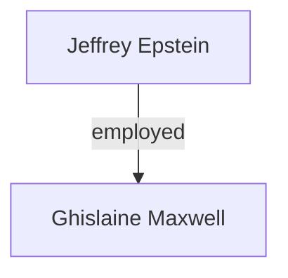

---

```yaml
title: "Epstein Investigation Vault — Writing and Editorial Style Guide"
tags: [sop, style, writing, editorial, standards]
date: 2026-02-28
summary: "The definitive style guide governing voice, confidence ratings, citation standards, tagging conventions, diagram usage, and editorial prohibitions for all documents in the Epstein Investigation Vault."
verified: true
source: [internal-editorial-policy, APA-7th-edition-manual, DOJ-EFTA-portal-conventions]
case-refs: []
author-note: "This document is normative. All vault contributors must read and follow it. Deviations require documented justification in the file's YAML frontmatter."
confidence-overall: "N/A — prescriptive document"
```

---

# Epstein Investigation Vault — Writing and Editorial Style Guide

> **Governing Principle:** Precision is a moral obligation when writing about allegations of sexual abuse, trafficking, and the complicity of powerful institutions. Every sentence in this vault either advances the evidentiary record or honestly acknowledges the limits of what is known. There is no third option.

---

## Table of Contents

- [I. Vault Purpose and Voice](#i-vault-purpose-and-voice)
- [II. Confidence Rating System — Precise Usage](#ii-confidence-rating-system--precise-usage)
- [III. The #claim Tag — Rules](#iii-the-claim-tag--rules)
- [IV. APA 7th Edition Standards](#iv-apa-7th-edition-standards)
- [V. YAML Frontmatter Required Fields](#v-yaml-frontmatter-required-fields)
- [VI. Mermaid Diagram Conventions](#vi-mermaid-diagram-conventions)
- [VII. Prohibited Practices](#vii-prohibited-practices)
- [VIII. Handling Conflicting Sources](#viii-handling-conflicting-sources)
- [IX. Cross-Referencing Conventions](#ix-cross-referencing-conventions)
- [X. Document Structure Standards](#x-document-structure-standards)
- [XI. What This Vault Is Not](#xi-what-this-vault-is-not)
- [Appendix A: Quick-Reference Checklist](#appendix-a-quick-reference-checklist)
- [References](#references)

---

## I. Vault Purpose and Voice

### 1.1 What This Vault Is

The Epstein Investigation Vault is an **intelligence-style investigative archive**. It synthesises the public evidentiary record — court filings, regulatory findings, Department of Justice publications, established journalism, declassified documents, and sworn testimony — into a structured, cross-referenced, and navigable knowledge base. Its purpose is threefold:

1. **Preservation.** To prevent the fragmentation and loss of a complex, multi-jurisdictional evidentiary record spanning decades.
2. **Synthesis.** To map relationships, timelines, financial flows, and institutional failures that no single source document captures in full.
3. **Accountability.** To maintain an honest, rigorously sourced record that resists both sensationalism and premature closure.

This vault is **not journalism** — it does not break stories, conduct interviews, or publish scoops. It is **not memoir** — it does not centre any individual's subjective experience as its analytical frame. It is **not a legal brief** — it does not advocate for any particular legal outcome.

### 1.2 Primary Voice: Analytical Precision

The default voice across all findings documents, network analyses, financial tracings, and institutional profiles is **analytical and restrained**. The model is the intelligence assessment, not the newspaper article.

**Characteristics of the primary voice:**

- **Declarative sentences** where evidence warrants them: "Epstein pleaded guilty to one count of solicitation of prostitution on June 30, 2008 [CONFIRMED]" (State of Florida v. Epstein, 2008).
- **Explicit uncertainty** where evidence does not warrant declarative statements: "The precise mechanism by which the non-prosecution agreement was negotiated remains disputed [CORROBORATED], with former U.S. Attorney Alexander Acosta's account differing materially from that of the victims' attorneys" (Brown, 2019; Patterson & Connolly, 2016).
- **No rhetorical questions.** If a question is worth raising, state it as an open investigative line.
- **No exclamation marks.** Ever.
- **No editorialising adjectives** unless they are drawn directly from an evidentiary source (e.g., the word "sweetheart" in "sweetheart deal" is permissible because it originates in the *Miami Herald*'s investigative nomenclature and has been adopted in congressional testimony).
- **Active voice preferred.** Passive voice is acceptable only when the actor is genuinely unknown: "The surveillance tapes were destroyed" (passive, actor unknown) vs. "Prosecutors declined to indict" (active, actor known).

### 1.3 Secondary Voice: Literary Non-Fiction

Two categories of vault documents may employ a controlled literary non-fiction style:

1. **Narrative Prologues** — introductory sections that orient the reader to a case thread, timeline, or institutional failure. These may use scene-setting, carefully attributed quotation, and chronological storytelling.
2. **Profile Contextualisation Sections** — the opening paragraphs of person or location profiles that establish context before the evidentiary analysis begins.

Even in these sections, every factual assertion must carry a confidence rating and citation. The literary register applies to **sentence construction and pacing**, not to evidentiary standards.

**Example (acceptable):**

> On the morning of August 10, 2019, correctional officers at the Metropolitan Correctional Center in Manhattan found Jeffrey Epstein unresponsive in his cell [CONFIRMED] (Federal Bureau of Prisons, 2019). The city medical examiner would later rule the death a suicide by hanging [CONFIRMED] (Sampson, 2019). Within hours, the evidentiary landscape shifted irreversibly: the central defendant in the most consequential sex-trafficking prosecution of the decade was dead, and the question of co-conspirator accountability passed from the certainty of trial to the contingencies of civil litigation, congressional inquiry, and public memory.

**Example (unacceptable):**

> Jeffrey Epstein was found dead in mysterious circumstances that shocked the world. Many believe he was murdered to silence him.

---

## II. Confidence Rating System — Precise Usage

Every substantive claim in this vault **must** carry one of the following confidence ratings. These ratings are applied in-line, immediately after the relevant assertion, and before the APA citation.

### 2.1 [CONFIRMED]

**Definition:** The claim is established by a court conviction, plea, formal DOJ statement, regulatory finding, officially filed court document, or uncontested documentary evidence in the public record.

**Threshold:** A single authoritative primary legal or governmental source suffices.

**Examples:**

- "Jeffrey Epstein pleaded guilty in 2008 to one Florida state charge of solicitation of prostitution and one charge of procurement of minors for prostitution [CONFIRMED]" (State of Florida v. Epstein, Case No. 08-10102, 2008).
- "Ghislaine Maxwell was convicted on December 29, 2021, on five of six federal counts, including sex trafficking of a minor [CONFIRMED]" (United States v. Maxwell, No. 20-cr-330, S.D.N.Y., 2021).
- "The U.S. Attorney's Office for the Southern District of New York indicted Epstein on July 8, 2019, on one count of sex trafficking and one count of conspiracy to commit sex trafficking [CONFIRMED]" (United States v. Epstein, No. 19-cr-490, S.D.N.Y., 2019).

**What [CONFIRMED] is NOT:** "Widely reported," "well-known," "generally accepted." Media consensus, no matter how strong, does not constitute confirmation. The source must be a primary legal or governmental record.

### 2.2 [CORROBORATED]

**Definition:** The claim is supported by at least two independent, credible sources. Both sources must be named in the reference list. "Independent" means neither source relies on the other for its information.

**Threshold:** Minimum two named, credible, editorially rigorous sources with independent reporting or documentation.

**Examples:**

- "Epstein visited the White House at least once during the Clinton administration [CORROBORATED]" (Recarey, 2006, deposition testimony; *The New York Times*, Ivory et al., 2019).
- "The 2008 non-prosecution agreement was negotiated with unusual secrecy and without legally required notification to victims [CORROBORATED]" (Brown, 2019; U.S. Office of Professional Responsibility, 2020).
- "Flight logs indicate that numerous prominent individuals flew on Epstein's aircraft between 1995 and 2013 [CORROBORATED]" (Epstein flight logs, released via Giuffre v. Maxwell, No. 15-cv-7433, S.D.N.Y.; FAA records corroborated in Brown, 2019).

**What [CORROBORATED] is NOT:** "Multiple sources report" without naming them. Every corroboration claim must be verifiable by a reader who follows the citations.

### 2.3 [SINGLE SOURCE]

**Definition:** The claim rests on one credible, established outlet, document, or named individual's sworn testimony, and has not been independently confirmed by a second source.

**Threshold:** The source must be a recognised journalistic outlet with editorial standards, a sworn deposition, an official document, or a named credible individual on the record.

**Usage:** Name the outlet and article or document explicitly in the in-text citation.

**Examples:**

- "According to a 2003 Vanity Fair profile, Epstein claimed to manage money exclusively for billionaires [SINGLE SOURCE]" (Lanchester, 2003, *Vanity Fair*).
- "A former household employee testified in deposition that massage sessions occurred multiple times daily at the Palm Beach residence [SINGLE SOURCE]" (Alessi deposition, Doe v. Epstein, Palm Beach County, 2009).

**What [SINGLE SOURCE] is NOT:** "One source says" without identifying it. Anonymous sourcing in a credible outlet is permissible (e.g., "according to two unnamed officials cited by *The New York Times*") but must be flagged: the rating remains [SINGLE SOURCE] until corroborated.

### 2.4 [UNVERIFIED]

**Definition:** The claim has not met the threshold for any of the above ratings, but is included because it represents: (a) an active investigative lead, (b) necessary context for understanding the evidentiary landscape, or (c) an allegation so widely discussed that omitting it would itself be misleading.

**Mandatory requirement:** Every [UNVERIFIED] claim must include a parenthetical or footnote explaining **why it is included despite its low confidence level.**

**Examples:**

- "Epstein allegedly possessed compromising recordings of visitors to his properties [UNVERIFIED — included because this allegation was referenced in multiple civil depositions and has shaped public discourse, but no such recordings have been entered into evidence or confirmed by law enforcement as of 2026-02-28]."
- "It has been alleged that certain intelligence agencies maintained a relationship with Epstein [UNVERIFIED — included because the allegation has been raised in congressional inquiries and by credible journalists, but no governmental body has confirmed such a relationship]."

**What [UNVERIFIED] is NOT:** A license to include anything. Material that is purely speculative, originates solely from conspiracy forums, or serves no analytical purpose in understanding the evidentiary record should be **omitted entirely**, not rated [UNVERIFIED].

### 2.5 Application Rules

| Rule | Detail |
|---|---|
| **Placement** | Immediately after the claim, before the citation: "...convicted on five counts [CONFIRMED] (United States v. Maxwell, 2021)." |
| **Every significant assertion** | Ratings are mandatory on factual claims about events, relationships, financial transactions, and conduct. They are not required on logical inferences explicitly flagged as such ("It follows that...") or on descriptions of the vault's own methodology. |
| **Upgrading** | A rating may be upgraded when new evidence emerges. The YAML `date` field must be updated, and a changelog note should be appended. |
| **Downgrading** | If a previously [CONFIRMED] claim is overturned (e.g., a conviction is vacated), the rating must be immediately downgraded and the file updated. |

---

## III. The #claim Tag — Rules

### 3.1 Purpose

The `#claim` tag is a protective editorial mechanism. It signals to the reader that a negative characterisation of a **living, non-convicted person** is being reported as an allegation, not as an established fact. It exists to prevent the vault from functioning as an instrument of defamation while still permitting honest synthesis of the evidentiary record.

### 3.2 When to Apply

**Apply `#claim` to EVERY negative characterisation of a living person who has not been convicted of the specific conduct being described.**

- "John Doe allegedly participated in sex trafficking activities #claim at the Palm Beach residence [SINGLE SOURCE] (Doe deposition, 2015)."
- "Jane Smith was named in civil filings as having facilitated introductions to underage victims #claim [SINGLE SOURCE] (Roe v. Doe, S.D.N.Y., 2020)."

**The tag is placed in-line, immediately after the specific negative characterisation**, not at the end of a paragraph or sentence cluster. This ensures that the reader encounters the tag at the exact point of the claim.

### 3.3 When NOT to Apply

| Scenario | Rationale |
|---|---|
| **[CONFIRMED] court findings against the named person** | A conviction or guilty plea is a legal finding, not an allegation. Ghislaine Maxwell's conviction does not require `#claim`. |
| **Documentary evidence directly attributable to the person** | If a person's own signed document, email, or recorded statement establishes a fact, `#claim` is unnecessary for that specific fact. |
| **Regulatory findings against the person** | E.g., a bar association finding of misconduct, an SEC enforcement action. |
| **Deceased persons** | The deceased cannot be defamed under U.S. law. Jeffrey Epstein's conduct does not require `#claim`. However, **factual accuracy and confidence ratings still apply.** |
| **Neutral or positive characterisations** | "Smith attended Harvard" does not require `#claim` even if unverified — it is not a negative characterisation. (It still requires a confidence rating.) |

### 3.4 Special Cases

- **Convicted persons, different conduct:** If a person has been convicted of Conduct A but is alleged to have committed Conduct B, `#claim` applies to assertions about Conduct B. Example: Maxwell was convicted of sex trafficking; if a vault document alleges she also committed perjury in a separate civil matter not yet adjudicated, `#claim` applies to the perjury allegation.
- **Organisations:** `#claim` applies to negative characterisations of identifiable organisations (corporations, institutions) when the characterisation has not been established by regulatory or judicial finding. Example: "Deutsche Bank facilitated suspicious transactions for Epstein #claim [SINGLE SOURCE]" becomes unnecessary **after** the NYDFS consent order: "Deutsche Bank failed to properly monitor Epstein-related accounts [CONFIRMED] (NYDFS Consent Order, 2020)."
- **Public officials acting in official capacity:** `#claim` still applies. Public officials are entitled to the same evidentiary rigour as private individuals. The vault does not adopt the lower "actual malice" standard from defamation law as an editorial licence.

### 3.5 Formatting

- The tag is always lowercase: `#claim`
- It appears **before** any confidence rating and citation: "...facilitated introductions #claim [SINGLE SOURCE] (Roe v. Doe, 2020)."
- In Mermaid diagrams, `#claim` is indicated by a dashed line (`-.->`) rather than a solid line (`-->`) for edges involving unconfirmed allegations about living non-convicted persons.

---

## IV. APA 7th Edition Standards

### 4.1 In-Text Citations

All in-text citations follow APA 7th edition format:

- **Parenthetical:** (Author, Year) or (Author, Year, p. X) for direct quotations.
- **Narrative:** Author (Year) stated that... or Author (Year, p. X) argued...
- **Multiple authors:** (Author1 & Author2, Year) for two; (Author1 et al., Year) for three or more.
- **Court cases:** Italicised case name, followed by year: (*United States v. Maxwell*, 2021).
- **No author:** Use abbreviated title: ("Epstein Flight Logs," 2015).

### 4.2 Reference List Formats

Every vault document ends with a full APA 7th edition reference list under the heading `## References`.

**Journal Article:**
```
Cassidy, J. (2019). The cost of Epstein's deal. The New Yorker, 95(21), 24–31.
```

**News Article (online):**
```
Brown, J. K. (2018, November 28). How a future Trump cabinet member gave a serial sex
    abuser the deal of a lifetime. Miami Herald.
    https://www.miamiherald.com/news/local/article220097825.html
```

**Court Document (PACER):**
```
United States v. Epstein, No. 19-cr-490 (S.D.N.Y. 2019). Indictment. Retrieved from
    PACER, https://www.pacer.gov
```

**Government Publication:**
```
U.S. Department of Justice, Office of Professional Responsibility. (2020). Investigation
    into the handling of the Jeffrey Epstein case. U.S. Department of Justice.
    https://www.justice.gov/opr
```

**Book:**
```
Patterson, J., & Connolly, J. (2016). Filthy rich: The shocking true story of Jeffrey
    Epstein. Grand Central Publishing.
```

**Website (DOJ Portal / EFTA format):**
```
U.S. Department of Justice. (2019, July 8). Jeffrey Epstein charged in Manhattan federal
    court with sex trafficking of minors [Press release].
    https://www.justice.gov/usao-sdny/pr/jeffrey-epstein-charged-manhattan-federal-court-
    sex-trafficking-minors
```

**Deposition Transcript:**
```
Alessi, J. (2009). Deposition transcript. Doe v. Epstein, No. 2008-CA-026354 (Palm
    Beach County Cir. Ct.). Retrieved from court records.
```

**Declassified/Released Documents:**
```
Giuffre v. Maxwell, No. 15-cv-7433 (S.D.N.Y.). Flight logs of N908JE [Exhibit]. Released
    pursuant to court order, January 2024.
```

### 4.3 Citation Priority

When multiple source types are available for the same claim, prefer in this order:

1. Primary court records and government documents
2. Official press releases (DOJ, FBI, etc.)
3. Investigative journalism from established outlets (named reporters, editorial oversight)
4. Books by credible authors with documented sourcing
5. Academic analysis

---

## V. YAML Frontmatter Required Fields

Every vault document **must** begin with a YAML frontmatter block enclosed in triple-dash delimiters (`---`). The following fields are mandatory:

```yaml
---
title: "Human-readable title of the document"
tags: [primary-category, subcategory, key-entity-if-relevant]
date: 2026-02-28
summary: "One sentence summarising the document's content and significance."
verified: true | partial | false
source: [list-of-primary-sources-used]
case-refs: [case-numbers-if-applicable, e.g., "19-cr-490", "15-cv-7433"]
---
```

### 5.1 Field Definitions

| Field | Type | Description |
|---|---|---|
| `title` | String | The full title of the document. Should be descriptive and specific. |
| `tags` | List | Hierarchical tags. First tag is the primary category (e.g., `findings`, `people`, `locations`, `legal`, `financial`, `institutional`, `sop`). Subsequent tags narrow scope. |
| `date` | Date (ISO 8601) | The date of the most recent substantive edit. Updated on every revision. |
| `summary` | String | One sentence. Must be comprehensible without reading the document. |
| `verified` | Enum | `true` = all major claims rated [CONFIRMED] or [CORROBORATED]; `partial` = mix of ratings; `false` = predominantly [UNVERIFIED] or [SINGLE SOURCE]. |
| `source` | List | Primary sources consulted. Not the full reference list — just the most important 3–5. |
| `case-refs` | List | Formal case numbers (federal or state) relevant to the document. Empty list `[]` if none. |

### 5.2 Optional Fields

```yaml
author-note: "Any editorial caveats, revision history, or context for the document."
confidence-overall: "[CONFIRMED] | [CORROBORATED] | [SINGLE SOURCE] | [UNVERIFIED] | mixed"
last-reviewed: 2026-02-28
status: draft | review | final
related: [list-of-related-vault-files]
```

### 5.3 Tag Taxonomy (Primary Categories)

| Tag | Scope |
|---|---|
| `people` | Individual profiles |
| `findings` | Analytical documents synthesising evidence |
| `locations` | Property and site profiles |
| `legal` | Court proceedings, legal analysis, plea agreements |
| `financial` | Money flows, asset tracing, institutional complicity |
| `institutional` | Organisations, agencies, firms |
| `timeline` | Chronological reconstructions |
| `sop` | Standard operating procedures, style guides, vault governance |
| `evidence` | Specific evidence items (documents, recordings, logs) |

---

## VI. Mermaid Diagram Conventions

### 6.1 When to Use Diagrams

| Diagram Type | Use Case |
|---|---|
| **Network/Graph** | Relationships between people, institutions, and entities |
| **Timeline** | Chronological reconstruction of events |
| **Flowchart** | Legal processes, financial flows, institutional decision chains |
| **Hierarchy** | Organisational structures, corporate entity trees |

### 6.2 Syntax Standards

All diagrams use Mermaid.js syntax within fenced code blocks:

````

````

### 6.3 Node Labels

- **Maximum 40 characters** per line within a node.
- Use `<br/>` for multi-line labels where necessary.
- Use full names on first appearance; initialised abbreviations permitted thereafter only if a legend is provided.
- Node shapes convey meaning:
  - `[Rectangle]` — Person
  - `([Stadium])` — Institution/Organisation
  - `{Diamond}` — Decision point
  - `[(Cylinder)]` — Financial entity/account
  - `((Circle))` — Location

### 6.4 Edge Labels

- Brief verb phrases: `-->|"paid $158M"|`, `-->|"convicted 6 counts"|`, `-->|"employed 1992–2019"|`
- Maximum 30 characters.
- Use quotation marks around edge labels for readability.

### 6.5 Edge Styles for Confidence Levels

| Edge Style | Meaning |
|---|---|
| `-->` (solid arrow) | [CONFIRMED] or [CORROBORATED] relationship |
| `-.->` (dashed arrow) | [SINGLE SOURCE] or [UNVERIFIED] relationship / #claim |
| `==>` (thick arrow) | Primary/central relationship in the diagram |

### 6.6 Subgraphs

Use subgraphs to group nodes by:
- **Geography:** "subgraph Palm Beach," "subgraph U.S. Virgin Islands," "subgraph New York"
- **Institution:** "subgraph DOJ," "subgraph JPMorgan Chase"
- **Time period:** "subgraph 1992–2002," "subgraph 2005–2008 Investigation"

### 6.7 Direction

| Direction | Use Case |
|---|---|
| `TD` (top-down) | Hierarchies, power structures |
| `LR` (left-right) | Process flows, financial transfers, timelines |
| `TB` (top-bottom) | Alternate for hierarchies when TD is congested |

### 6.8 Example

```mermaid
graph TD
    subgraph "Palm Beach Investigation 2005–2008"
        A[Jeffrey Epstein] -->|"employed"| B[Ghislaine Maxwell]
        A -->|"plea agreement<br/>June 2008"| C([State Attorney<br/>Palm Beach County])
        D([FBI Palm Beach] ) -->|"referred to"| E([U.S. Attorney<br/>S.D. Florida])
        E -->|"negotiated NPA"| A
        F[Victims] -.->|"not notified<br/>#claim on process"| E
    end
```

---

## VII. Prohibited Practices

The following practices are **categorically prohibited** across all vault documents. Violations require immediate correction.

### 7.1 Presenting Speculation as Fact

**Prohibited:** "Epstein was murdered to protect powerful associates."
**Required:** "The New York City medical examiner ruled Epstein's death a suicide [CONFIRMED] (Sampson, 2019). Alternative theories have been raised in public discourse but are not supported by official findings [UNVERIFIED — included because the allegation has been referenced in congressional correspondence and has materially shaped public trust in the investigation]."

### 7.2 Loaded Language Without Evidentiary Basis

The following terms may **only** be used when supported by a court finding, regulatory determination, or the specific language of an indictment or conviction:

- "Masterminded" — only if a court characterized the person's role as such
- "Orchestrated" — same standard
- "Kingpin" — same standard
- "Pedophile ring" — use "sex trafficking operation" unless quoting a specific source
- "Cover-up" — only if a formal investigation has found concealment; otherwise use "failure to disclose" or "inadequate transparency"

### 7.3 Omitting Confidence Ratings

Every substantive claim **must** carry a confidence rating. A document submitted without ratings on significant factual assertions will be returned for revision. "Significant" means: any claim about an individual's conduct, any claim about a financial transaction, any claim about institutional action or inaction, and any claim about the occurrence or non-occurrence of an event.

### 7.4 Citing Prohibited Sources

The following source categories are **never** citable in this vault:

- Conspiracy-oriented websites (e.g., InfoWars, QAnon-affiliated sites)
- Tabloid publications without editorial fact-checking standards
- Unverified social media posts (Twitter/X threads, Reddit posts, anonymous blogs)
- Self-published books without documented sourcing
- Sources that have been formally retracted

**Note:** If a prohibited source is the *origin* of a claim that has subsequently been investigated by credible outlets, cite the credible outlet, not the original prohibited source.

### 7.5 Combining #claim Persons with Unqualified Assertions

**Prohibited:** "John Doe trafficked minors and also attended fundraisers."
**Required:** "John Doe allegedly facilitated the transportation of minors to Epstein's properties #claim [SINGLE SOURCE] (Smith, 2020). Separately, Doe attended political fundraisers at which Epstein was present [CORROBORATED] (Jones, 2019; Williams, 2020)."

The structure must make clear which assertions are alleged and which are independently established. The reader should never have to guess which parts of a sentence carry the `#claim` tag.

### 7.6 Editorialising in Analytical Sections

Vault contributors do not express outrage, moral judgement, or personal opinion in analytical sections. The evidence speaks for itself. If you feel compelled to write "shockingly" or "disturbingly," the evidence is not being presented with sufficient clarity.

---

## VIII. Handling Conflicting Sources

### 8.1 Principle

Conflicts between sources are **features of the evidentiary record, not problems to be resolved by editorial fiat.** The vault documents disagreements; it does not adjudicate them.

### 8.2 When Two Reliable Sources Disagree

Document both positions with full citations and assign independent confidence ratings to each:

> Former U.S. Attorney Acosta stated that he was instructed to defer to Epstein's attorneys because Epstein "belonged to intelligence" [SINGLE SOURCE] (Brown, 2019, reporting Acosta's account to the Trump transition team). The Department of Justice has not confirmed any intelligence affiliation [CONFIRMED — as a negative: DOJ has issued no such confirmation as of 2026-02-28] (U.S. Department of Justice, public records search, 2025).

### 8.3 When Documentary Evidence Conflicts with Testimony

Documentary evidence is generally treated as more reliable than testimony, but this hierarchy is **noted, not assumed:**

> Flight logs for aircraft N908JE record a passenger identified as [Name] on [Date] [CORROBORATED] (Giuffre v. Maxwell, Exhibit X; FAA records). [Name] has denied ever flying on the aircraft [SINGLE SOURCE] (public statement reported in *The Washington Post*, Author, Year). The vault notes the conflict between the documentary record and the public denial without resolving it; the flight logs are primary documentary evidence, while the denial is an unsworn public statement.

### 8.4 The Dramatic-Version Prohibition

**Never resolve a source conflict by selecting the more dramatic version.** If the dramatic version is better sourced, it will earn a higher confidence rating on its own merits. If both versions are equally sourced, both are presented and the reader is explicitly told the conflict is unresolved.

---

## IX. Cross-Referencing Conventions

### 9.1 WikiLinks

The vault uses Obsidian-compatible WikiLink syntax for internal cross-references:

| Entity Type | Format | Example |
|---|---|---|
| Person | `[[People/Full-Name]]` | `[[People/Ghislaine-Maxwell]]` |
| Finding | `[[Findings/Filename]]` | `[[Findings/NPA-Analysis-2008]]` |
| Location | `[[Locations/Name]]` | `[[Locations/Palm-Beach-Residence]]` |
| Legal Document | `[[Legal/Case-Name-or-Number]]` | `[[Legal/United-States-v-Maxwell-20-cr-330]]` |
| Financial Entity | `[[Financial/Entity-Name]]` | `[[Financial/JPMorgan-Chase-Relationship]]` |
| Institution | `[[Institutions/Name]]` | `[[Institutions/Metropolitan-Correctional-Center]]` |
| Timeline | `[[Timelines/Name]]` | `[[Timelines/2005-2008-Florida-Investigation]]` |
| SOP | `[[SOP/Document-Name]]` | `[[SOP/Writing-Style-Guide]]` |

### 9.2 Liberal Cross-Referencing

WikiLinks should be used **every time** a named entity appears in a document — at minimum on first mention. The vault's analytical value depends on its connectivity. An isolated document is a failure of architecture.

### 9.3 Before Creating a New Profile

**Check whether a profile already exists.** Duplicate profiles fragment the evidentiary record. If a profile exists, link to it. If it is insufficient, expand it. Create a new profile only when no existing file covers the entity.

### 9.4 Alias Handling

When an entity is known by multiple names (e.g., aircraft tail numbers, property names, corporate entities), create aliases in the YAML frontmatter:

```yaml
aliases: ["Lolita Express", "N908JE", "Epstein Boeing 727"]
```

---

## X. Document Structure Standards

### 10.1 Findings Documents

```
---
YAML Frontmatter
---

# Title

> **Summary Box:** One-paragraph abstract of the finding, key confidence level, and significance.

## Table of Contents

## 1. Background
## 2. Evidence
## 3. Analysis
## 4. Open Questions
## 5. Related Documents (WikiLinks)

## References
```

### 10.2 Person Profiles

```
---
YAML Frontmatter (including aliases)
---

# Full Legal Name

> **Status:** Convicted / Indicted / Named in civil proceedings / Witness / Deceased / No legal action
> **Confidence Level:** Overall assessment of the evidence concerning this individual

## Background
Biographical context relevant to the investigation.

## Connection to Epstein
How, when, and through what mechanisms this person intersected with Epstein's activities.

## Evidence
Specific documentary, testimonial, and forensic evidence. Each item carries a confidence rating.

## Legal Status
Current legal standing: convictions, pending proceedings, settlements, immunity agreements.

## Open Questions
Unresolved investigative lines.

## Related Profiles
WikiLinks to connected persons, institutions, and locations.

## References
```

### 10.3 Location Profiles

```
---
YAML Frontmatter
---

# Location Name (Common Name and Legal Address)

> **Property Type:** Residential / Commercial / Private Island / Aircraft
> **Operational Period:** Date range of relevance to the investigation

## Property Facts
Ownership history, acquisition details, legal description.

## Operational Role
How this location functioned within the trafficking operation, as established by