# The Epstein Enterprise: Definitive Chronological Timeline

> **Analytical standard.** This document constitutes the most comprehensive single-document chronology of the Jeffrey Epstein case assembled in this vault. Every entry is sourced to public court records, official government documents, regulatory findings, or established major journalism. Confidence ratings are applied per the system below. Allegations against living non-convicted persons are tagged `#claim`. This timeline reflects the evidentiary record as of February 28, 2026.

---

## Confidence Rating System

| Rating | Meaning |
|--------|---------|
| **[CONFIRMED]** | Established by official court record, DOJ statement, ME ruling, or regulatory finding |
| **[CORROBORATED]** | Established by two or more independent credible sources |
| **[SINGLE SOURCE]** | Reported by one credible source; not independently verified |
| **[UNVERIFIED]** | Claim or allegation without sufficient evidential basis in public record |

---

## Major Phases — Mermaid Timeline Diagram

```mermaid
timeline
    title The Epstein Enterprise — Major Phases (1953–2026)

    section Origins & Rise
        1953 : Epstein born, Brooklyn
        1973-1975 : Teaching at Dalton School
        1976-1981 : Bear Stearns trader, VP by 1980
        1982 : Founds J. Epstein & Co.

    section Network Construction
        1986 : Les Wexner relationship begins
        1991 : Wexner grants power of attorney
        1991 : Robert Maxwell death — Ghislaine enters orbit
        1996 : Maria Farmer FBI complaint ignored
        1998 : Little Saint James purchased; JPMorgan banking begins

    section Expansion & First Exposure
        2002 : Trump "terrific guy" quote published
        2005 : Palm Beach PD investigation begins
        2006 : FBI enters case; Epstein arrested FL
        2007 : Trump bans Epstein from Mar-a-Lago
        2008 : NPA signed; FL plea; 13 months served

    section Post-Conviction Operations
        2010 : DEA opens investigation; Andrew visits in prison
        2013 : MIT donations concealed; Deutsche Bank onboards
        2014-2015 : Scopolamine emails (EFTA00008744)
        2015 : ABC News package killed

    section Reckoning
        2018 : Miami Herald "Perversion of Justice"
        2019-Feb : NPA ruled unconstitutional
        2019-Jul : Arrested at Teterboro; SDNY indictment
        2019-Aug : Found dead at MCC
        2020-Jul : Maxwell arrested; Deutsche Bank fined
        2021-Dec : Maxwell convicted

    section Aftermath & 2026 Disclosure
        2022 : Andrew settles; Brunel dies; Maxwell sentenced
        2023 : JPMorgan settles $365M total
        2024 : Giuffre v. Maxwell docs released; FCA bans Staley
        2025 : Epstein Files Transparency Act enacted
        2026-Jan : DOJ releases 3.5M pages
        2026-Feb : Andrew arrested; Mandelson arrested; global resignations
```

---

## 1953–1975: Origins

### 1953

- **1953-01-20** — **Jeffrey Edward Epstein born in Brooklyn, New York** to Seymour and Pauline Epstein. [CONFIRMED] (NYC vital records; AP News, 2019)

### 1966–1969

- **1966–1969** — Epstein attends Lafayette High School, Brooklyn; described by classmates as academically gifted but socially peripheral. Graduates at age 16. [CORROBORATED] (NYT, 2019; Vanity Fair, 2003)

### 1969

- **1969** — Epstein enrolls at Cooper Union, New York. Does not complete a degree. [CORROBORATED] (NYT, 2019; Vanity Fair, 2003)

### 1971

- **1971** — Epstein transfers to New York University's Courant Institute of Mathematical Sciences. Again does not complete a degree. [CORROBORATED] (NYT, 2019)

### 1973–1975

- **1973-09** — Epstein begins teaching mathematics and physics at the Dalton School, Manhattan, despite lacking a college degree. Hired by headmaster Donald Barr (father of future Attorney General William Barr). [CONFIRMED] (Dalton School records, per NYT, 2019; Vanity Fair, 2003)

- **1975** — Epstein leaves the Dalton School. Circumstances of departure unclear; school records sealed. [SINGLE SOURCE] (Vanity Fair, 2003)

---

## 1976–1989: Wall Street and the Construction of Wealth

### 1976

- **1976** — Epstein joins Bear Stearns as a trader. Recruited by Alan "Ace" Greenberg; advances rapidly in the options trading division. [CONFIRMED] (Bear Stearns records, per NYT, 2019; Vanity Fair, 2003)

### 1980

- **1980** — Epstein promoted to limited partner at Bear Stearns. [CORROBORATED] (NYT, 2019; Vanity Fair, 2003)

### 1981

- **1981** — Epstein departs Bear Stearns. Circumstances disputed: reported variously as resignation and termination. SEC records from this period remain sealed. [SINGLE SOURCE] (Vanity Fair, 2003)

### 1982

- **1982** — Epstein establishes J. Epstein & Co., a financial management firm exclusively serving clients with net worth exceeding $1 billion. The firm's client list and revenue sources have never been fully documented. [CORROBORATED] (NYT, 2019; Vanity Fair, 2003)

### 1986

- **1986** — **[[People/Les-Wexner]] becomes Epstein's primary financial patron.** Wexner, founder and CEO of The Limited (later L Brands), engages Epstein as his personal financial manager. The relationship will ultimately involve power of attorney and the transfer of the 9 East 71st Street Manhattan mansion. [CONFIRMED] (Wexner congressional testimony, 2026; NYT, 2019)

### 1988

- **1988** — Epstein takes up residence at [[Locations/9-East-71st-Street-NYC]], the 21,000-square-foot Herbert N. Straus mansion on the Upper East Side, transferred to him by [[People/Les-Wexner]] under arrangements that remain legally disputed. [CONFIRMED] (NYC property records; NYT, 2019)

### 1989

- **1989** — First known contact between Epstein and members of the British establishment via social events in New York and London. [[People/Ghislaine-Maxwell]]'s father [[People/Robert-Maxwell]] is at the height of his media empire. [SINGLE SOURCE] (Vanity Fair, 2003)

---

## 1990–1999: Network Expansion and the Maxwell Connection

### 1991

- **1991** — **[[People/Les-Wexner]] grants Epstein power of attorney with unlimited scope** over his financial affairs. Wexner's attorneys later told investigators Epstein misappropriated approximately $100 million under this authority. [CONFIRMED] (Wexner congressional testimony, Feb 2026; NYT, 2019)

- **1991-11-05** — **[[People/Robert-Maxwell]] found dead in the Atlantic Ocean off the Canary Islands**, having fallen from his yacht the *Lady Ghislaine*. Ruled death by drowning; heart attack suspected. His funeral in Jerusalem was attended by six serving and former heads of the Mossad, as reported by multiple Israeli media sources. His media empire subsequently collapsed under massive debt and pension-fund fraud. [CONFIRMED] (British inquest records; Israeli media, 1991; AP, 1991)

- **1991 (late)–1992** — **[[People/Ghislaine-Maxwell]] meets Jeffrey Epstein in New York** following the collapse of her father's empire and her relocation to Manhattan. She becomes Epstein's romantic partner and, as later established at trial, his principal co-conspirator in the trafficking operation. [CONFIRMED] (Maxwell trial record, SDNY 20-CR-330, 2021)

### 1993

- **1993** — Epstein and Maxwell begin hosting social events at the Manhattan townhouse and at other properties, establishing the social infrastructure that would serve as the operational front for the trafficking network. Guest lists include figures from finance, politics, academia, and entertainment. [CORROBORATED] (Vanity Fair, 2003; multiple victim depositions, SDNY 15-CV-07433)

### 1994

- **1994** — Epstein introduced to Donald Trump at Mar-a-Lago, Palm Beach, Florida, per contemporaneous social reporting. The two socialise in New York and Palm Beach circles over the next several years. [CORROBORATED] (New York magazine, 2002; AP, 2019) #claim

### 1995

- **1995** — **[[People/Virginia-Giuffre]] (then Virginia Roberts), age approximately 15–16, is recruited into the Epstein network** while working as a locker room attendant at Mar-a-Lago, Palm Beach. She alleges recruitment by [[People/Ghislaine-Maxwell]]. [CONFIRMED] (Giuffre v. Maxwell depositions, SDNY 15-CV-07433; Maxwell trial testimony, SDNY 20-CR-330)

### 1996

- **1996** — **[[People/Maria-Farmer]] files a complaint with the FBI** alleging sexual assault by Epstein and Maxwell at the Ohio estate of [[People/Les-Wexner]]. The complaint is not acted upon. Farmer later stated in interviews that FBI agents told her they would investigate but no investigation materialized. This represents the first documented law enforcement complaint against Epstein. [CONFIRMED] (Farmer interviews, per Miami Herald, 2018; FBI records released 2026)

- **1996** — [[People/Annie-Farmer]], Maria Farmer's younger sister, alleges she was abused by Epstein at Zorro Ranch, New Mexico, when she was 16. She testified at the Maxwell trial in 2021. [CONFIRMED] (Maxwell trial testimony, SDNY 20-CR-330, 2021)

### 1997

- **1997** — Epstein purchases [[Locations/Zorro-Ranch-New-Mexico]], an approximately 8,000-acre property near Stanley, New Mexico. The ranch becomes a documented site of abuse in later victim testimony. [CONFIRMED] (Santa Fe County property records; victim depositions, SDNY)

### 1998

- **1998** — **Epstein purchases [[Locations/Little-Saint-James-USVI]]**, a 70-acre private island in the U.S. Virgin Islands, for approximately $7.95 million. The island becomes the primary documented site of the trafficking operation. [CONFIRMED] (USVI property records; SDNY indictment, 19-CR-490)

- **1998** — **JPMorgan Chase begins banking relationship with Epstein.** The relationship will last until 2013 — five years after Epstein's 2008 conviction — and will involve processing large cash withdrawals consistent with victim payments over compliance staff objections. [CONFIRMED] (SDNY 23-cv-10365; NYDFS, 2020)

### 1999

- **1999** — [[People/Prince-Andrew]] and Epstein establish a social relationship, with Andrew visiting Epstein properties. Andrew was introduced to Epstein through [[People/Ghislaine-Maxwell]]. [CORROBORATED] (BBC Newsnight, 2019; Giuffre depositions, SDNY 15-CV-07433) #claim

---

## 2000–2004: Peak Operation and First Journalism

### 2000

- **2000** — [[People/Alan-Dershowitz]], Harvard Law professor, enters documented association with Epstein. Dershowitz later represented Epstein during the 2008 NPA negotiations. Dershowitz has been named in civil allegations by [[People/Virginia-Giuffre]]; he vehemently denies all allegations and brought defamation counterclaims. [CONFIRMED — association; SINGLE SOURCE — abuse allegations] (Giuffre depositions; Dershowitz public statements) #claim

- **2000** — [[People/Bill-Clinton]] begins documented travel on Epstein's aircraft. Flight logs released in civil litigation document multiple flights between 2001 and 2003. Clinton spokesperson stated in 2019 he took four trips on Epstein's plane. Flight logs suggest a higher number. [CORROBORATED] (Flight logs, Giuffre v. Maxwell discovery; Clinton statement, 2019) #claim

### 2001

- **2001** — [[People/Ehud-Barak]], former Israeli Prime Minister, begins documented association with Epstein. Barak was later photographed entering Epstein's Manhattan townhouse in 2016. Barak acknowledged the relationship but denied any knowledge of criminal activity. [CORROBORATED] (Daily Mail, 2019; Barak public statement, 2019) #claim

### 2002

- **2002** — ***New York* magazine publishes profile of Epstein** in which [[People/Donald-Trump]] is quoted: "I've known Jeff for 15 years. Terrific guy. He's a lot of fun to be with. It is even said that he likes beautiful women as much as I do, and many of them are on the younger side." [CONFIRMED] (Landon, *New York* magazine, 2002)

### 2003

- **2003-03** — *Vanity Fair* publishes profile of Epstein by [[People/Vicky-Ward]]. Key sections about allegations from [[People/Maria-Farmer]] and [[People/Annie-Farmer]] were removed before publication. Ward later reported that Epstein had threatened her during the reporting process. [CONFIRMED] (Ward, *Vanity Fair*, 2003; Ward subsequent interviews, 2019)

### 2004

- **2004** — The Crime Victims' Rights Act (CVRA), 18 U.S.C. section 3771, enacted as Pub. L. No. 108-405. This statute will later form the basis for the ruling that the 2008 NPA violated victims' rights. [CONFIRMED] (114 Stat. 2260, 2004)

---

## 2005–2008: Investigation, Plea Deal, and the Non-Prosecution Agreement

### 2005

- **2005-03** — **A Palm Beach, Florida family contacts the Palm Beach Police Department (PBPD) to report that their 14-year-old daughter was molested at [[Locations/358-El-Brillo-Way-Palm-Beach]], Epstein's Palm Beach mansion.** Detective Joseph Recarey leads the investigation. [CONFIRMED] (PBPD records; AP, 2019; Miami Herald, 2018)

- **2005** — **PBPD investigation expands; 36 underage victims eventually identified.** Detectives find a pattern of recruitment through local high schools. [[People/Sarah-Kellen]], Adriana Ross, and Lesley Groff identified as operational staff managing victim scheduling. [CONFIRMED] (PBPD records; Miami Herald, 2018; NPA co-conspirator designations, SDFL 08-80736)

- **2005** — [[People/Howard-Lutnick]] and his wife visit Epstein's Manhattan townhouse. Lutnick later claimed this was the last time he willingly spent time with Epstein. DOJ 2026 files contradict this claim — see 2026 entries. [CONFIRMED] (NYT, 2026-02-07; Commerce Dept statement; DOJ Epstein files, 2026)

### 2006

- **2006-05** — **PBPD completes investigation and prepares charging paperwork** for multiple counts of unlawful sex with a minor. State Attorney Barry Krischer takes the unusual step of redirecting the case to a grand jury rather than proceeding on the police charges. [CONFIRMED] (PBPD records; AP, 2019)

- **2006-07** — **Grand jury indicts Epstein on one count of solicitation of prostitution** — a dramatically reduced charge relative to the 36 identified victims. Palm Beach Police Chief Michael Reiter publicly accuses SA Krischer of giving Epstein special treatment. FBI opens a federal investigation. [CONFIRMED] (PBPD; AP, 2019; FBI records)

- **2006 (fall)** — FBI federal investigation accelerates under the direction of the SDFL U.S. Attorney's office. AUSA Marie Villafana leads the federal case and pushes for a multi-count federal indictment. [CORROBORATED] (Miami Herald, 2018; *Does 1-6 v. US*, 2019)

### 2007

- **2007** — **Federal prosecutors prepare a 53-page sex crimes indictment.** However, Epstein defense attorneys — including [[People/Alan-Dershowitz]], Gerald Lefcourt, Jay Lefkowitz, Kenneth Starr, and Martin Weinberg — engage in extensive negotiations with U.S. Attorney [[People/Alexander-Acosta]] in Miami. [CONFIRMED] (Miami Herald, 2018; *Does 1-6 v. US*, 2019; AP, 2019)

- **2007** — **[[People/Donald-Trump]] bans Epstein from Mar-a-Lago.** The precise date and reason are disputed. Trump attorney stated it followed an incident involving a member's daughter; no independent documentation of the incident has been located. [SINGLE SOURCE] (Trump attorney statement, per AP, 2019)

### 2008

- **2008-06-30** — **The Non-Prosecution Agreement (NPA) is signed by U.S. Attorney [[People/Alexander-Acosta]] and Epstein's defense team (SDFL 08-80736).** The agreement: (1) commits the SDFL not to file federal charges; (2) extends immunity to "any potential co-conspirators" including [[People/Sarah-Kellen]], Adriana Ross, Lesley Groff, and [[People/Ghislaine-Maxwell]] by implication; (3) requires Epstein to plead guilty to Florida state solicitation charges; (4) was kept secret from victims in violation of the CVRA. [CONFIRMED] (SDFL 08-80736; *Does 1-6 v. US*, 2019; Miami Herald, 2018)

- **2008 (summer/fall)** — **Epstein pleads guilty to Florida state charges** of solicitation of prostitution and procurement of minors for prostitution. Sentenced to 18 months in the Palm Beach County stockade. [CONFIRMED] (Palm Beach County Court records; AP, 2019)

- **2008 (fall)–2009 (summer)** — **Epstein serves approximately 13 months**, with extensive work-release privileges allowing him to leave custody for up to 12 hours per day, six days per week, to his downtown West Palm Beach office. [CONFIRMED] (Palm Beach Sheriff records; Miami Herald, 2018)

---

## 2009–2012: Post-Conviction Continuation

### 2009

- **2009-04-24** — Epstein sends email to [[People/Sultan-Ahmed-bin-Sulayem]] (DP World CEO): "where are you? are you ok, I loved the torture video" (EFTA00666117). The nature of the referenced video is unknown. [CONFIRMED] (DOJ, 2026; EFTA00666117; CNN Business, 2026; Newsweek, 2026)

- **2009-07** — Epstein released from Palm Beach County custody after serving 13 months. Registers as a sex offender in Florida and the U.S. Virgin Islands. [CONFIRMED] (Florida SORT records; AP, 2019)

- **2009** — Epstein resumes social activities in New York, hosting dinners at the Manhattan townhouse. Guests during this post-conviction period include documented visits by [[People/Prince-Andrew]], [[People/Bill-Gates]], and others. [CORROBORATED] (NYT, 2019; Daily Mail, 2011; Gates spokesperson statement, 2019) #claim

### 2010

- **2010** — [[People/Prince-Andrew]] visits Epstein at his Manhattan townhouse while Epstein is a registered sex offender. Photographed walking in Central Park with Epstein. Andrew later acknowledged this visit but called it an error of judgment. [CONFIRMED] (Daily Mail, 2011; Andrew BBC interview, 2019)

- **2010 (approx.)** — DOJ email chain in 2026 release shows [[People/Prince-Andrew]] forwarding a government report from his special adviser regarding Southeast Asia trade mission to Epstein. This document became the predicate for Andrew's 2026 arrest. [CONFIRMED] (NBC News, 2026; DOJ Epstein files, 2026)

- **2010-12-17** — **DEA opens investigation** into Jeffrey Epstein and 14 other unnamed individuals for suspicious money transfers possibly linked to narcotics and prostitution in USVI and New York City. Investigation ran five-plus years. 69-page memo marked "law enforcement sensitive." Existence not publicly disclosed until 2026 DOJ release. [CONFIRMED] (CBS News, 2026-02-24; DOJ Epstein files, Data Sets 9-12)

### 2011

- **2011-03** — [[People/Jes-Staley]], then head of JPMorgan's investment bank, visits Epstein at the Palm Beach residence while Epstein is a registered sex offender. Staley and Epstein exchanged approximately 1,200 emails between 2008 and 2012. [CONFIRMED] (SDNY 23-cv-10365; FCA findings, 2024)

### 2012

- **2012** — [[People/Leon-Black]] of Apollo Global Management begins a documented financial relationship with Epstein involving payments totaling $158 million between 2012 and 2017, described as for "tax and estate planning advice." Senate Finance Committee later investigated whether these payments financed trafficking operations. [CONFIRMED — payments; SINGLE SOURCE — trafficking finance theory] (Senate Finance Committee; Al Jazeera, 2026)

---

## 2013–2018: Institutional Enablement and Investigative Journalism

### 2013

- **2013** — **JPMorgan Chase terminates banking relationship with Epstein** — five years after his conviction — following internal compliance pressure. [[People/Jes-Staley]] departed JPMorgan that same year. [CONFIRMED] (SDNY 23-cv-10365; NYDFS, 2020)

- **2013** — **Deutsche Bank immediately onboards Epstein as a client**, beginning a banking relationship that will last until 2018. Deutsche Bank processed Epstein transactions despite full knowledge of his criminal history and compliance red flags. [CONFIRMED] (NYDFS Consent Order, July 2020)

- **2013** — **First MIT Media Lab donation from Epstein**, deliberately concealed as "anonymous" in MIT records. Internal emails show then-director [[People/Joi-Ito]] instructed staff to describe Epstein as "a friend of a friend." Total MIT donations from Epstein: approximately $7.5 million. [CONFIRMED] (Farrow & Lepore, *New Yorker*, 2019-09-06; Goodwin Procter, 2019)

- **2013** — Epstein donates to Harvard, eventually totaling approximately $9.1 million across multiple Harvard departments and programs. [CONFIRMED] (Harvard Crimson; Harvard internal review)

### 2014–2015

- **2014–2015** — **EFTA00008744 documents Epstein's engagement with literature on scopolamine** — the tropane alkaloid known as "devil's breath" — including a forwarded article titled "Scopolamine: Powerful drug growing in the forests of Colombia that ELIMINATES free will." Cross-referenced with documented presence of Brugmansia ("trumpet plants") in Epstein's island nurseries. [CONFIRMED — email content; CORROBORATED — botanical evidence] (DOJ, 2026; EFTA00008744; Complex, 2026; NewsNation, 2026)

- **2014-12 (approx.)** — Joseph Manzaro victim impact statement (filed 2022) describes an incident in December 2014 — within the EFTA00008744 email timeframe — alleging he was drugged and overheard: "I gave him a LOT of that scopolamine." [SINGLE SOURCE] (Manzaro victim impact statement, filed 2022)

### 2015

- **2015** — **[[People/Amy-Robach]] of ABC News completes a news package on the Epstein case.** The package is killed by ABC News executives. Robach was later captured on a hot mic in November 2019 expressing frustration: "I've had the story for three years... We had everything." [CONFIRMED] (Project Veritas hot mic recording, Nov 2019; Robach public statement, 2019)

- **2015** — DEA produces 69-page "law enforcement sensitive" memo referencing Epstein and 14 co-targets, documenting a request to the Organized Crime Drug Enforcement Task Forces Fusion Center. Substantive detail heavily redacted. Existence not publicly known until 2026. [CONFIRMED] (CBS News, 2026-02-24; DOJ Epstein files)

- **2015-09-21** — [[People/Virginia-Giuffre]] files *Giuffre v. Maxwell* (SDNY 15-CV-07433), a defamation suit against [[People/Ghislaine-Maxwell]] for calling Giuffre a liar. The discovery process in this case generates the depositions and documents later released in January 2024. [CONFIRMED] (SDNY 15-CV-07433 docket)

### 2017

- **2017** — *Giuffre v. Maxwell* settled. Amount undisclosed; reported as approximately $1 million. Documents sealed by court order. [CONFIRMED — settlement; SINGLE SOURCE — amount] (SDNY 15-CV-07433; media reporting)

- **2017** — **[[People/Alexander-Acosta]] confirmed as U.S. Secretary of Labor** under President Trump. The 2008 NPA is not raised at his Senate confirmation hearing. [CONFIRMED] (Senate records; AP, 2019)

### 2018

- **2018** — **Deutsche Bank terminates banking relationship with Epstein** after five years of service post-conviction. The bank processed over $150 million in transactions during this period. [CONFIRMED] (NYDFS Consent Order, July 2020)

- **2018-11** — ***Miami Herald* publishes "Perversion of Justice"** by [[People/Julie-Brown]], a landmark investigative series documenting the 2008 NPA, the identified victims, the co-conspirators granted immunity, and the failure of federal prosecution. The series reignites public and congressional pressure for accountability. [CONFIRMED] (Brown, *Miami Herald*, 2018)

---

## 2019: Arrest, Indictment, and Death

### February

- **2019-02-21** — **Judge Kenneth Marra (SDFL) rules the 2008 NPA violated the Crime Victims' Rights Act (CVRA)** in *Does 1-6 v. United States*. Marra finds prosecutors deliberately concealed the deal from over 30 identified victims. The ruling does not void the NPA but establishes the constitutional violation. [CONFIRMED] (*Does 1-6 v. US*, SDFL, 2019; AP, 2019)

### July

- **2019-07-06** — **Jeffrey Epstein arrested by FBI-NYPD task force at Teterboro Airport, New Jersey**, upon arrival on a private flight from Paris. A search warrant is executed at [[Locations/9-East-71st-Street-NYC]], where agents recover "thousands of sexually explicit photographs," including images of minors, in a locked safe. [CONFIRMED] (SDNY 19-CR-490; FBI search warrant return; AP, 2019)

- **2019-07-08** — **SDNY federal indictment unsealed (19-CR-490).** Two counts: sex trafficking of minors (18 U.S.C. section 1591) and conspiracy to commit sex trafficking of minors (18 U.S.C. section 1594). Covers conduct from 2002 through 2005 in New York and Florida. [CONFIRMED] (SDNY 19-CR-490; DOJ press release, 2019-07-08)

- **2019-07-10** — [[People/Alexander-Acosta]] holds press conference defending the 2008 NPA. During this period, it is reported that Acosta told colleagues Epstein "belonged to intelligence" and that he was told to "leave it alone" — a claim Acosta has not confirmed under oath. [CONFIRMED — press conference; SINGLE SOURCE — intelligence claim] (AP, 2019; Miami Herald, 2018)

- **2019-07-15** — **Epstein denied bail** by Judge Richard Berman (SDNY). Flight risk and danger to the community cited. Epstein remanded to MCC New York. [CONFIRMED] (SDNY 19-CR-490; AP, 2019)

- **2019-07-19** — **[[People/Alexander-Acosta]] resigns as U.S. Secretary of Labor** amid renewed scrutiny of the 2008 NPA. [CONFIRMED] (White House statement; AP, 2019)

- **2019-07-22/23** — **Epstein found semi-conscious in his MCC cell with marks on his neck.** He was sharing a cell with Nicholas Tartaglione, a former police officer charged with quadruple murder. Incident characterized as possible self-harm; Tartaglione denies involvement. Epstein reportedly told his attorneys he believed he was assaulted. [CONFIRMED — incident; UNVERIFIED — assault claim] (DOJ OIG, 2021; NYT, 2019)

- **2019-07-23 to ~07-25** — Epstein placed on suicide watch. [CONFIRMED] (DOJ OIG, 2021)

- **2019-07-29** — **Epstein defense attorneys meet SDNY prosecutors and FBI to discuss "possibility of a resolution of the case, and the possibility of the defendant's cooperation."** No specific proposal made. SDNY indicated Epstein must accept responsibility before further discussion. This meeting occurred 11 days before Epstein's death. [CONFIRMED] (FBI, "Epstein Investigation Summary & Timeline," DOJ Epstein Files, 2026; Guardian, 2026-02-02)

- **Late July 2019** — Epstein removed from suicide watch and placed on less restrictive "psychological observation." MCC psychology staff authorized the removal. DOJ IG later found the decision "procedurally questionable." Epstein's cellmate transferred out approximately 24 hours before his death. [CONFIRMED] (DOJ OIG, 2021)

### August

- **2019-08-09, ~10:30 PM** — Last documented check of Epstein by guards Tova Noel and Michael Thomas. [CONFIRMED] (DOJ OIG, 2021)

- **2019-08-09, ~10:30 PM to 2019-08-10, ~06:30 AM** — **Approximately 8-hour gap during which guards did not conduct required 30-minute checks.** Both guards slept for substantial portions of this period. Both falsified monitoring logs claiming checks had been made. CCTV cameras outside Epstein's cell area were not functioning — footage not recorded or not recovered. [CONFIRMED] (DOJ OIG, 2021; SDNY *US v. Noel & Thomas*, 19-CR-1044)

- **2019-08-10, ~06:30 AM** — **Jeffrey Epstein found unresponsive in his MCC cell.** CPR initiated; transferred to NYU Langone Medical Center. [CONFIRMED] (DOJ OIG, 2021)

- **2019-08-10, ~07:30 AM** — **Epstein pronounced dead at NYU Langone Medical Center.** Age 66. [CONFIRMED] (NYC OCME records)

- **2019-08-10** — NYC Medical Examiner Dr. Barbara Sampson initiates autopsy. Findings include: fractures of left and right thyroid cartilage horns; fracture of left hyoid bone; hemorrhages in neck structures. [CONFIRMED] (Sampson, NYC OCME, 2019)

- **2019-08-12** — AG William Barr states publicly: "We are now learning of serious irregularities at this facility that are deeply concerning." [CONFIRMED] (Barr, per Washington Post, 2019-08-12)

- **2019-08-16** — NYC OCME issues initial cause of death: suicide by hanging, categorized as "pending further investigation." [CONFIRMED] (Sampson, 2019)

- **2019-08-17** — Dr. Michael Baden, retained by the Epstein family, publicly states injuries are "more consistent with homicidal strangulation" and that in 50 years he has "not seen where there are so many broken bones" in a suicide by hanging. [CONFIRMED — Baden's statement] (Baden, per NYT, 2019)

- **2019-08-29** — SDNY case 19-CR-490 dismissed following Epstein's death. [CONFIRMED] (SDNY docket)

### September–November

- **2019-09-06** — ***New Yorker* publishes Ronan Farrow and Jill Lepore investigation** into MIT Media Lab's concealed acceptance of Epstein donations. Documents show [[People/Joi-Ito]] directed staff to hide Epstein's identity. [CONFIRMED] (Farrow & Lepore, *New Yorker*, 2019-09-06)

- **2019-09-07** — **[[People/Joi-Ito]] resigns as director of MIT Media Lab.** [CONFIRMED] (MIT statement, 2019-09-07)

- **2019-10-30** — NYC OCME issues final certificate of death: cause — "asphyxia due to hanging"; manner — "suicide." Ruling maintained through all subsequent review. [CONFIRMED] (Sampson, NYC OCME, 2019-10-30)

- **2019-11** — ***Miami Herald* continues "Perversion of Justice" coverage.** ABC News hot mic video surfaces showing [[People/Amy-Robach]] describing how her 2015 Epstein package was killed. [CONFIRMED] (Project Veritas, 2019; Robach statement, 2019)

- **2019-11** — **Goodwin Procter LLP publishes MIT independent review**, documenting Epstein's $7.5 million in donations and the systematic concealment of his identity in MIT records. [CONFIRMED] (Goodwin Procter, 2019)

- **2019-11-16** — [[People/Prince-Andrew]] gives BBC Newsnight interview with Emily Maitlis. Andrew denies all allegations by [[People/Virginia-Giuffre]]; claims inability to sweat; massive public backlash. [CONFIRMED] (BBC, 2019-11-16)

- **2019-11-19** — SDNY files criminal charges against MCC guards Tova Noel and Michael Thomas for falsifying prison records and conspiracy. [CONFIRMED] (SDNY *US v. Noel & Thomas*, 19-CR-1044)

- **2019-11-20** — [[People/Prince-Andrew]] announces he is stepping back from royal duties. [CONFIRMED] (Buckingham Palace statement, 2019-11-20)

---

## 2020: Maxwell Arrest and Institutional Accountability

- **2020-01** — AG Barr tells Associated Press he has reviewed evidence and believes the death was a suicide: "A perfect storm of failures." [CONFIRMED] (Barr, per AP, 2020-01)

- **2020-07-02** — **[[People/Ghislaine-Maxwell]] arrested by FBI** at a property in Bradford, New Hampshire. SDNY indictment (20-CR-330) unsealed: six counts including sex trafficking of minors, conspiracy, enticement of minors, and perjury. [CONFIRMED] (SDNY 20-CR-330; DOJ press release, 2020-07-02)

- **2020-07-09** — **Deutsche Bank fined $150 million by NYDFS** for processing Epstein transactions from 2013 to 2018 despite documented compliance red flags and full knowledge of his criminal history. [CONFIRMED] (NYDFS Consent Order, 2020-07-09)

- **2020-12-17** — **[[People/Jean-Luc-Brunel]] arrested at Charles de Gaulle Airport**, Paris, while attempting to board a flight to Senegal. Detained under French investigation for rape and sexual assault of minors. [CONFIRMED] (French Ministry of Justice; AP, 2020-12-17)

---

## 2021: Maxwell Trial and Conviction

- **2021 (spring)** — SDNY prosecutors file motion to dismiss charges against guards Noel and Thomas, citing inability to prove criminal intent ("willfulness") beyond a reasonable doubt. Court grants dismissal. No conviction secured. [CONFIRMED] (SDNY *US v. Noel & Thomas*, dismissal order, 2021)

- **2021** — DOJ Inspector General publishes investigation into Epstein's death: *Management of high-risk prisoners in Bureau of Prisons institutions* (OIG-21-086). Documents: chronic MCC understaffing; sleeping guards and falsified logs; CCTV camera failures; procedurally questionable suicide watch removal; no conclusion on manner of death. [CONFIRMED] (DOJ OIG, 2021)

- **2021-08-09** — [[People/Virginia-Giuffre]] files civil suit against [[People/Prince-Andrew]] (SDNY 21-CV-06702), alleging sexual abuse. [CONFIRMED] (SDNY 21-CV-06702 docket)

- **2021-11-29** — **Maxwell trial begins in SDNY** before Judge Alison Nathan. [CONFIRMED] (SDNY 20-CR-330)

- **2021-12-29** — **[[People/Ghislaine-Maxwell]] convicted on five of six federal counts**, including sex trafficking of a minor, conspiracy to entice minors to travel to engage in illegal sex acts, conspiracy to transport minors with intent to engage in criminal sexual activity, transportation of a minor with intent to engage in criminal sexual activity, and conspiracy to commit sex trafficking. Acquitted on one count of enticing a minor to travel to engage in illegal sex acts. [CONFIRMED] (SDNY 20-CR-330; DOJ, 2021-12-29)

---

## 2022: Settlements, Sentencing, and Brunel Death

- **2022-02-15** — ***Giuffre v. Prince Andrew* settled for a reported approximately 12 million GBP.** Not an admission of liability. Andrew released a statement acknowledging Epstein's victims and pledging a charitable donation. [CONFIRMED] (SDNY 21-CV-06702; BBC, 2022)

- **2022-02-19** — **[[People/Jean-Luc-Brunel]] found dead in his cell at La Sante Prison, Paris.** Ruled suicide by hanging. French investigation into his alleged crimes was incomplete. Brunel, 76, had been in pretrial detention since December 2020. His death in custody — by the same method attributed to Epstein, while facing related charges — has been widely noted. [CONFIRMED] (French Ministry of Justice; AP, 2022-02-19)

- **2022-06-28** — **[[People/Ghislaine-Maxwell]] sentenced to 20 years in federal prison** by Judge Nathan. Designated to FCI Tallahassee. Projected release approximately 2037. [CONFIRMED] (SDNY 20-CR-330; DOJ, 2022-06-28)

---

## 2023: JPMorgan Settlements

- **2023-06** — **JPMorgan Chase settles USVI government suit for $290 million** — the largest settlement related to institutional enablement of the Epstein trafficking operation. The USVI alleged JPMorgan knowingly provided banking services that facilitated trafficking. [CONFIRMED] (USVI v. JPMorgan, settlement; AP, 2023)

- **2023-10** — **JPMorgan settles Jane Doe class action for $75 million** (SDNY 23-cv-10365). Total JPMorgan Epstein-related exposure: approximately $365 million. [CONFIRMED] (SDNY 23-cv-10365; Reuters, 2023)

---

## 2024: Document Releases and Regulatory Action

- **2024-01-03** — **Judge Loretta Preska (SDNY) orders release of *Giuffre v. Maxwell* documents** — depositions, correspondence, and name lists previously sealed. Documents released in batches throughout January 2024. [CONFIRMED] (SDNY 15-CV-07433; AP, 2024)

- **2024-05** — **UK Financial Conduct Authority (FCA) bans [[People/Jes-Staley]] from UK financial services** for misleading regulators about the nature and extent of his relationship with Epstein. Staley had resigned as Barclays CEO in 2021 under pressure over the Epstein connection. [CONFIRMED] (FCA decision notice, 2024)

- **2024-08** — [[People/Howard-Lutnick]] named co-chair of Donald Trump's presidential transition team. [CONFIRMED] (AP, 2024)

- **2024-11** — President-elect Trump nominates [[People/Howard-Lutnick]] for U.S. Secretary of Commerce. [CONFIRMED] (White House transition; AP, 2024)

---

## 2025: Transparency Act and Pre-Release Revelations

- **2025-02-21** — [[People/Howard-Lutnick]] assumes office as 41st U.S. Secretary of Commerce following Senate confirmation. [CONFIRMED] (Senate records; AP, 2025)

- **2025-09 (approx.)** — **Peter Mandelson sacked as UK Ambassador to the United States** by PM Keir Starmer following an earlier tranche of Epstein files revealing a handwritten note from [[People/Peter-Mandelson]] to Epstein calling him "my best pal" on the occasion of Epstein's 50th birthday. [CONFIRMED] (Al Jazeera, 2026; Wikipedia)

- **2025-10** — [[People/Howard-Lutnick]] states in "Pod Force One" podcast interview that Epstein "is the greatest blackmailer ever" and claims that after a 2005 visit to Epstein's townhouse he "was never in the room with him socially, for business or even philanthropy." DOJ files later contradict this claim. [CONFIRMED] (Guardian, 2026-02-27; NYT, 2026-02-07)

- **2025-11** — **Congress passes the Epstein Files Transparency Act**, mandating DOJ release of all Epstein/Maxwell investigation files. Signed by President Trump. Statutory release deadline: December 19, 2025. [CONFIRMED] (Pub. L., Nov 2025; CBS News, 2026; NYT, 2026)

- **2025 (summer)** — FBI compiles summary of more than a dozen public tips involving [[People/Donald-Trump]] and Epstein, including unsubstantiated accusations of sexual abuse. Summary revealed in 2026-01-30 DOJ release. DOJ stated documents "may include fake or falsely submitted images, documents or videos" and that "some of the documents contain untrue and sensationalist claims against President Trump that were submitted to the FBI right before the 2020 election." [CONFIRMED — FBI summary exists; UNVERIFIED — underlying tips] (NYT, 2026-01-31; CBS News, 2026-02-24; DOJ statement, 2026-01-30) #claim

- **2025-12-19** — **DOJ misses statutory deadline** for producing Epstein files under the Transparency Act, citing volume of material and need to redact personal information of survivors. [CONFIRMED] (CBS News, 2026-02-24; NYT, 2026-01-31)

---

## 2026: The Great Disclosure

### January

- **2026-01-30** — **DOJ releases largest Epstein file tranche: approximately 3.5 million pages, approximately 180,000 images, approximately 2,000 videos** at justice.gov/epstein (Data Sets 1 through 12). Documents mention [[People/Donald-Trump]], [[People/Bill-Clinton]], [[People/Elon-Musk]], [[People/Bill-Gates]], [[People/Howard-Lutnick]], and hundreds of others. Deputy AG Todd Blanche states White House "had nothing to do" with vetting. DOJ warns release "may include fake or falsely submitted images, documents or videos." [CONFIRMED] (DOJ, 2026-01-30; NYT, 2026-01-31; CBS News, 2026-02-24; justice.gov/epstein)

### February

- **2026-02-02** — *Guardian* publishes key takeaways from Epstein file release, documenting cooperation discussions (2019-07-29), FBI tip summary involving Trump, and additional names including [[People/Elon-Musk]], [[People/Bill-Gates]], [[People/Howard-Lutnick]]. [CONFIRMED] (Guardian, 2026-02-02)

- **2026-02-07** — **NYT reports DOJ files detail that [[People/Howard-Lutnick]] and Epstein interacted regularly over at least 13 years** while living as neighbors on Manhattan's Upper East Side. Records show co-investment in a privately held company, neighborhood and philanthropic dealings, and socialization in New York and the Caribbean. Epstein at one point sought to meet Lutnick's nanny. Directly contradicts Lutnick's October 2025 podcast claim. Commerce Dept calls NYT report a "failing attempt by the legacy media." [CONFIRMED] (NYT, 2026-02-07; DOJ Epstein files, 2026-01-30)

- **2026-02-13** — **[[People/Sultan-Ahmed-bin-Sulayem]] replaced at DP World** following CNN/CNBC/DOJ revelations regarding EFTA00666117 "torture video" email and correspondence described as "often including explicit content" with discussions of visits to Epstein's Caribbean island. [CONFIRMED] (CNN Business, 2026; Newsweek, 2026; Dubai Government Media Office)

- **2026-02 (early–mid)** — **Wave of resignations across business and diplomacy**: [[People/Borge-Brende]] (WEF CEO), Jack Lang (Arab World Institute), Brad Karp (Paul Weiss chairman), Mona Juul (Norwegian diplomat; husband Terje Rod-Larsen named in files), and others. [CONFIRMED] (Time, 2026; NBC News, 2026; Al Jazeera, 2026)

- **2026-02-19** — **[[People/Prince-Andrew]] arrested by Thames Valley Police** on his 66th birthday at Royal Lodge, Windsor Great Park. Suspected misconduct in public office — sharing classified UK government documents with Epstein (the Southeast Asia trade envoy email, circa 2010). Held for 11 hours; released "under investigation." First arrest of a member of the British royal family in modern centuries. Maximum sentence for misconduct in public office: life imprisonment. [CONFIRMED] (NBC News, 2026; CNN, 2026; Thames Valley Police)

- **2026-02-19** — **New Mexico criminal proceedings reopened** in connection with Epstein's [[Locations/Zorro-Ranch-New-Mexico]] property and allegations of abuse at the ranch. [CONFIRMED] (AP, 2026; state court records)

- **2026-02-23** — **[[People/Peter-Mandelson]] arrested by Metropolitan Police** (Thames Valley Police involvement). Suspected misconduct in public office — forwarding internal UK government report on post-2008 financial crisis fund-raising to Epstein, and separately alleged to have offered to lobby UK officials to reduce a tax on bankers' bonuses on Epstein's behalf. Released on bail February 24. Not charged; under investigation. [CONFIRMED — arrest; SINGLE SOURCE — lobbying allegation] (NPR, 2026; CNN, 2026; CNBC, 2026)

- **2026-02-24** — CBS News publishes findings from DOJ repository including first public reporting of the DEA investigation opened 2010-12-17; CBS identifies the 69-page DEA memo in Data Sets 9-12. [CONFIRMED] (CBS News, 2026-02-24)

- **2026-02-26** — **[[People/Borge-Brende]] steps down as WEF CEO** following revelation of post-2008 correspondence with Epstein in DOJ files. [CONFIRMED] (Time, 2026; Al Jazeera, 2026)

- **2026-02-27** — **DOJ website restores photo showing [[People/Howard-Lutnick]] with Epstein on Epstein's private island.** Photo shows Epstein front-and-center with Lutnick in blue shirt and white shorts. Senators Chris Van Hollen (MD) and Jeff Merkley (OR) send letter demanding Lutnick testify before Congress and produce all records. House Oversight Committee chair James Comer says subpoena "not ruled out." [CONFIRMED] (Guardian, 2026-02-27; justice.gov/epstein)

- **2026-02-27** — Congressional investigation opened into DOJ decisions to withhold files related to Trump-Epstein accusations. NPR reports files appear in the directory index but content is missing. Described as bipartisan. [CORROBORATED] (NPR, 2026; Guardian, 2026)

- **2026-02-28** — Current date. Investigation ongoing across multiple jurisdictions: UK (Andrew, Mandelson), France (Jack Lang), New Mexico (Zorro Ranch), Congressional (Lutnick, withheld files), DOJ (continuing document analysis). [[People/Ghislaine-Maxwell]] serving 20-year sentence at FCI Tallahassee. Civil and regulatory proceedings continue. [CONFIRMED]

---

## Summary Statistics

| Category | Count / Figure |
|----------|---------------|
| Identified victims (PBPD, 2005-2006) | 36+ |
| Duration of trafficking operation (documented) | ~1993–2019 |
| Federal conviction: Epstein | FL state plea only (2008); died pretrial on federal charges (2019) |
| Federal conviction: Maxwell | 5 of 6 counts (2021); 20 years |
| NPA co-conspirators granted immunity | 4+ named (Kellen, Ross, Groff + unnamed) |
| Total JPMorgan Epstein settlements | ~$365M |
| Deutsche Bank fine (NYDFS) | $150M |
| Leon Black payments to Epstein | $158M |
| DOJ 2026 release volume | ~3.5M pages, ~180K images, ~2K videos |
| Arrests post-2026 release | 2 (Andrew, Mandelson) |
| Resignations/replacements post-2026 release | 6+ confirmed |
| Deaths in custody (Epstein network) | 2 (Epstein, Brunel) |
| Countries with active proceedings (Feb 2026) | 3+ (US, UK, France) |

---

## APA References (Selected)

- AP News. (2019). Timeline: Key moments in the Jeffrey Epstein case. *Associated Press*.
- Baden, M. (2019, October 30). Press conference on independent autopsy findings [Public statement]. New York, NY.
- Brown, J. K. (2018, November). Perversion of justice. *Miami Herald*.
- CBS News. (2026, February 24). Epstein DOJ files: What we know from the latest document release. *CBS News*.
- CNN Business. (2026). DP World CEO Sultan bin Sulayem replaced following Epstein email revelations. *CNN*.
- DOJ. (2026a). Epstein files release portal. *justice.gov/epstein*.
- DOJ OIG. (2021). *Management of high-risk prisoners in Bureau of Prisons institutions* (OIG-21-086).
- Farrow, R., & Lepore, J. (2019, September 6). How an elite university research lab concealed its relationship with Jeffrey Epstein. *The New Yorker*.
- Goodwin Procter LLP. (2019). *Report to the Massachusetts Institute of Technology*.
- Guardian. (2026, February 27). Lutnick photo restored; senators demand testimony. *The Guardian*.
- Miami Herald. (2018). Perversion of justice investigation archive.
- NBC News. (2026). Prince Andrew arrested by Thames Valley Police. *NBC News*.
- New York Times. (2026, January 31). Takeaways from the Epstein files release. *NYT*.
- NPR. (2026). Congressional inquiry opened into missing DOJ Epstein files. *NPR*.
- Sampson, B. (2019). Certificate of death — Jeffrey Edward Epstein. *NYC Office of Chief Medical Examiner*.
- Time. (2026). Borge Brende steps down as WEF CEO. *Time*.

---

*Cross-references: [[Investigations/Epstein/Epstein]] | [[Findings/DOJ-2026-Files-Complete-Analysis]] | [[Findings/Legal-RICO-Complete-Analysis]] | [[Findings/Cover-Up-Complete-Record]] | [[Findings/Forensic-Medical-Analysis]] | [[Findings/Financial-Institutions-JPMorgan-Deutsche]] | [[Findings/DEA-Epstein-Investigation]]*

*Last updated: 2026-02-28*
